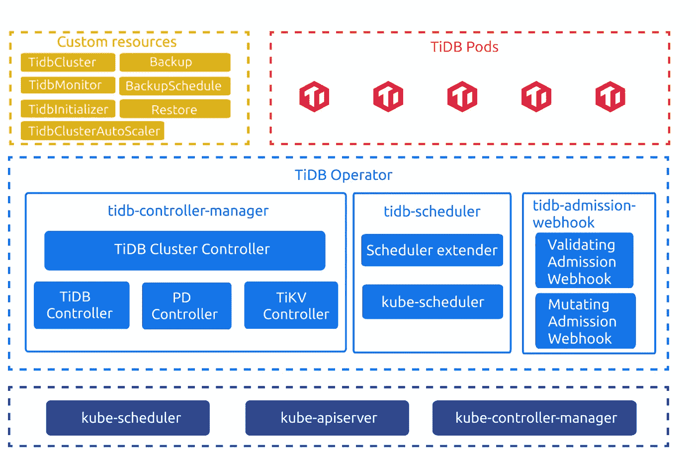

# TiDB 操作符源代码阅读(一):概述

> 原文：<https://medium.com/geekculture/tidb-operator-source-code-reading-i-overview-cf1891f1fd90?source=collection_archive---------28----------------------->

**作者:** [陈一文](https://github.com/handlerww)(TiDB 运营商委托人)

**Transcreator:** [黄然](https://github.com/ran-huang)；编辑:汤姆·万德

[TiDB Operator](https://docs.pingcap.com/tidb-in-kubernetes/stable) 是 Kubernetes 的 TiDB 自动操作系统。作为一个为 TiDB 定制的 Kubernetes 操作器，它被 TiDB 用户广泛用于在整个生命周期中管理他们的集群，因此拥有一个活跃的开发人员社区。

然而，Kubernetes 和 TiDB Operator 都相当复杂，因此对其开发做出贡献需要一些努力和准备。为了帮助我们的社区掌握这一基本知识，我们正在创建一系列文章，带您浏览 TiDB 操作符源代码。本系列不仅可以帮助新手开始使用 TiDB Operator，也可以作为更有经验的开发人员的参考。

第一篇文章向您介绍了 TiDB Operator 的架构、其核心组件以及它的用途。这篇文章是所有其他文章的基础。我们希望这篇文章对你有所帮助，并激励你把自己的创意带到社区中来。

# TiDB 操作符概述

在这一节中，我将讨论两个问题:TiDB 操作符是如何工作的，以及它对您有什么帮助。弄清楚这两个问题，你就能更好地理解 TiDB 操作者的该做和不该做。

## TiDB 操作员如何工作

当 TiDB Operator 维护您的 TiDB 集群时，它的组件与定制资源(CRs)紧密协作。

*TiDB Operator v1.1 architecture*

由[自定义资源定义](https://kubernetes.io/docs/concepts/extend-kubernetes/api-extension/custom-resources/#customresourcedefinitions) (CRD)，[自定义资源](https://kubernetes.io/docs/concepts/extend-kubernetes/api-extension/custom-resources/#custom-resources)定义描述您的 TiDB 集群的期望状态:

*   `TidbCluster`描述 TiDB 集群的期望状态。
*   `TidbMonitor`描述 TiDB 集群的监控组件。
*   `TidbInitializer`描述所需的初始化作业。
*   `Backup`描述所需的备份作业。
*   `Restore`描述所需的还原作业。
*   `BackupSchedule`描述计划的备份作业。
*   `TidbClusterAutoScaler`描述自动缩放规则。
*   `DMCluster`描述与 [TiDB 数据迁移](https://docs.pingcap.com/tidb-data-migration/stable)相关的配置。

TiDB 运算符包括以下组件:

*   `tidb-controller-manager`是 Kubernetes 中的一组自定义控制器。这些控制器不断地将记录在`TidbCluster`对象中的期望状态与 TiDB 集群的实际状态进行比较。他们调整 Kubernetes 中的资源，使 TiDB 集群满足您的期望状态，并根据其他 Cr 完成相应的控制逻辑。
*   `tidb-scheduler`是一个 Kubernetes 调度程序扩展，它将 TiDB 特定的调度策略注入到 Kubernetes 调度程序中。
*   `tidb-admission-webhook`是 Kubernetes 中的一个动态接纳控制器，完成对 Pod、StatefulSet 和其他相关资源的修改、验证、操作和维护。

当 TiDB 在 Kubernetes 中运行时，TiDB Operator 使用本机资源(部署、StatefulSet、服务、PVC、ConfigMap 等。)并协调它们来维护 TiDB 集群。

## TiDB 操作员如何帮助您

简而言之，TiDB Operator 将您从烦人的日常维护工作中解放出来。您唯一的任务是创建指定 TiDB 集群所需状态的 YAML 语句。TiDB Operator 使用这些信息来调度 Kubernetes 资源，以将集群推向所需的状态，并向外部提供服务。

让我举两个例子来说明 TiDB 操作符是如何简化一切的。假设您想要三个[布局驱动](https://docs.pingcap.com/tidb/stable/tidb-architecture#placement-driver-pd-server) (PD)实例。您需要初始化第一个实例，然后将另外两个加入到第一个实例中。要实现这一点，您可以通过指定`--initial-cluster`和两个`--join`参数来手动完成，或者您可以告诉 TiDB Operator 为您生成配置。显然，后者更容易。

另一个例子是执行 PD 的滚动升级。当 PD 正在运行时，升级它可能会影响联机服务。在手动升级中，您需要使用 StatefulSets 的`UpdateStrategy.Partition`选项来控制滚动升级进度，并在监控 PD 服务的同时逐个升级 PD 实例。但是 TiDB 运营商的情况就不同了。它可以使用 PD API 通过转移 Leader 并检查更新的 PD 实例是否按预期工作来自动执行滚动升级。

为了实现上述功能，TiDB 操作员需要与 Kubernetes 和 TiDB 一起工作。一方面，它需要与 Kubernetes 互动，使其资源和运营符合 TiDB 的要求。另一方面，它与 TiDB 组件的 API 进行交互，从 PD 获取集群状态，并反馈给 Kubernetes 资源管理。此外，它根据您的规范维护 TiDB 集群。

如果您想将 TiDB 维护功能与您的 Kubernetes 系统集成，TiDB Operator 还将从 TiDB 的角度为您提供与这两个系统进行交互的能力。

# 这个系列带给你的

TiDB 操作符源代码阅读系列文章将涉及以下主题:

*   入门:TiDB 操作符基础及其试图解决的问题。
*   操作符模式:入口点、程序逻辑及其协调循环的触发器。
*   调和循环设计:一般设计及其如何扩展。
*   功能设计:备份和恢复、自动伸缩、webhook、高级 StatefulSet、tidb-scheduler 和监控。
*   质量管理:我们如何通过单元测试、端到端测试和稳定性测试来确保 TiDB Operator 的代码质量。

这些深入的文章将帮助您充分利用 TiDB 操作符。如果您决定将它集成到您的基于 Kubernetes 的系统中，您将有我们的最佳实践来指导您。更重要的是，这些文章将为您提供为 TiDB Operator 做出贡献所需的知识，并使产品变得更好。

这个博客系列也将有益于你的 Kubernetes 学习。当您研究 Kubernetes 的操作符模式时，TiDB 操作符是一个很好的榜样。现在在 Kubernetes 社区里，有 [Kubebuilder](https://github.com/kubernetes-sigs/kubebuilder) 和 [Operator SDK](https://github.com/operator-framework/operator-sdk) 这样的运营商框架，也有 [controller-runtime](https://github.com/kubernetes-sigs/controller-runtime) 这样的库。它们是利用 Kubernetes 模块封装复杂程序逻辑的各种实现。通过理解 TiDB Operator，您将掌握如何基于 Kubernetes 设计强大而优雅的资源管理系统。

# 总结

在本文中，我们讨论了 TiDB 操作符的基础知识以及它所解决的问题。随着我们系列的继续，我们将深入研究 TiDB 操作符代码，并分享我们开发这个 Kubernetes 操作符的经验。

如果您有任何问题或想了解更多，请随时加入我们的 Slack 频道 [#sig-k8s](https://slack.tidb.io/invite?team=tidb-community&channel=sig-k8s&ref=pingcap-blog) 或在 [pingcap/tidb-operator](https://github.com/pingcap/tidb-operator) 开题。敬请期待！

*原载于 www.pingcap.com***2021 年 3 月 23 日**