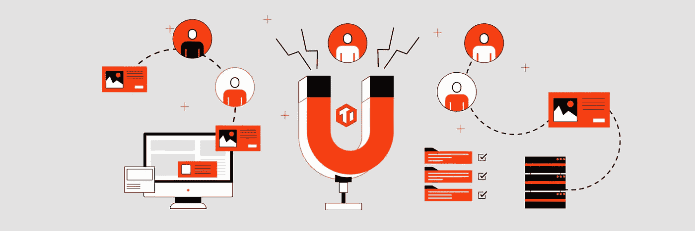
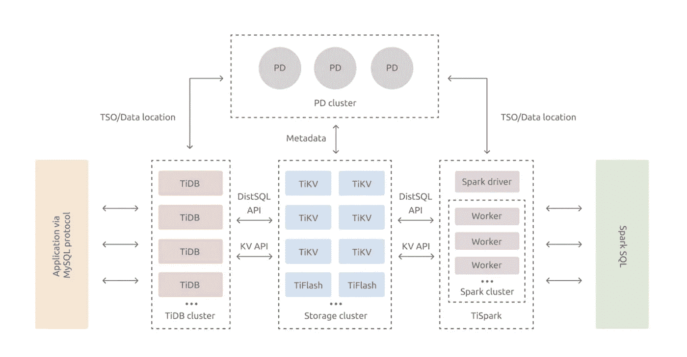
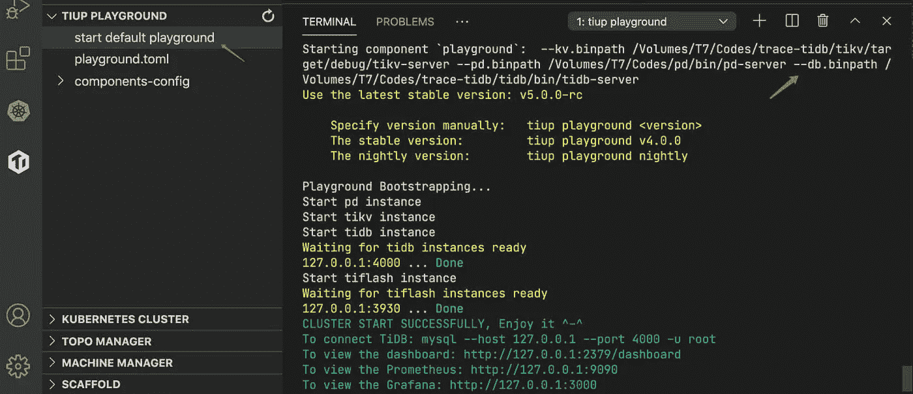
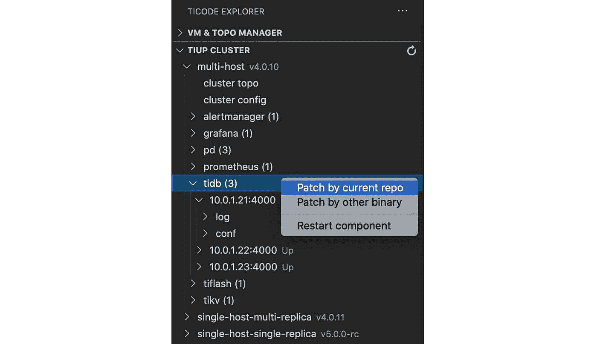
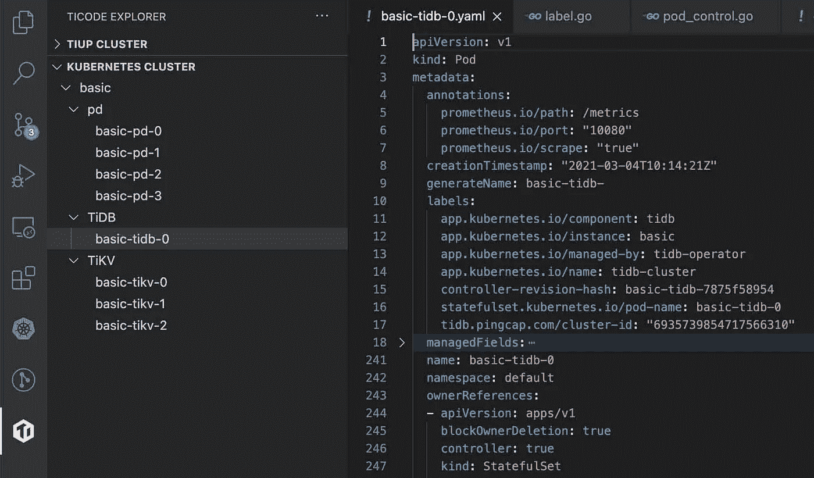
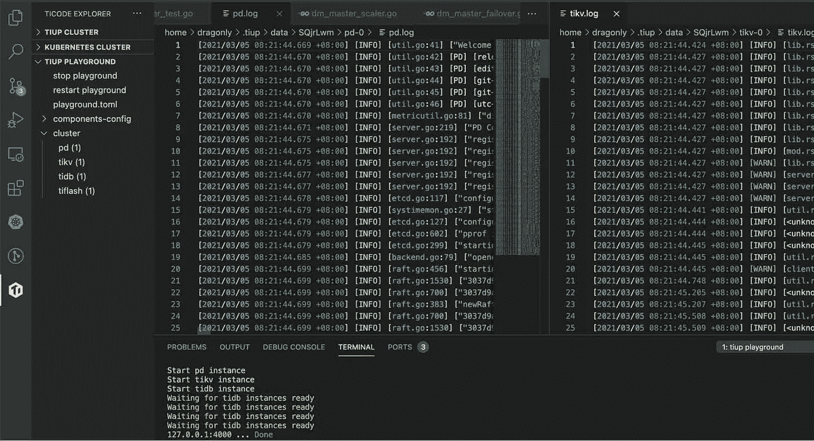
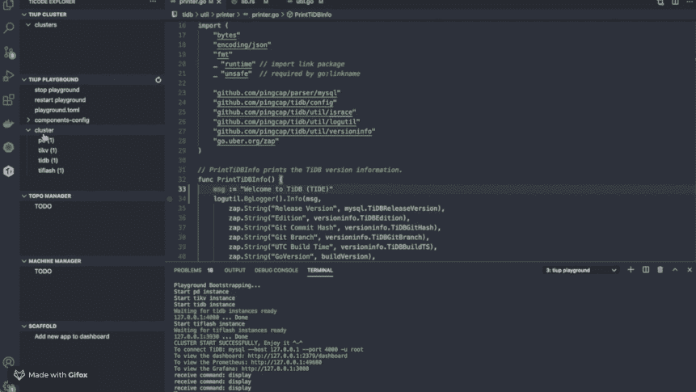
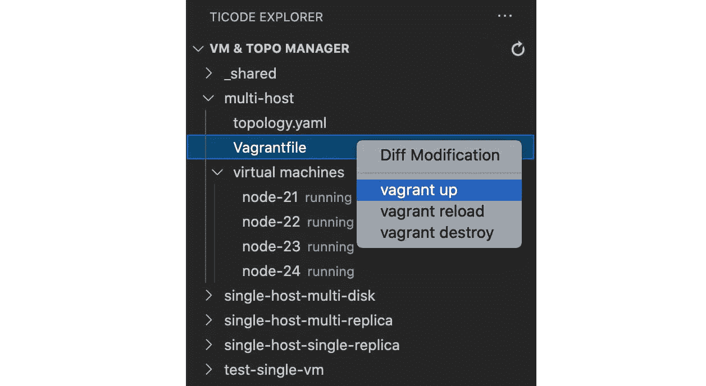
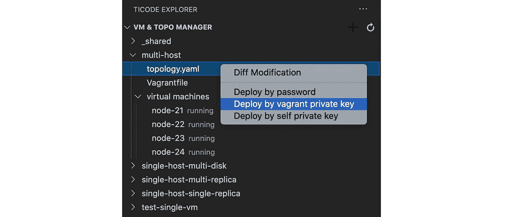

# TiDE:轻松开发分布式数据库

> 原文：<https://medium.com/geekculture/tide-developing-a-distributed-database-in-a-breeze-25498e89b568?source=collection_archive---------39----------------------->

作者:PingCAP 的软件工程师

*   [黄](https://github.com/baurine)
*   [李亿龙](https://github.com/dragonly)，
*   [吴艾蕾](https://github.com/aylei)

Transcreator: [黄然](https://github.com/ran-huang)；编辑:汤姆·万德

为 TiDB 的代码库做贡献并不容易，尤其是对新手来说。作为一个分布式数据库，TiDB 有多个组件和众多工具，用包括 Go 和 Rust 在内的多种语言编写。开始使用如此复杂的系统需要相当大的努力。

因此，为了欢迎 TiDB 的新成员，让他们更容易为我们的社区做出贡献，我们开发了一个 TiDB 集成开发环境: [TiDE](https://github.com/tidb-incubator/tide) 。TiDE 是在 TiDB Hackathon 2020 期间创建的，是一个 Visual Studio 代码扩展，使开发 TiDB 变得轻而易举。有了这个扩展，开发一个分布式系统就像开发一个本地系统一样简单。

在本文中，我将向您展示 TiDE 的核心特性，以及它如何为 TiDB 开发人员简化标准工作流程。让我们开始吧。

# 开发 TiDB 有多难？

作为一个复杂的分布式 SQL 数据库系统， [TiDB](https://github.com/pingcap/tidb) 有三个核心组件(TiDB，TiKV，和布局驱动，PD)和许多生态系统工具。TiDB 和 [PD](https://github.com/tikv/pd) 用 Go 编写，而 [TiKV](https://github.com/tikv/tikv) 用 Rust 编写。

*TiDB architecture in a glance*

想象一下，你想亲自动手编译 TiDB。你需要经历几个痛苦的步骤:

1.  下载这三个组件的代码。如果您还没有这样做，请安装 Go 和 Rust 工具链，并根据每个组件的文档编译二进制文件。
2.  要轻松运行编译后的组件，需要安装 TiDB 的包管理器 [TiUP](https://docs.pingcap.com/tidb/stable/tiup-overview) 。然后，您将学习编写一个基本的配置文件并启动 TiDB 集群。
3.  在集群启动并运行之后，您需要阅读每个组件的日志，并通过在日志中搜索关键字来了解它们的详细信息。然而，TiDB 是一个多进程(和多节点)系统，所以您需要登录到不同的物理机器来查看日志。你必须知道如何使用`less`和`grep`命令。
4.  当您有了一个想法并想尝试 TiDB 时，您需要编写代码，编译它，将二进制文件复制到本地或远程 TiUP 目录，重新启动集群，并重复步骤 3。

正如您所看到的，开发 TiDB 的传统工作流程是一个冗长而乏味的过程，大部分精力都浪费在重复的、令人不快的操作上。

# 什么是潮汐，我们为什么需要它？

孔子(中国哲学家和政治家)说:“巧匠必须磨刀霍霍。”那适用于 TiDB 开发者(你！)也是。要减少繁琐的工作，提高效率，自动化是必须的。TiDE，一个 VS 代码扩展，自动化你在 VS 代码中的 TiDB 编码体验。

当您启用 TiDE 时，它会在 VS 代码中为 TiDB 创建一个专用的工作区，提供简化 TiDB 开发的功能。

## 简化的 TiDB 集群部署

TiDE 的基本特性之一是 iDE。无论您想在本地测试集群还是生产集群上进行开发，TiDE 都可以通过几次点击来启动您需要的环境。

**本地测试集群**

以前，要开始，您需要运行`tiup playground`来启动一个测试集群。现在，您只需创建一个工作区来添加您的代码目录，剩下的工作将由 TiDE 来完成。

要修复一个 bug 或添加一个新特性，您不再需要自己编译代码和更新二进制文件，因为 TiDE 将帮助您完成这个过程并重新启动集群。您所要做的就是编写代码，这与在任何 IDE 中开发程序是一样的体验。

*Deploy a testing cluster in TiDE*

**生产集群**

在生产环境中，TiDB 通过`tiup cluster`部署到多个物理机或虚拟机。以前，您需要通过`scp`命令将二进制文件传输到远程机器，并重启相应的进程。

毫无疑问，TiDE 简化了您的工作流程。开发人员完成他们的代码后，TiDE 编译代码，通过 TiUP 生成的 SSH 密钥对将二进制文件分发到远程机器，并重新启动所有进程。开发分布式系统就像开发本地系统一样简单。

*Patch the remote binary in TiDE*

## Kubernetes 集成(alpha)

TiDB 是一个云原生数据库，根据定义，你应该能够在 Kubernetes 开发和部署。开发人员使用`kubectl`来管理 Kubernetes 中的资源，但这很不方便。

我们现在为 TiDE 添加了一个特性，可以像使用 TiUP 一样方便地在 Kubernetes 中开发和调试 TiDB 集群。这仍处于 alpha 阶段，欢迎任何贡献；但是首先，您可以在 Kubernetes 中查看您的 TiDB 集群。

*View TiDB clusters in Kubernetes*

## 统一日志访问

因为 TiDB 有很多组件，如果要查询系统状态，往往要检查多个日志。对于开发新手来说，找到日志地址并搜索或分析日志可能是一个巨大的负担。

TiDE 提供了统一的日志访问解决方案。通过点击你需要的组件和进程，你可以立即看到 VS 代码中的所有日志。还可以使用 VS Code 内置的搜索功能搜索所有日志，包括正则表达式匹配。切换到另一个流程？只需再点击几下。这个解决方案如此简单直观，以至于搜索日志不再令人苦恼。

以下是在拆分编辑器中查看不同日志的示例:

*Analyzing TiDB logs in VS Code*

## 调试模式(alpha)

当一个新手接触 TiDB 的代码库时，他们通常会从阅读源代码开始。但是当有复杂的条件和多个 goroutines-thread sync 时，理解代码就困难多了。变量的数量激增到人脑无法处理的程度。

这就是调试模式发挥作用的地方。通过在代码中设置断点，运行调试器，我们可以清楚地看到当前线程每个堆栈上的变量值，就像《黑客帝国》中的时间冻结场景。

在 TiDE 的调试模式下，当程序处理一个客户端请求时，你可以调试每个组件，不管是 TiDB、TiKV 还是 PD，用 Go 还是 Rust 编写。TiDE 甚至支持跨组件调试。例如，如果当前断点是在 TiDB 向 TiKV 发送 RPC 请求之前设置的，调试器可以跳转到 TiKV 中的下一个断点。

*Running the debug mode in TiDE*

# 虚拟机集成

在实际部署中，不是每个人都能负担得起部署 TiDB 的多台物理机。有时我们需要在虚拟机上部署 TiDB。

在[流浪者](https://www.vagrantup.com/)的帮助下，TiDE 集成了在虚拟机上部署 TiDB 集群的通用流程。您只需要为每个组件设置副本的数量，TiDE 将管理虚拟机。

*Deploy a cluster to virtual machines*

# 试试退潮！

分布式系统和数据库都是计算机科学的前沿领域。参与相关的开源项目，虽然充满了障碍，但从长远来看，可以带来巨大的好处。希望 TiDE 能让你的 TiDB 之旅更加愉快。

通过构建专用 IDE TiDE，我们希望改善 TiDB 开发体验，让数据库爱好者更容易成为 TiDB 贡献者。通过让更多的程序员加入我们的社区，我们希望建立一个更好的分布式数据库。

在本文中，我只介绍了 TiDE 的核心特性；还有很多要了解的。如果你有兴趣尝试 TiDE，你可以跟随这个[逐步指南](https://github.com/tidb-incubator/tide/blob/master/doc/guide.md)，或者[加入我们的 Slack 频道](https://slack.tidb.io/invite?team=tidb-community&channel=tide&ref=pingcap-blog)进行讨论。此外，由于 TiDE 本身是一个开源项目，因此非常感谢任何贡献。您可以查看[我们的路线图](https://github.com/tidb-incubator/tide#todo)并选择一个功能。让我们一起磨刀吧！

*原载于 2021 年 5 月 13 日*[*www.pingcap.com*](https://pingcap.com/blog/tide-developing-a-distributed-database-in-a-breeze#how-hard-was-it-to-develop-tidb)