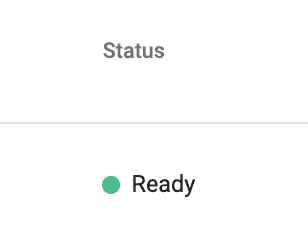
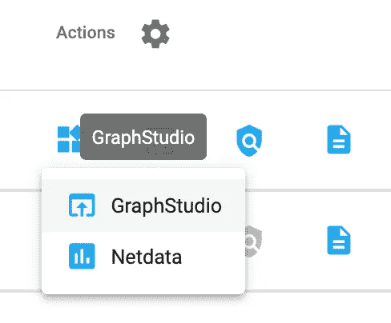
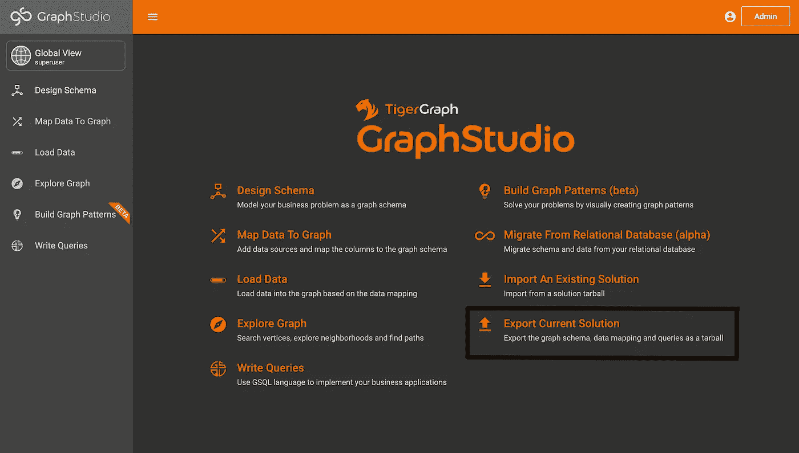
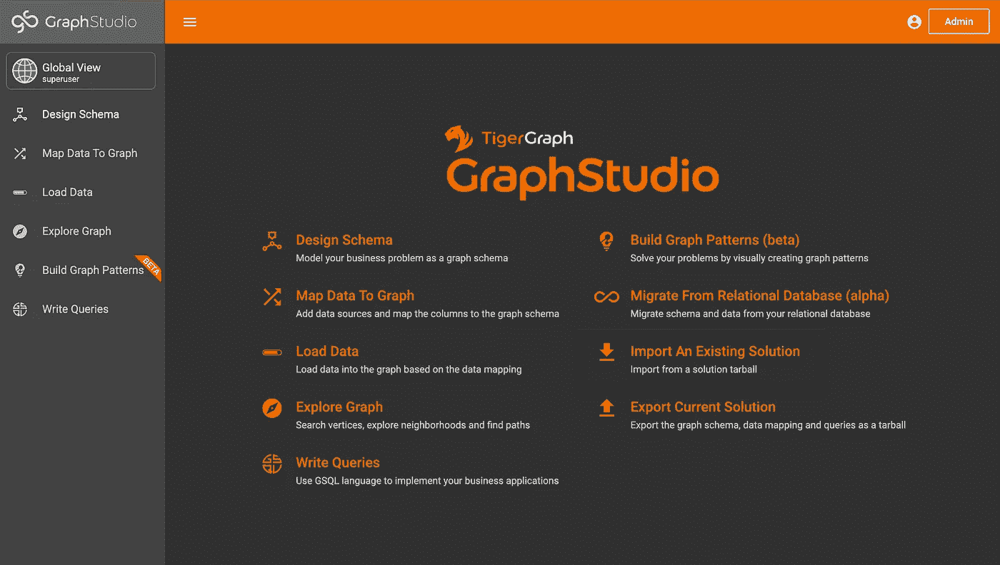
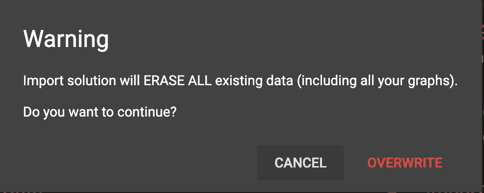
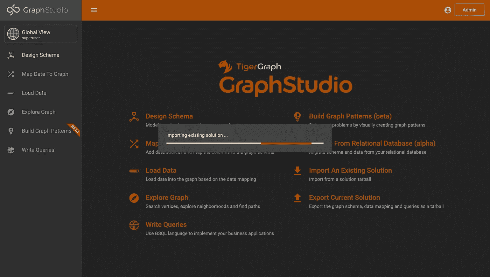
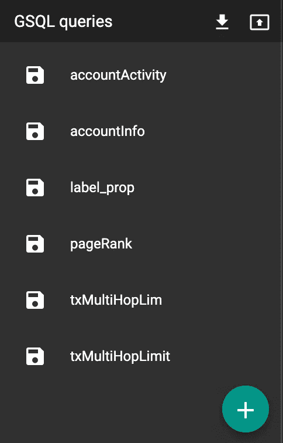

# TigerGraph 微博:导入和导出您的 TigerGraph 解决方案

> 原文：<https://medium.com/geekculture/tigergraph-microblog-importing-and-exporting-your-tigergraph-solution-c836171dadf3?source=collection_archive---------54----------------------->

## 在 GraphStudio 中导入和导出 TigerGraph 解决方案

# 目标

TigerGraph 解决方案在一周不活动后会自动终止，因此您需要保存您的解决方案！为此，您可以从 GraphStudio 自动导入和导出您的解决方案，本博客将带您一步一步地完成这一过程！

# 第一部分:导出您现有的解决方案

如果您有一周或更长时间无法访问您的解决方案，导出您的解决方案将是一个好主意。为此，首先进入[https://tgcloud.io/](https://tgcloud.io/)，导航至“解决方案”，如果您的解决方案尚未准备好，请启动它。当“状态”下出现绿点和“就绪”字样时，导航到 GraphStudio。

When the Status is “Ready,” you’re ready!

您可以导航到 GraphStudio，方法是转到“Actions”列，单击四个框，然后从下拉列表中单击 GraphStudio。

Click the four boxes -> GraphStudio.

这应该会引导你进入这样一个页面。

GraphStudio Home Page

在那里，单击“导出当前解决方案”它会自动下载一个压缩文件到你的电脑上。

> 注意:这可能需要几分钟时间。

Click “Export Solution.”

完美！保存此文件，以便在需要导入解决方案时使用！

> **注意:这将只导出图形的模式、数据映射和查询！**

# 第二部分:导入您现有的解决方案

当您准备好导入您的解决方案时，请在 https://tgcloud.io/的[上重新创建您的解决方案，并再次访问 GraphStudio。你将再次到达 GraphStudio 的主页。在那里，选择“Import Existing Solution”并选择您之前保存的文件。](https://tgcloud.io/)

Click “Import An Existing Solution.”

您可能会看到这个警告。如果您愿意抹掉所有数据(相当于“全部删除”)，并用导入解决方案替换它，请按“覆盖”

Warning Message that Might Appear

然后，您将看到一个加载屏幕，等待新解决方案的创建。

> 注意:这可能需要几分钟来设置。

Loading Screen

准备就绪后，您将能够看到所有的图表、查询、加载作业和模式！

要让您的图表恢复正常，请重新安装您的查询并重新执行您的加载作业。

All of the queries are saved. You’ll need to install all of them.

运行完所有程序后，您的图表将恢复正常！恭喜你。

# 第三步:祝贺+问题？

恭喜你。您现在知道如何导入和导出 TigerGraph 解决方案了！

如果您遇到任何问题，请随时在 TigerGraph Discord 上提出任何问题:

 [## 加入 TigerGraph Discord 服务器！

### 查看 Discord 上的 TigerGraph 社区-与 568 名其他成员一起玩，享受免费的语音和文本聊天。

不和谐. gg](https://discord.gg/gRHWBZNpxW)