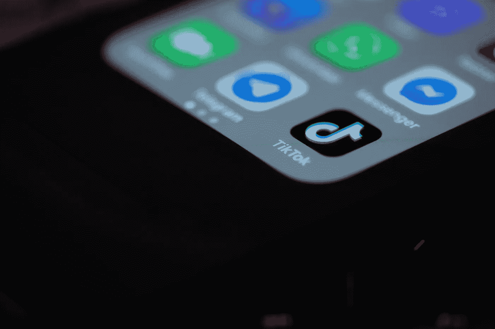

# 抖音仍在侵犯你的隐私

> 原文：<https://medium.com/geekculture/tiktok-is-still-invading-your-privacy-e0f09e2e8d89?source=collection_archive---------9----------------------->

Solen Feyissa

如果你不记得抖音曾是美国政治最热门话题的那段短暂时间，那是情有可原的。在封锁最严重的时候，这款应用因其与中国政府的关系和可疑的数据收集做法而受到攻击。有很多关于完全禁止该应用程序的讨论，围绕它的讨论确实提出了关于我们在手机上给应用程序多少数据的问题。然后它平息了，因为疫情没有去任何地方，也没有[无数](https://blog.malwarebytes.com/awareness/2021/06/second-colossal-linkedin-breach-in-3-months-almost-all-users-affected/) [和其他](https://threatpost.com/ps3-players-ban-attacks-gaming/167303/)侵犯隐私。现在，抖音对其隐私政策的一项修改再次引发了这个问题。让我们看看问题是什么，为什么它是值得注意的。

# 什么变了？

Tobias Tullius

6 月初，抖音悄悄改变了其隐私政策，声明该应用程序现在有权“ [*收集生物标识符和生物信息*](https://www.tiktok.com/legal/privacy-policy?lang=en#privacy-us) ”。这是一个更加危险和激烈争论的数据收集领域，因为政府和国家机构已经在收集生物特征信息，但包括脸书、亚马逊和谷歌在内的私营公司也不想落后。但是，生物特征数据收集让人感觉更加邪恶，而不是在定向广告中有明确目的的普通元数据。毕竟，它可以包括许多东西，或者，在抖音的例子中，“面纹和声纹”。如果你想知道这在普通人中意味着什么，应用程序可以自行采集你的照片和声音记录。

事实上，这个新的附录依赖于自动收集的数据，这意味着抖音甚至没有选择性地这样做。在任何时候，当它的算法认为合适的时候，你的面部照片或你在应用程序上说的话的录音都可以保存下来供以后使用。抖音表示，它将寻求许可来收集这些数据，但前提是你所在的地方法律明确要求获得这种许可。在美国，这意味着有相应法规的六个州之一。当我写这篇文章时，还没有统一的联邦立法来限制生物特征数据的收集和使用。

# 有什么大不了的？

Jason Dent

理论上，如果你着眼于更广阔的社交媒体市场，这不应该太令人担忧。大量类似的应用程序收集视频和音频信息，一些用于提高人工智能，一些用于调节内容，一些用于广告定位。当然，更有可能的情况是，大多数人用它来瞄准目标，但大多数公司把不那么令人毛骨悚然的用途放在前面，把令人担忧的案例转移到后台。

抖音没有说明你的面部照片和声音录音将用于何种目的。相反，它有一个所有数据的总括部分，你可以发现其中一些数据将用于定向广告，一些用于定制你的订阅，一些用于“支持抖音的社交功能”，无论这在实践中意味着什么。缺乏清晰度是抖音从一个青少年发布愚蠢舞蹈的新兴应用程序到陷入隐私丑闻的社交网络的象征，这一丑闻已经持续了一年多。

在数据收集和侵犯隐私方面，抖音远非最糟糕的违法者，但它似乎决心迎接挑战。在拜登政府[停止上诉程序](https://www.wsj.com/articles/tiktok-sale-to-oracle-walmart-is-shelved-as-biden-reviews-security-11612958401)后，该应用程序仍处于悬而未决的状态，它本可以低调行事，避开隐私倡导者的雷达。相反，它走的是脸书路线——当你陷入丑闻时，不断引起骚动，这样公众的目光就永远不会只抓住一件事，并真正审视它。在不到一年的时间里，它经历了从讨论与中国政府的关系到辩论其数据存储，再到人们挑剔其代码，再到目前明确的数据收集阶段。

# 会发生什么？

Solen Feyissa

尽管对这一新发展有零星的报道，但抖音似乎已经在尽可能少的摩擦下完成了这一变革。当前的政府并不想杀鸡儆猴，隐私倡导者被与和谷歌正在进行的斗争所淹没，在这种情况下，它们肯定是更大的鱼。因此，目前，抖音只是在试图使其偏离轨道的批评声中继续前行。

影响抖音的数据收集及其竞争对手的任何类似做法的唯一真正方法是通过保护用户隐私的全国性立法，无论是与常规数据还是生物识别数据有关。当每个州都不得不独自应对各种各样的问题时，数字隐私往往会被搁置一旁，即使没有被搁置，对这类事情的反应也是缓慢的。不要等待所有国家都赶上来，而是需要就这一问题做出一个总体决定。通过在更大范围内效仿伊利诺伊州的[和加利福尼亚州的](https://www.natlawreview.com/article/anatomy-biometric-laws-what-us-companies-need-to-know-2020)，我们可以看到公司如何对待生物识别数据的真正变化，并夺回我们数字生活的这一领域。