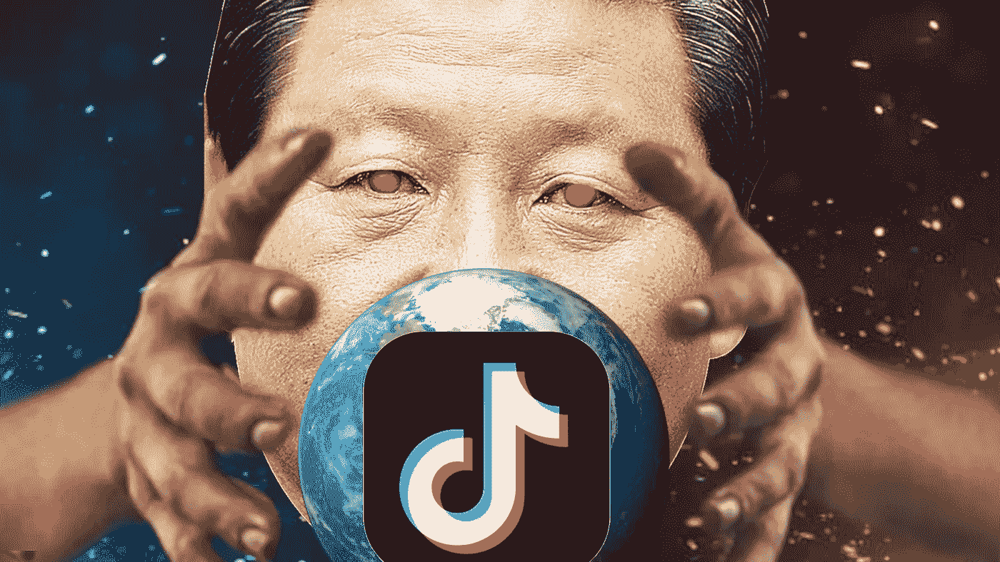
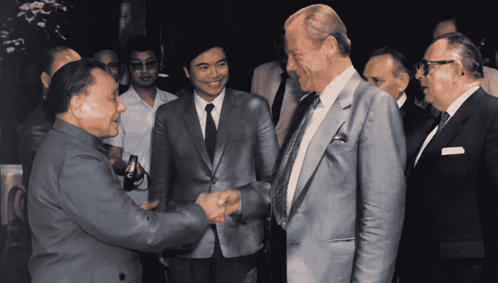
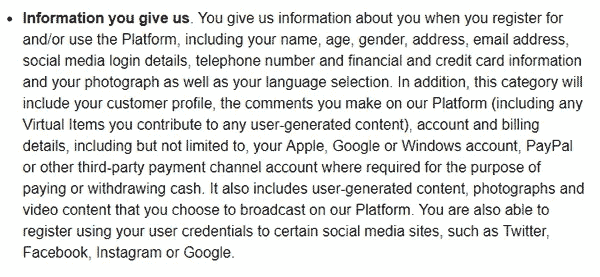
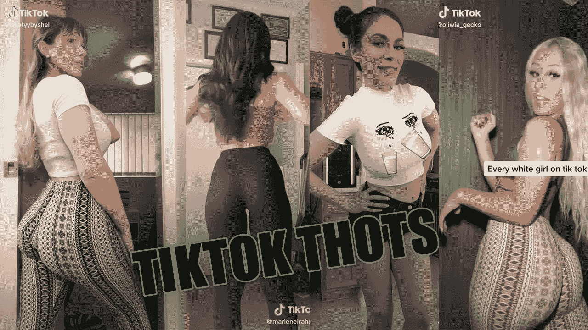
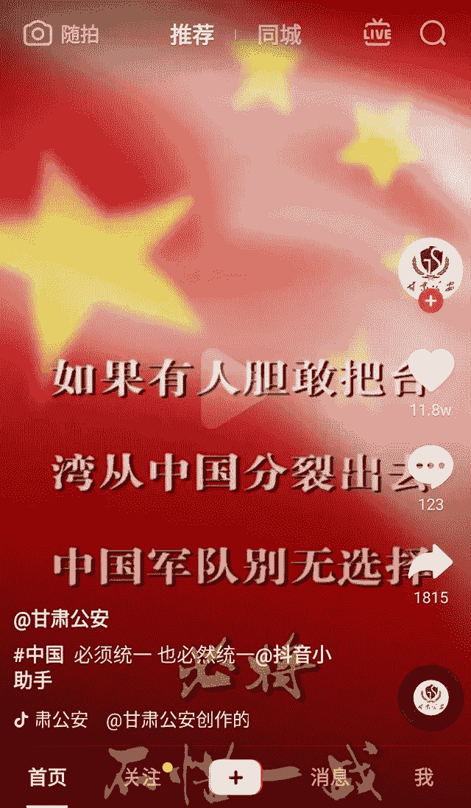
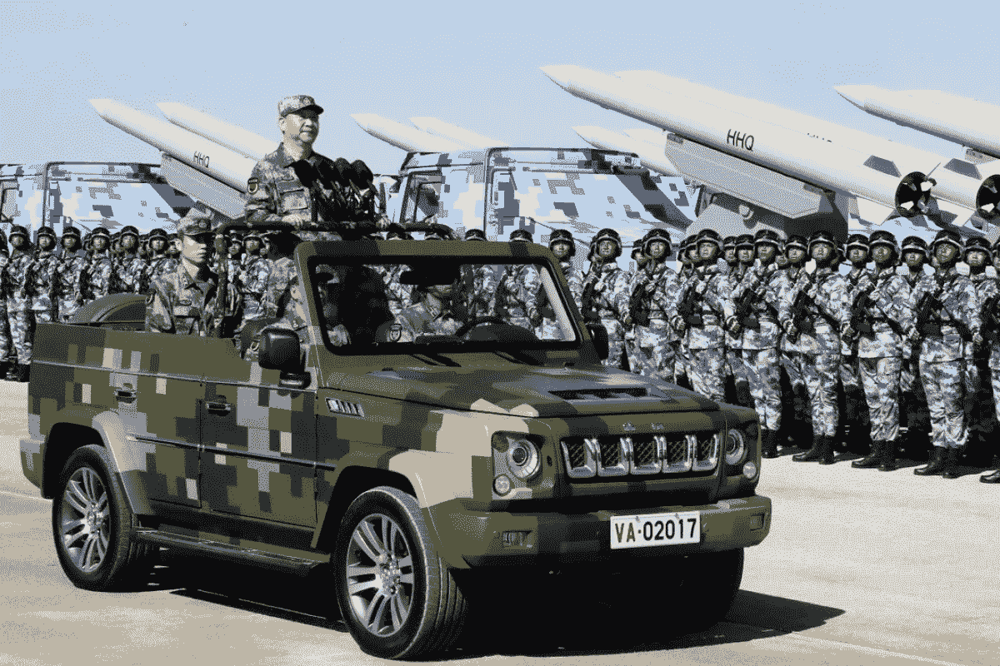
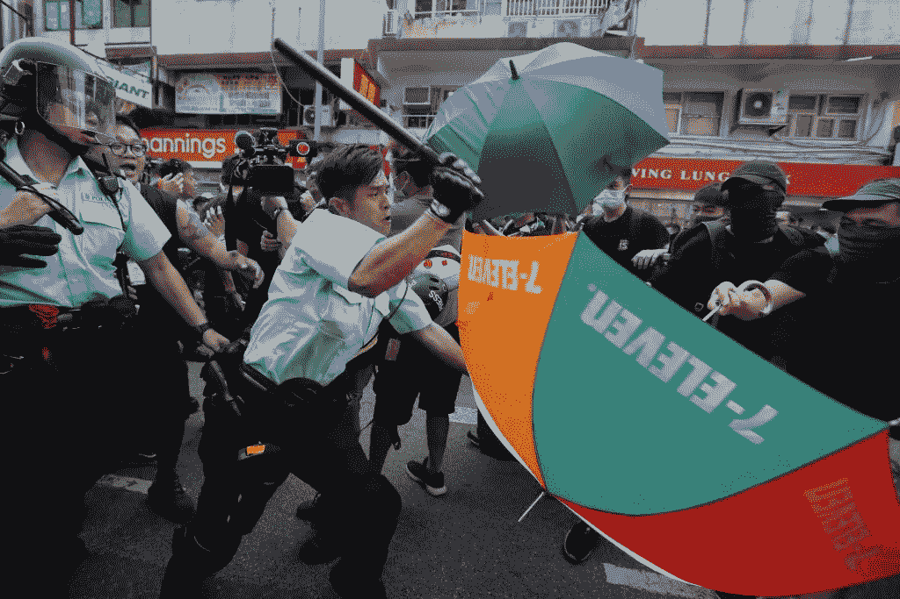

# 抖音:这款应用致力于维护一个不断变化的世界秩序

> 原文：<https://medium.com/geekculture/tiktok-the-app-bent-on-asserting-a-changing-world-order-d09b3077ddc8?source=collection_archive---------8----------------------->

## 中国共产党如何利用抖音来接管世界？

Photo from Dre Chang

抖音是苹果应用商店排名第一的娱乐应用。数百万人每天都在使用这款应用。然而，如果我告诉您，这个应用程序是现代史上最大的数据收集操作之一的前端操作，会怎么样呢？也许你认为我是一个互联网上的阴谋狂人。在你结束这篇文章之前，给我七分钟时间让你看看这个兔子洞有多深。

这就是中国共产党如何利用抖音来促进世界秩序的改变。

## 收集用户数据

在邓小平统治下，中国经历了从共产主义国家到资本主义国家的转变。你是一个国家的领导人，这个国家刚刚经历了一场大规模的家庭灾难，数以亿计的人死于这场灾难。你看看你们国家的内部环境。人们变得越来越焦虑不安。与此同时，世界各国正变得资本主义化。这里资本主义，那里资本主义。苏联帝国正在慢慢瓦解。成为一名共产党员意味着你将会挣扎。作为一个国家领导人，你想生存。[除非你是一个像朝鲜一样极度暴虐的政权，否则你需要确保你的人民幸福。](https://archive.nytimes.com/www.nytimes.com/library/world/0220obit-deng.html)否则，你晚上会睡不着。[因此，你在玩全球领导者设定的游戏。所以你公开接受资本主义。](https://archive.nytimes.com/www.nytimes.com/library/world/0220obit-deng.html)

Photo from www.vorwaerts.de

然而，当握手时，你的手指交叉在背后。在后台，你需要确保显示谁是负责人。只要人民屈服于政权，他们就能富裕起来。每家公司都必须在其董事会成员或领导职位中安插一名中国共产党成员。作为回报，这些公司将得到政府的支持。然而，私营公司的资产仍然归政府所有。这意味着中国国内的科技公司根据法律被迫将客户数据交给政府。政府将把这些数据用于军事目的。这被称为[军民融合](https://www.state.gov/wp-content/uploads/2020/05/What-is-MCF-One-Pager.pdf)。

这就把我们带到了今天。根据苹果应用商店的说法，这是抖音应用需要用户提供的一些权限。

Photo 1 from onlineprivacytips.co

对你来说，这可能是不寻常的，甚至是令人毛骨悚然的。如果交出的数据来自中国境内的人就好了。然而，这些公司的影响跨越国界，因此数据是从其国界之外的国家收集的。这意味着数据来自最大的国家，如印度和美国。尽管所有这些信息都是公开的，但大众尤其是年轻人仍在继续使用抖音。这就引出了我们的下一点。

## 摧毁青年

作为一个想要建立一个不断变化的世界秩序的领导人。你想削弱对手。回顾历史，你会知道任何沉溺于享乐主义的国家和帝国都注定会崩溃。如果你想摧毁任何政府，从向年轻人宣传七宗罪开始。

**情欲**

Photo from ytimg.com

**饕餮**

Photo from ytimg.com

**贪婪**

Photo from ytimg.com

**愤怒**

Photo from ytimg.com

**骄傲**

Photo from istock.com

**懒惰和嫉妒**

现在其他国家的士气已经下降，他们的注意力已经耗尽。开始在你的内部平台上推广民族主义形象。

Photo from reddit.com

这不是不道德吗？就在 100 多年前，[西方做了一件类似的事情，将阿片类药物进口到中国](https://epicenter.wcfia.harvard.edu/blog/historys-hatred-chinas-war-on-drugs)。现在，中国正在用技术对西方做同样的事情。多讽刺？当涉及到美元时，道德问题就被扔进了垃圾箱。这就把我们带到了下一点。

## 压制内部反对意见

不像美国，公司可以让政客闭嘴，然后逍遥法外。

 [## 脸书暂停川普账户两年

### 脸书公司已暂停美国前总统唐纳德·特朗普的脸书和 Instagram 账户两年。他是…

www.bbc.com](https://www.bbc.com/news/world-us-canada-57365628) 

作为当今一个政权的领导人，你必须对你的人民行使支配权。

Photo from scmp.com

回顾成功的权威社会，软弱的领导者展示力量，而强者隐藏他们的权力。不展示实力就意味着强者会压到你头上。所以你割喉杀鸡儆猴。如果你是一个中国平民，甚至是一个想要质疑权威的技术亿万富翁，政权仍然会在你的脖子上放一只靴子，以显示谁是负责人。

Video from youtube.com

作为读者，你可能认为中国不会挑起冲突。“美国将阻止中国入侵台湾。”在这个大规模去全球化的阶段，任何事情都是可以讨论的。正如夏平自己说的

> 同时，中国人民决不允许任何外国势力欺负、压迫或奴役我们。任何胆敢这样做的人都会被 14 亿中国人民铸造的钢铁长城砸碎脑袋。

与他的前任不同，他强调与现有结构合作实现繁荣。这是政权领导人愿意站在他的人民面前，告诉他的人民站在他的政权面前，以改变结构。

你可能会认为这是为了散布恐惧而制造的宣传。然而，CCP 从一开始就明确表示要收回台湾。来自 CCP 的内部 d [文件已经证实了这个事实](https://www.youtube.com/watch?v=VNZ0so0LCoM)。

这让我们回到 CCP，利用抖音来推动民族主义宣传。然而，使用民族主义会以牺牲其他国家的支持为代价来增加你的国家的支持。因此它伤害了全球主义者的议程。所以你必须让反对者闭嘴。

## 与美国科技公司勾结

作为一个政权，你不能只影响你自己的国家。否则，你不会被承认为全球超级大国。你想在世界上维护你的统治地位，而不是让别人来维护你的统治地位。征服和奴役新的人口已经过时了。你将如何统治充满怨恨的民众？今天，战争通过控制信息的创造和流动而发生。你必须禁止批评你政权的言论。同时宣扬削弱其他国家道德基础的言论。但是你打算怎么做呢？通过用钱来控制大科技公司的平台。只有像你这样的顶级战略家才能把某人的优势变成劣势。

你的政权不仅控制了抖音，还影响并摧毁了其他美国科技公司的士气。

*   互联网首页 Reddit 从 CCP 获得了大约 1 . 5 亿美元的投资
*   [苹果从中国共产党的奴隶劳动中获利](https://www.theverge.com/2021/5/10/22428899/apple-suppliers-china-uyghur-forced-labor-report)
*   [谷歌为中国共产党建立了监控技术](https://theintercept.com/2019/07/11/china-surveillance-google-ibm-semptian/)

作为一个领导者，你的政权的公司需要接受那些让许多美国公司成功的商业实践。你需要向最优秀的资本主义学习。微软的政策[包含、取消和扩展](https://en.wikipedia.org/wiki/Embrace,_extend,_and_extinguish)已经摆在桌面上。拥抱引入西方的自由市场资本主义。修改一下，让它包含中国特色。让你的技术在某些领域与美国技术竞争。拓展美国市场。现在，抖音是美国排名第一的 iOS 娱乐应用。一款比脸书、Instagram 甚至 YouTube 更容易让人上瘾的应用。被保护者胜过主人。在这一点上几乎是诗意的。

但是如果外国公司想进入中国市场呢？他们必须服从 CCP 规则。参与审查。把知识产权交给中国政府。这不符合你们西方的道德和原则。然后呜呜，另一家美国公司会很乐意接受这个提议。当美元岌岌可危时，道德可能会被扔进垃圾箱。

Video from youtube.com

## 将这些点连接起来

作为读者，接下来会出现一些问题。你为什么认为俄罗斯政府入侵了嵌合体和乌克兰？

Photo from www.rt.com

你认为中国政府为什么收回香港？并且打算收回台湾？

Photo from www.dailymail.co.uk

因为没人能阻止他们。20 年前，当今地缘政治格局的行动是不可想象的。我们允许中国和俄罗斯等国家直接或间接地操纵信息流动。美国有很大一部分民众没有受过批判性思考的训练[。这是一个问题](https://www.npr.org/sections/thetwo-way/2016/11/23/503129818/study-finds-students-have-dismaying-inability-to-tell-fake-news-from-real)[当这些社交媒体应用程序被设计来确认一个现有的世界观](https://ieeexplore.ieee.org/abstract/document/4370493)以最大化广告收入。现在的争论是，解决这个问题是政府教育系统的责任还是企业科技公司的责任。

鉴于过去的行动，似乎下一个国际地缘政治行动是中国收回台湾。你可能认为没有国际战争发生。这是一场全球战争，不是靠枪炮和炸弹，而是靠心理战。当西方政府继续调查如何处理这些社交媒体平台的虚假信息时，中国共产党和俄罗斯政府已经赢得了每一场心理战。我的信息不在乎你是民主党人、共和党人还是自由主义者。右对左。没关系。这些[是用来分而治之的工具](https://www.merriam-webster.com/dictionary/divide%20and%20conquer)。你们所有人的生活都会变得同样糟糕。CCP 政权将在我们的眼皮底下强加一个不断变化的世界秩序，因为我们允许他们继续操纵公开的话语。

一般来说，人们在问我们如何才能防止未来的国际冲突。世界秩序的转变是不可避免的，但是可以采取措施来维持现状。经济重心从东方开始，也将在东方终结。我没有资格说明解决办法是什么。但我知道的是，减缓这一进程的一个方法是不给 CCP 情报。收回[数据所有权](/@dretechtips/list/privacy-3423d344f3e3)。整个频道都在探索如何做到这一点。CCP 政权将操纵任何不利于其目标的言论。基于抖音的受欢迎程度，这条消息可能会被禁止。达到这一点可能意味着你同意大部分已经写了。留下一大堆掌声，让算法向大众推广关于在线隐私的不受欢迎的观点。由你来决定历史的进程。

[订阅免费电子邮件列表，获取更多关于在线隐私的信息。](/subscribe/@dretechtips)

那些认为我在放屁的人。我故意制造恐慌，利用危机来推进我的计划。这样会有更多的人来分享和鼓掌。你可能会认为我与政客和宣传者没有什么不同，他们使用同样的修辞技巧来推进他们的议程，以牺牲他们的选民为代价。我有一个问题要问你。当互联网在 1989 年引入时，CCP 为什么要阻止外国网站的访问？

相关内容:

*   [在手机上使用谷歌的黑暗真相](/@dretechtips/the-dark-truth-about-using-google-on-your-phone-2aec68041dbf)
*   [去谷歌化的完整指南](/@dretechtips/how-to-dismantle-the-google-empire-e652bff6d2)
*   [你是数字农民](/geekculture/the-state-of-digital-peasantry-2f6326da88f7)