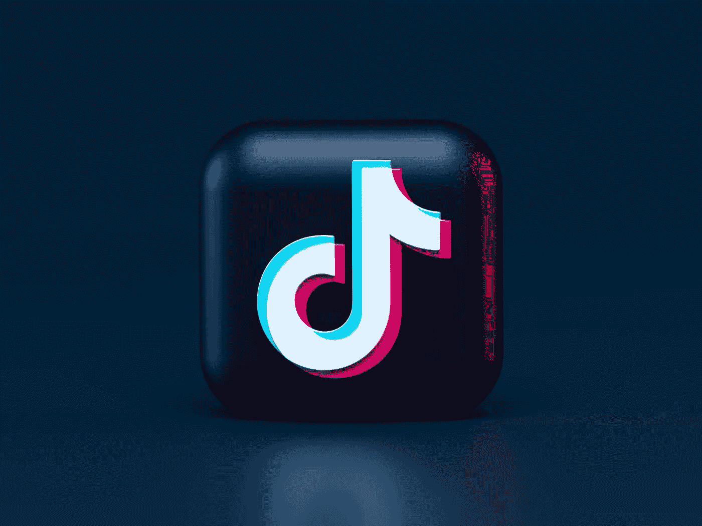

# 抖音与重大活动的伙伴关系对各方都有好处

> 原文：<https://medium.com/geekculture/tiktoks-partnerships-with-major-events-is-good-business-for-all-parties-a7d6eef04261?source=collection_archive---------7----------------------->

## 无论是体育赛事还是像欧洲电视网这样的文化活动

Photo by [Alexander Shatov](https://unsplash.com/@alexbemore?utm_source=unsplash&utm_medium=referral&utm_content=creditCopyText) on [Unsplash](https://unsplash.com/s/photos/tiktok?utm_source=unsplash&utm_medium=referral&utm_content=creditCopyText)

在 2020-2021 年期间以及 2022 年上半年，抖音赞助了几项备受瞩目的娱乐活动。抖音最近选择赞助的活动包括有数百万人观看的国际活动…