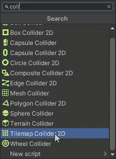
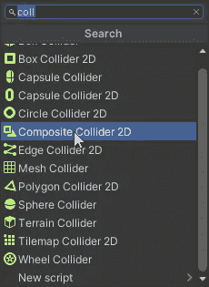
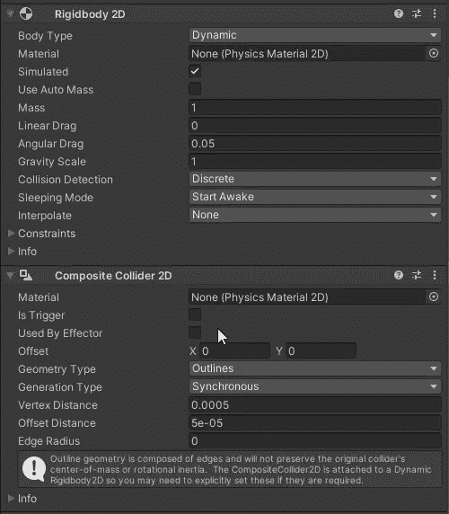
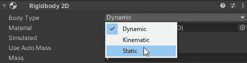
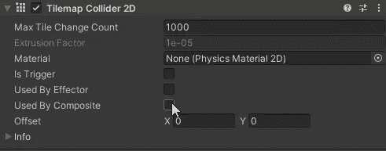
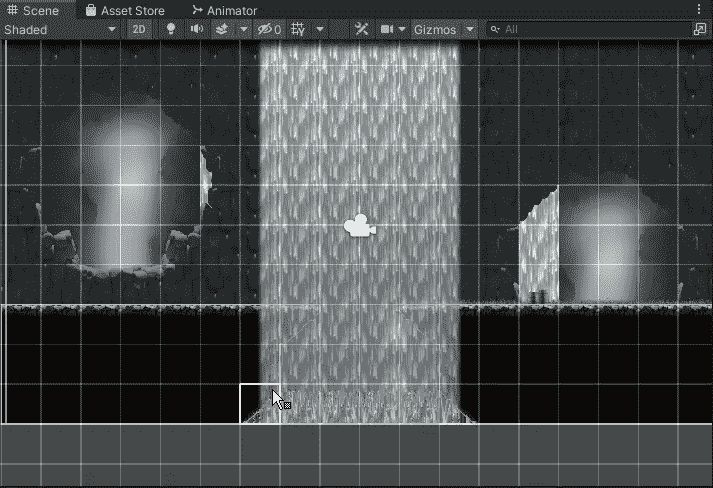

# 平铺可以碰撞 Tilemap 碰撞器简介和优化

> 原文：<https://medium.com/geekculture/tiles-can-collide-intro-and-optimization-to-tilemap-collider-13e3f13cbd61?source=collection_archive---------18----------------------->

**目标**:以最聪明的方式给瓷砖一个 2D 对撞机

因为我们画了一个玩家可以行走、跳跃、战斗等的地面，我们需要一种方法来检查玩家**是否被固定在**上。这项检查需要将**对撞机**包含在等式中，特别是对于那些瓦片。

要向 tilemap 添加碰撞器，让我们选择它并添加 **Tilemap 碰撞器 2D** 组件。Unity 将分析所有瓷砖的精灵，并为它们分配一个**多边形**碰撞器。

这很酷，因为它能识别悬崖的边缘，甚至下面的尖刺。

但是你可能会注意到，每个内部瓷砖都有一个碰撞器，这是一个**计算的浪费**,因为玩家永远不应该与它们碰撞，而是一直呆在表面上。我们来优化一下这个吧！

向 tilemap 添加第二个组件:**复合碰撞器 2D** 。

这将自动带来一个**刚体 2D** 组件。让我们将它的主体类型设置为 Static，并检查 Tilemap Collider 组件中的“由 Composite 使用”选项。

嘣！Unity 将重新计算多边形，提供一个新的整体碰撞器，类似于表面！

如果你喜欢，就鼓掌吧！看看我的游戏或者给我买杯咖啡:感谢每一种支持！！

