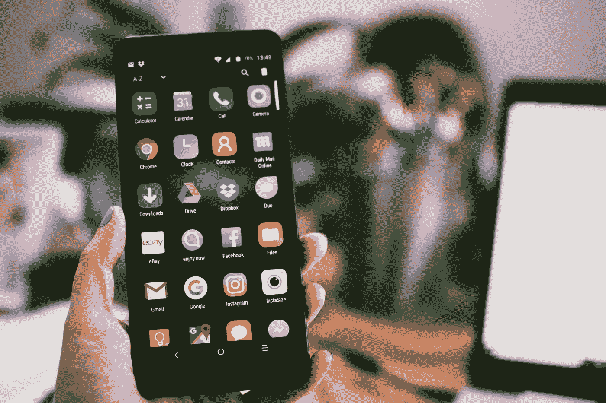

# 蒂姆·库克称安卓系统的恶意软件是 iOS 系统的 47 倍

> 原文：<https://medium.com/geekculture/tim-cook-says-android-has-47-times-more-malware-than-ios-9c22dfd8536d?source=collection_archive---------32----------------------->

## 你还想用安卓吗？

Photo by [Lisa](https://www.pexels.com/ru-ru/@fotios-photos?utm_content=attributionCopyText&utm_medium=referral&utm_source=pexels): [Pexels](https://www.pexels.com/ru-ru/photo/1092644/?utm_content=attributionCopyText&utm_medium=referral&utm_source=pexels)

当蒂姆·库克在 VivaTech 2021 会议上虚拟发言时，他声称安卓设备遭受的恶意软件数量是苹果产品的 47 倍。

[熊猫安全](https://www.pandasecurity.com/en/mediacenter/mobile-security/android-more-infected-than-ios/)称安卓设备造成了 47.15%的恶意软件感染，而 iphone……