# 时间序列分析——初学者指南

> 原文：<https://medium.com/geekculture/time-series-analysis-a-beginners-guide-81fc2f398784?source=collection_archive---------4----------------------->

做时间序列分析时要寻找的不同方面的简要概述。

**时间序列**是按时间顺序排列呈现的统计数据。**时间序列分析**是根据时间序列中过去的数据预测未来的数据。例如，如果我们知道一个组织从 2015 年到 2020 年的销售额，我们可以使用这些数据来预测 2021 年及以后的销售额。但请记住，这只是预测，而不是确切的数字。这是一个预测，表明销售额将接近这个数字。在进行时间序列分析时，需要记住以下几点:

1.  通常以相等的间隔(每天、每周、每月等)进行读数或观察。)
2.  在一段时间内对同一变量进行观察。比如“一个公司在一段时间内的销售额”。这里的“销售额”是一个变量。

# 时间序列的组成部分

时间序列的变化会在一段时间内发生。这些变化被广泛归类为时间序列的组成部分。它们是:

1.  长期变化或简单趋势
2.  季节性变化
3.  周期性变化
4.  随机或不规则变化

**长期变化或简单趋势**非常容易理解。在这种情况下，再次以销售为例，销售可以增加、减少或在一段时间内保持停滞。下图描绘了简单的趋势。

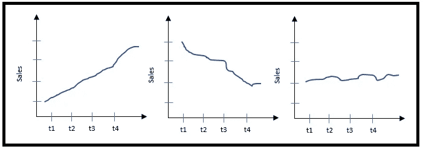

Long term variations OR Simple trend

简单趋势的一些其他例子可以是人口增长、出生率、死亡率等。

季节性变化是指同一年内经济增长的起伏。例如，空调和冷却器的销售在夏季会增加，但在其他季节会急剧下降。值得注意的是，这些变化发生在同一年内。

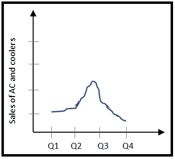

Seasonal Variation

**周期性变化**是指你在一段时间内看到数据中的周期性模式。一个经典的例子是股票市场，你会看到衰退和复苏在一段时间内持续发生。下图清楚地描述了循环变化。

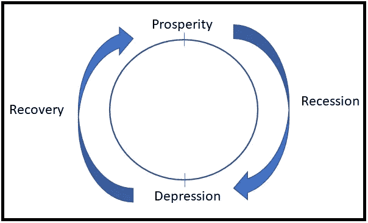

Cyclic Variation

**随机或不规则变化**可能因未知或不可预测的情况而发生。这些时候最好的例子就是 COVID。许多企业因 COVID 和锁定而遭受损失。但这不是一个会在一段时间内重复的现象。

# 时间序列分析模型

时间序列分析模型帮助我们决定如何根据上述趋势、季节性、周期性和不规则性因素来预测值。有两种类型模型:

1.  加性模型
2.  乘法模型

**可加模型:**如果四个因素(趋势、季节性、周期性和不规则性)完全独立，那么我们用可加模型来预测未来值。当我说独立时，一个因素不影响或影响其他因素的行为。在这种假设下，时间序列的大小是这四个因素各自影响的总和。

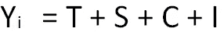

其中 T、S、C 和 I 代表趋势(T)、季节性(S)、周期性(C)和不规则性(I)。

**乘法模型:**乘法模型中，假设四个因素都是相互依赖的。例如，一场战争会使增长变得不规则，从而导致经济萧条，这种趋势可能会在较长一段时间内放缓。因此，如果这些因素是相互依赖的，你可以使用乘法模型。

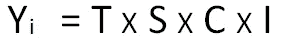

# 简单趋势的测量

现在我们已经了解了基础知识，让我们了解我们可以预测哪里。这里有一些问题需要探讨:

1.  给定夏季数据，我们能预测冬季冷饮销售吗？(季节性)
2.  如果发生自然灾害，我们能知道销售额吗？(不规则)
3.  我们能根据衰退预测复苏吗？(循环)

嗯，以上所有问题的答案都是否定的。因此，预测或预报的唯一方法是在长期变化或简单趋势的情况下。衡量时间序列趋势的常用方法有:

1.  徒手曲线
2.  移动平均线
3.  最小平方

**徒手曲线**非常简单直接，容易理解。在这种方法中，您只需根据可用的数据点绘制曲线，并延伸趋势线以预测或预测未来。在下图中， **s5** 是基于历史数据使用徒手曲线法对时间 **t5** 的销售预测。这种方法的问题是，每个人都可以得出不同的趋势线，这使得依赖效率很低。另一点是，如果你的数据集很小，你的曲线可能不好，使它完全不可预测和不确定。

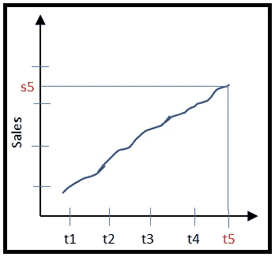

Free Hand Curve

**移动平均值**的工作原理是计算一段时间(3 年、4 年等)内固定数量读数或观察值的平均值(算术平均值)。).它通过删除先前平均组的第一个读数并获取系列中的下一个读数来遍历系列。计算的平均值被认为是周期中心时间单位的趋势值。请注意，在偶数读数的情况下，趋势值位于 b/w 2 区间，这也是第二步的中心。还要注意，在 3 年移动平均线的情况下，我们忽略了第一年和最后一年，而在 4 年移动平均线的情况下，我们忽略了第一年和最后两年。下图清晰地描绘了 3 年和 4 年的销售移动平均值。

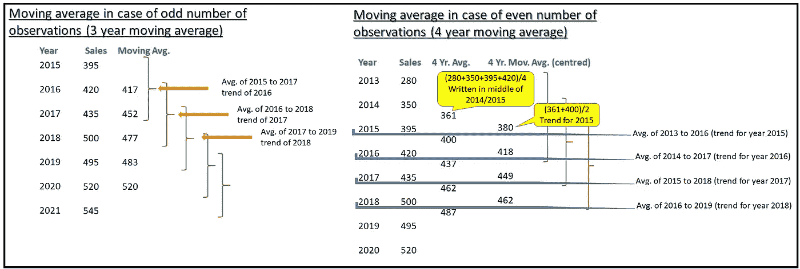

Moving Average Method

**最小二乘法:**该方法使用回归分析来寻找时间序列数据的趋势线。回归趋势线 *Y* 定义如下:

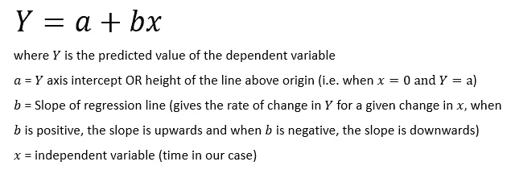

为了得到 a 和 b 的值，我们使用下面的公式:

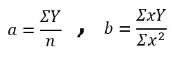

其中 *n* 为年/月数或一般周期数。

让我们用一个简单的例子来理解这一点。我们正在考虑 5 年的销售数据。对于中点(在下面的例子中，2019 年)，x 的值被取为零。中点以上的值将具有 x 的负值，而中点以下的值将具有 x 的正值。

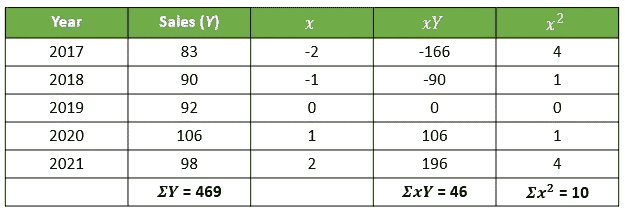

Least Squares Method

根据上表中的数据，我们可以如下计算 a 和 b 的值:

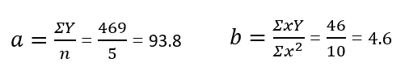

现在，如果我们想估计 2022 年的销售额，我们可以简单地替换回归方程中的值，如下所示(注意:考虑到上表，2022 年 x 的值将是 3)

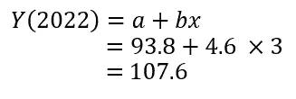

所以用最小二乘法对 2022 年的销量预测是 107.6。注意，在偶数个观察值的情况下，中点将是 2 个周期而不是 1 个周期。在这种情况下，中点(x)的值将是-1 和+1。此外，中点以上的值以 2 点为增量(-3，-5，依此类推)，中点以下的值将为+3，+5，依此类推。

# 白噪声和时间序列

如果一个时间序列的均值为零，方差为常数，则该时间序列被认为是白噪声。在这种情况下，做时间序列分析没有任何意义，我们应该停止这样做。白噪声序列的最佳预测是该序列的平均值。

# 时间序列的平稳性

如果一个时间序列的均值和方差在任何给定的时间段内都相同，则称该时间序列是平稳的。准确地说，均值和方差是时不变的。所有的时间序列算法都需要时间序列是平稳的。如果它不是稳定的，你的结果将是错误的。虽然在现实中，数据不会是静止的。有一些方法可以使数据稳定。一种这样的方法是微分(我不会在这里讨论这个，因为这是一个太长的阅读)。

# 时间序列分析方法

现在所有的行话都清楚了，下面是应该如何进行时间序列分析:

1.  确定该系列是否为白噪声。如果是，停止做时间序列分析。
2.  检查系列是否稳定。如果不是，在开始时间序列分析之前，让数据保持平稳
3.  一旦明确了序列不是白噪声并且是平稳的，就可以开始使用序列来应用时间序列算法。

我将很快再发表一篇文章，介绍使用其中一种算法来实际实现时间序列。