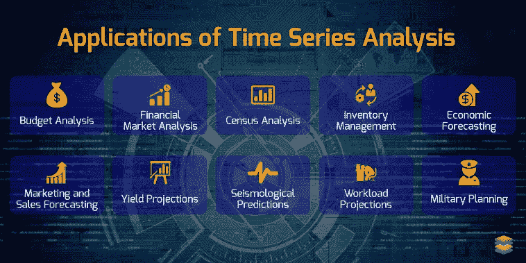

# 什么是时间序列分析？

> 原文：<https://medium.com/geekculture/time-series-analysis-d088f23b8c87?source=collection_archive---------18----------------------->

时间序列分析是一种与时间序列信息或模式识别交互的统计方法。时间序列信息意味着信息可用于各种离散的周期或时期。

**时间序列数据:**观察一个变量在各个时期使用的值。

假设您必须检查特定股票的一年时间序列的定期收盘市值，您将收到该股票在过去一年中每天的所有每日收盘列表，并按顺序对它们进行组织。这是股票的一年定期收盘价周期序列。

## 时间序列数据的预测:

时间序列分析的主要目标是提供一个合适的模型来更准确地表示结果中的趋势或现象。另一方面，预测时间序列数据是基于最近的过去来预测可能的情况。可以定期对收盘/开盘股票价格、公司的定期收益等进行预测。为了模拟时间序列数据，在研究中可以使用许多模型。

因为有许多技术和方法可用于时间序列预测。让我们来看看一些流行的知名款式:

1.  神经网络自回归(NNAR)
2.  RNN(递归神经网络)
3.  基于贝叶斯的模型
4.  广义自回归条件异方差(GARCH)
5.  长短期记忆(LSTM)
6.  自回归积分移动平均(ARIMA)
7.  简单移动平均线
8.  指数平滑法
9.  隐马尔可夫模型

## 时间序列数据的组成部分:

1.  **趋势:**是可以在整个时间序列中使用的重复段。它会产生不稳定的结果，可能是有利的、不利的、线性的或非线性的。它反映了低强度的差异，而中强度和高强度的数据是从时间序列中提取出来的。
2.  **循环的:**循环的模式是围绕一个给定的主题经历起起落落的循环。这是一种可以在时间序列中看到的波动。
3.  季节性:这是一种趋势，代表了可预测的可变性。这些特殊的运动是由外部条件和人类习俗造成的。在这种情况下，数据会暴露在日常日历时间出现的频繁和系统的修改中。
4.  **不规则:**是正时链条中的不可预测性。因为这些非线性变化被视为一种自发因素，不能用时间序列的任何其他因素来描述。不确定趋势的短期变化在实践中是不系统的

## **时间序列的应用:**

Source: [https://www.xenonstack.com/blog/time-series-deep-learning/](https://www.xenonstack.com/blog/time-series-deep-learning/)

1.  **预算分析**

使用时间序列分析进行预算分析对家庭主妇来说是至关重要的。因为他们可以从过去的数据中知道这个月需要多少卢比。

**2。金融市场分析**

金融分析师使用时间序列数据来分析此类股票价格，公司也可以使用这一概念根据过去的数据来预测销售额。

**3。地震预测**

它们与地震高度相关。如果在某个时间点发生了地震，那么根据该地震和其他过去的数据，可以预测未来会发生更强烈的地震。

**4。经济预测**

经济学家可以利用这个目的来预测国内生产总值或增长的国家或任何其他经济术语。由此，他们还可以向政府提出潜在的改进方案。

**5。军事规划**

由于其邻国之间的冲突不断增加，印度需要成为一个能够利用其所有装备精良的首都进行战斗的强国。为了采购和生产有效的防御武器，充分了解未来几年的防御战略并进行创造性的准备是一个基本前提。