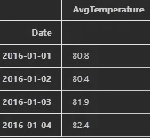
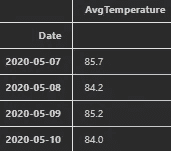
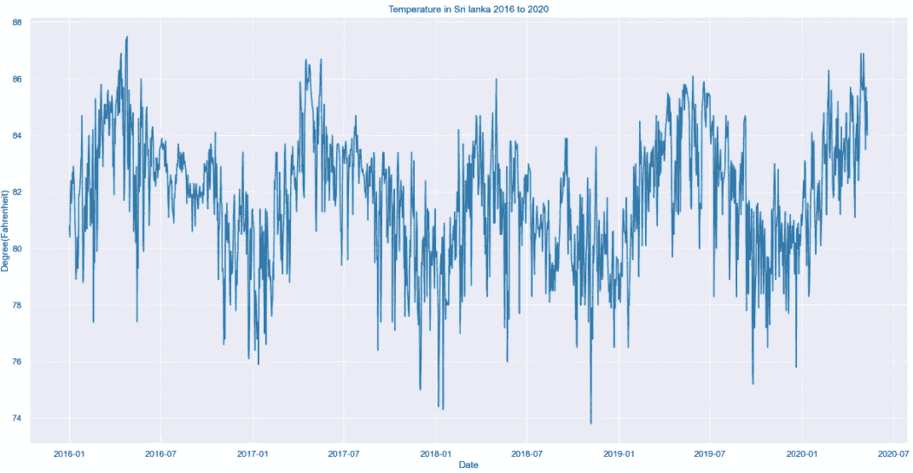
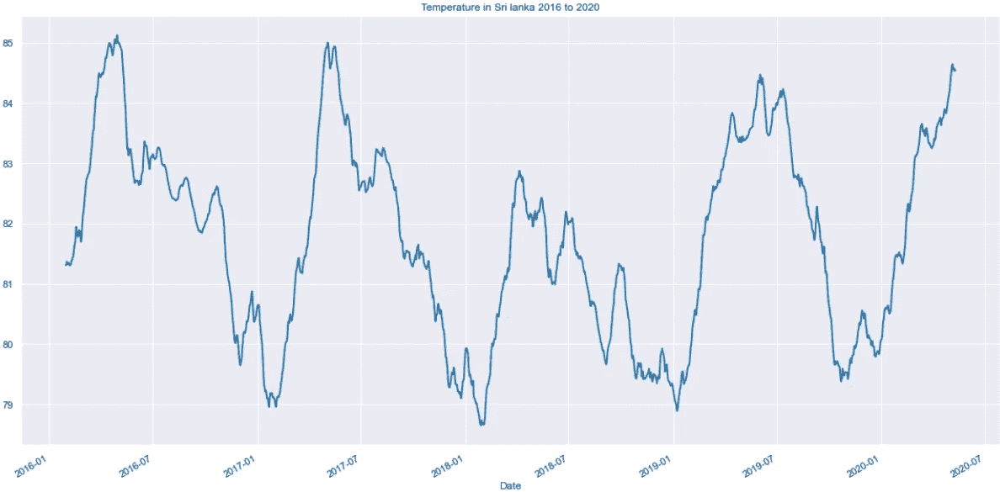
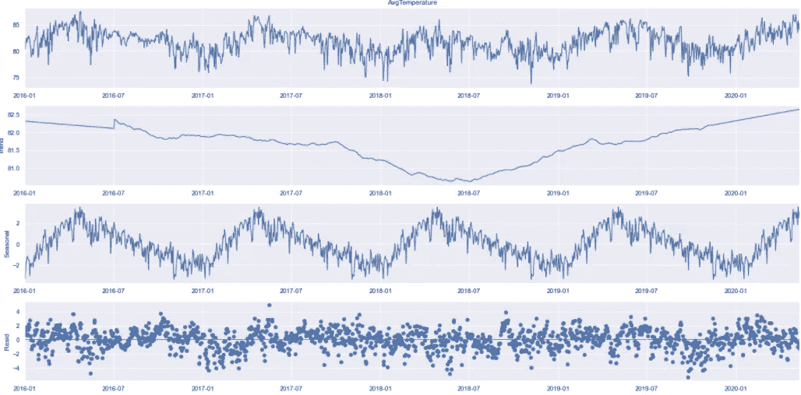
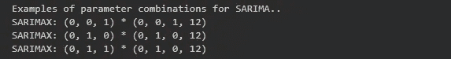
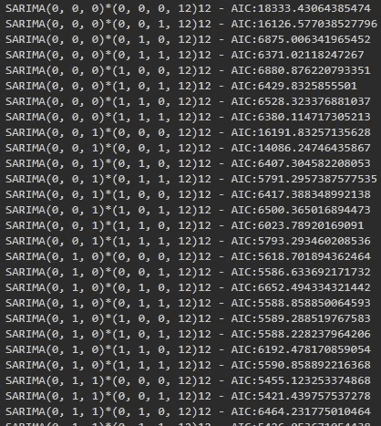
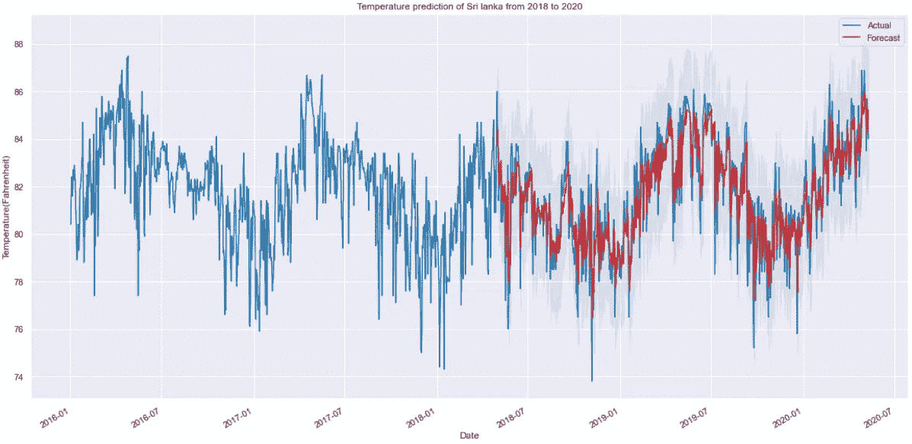

# 基于 Python 的 ARIMA 模型时间序列分析

> 原文：<https://medium.com/geekculture/time-series-analysis-using-arima-model-with-python-afe4b41bbec8?source=collection_archive---------3----------------------->

> ***时间序列*** 是一系列基于时间的数据点，这些数据点是在给定现象的特定时间间隔内收集的，并随时间发生变化。换句话说，时间序列是在一段时间内连续的等距点上取得的序列。

例如，我们可以提供不同领域的几个时间序列数据集，如污染水平、出生率、心率监测、全球气温和消费者价格指数等。在处理级别，在**时间内对上述数据集进行跟踪、监控、向下采样和聚合。**

在大数据分析领域有不同种类的时间序列分析技术。他们中很少有人，

*   自回归(AR)
*   移动平均线
*   自回归移动平均(ARMA)
*   自回归综合移动平均(ARIMA)
*   季节性自回归综合移动平均(SARIMA)

> **ARIMA 模式**

ARIMA 模型简单灵活，足以捕捉我们在数据中看到的关系，它旨在使用过去的数据解释数据点之间的自相关。我们可以对 ARIMA 模型进行如下分解，以抓住它的关键要素。

*   **AR: *自动回归。*** 这是一个利用数据和滞后数据之间依赖关系的模型。
*   **一:*综合。***
*   **MA: *移动平均线。*** 一种利用观测值和残差之间关系的模型，来自应用于滞后观测值的移动平均模型。

> **数据集解释**

对于本练习，数据集已从[https://www . ka ggle . com/sudalairajkumar/daily-temperature-of-major-cities](https://www.kaggle.com/sudalairajkumar/daily-temperature-of-major-cities)下载。在该数据集中，它包括从 1995 年到 2020 年在不同地区、国家和城市收集的日平均温度值(华氏温度)。

对于数据集的预处理和进一步分析，我使用了 *pandas。*使用*熊猫，*我们可以通过创建熊猫`DataFrame.`来探索、清理和处理数据集

在`DataFrame` 的预处理中，我们完成了几个步骤，

*   我已经通过合并年、月和日列添加了新列作为**日期**。然后分别从数据集中删除年、月、日、城市和地区列。
*   从数据框中移除重复的空值行。

在本文中，我并没有重点演示数据预处理。因此让我们转入讨论这一观察的一个重要事实。

在这个经过预处理的数据框中，它具有每个国家的长期温度值。到目前为止一切都很好！但是，对于今天的天气数据来说，使用过去的温度可能不是一个好的指标，因为影响全球温度的因素一直在变化。

因此，**最好在最近的影响因素**下分析，我们将只选取 2016 年至 2020 年的数据子集进行时间序列分析。此外，为了便于分析，我还过滤了特定国家的数据框架。在这里，我使用了国家“斯里兰卡”。

> **探索性分析**

首先，您需要将日期设置为数据框的索引。

sample head records of data frame

sample tail records of data frame

> **数据可视化**

下一步是将数据框可视化为时间序列图。下图显示了斯里兰卡 2016 年至 2020 年期间的温度分布情况。为了绘图，我已经导入了`matplotlib.pylot.`

正如你所看到的，读取曲线图有点嘈杂，因为数据集包含每天的温度和曲线图。因此，我们需要使用适当的技术来平滑情节。

我们如何平滑这个图形？

在数据科学中，平滑技术可以用来减少或消除这些变化和噪声的影响。如果应用得当，这些技术可以消除时间步长之间的细微差异，从而改善潜在趋势的可视化和识别。作为例子，

*   指数平滑法
*   移动平均平滑

*移动平均平滑*是时间序列分析中经常使用的一种流行的平滑方法，易于应用且不易产生大量虚假信号。

Pandas 有预建的方法来简化移动平均平滑的应用，如滚动()。通过这种方法，您可以提供特定时间段作为窗口大小。例如，窗口大小 30 意味着，我们将 30 天作为一个窗口。使用这种技术，我们可以得到该时间段内每个窗口大小的数据集的平均值。

您可以根据衰减需求选择窗口大小。在这个例子中，我使用的窗口大小为 30。

***时间序列分解***

时间序列数据可以表现出多种模式，将时间序列分成几个部分通常是有帮助的，每个部分代表一个基本的模式类别。

如果我们考虑上面的图表，我们可以稍微看到每年日平均温度的共同模式。每年的年初和年末似乎都很冷。但是到了年中，气温会逐渐升高。

时间序列分解有不同的组成部分，

*   *:重复模式在数据集中固定且已知的时间段内出现。*
*   ****趋势*** :包含数据中持续增加或减少的方向。*
*   ****残差*** :时间序列中季节和趋势成分被估计并去除后的项。形成序列中短期波动的数据，这些数据既不系统也不可预测。*

*这里我对以上三种模式做了加法分解。*

**

> ****用 SARIMA 模型预测****

*普通 ARIMA 模型的问题是它不支持季节性。*

*在这个日平均数据集中，我们可以看到季节性模式，因此，我们继续使用使用季节差异的 SARIMA 模型。季节差异与常规差异类似，但是，我们不是减去连续的项，而是减去上一季的值。*

*ARIMA 模型包括 p、d 和 q 三个主要参数*

*   ****p*** :自回归模型的阶。*
*   ****q*** :移动平均线模型的顺序。*
*   ****d*** :使时间序列平稳所需的差数。*

*萨里玛车型基于 ARIMA 车型。它还包括 *p* 、 *q* 和 *d* 参数，还包括一组额外的参数来说明时间序列的季节性。*

****P*** :季节自回归模型的阶。*

****Q*** :季节移动平均线模型的顺序。*

****D*** :应用于时间序列的季节差异数。*

*因此，我们可以将萨里玛模型的符号表示为萨里玛(P，D，q)(P，D，Q，s)。这里 s 表示一年的季节性。*

**

****我们如何选择合适的参数组合来拟合 SARIMA 模型？****

*选择最佳 ARIMA 模型配置通常是一个迭代过程。为此，我们可以使用“网格搜索”来反复探索不同的参数组合。*

*对于每个参数组合，我们使用 statsmodels 模块中的 SARIMAX()函数拟合新的季节性 SARIMA 模型，并计算 AIC (Akaike 信息标准)。AIC 用于衡量统计模型的相对质量。*

**

*sample of different combination of parameters with AIC values*

*考虑到不同的组合及其 AIC 值，我们可以选择一个 AIC 值最小的组合。通过考虑这些组合中的所有值，我可以得到*最小 AIC (5281.62)* 组合为*萨里玛(1，1，1)*(1，1，1，12)12* 。之所以选择较低的组合 AIC，是因为它将是更好的**-适合模型。***

******将选择的组合拟合到 SARIMA 模型******

***现在我们已经弄清楚了组合。然后我们可以把它合成为如下的萨里玛模型。***

> *****用预测验证 SARIMA 模型*****

***我们可以用各种方法来预测。***

*   ******非动态预测(静态)*** :此方法产生一步预测，这意味着每个点的预测都是使用到该点为止的完整历史生成的。***

***在本例中，我们主要关注静态预测，在这种情况下，对于日平均温度示例，静态预测比动态预测更适用。***

***通过这种方法，我们可以将时间序列的预测值与实际值进行比较，从而确保模型的准确性。下面的代码片段显示，我们预测的日平均温度提供的起始日期为 2018 年 5 月 1 日。***

***Get prediction using static forecasting***

***在上面的代码片段中，我们将训练时间序列周期确定为 2016 年到 2018 年。因此，我们预测从 2018 年开始到 2020 年结束期间的温度。***

******

***可以想象，乍一看，我们可以看到预报的日平均温度与实际的日平均温度一致。我们可以通过评估 **RMSE(均方差)**来量化我们预测的准确性，其中对于每个预测值，我们计算其与真实值的距离，并对结果求平方。***

***结果:**该 SARIMA 模型预测的 RMSE 误差为 1.32** ，非常低，说明我们从该模型中获得了很高的精度。在理想情况下，MSE 应该为零。但是通常这是不可能的。***

*   ******动态预测*** *:****

***通过动态预测，我们仅使用某个时间点之前的时间序列信息，之后，使用之前预测时间点的值生成预测。***

***Get prediction using dynamic forecasting***

***对于动态预测，我们还计算 RMSE 值如下:***

***结果:**动态预报预测的 RMSE 误差为 20.45** 明显高于前一步。通过考虑上述预测精度值，我们可以得出结论，***

******静态预测允许将之前预测的结果单独作为未来通货膨胀结果的预测器，这一点可以很好地跟踪，因为与动态预测结果相比，误差幅度非常小。******

> *****顺便说一下，我们已经到了这篇文章的结尾，对熊猫使用 ARIMA 模型进行*时间序列分析。希望无论你以前有什么样的知识，你都能在讨论的主题上获得知识。******
> 
> *****如果你看到这篇文章，请给我一个鼓励。👏*****
> 
> ***我将结束这次旅行，直到我们遇到另一个有趣的话题。😊 🎉***