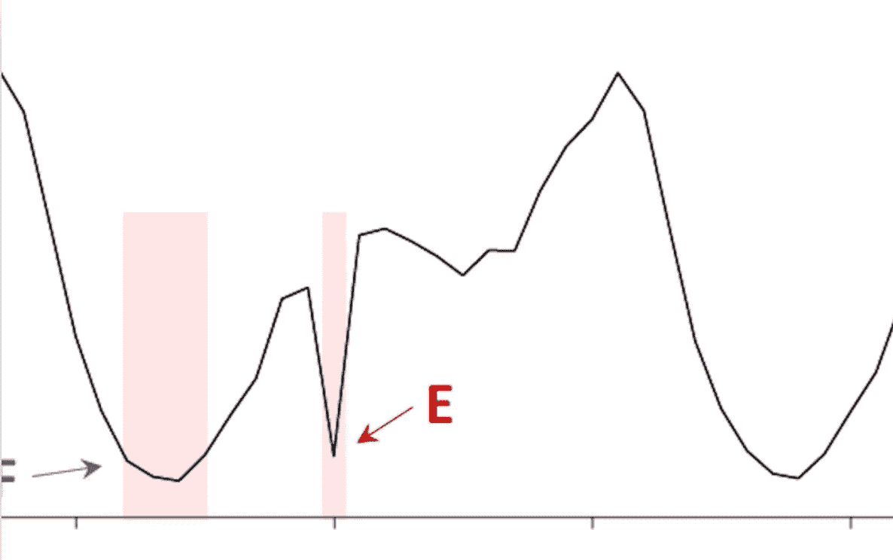
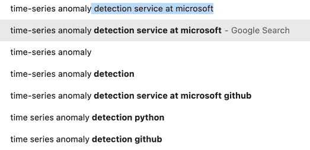
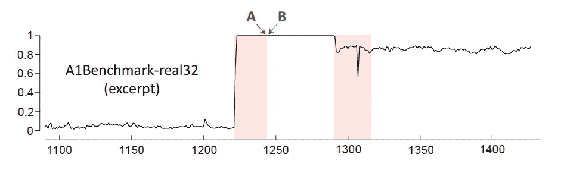
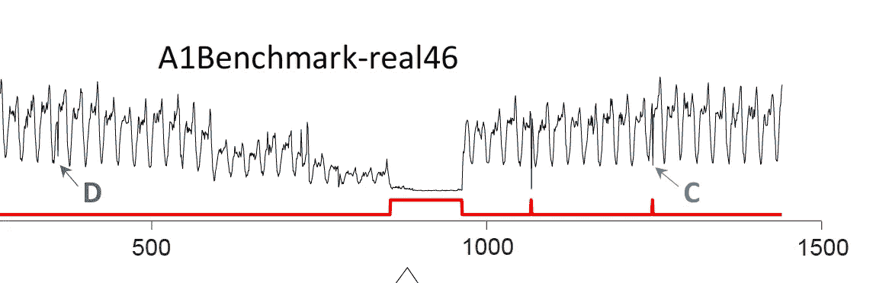
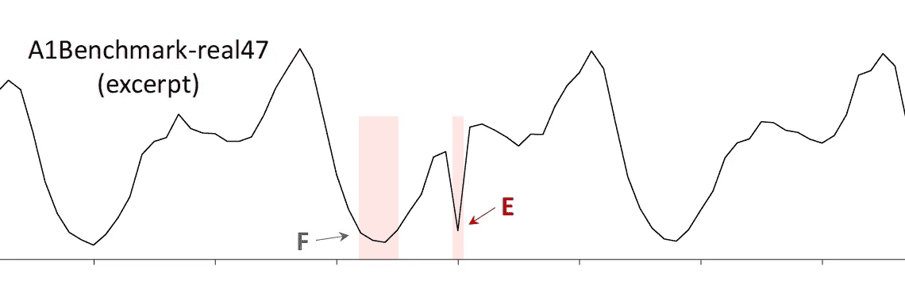
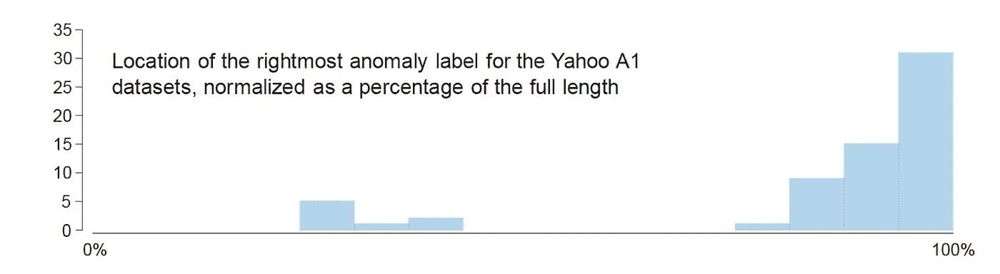
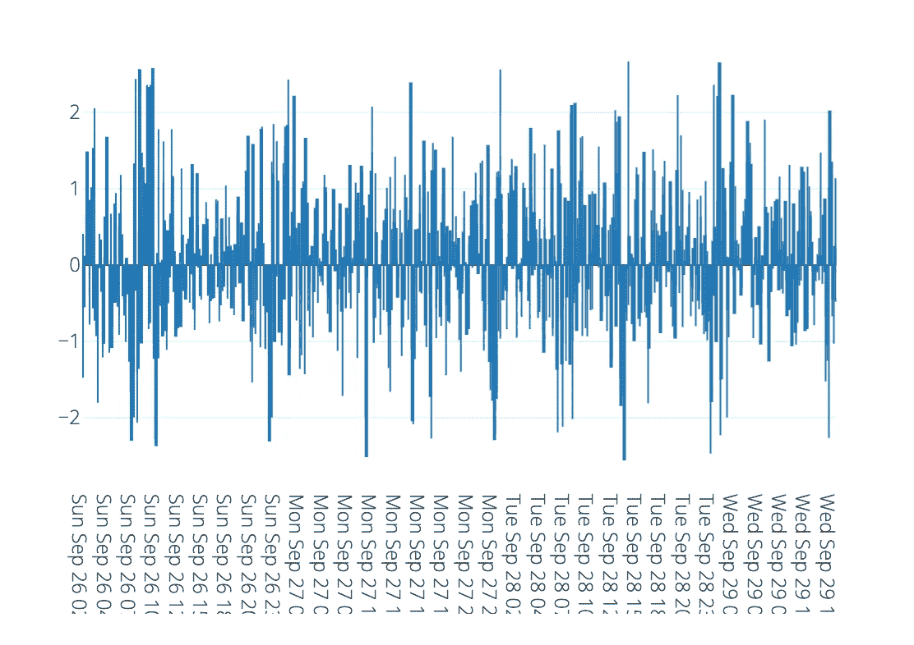

# 时间序列异常定义

> 原文：<https://medium.com/geekculture/time-series-anomaly-definition-c04b7d907000?source=collection_archive---------2----------------------->

From *Current “Time Series Anomaly Detection Benchmarks are Flawed and are Creating the Illusion of Progress” by* Renjie Wu and Eamonn J. Keogh

你看到我在那里做了什么吗？我标题中的第四个词是意想不到的——有人会说是反常现象。你在期待另一篇令人打哈欠的文章，叫做时间序列异常检测，是吗？当然，谷歌希望这是标题…而且我应该买一个微软的产品来帮助我。

使用机器学习进行异常检测在最近一段时间非常流行，但根据徐人杰·吴和埃蒙·j·基奥去年的批评，这种收益可能是虚幻的。我一直在研究一个异常检测的解决方案，在这里我会做得更清楚。但是这篇文章首先概述了他们对现状的批评。你可以在*当前的时间序列异常检测基准有缺陷，并且正在制造进步的假象* ( [**论文**](https://wu.renjie.im/research/anomaly-benchmarks-are-flawed/) )。

## 平凡

我总是本能地对“异常”一词保持警惕，因为它似乎会引发循环定义。(我不骗你，当我写这篇文章的时候，我的狗实际上正在我旁边的地板上追逐它的尾巴)。我对吴和评论的残酷性持怀疑态度。在关于最近使用变分自动编码器进行异常检测的文章中，他们写道:

这种复杂方法的许多结果可以用一行代码和几分钟的努力来复制

哎哟。作者使用这种“一行代码”的尺度来评估异常检测中最近所谓的进步，从而识别他们所说的基准测试中的第一个缺陷。他们将时间序列异常检测问题定义为平凡的，如果它可以通过使用原始函数(如 mean、max、std)来解决(与一行调用 kmeans 或其他函数相比)。

作者声称，在艾哈迈德、拉文、波弟和阿迦( [**论文**](https://www.sciencedirect.com/science/article/pii/S0925231217309864) )的*无监督实时流数据异常检测*中使用的 Numenta 基准在这个意义上是微不足道的。洪达姆、康斯坦蒂努、拉波特、科尔韦尔和索德斯特罗姆在*使用 LSTMs 和非参数动态阈值法*检测航天器异常时使用的 NASA 数据集也是如此，他们推断，因为大多数异常偏离正常的数量级。

在 [**reddit**](https://www.reddit.com/r/MachineLearning/comments/j2cqa2/r_current_time_series_anomaly_detection/) 的讨论中，一些参与者认为单行标准是不可接受的模糊——但我个人对此没有异议，我认为他们可能忽略了更重要的一点。

## 不切实际的异常密度

吴和注意到，在一些基准数据集中，有大量的连续区域都被标记为异常；或者标记为异常的许多区域；或者彼此非常接近的异常点。他们展示了来自 Yahoo 基准数据集的以下案例，并注意到 A 被分类为异常(我们假设是手动分类),而 B 没有。

这显然产生了一个问题，因为 A 和 B 之间没有区别——什么都没有改变，而且*几乎任何合理的算法都会把它们视为相同的(除非它进行了一些任意的计数，也许)。*

From *Current “Time Series Anomaly Detection Benchmarks are Flawed and are Creating the Illusion of Progress” by* Renjie Wu and Eamonn J. Keogh

这是雅虎基准数据集的另一个例子。为了基准算法的目的，你能说出 C 和/或 D 点中的哪一个被认为是异常的吗？是的，红线显示出来了。在数据集的创建中，C 被认为是异常值，而 D 不是。

From *Current “Time Series Anomaly Detection Benchmarks are Flawed and are Creating the Illusion of Progress” by* Renjie Wu and Eamonn J. Keogh

这使我们看到了问题的明显循环——我将在适当的时候提出一个解决办法。然而，让我们先从吴和敏锐的目光中再借一个例子。

From *Current “Time Series Anomaly Detection Benchmarks are Flawed and are Creating the Illusion of Progress” by* Renjie Wu and Eamonn J. Keogh

为什么 F 是异常？你的猜测和我的一样好，不幸的是，这种“基本事实”正被用来报告异常检测的进展。我就不往下说了，不过看 [**论文**](https://wu.renjie.im/research/anomaly-benchmarks-are-flawed/) 更多半信半疑选择的例子。

## 运行至故障偏差

正如你在吴和的论文中推断的那样，雅虎基准指数受到了重创，但它也存在另一个缺陷——异常值的分布高度倾斜。这张图显示了这种偏见有多严重。绝大多数被认为是异常的数据点位于时间序列的最末端。因此，考虑到这一点的算法将胜过其他算法——显然，在野外不会提供任何真正的优势。

From *Current “Time Series Anomaly Detection Benchmarks are Flawed and are Creating the Illusion of Progress” by* Renjie Wu and Eamonn J. Keogh

## 解决方案 1:更好的基准数据集

作者认为，最近的研究还存在其他问题，包括评分函数的可疑选择和应用领域的不明确定义。但是我会让读者参考他们的论文，因为我想把这篇文章变成一篇更积极的文章。

已经看到了用于异常检测基准测试的数据集中的一些困难，一个明显的解决方案是创建更好的数据集。作者强烈建议放弃现有的基准，他们创建了自己的基准——增加了 UCI 不断增长的数据集**。**

**然而，就我个人而言，我不确定这是否真正触及了时间序列异常检测循环的核心。例如，如何将比特币价格的上涨定性为异常或非异常？这到底意味着什么？对于一个算法来说，擅长检测或事后分类异常行为意味着什么？**

**虽然吴和建议抛弃异常检测数据集，但我还是想建议，或许我们应该抛弃术语异常，直到有人能够提供一个可行的定义——因为显然，该领域似乎在这方面苦苦挣扎。我们已经有了单词*分类*(分为“鲍勃认为不正常的事情”或“鲍勃认为在正常操作范围内的事情”)，如果论文的标题是“*一种对鲍勃认为不正常的事情进行分类的新颖的机器学习方法*”，我会说任何人失去理智或困惑的危险都更小。**

**这种想法能得出合乎逻辑的结论吗？让我给你介绍一个基于竞争的异常概念，它不是循环的，也不是模糊的。**

## **解决方案 2:市场概率和“Z 流”**

**当我问自己比特币的走势是否*反常*(事实上我不反常，因为我讨厌这个词)时，我只是看下面的情节。我的朋友们，这是一个 **z-stream** ，正如底层的 [**机制**](https://www.microprediction.com/blog/intro) 所揭示的，它可以被解释为上面给出的分类定义的概括，除了我们用 *Bob、Mary 和 Alice* 替换 *Bob* ，并且我们要求他们将数据“分类”成百分位数。**

****

**Image from www.microprediction.org**

**顺便说一下，我更希望你看的是这个 **z-stream** 的 [**真人版**](https://www.microprediction.org/stream_dashboard.html?stream=z1~c5_bitcoin~3555) ，因为你可以点击“转到父”按钮，在这里显示比特币价格变化的时间序列**，结合排行榜上显示的算法所做的预测，确定“z”值。****

****强调一下，这些数字不是某种固定算法的结果。下面是它们是如何计算的(这个 [**帖子**](https://www.microprediction.com/blog/intro) 的简短版本)。****

1.  ****算法提交 225 个对数据流未来价值的猜测，知道它们将根据有多少接近随后揭示的真相而得到奖励。****
2.  ****所有提交的猜测的总和很容易被解释为累积分布 F(例如，可以使用经验分布，但也有更好的方法)。****
3.  ****到达的数据点 x 被赋予等于 z = norminv(F(x))的 z 分数****

****这种说法是，z 将接近正态分布，因为如果不是这样，就有奖励寻求预测算法来修正它的动机。****

****(顺便说一下，没有强有力的理由应用 norminv，我们可以用百分位数来代替。然而，有一些证据表明，算法及其作者往往更喜欢变换的时间序列。参见托马索和赫尔穆特的 [**论文**](https://mpra.ub.uni-muenchen.de/32294/1/MPRA_paper_32294.pdf) 举例。)****

****Bob 或读者可以创建另一种算法，并在任何时候启动它——通过修改 Python 脚本(就像这个 [**one**](https://github.com/microprediction/microprediction/blob/master/crawler_examples/booze_mammal.py) )并运行它。此外，Bob、M 和 Alice 添加更好的算法应该不会太困难，因为 Alice 可以相当容易地利用一百个完全自主的时间序列点预测器 ra *中的任何一个。*****

****为了进一步降低固定分布的成本，十几个流行的 Python 时间序列包在一个规范的序列到序列调用签名 [**中公开，这里是**](https://github.com/microprediction/timemachines) ，希望让 Alice 的生活更容易，因为她试图对比特币价格运动进行分布预测(例如，她可以预测波动)。爱丽丝也有一些小小的金钱动机来加入她的算法，尽管我确信这与她的科学动机相比相形见绌。****

****现在，我承认使用“z 分数”可能会被认为是对现有术语的混淆。我的意图是 z-streams 中的数字会让人想起 z-scores，但同时又明显更胜一筹。撇开我的写作障碍不谈，我们现在可以自由地使用 z 曲线时间序列以多种方式定义异常。稍后会有更多的介绍。****

## ****异常层位****

****但是首先，这是异常检测研究的另一个潜在问题，以及异常数据集的创建。似乎经常没有期限结构的概念。然而在现实世界中，一个事件可能在短时间尺度上被认为是异常的，但在更长时间尺度上却不是，反之亦然。****

****在设计 z 流时不可能不面对这个问题。因此，您会注意到，每个 z 流都是相对于预测地平线定义的。这些地平线目前仅超过一分钟或不到一小时。当一个新的数据点到达时，我们回顾提交的预测，并且只使用那些在截止时间之前收到的预测。****

****我希望从 [**力学**](https://www.microprediction.com/blog/intro) 中明确这一点。****

## ****人们唯一会同意的是****

****把概率定义为概率竞争的结果已经是老观念了。****

****De Finetti 有一句名言:概率是不存在的……除非人们赌两只苍蝇爬上一堵墙。不管怎样，这是我在澳大利亚对意大利数学家在 20 世纪 20 年代以后的思考的即兴重复。今天，我们谈论风险中性和市场隐含的概率，因为金融窃取了这个概念，并将其重新命名。****

****法国人发明了斗鸡的彩金，这是我给你们展示的 z 流机制的一个特例。一位出生于英国的澳大利亚发明家在 1907 年实现了计算器，但新西兰人是第一个在愤怒中使用它的人。有大量的信贷可以分配。****

****在频繁重复预测的领域，风险中性概率或多或少与精算概率一致(试图使用一个词来暗示现实世界的概率，而不会引发贝叶斯主义者和频繁主义者之间的斗争)。我们没什么好担心的。****

****在这个领域，我称之为微观预测领域，竞争预测(例如竞争分布预测)的自我调节性质意味着我们可以避免时间序列算法评估中的大多数常见问题，如数据泄漏和过度拟合。我们代之以工程难题。****

****这里的主要假设是，当参与的摊余摩擦成本较低时，小额回报是否足够，这将得到时间的检验(比方说，对于一个在流网络中觅食的巡回算法，你可以相当容易地创建自己的“爬虫”**)。******

******还要注意 z-stream 值的丢失是因为父代竞争需要*分布预测*。玛丽不仅有动机在缺失的地方增加更多的质量，还有第二个动机，由彩票悖论(在这里讨论**)提供的稍微偷偷摸摸的动机。********

******正如我之前提到的，根据组织 M-竞赛的专家所说，直播、分布式、流媒体竞赛也被认为是预测评估的**未来，并且已经这样做了四十年。********

## ******使用 z 流的工程定制异常检测******

******如果您想要现有流的 z 流值(此处 列出了 [**),您已经有了。有许多**](https://www.microprediction.org/browse_streams.htm) **[**选项**](https://www.microprediction.com/public-api) 可供选择。然而，你可能会有自己的定制数据。********

**要创建一个新的类似于比特币的父流，可以使用 API 或 Python 客户端库(“微预测”)来发布自己的数据( [**参见说明**](https://www.microprediction.com/get-predictions) )。**

**这将自动创建一个二级竞赛流，通过像 [**这个**](https://github.com/microprediction/microprediction/blob/master/crawler_examples/booze_mammal.py) 这样的算法来预测你的 z 值。然后，您可能想更进一步，使用 z 值来定义一些您认为反映操作需求的其他客户号。**

**循环重复。什么最能预测你自己的异常？我不能说，但我有一个想法。时间序列算法相对性能的变化可能是异常行为的先兆(就像一种专门预测零序列的算法在排行榜上排名上升一样——尽管我们显然可以构建更细微的例子)。**

**现在，我希望大家清楚，这将如何服务于学术目的以及现实的商业需求。而且也要明确，琐碎不再是 bug。也许这是一个特点。现在，一行程序实际上是有意义的，例如，如果应用于 z 流。**

**目前，我对 z 流的泛函是合适的这个问题保持沉默。我宁愿只给你提供原材料。但是人们可以将异常定义为长度为 k 的 z 曲线点序列，其总和的绝对值超过阈值。或者，它可以是 z 曲线值全部高于阈值的运行，或者满足一些其他概率度量的运行。**

**z 曲线结构也让我们远离了“走向失败”的偏见或其他偏见，这些偏见可能会不公平地让唯利是图的算法在竞赛中占据优势。异常密度过高的问题现在也不是问题了。**

**也许我遗漏了一些东西，但如果没有，我会很有兴趣看看学术研究人员是否利用了这个设备，或者他们是否继续追逐自己的尾巴。**