# 基于时间序列的预测:非季节性 ARIMA 模型

> 原文：<https://medium.com/geekculture/time-series-based-forecasting-non-seasonal-arima-models-600064475924?source=collection_archive---------9----------------------->

ARIMA(p，d，q)模型提供了一种不同的时间序列预测方法，它是 Box-Jenkins 模型的一种非常流行的统计方法形式。自回归综合移动平均可用于不同领域，如统计，以衡量在一段时间内发生的事件，也可用于预测一系列的未来值。这个模型的组成部分是什么？

我们来看看 AR，I，MA 的定义。

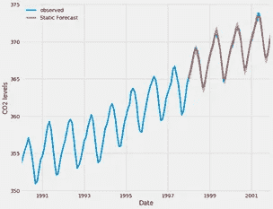

**Figure 1** Time series visualization

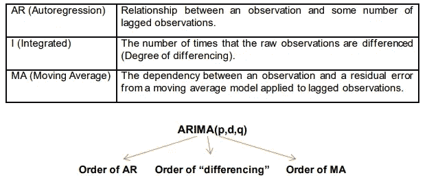

**自回归模型**

在多元回归模型中，我们使用预测因子的线性组合来预测感兴趣的变量。在自回归模型中，我们通过使用过去的线性组合来预测变量。p 阶自回归模型可以写成如下形式。

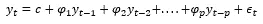

**移动平均线模型**

移动平均模型在类似回归的模型中使用过去的预测误差。请将公式视为

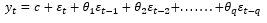

**后移**

处理时间序列滞后时，后移运算符 B 非常有用:

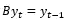

b 具有将数据向后差分一个周期的效果。第一个区别可以写成

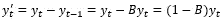

注意，第一个差异由(1b)表示。同样，如果必须计算二阶差分，则:

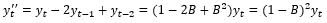

一般来说，我们可以看到 dth 阶差可以写成

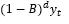

**非季节性 ARIMA 车型**

当我们将差分与自回归和移动平均模型相结合时，我们会发现一个非季节性 ARIMA(自回归综合移动平均)模型。该模型可以写成(差分序列)

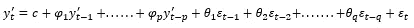

常数 c 对这些模型得出的长期预测有重大影响。d 的值也会影响预测范围。如果数据显示周期，p 值很重要。

下面找一些特殊情况。

见下面 ARIMA 模型的一些特殊情况。

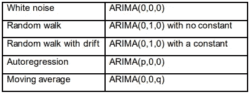

ARIMA 函数对于使用 Python 或 R 构建模型很有用，但是现实情况是任何自动化的东西都可能有点糟糕。因此，理解一些模型的行为是非常重要的。为此，我们需要了解如何手动找到参数 p、d、q。让我们检查一些情节。

**ACF & PACF 地块**

通常不可能知道对于数据集来说什么样的 p 和 q 值是正确的。有时可以使用 ACF 图和密切相关的 PACF 图来确定适当的值。什么是 ACF 和 PACF 图？

ACF 是一种测量时间 t 的观测值和先前时间的观测值之间的线性关系的方法。

PACF 是偏自相关函数，它解释了序列与其自身滞后之间的偏相关性。它找出残差与下一个滞后值的相关性。

一些例子来理解我们如何使用 ACF 和 PACF 图来选择 p 和 q 值。

PACF 在 lag1 处显示异常值，而 ACF 显示清晰的模式。这是一个 AR(1)模型。

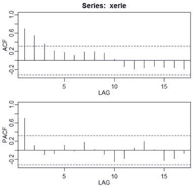

**Figure 2** Example for ACF&PACF graphs

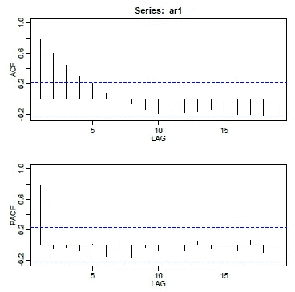

**Figure 3** Example for ACF&PACF graphs

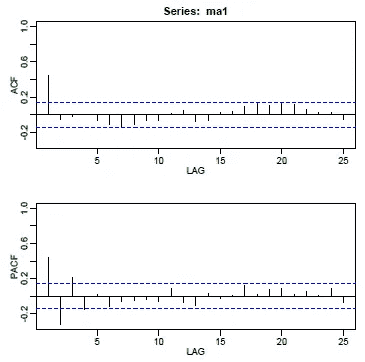

**Figure 4** Example for ACF&PACF graphs

**参考文献**

[https://machinelingmastery . com/ARIMA-for-time-series-forecasting-with-python/](https://machinelearningmastery.com/arima-for-time-series-forecasting-with-python/)

[https://www . machine learning plus . com/time-series/ARIMA-model-time-series-forecasting-python/#:~:text = ARIMA % 2C % 20 short % 20 for % 20 ' Auto % 20 regressive，used % 20 to % 20 forecast % 20 future % 20 values。](https://www.machinelearningplus.com/time-series/arima-model-time-series-forecasting-python/#:~:text=ARIMA%2C%20short%20for%20'Auto%20Regressive,used%20to%20forecast%20future%20values.)

[https://machine learning mastery . com/time-series-forecasting-methods-in-python-cheat-sheet/](https://machinelearningmastery.com/time-series-forecasting-methods-in-python-cheat-sheet/)

[https://towards data science . com/identifying-ar-and-ma-terms-using-ACF-and-pacf-plots-in-time-series-forecasting-CCB 9 FD 073 db 8](https://towardsdatascience.com/identifying-ar-and-ma-terms-using-acf-and-pacf-plots-in-time-series-forecasting-ccb9fd073db8)

[https://otexts.com/fpp2/arima.html](https://otexts.com/fpp2/arima.html)