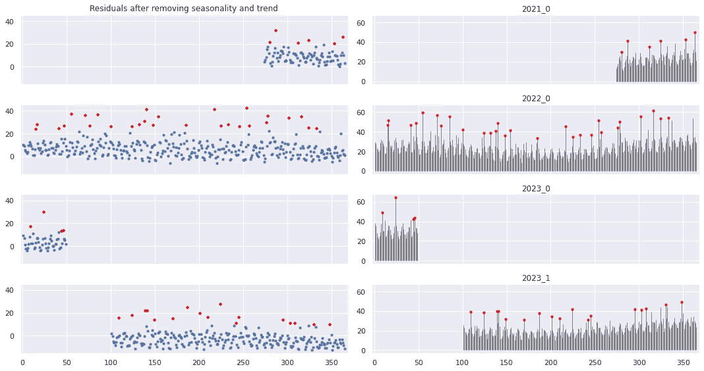

# 离群点检测的时间序列批处理

> 原文：<https://medium.com/geekculture/time-series-batch-processing-for-outlier-detection-88e7f3656101?source=collection_archive---------4----------------------->

Image by author

我们在加拿大皇家银行集团的高级分析部门经常处理时间序列预测。这些主要是日常零售销售，有一套标准的问题，如缺失值、异常值和不同长度的数据可用于历史时期内的分析。在最坏的情况下，客户可能没有外部数据源，如他们的促销活动记录，这使得数据清理更加复杂。

通常，数据清洗包括离群点检测。尽管引入了相当多的用于离群点检测的开箱即用的[算法](https://scikit-learn.org/stable/modules/outlier_detection.html#overview-of-outlier-detection-methods)，但有时它们在每一行中的使用感觉像是对计算资源的浪费。此外，如果你指的是对成千上万个共享公共动态(季节性)模式的时间序列进行异常值检测。

在这方面，我们已经开始考虑对时间序列进行一些批处理，以尽可能自动和智能地检测异常值。

进一步阅读将使你了解我们为大量单变量时间序列提取统一季节性的方法。在这种方法中，您最欣赏的可能是调整季节性(从而进一步检测异常值)的能力，即使那些时间序列不到两个完整的“长期”(例如每年)季节。

## 生成数据

为了说明我们的方法，我们将首先生成一个玩具数据集，该数据集具有上述所有严重的遗留问题(不均衡的可用性、数据中的缺口和基本变化)。

下面是一些人工生成的时间序列，它们共享不同频率的一些常见(buе非均匀分布)波动(假装模拟零售业的年度和周季节性模式)可能的样子:

为了使这些时间序列更加“真实”,我们将根据以下方案从其中一些序列中排除数据:

…通过巨大的差距和一些根本性的转变使他们更加混乱:

我们如何获得(几乎)真实世界的数据集进行实验:

## 计算时间序列重心(批处理)

最敏锐的读者可能已经猜到，我们需要像所有时间序列的重心一样的东西来提取共同的季节性。虽然有一个很棒的 Python 模块( [tslearn](https://tslearn.readthedocs.io/en/stable/auto_examples/clustering/plot_barycenters.html#sphx-glr-auto-examples-clustering-plot-barycenters-py) )是专门为这个目的设计的，但是我们不能在我们的例子中使用它，因为数据中的那些 NaN。因此，我们可以简单地将 *np.nanmean(data，axis=0)* 用于所有堆叠的时间序列，但事先会稍微平滑它们。这是我们批量处理的核心。

以下是平滑后随机样本的外观:

…这是我们的重心:

## 从重心提取常见的季节模式

然后，我们将使用傅立叶元素近似我们的季节性(每年和每周)。现在看着我的手:

所有年份生成数据中的季节性模式:

## 去除(普通)季节性和趋势后检测异常值

此外，我们将季节性表示为目标值的份额(即单变量时间序列)，并应用高级过滤器进行数据平滑。

这最后一步相当简单。在一个循环中的每个时间序列上，我们执行:
——对(普通)季节性的调整；
-从调整后的数据中移除线性(年度)趋势；
-将异常值检测为某个动态阈值以上的残差。

以下是一些随机时间序列的算法输出:

换句话说，这些残差的异常不能用季节性和趋势性来解释。在现实世界中，你可能会认为它们是“由于特殊事件”的特大销售，这些事件可以是假期或促销活动等。