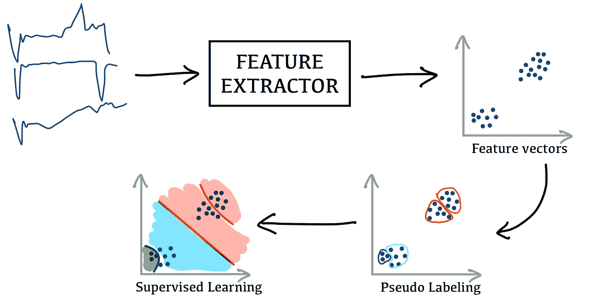
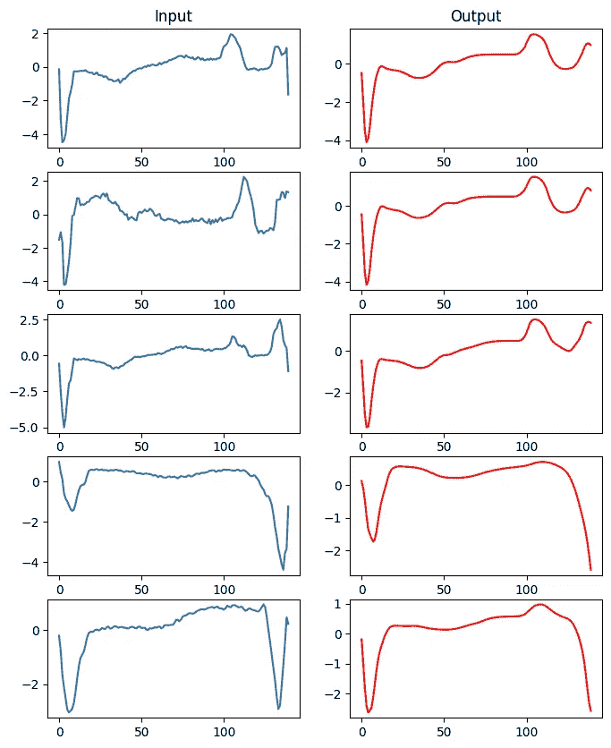
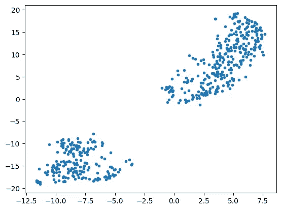
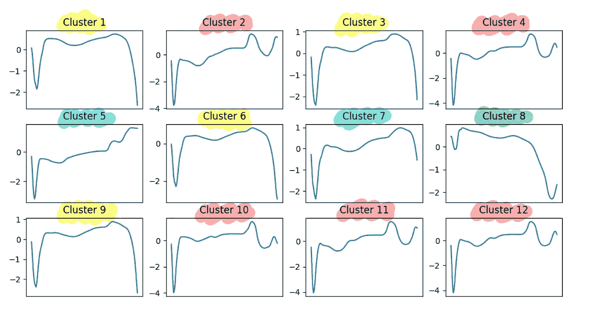
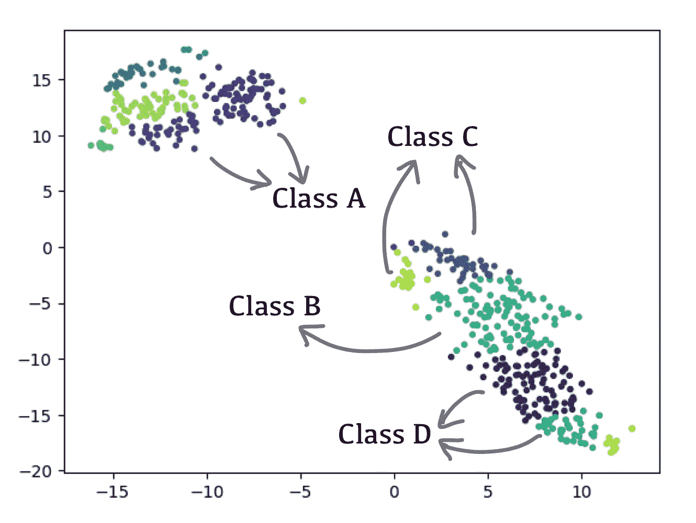
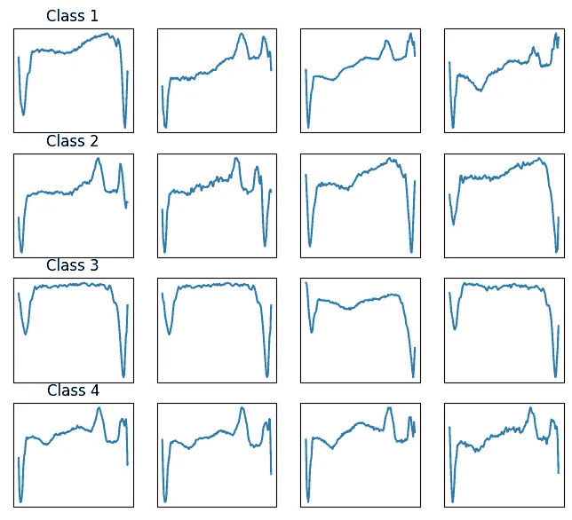
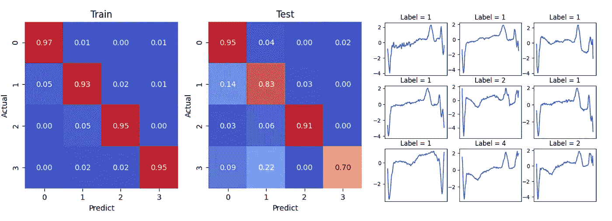

# 无标签时间序列分类

> 原文：<https://medium.com/geekculture/time-series-classification-without-labels-4c3acc5cfd0f?source=collection_archive---------2----------------------->

## 当地面真相不存在时

# 介绍

大多数时候，当我们建立一个分类器时，问题是在一个监督学习环境中。有数据和标签可以用来优化模型。不幸的是，事实并非总是如此。我最近就遇到过这种情况。一个客户来了，说他们想在他们知道存在的时间序列数据中找到模式，但不知道它到底是什么样子。

我在做这个项目时发现，对于这类问题，没有太多可用的资源(至少从我的研究来看)。为了找到一个可接受的解决方案，我不得不将几个来源的概念混合在一起。在这篇文章中，我将分享我解决这个问题的方法。

***免责声明*** *:由于真实数据是保密的，所以本文中你看到的所有输出都是将这种方法应用于公开可用的* [*ECG5000 数据集*](http://www.timeseriesclassification.com/description.php?Dataset=ECG5000) *的结果。*

# 目录

> [概述](#e012)
> [特征提取](#3f02)
> [伪标注](#d2af)
> [构建分类器](#5ce6)
> [结论](#aad2)

# 概观

我们要使用的方法是基于这样的假设，即每个样本都有关键特征，这些特征是所有特征的子集。如果样本的关键特征彼此接近，则属于同一类别。如果我们可以从数据中提取关键特征，我们就可以用它来将样本分类成组，并使用这种洞察力来自己标记所有样本。最后，在我们得到每个样本的(伪)标签后，我们可以使用监督学习方法训练一个分类器。

下图显示了这种方法的概况。

# 特征抽出

如上文所述，该方法的第一步是从时间序列中提取关键特征。有很多方法可以从时间序列数据中提取特征，但在选择特征提取方法之前，我们应该对关键特征有一个清晰的定义。

在这项工作中，我们将关键特征定义为一组能够解释原始时间序列整体结构的特征。 *Autoencoder* 是一个非常适合这一定义的模型，因为该模型所做的只是将原始数据压缩成一个矢量，并以重建损失较小的方式恢复输入。因此，我们训练了一个自动编码器，并将编码器部分用作特征提取器。下图显示了自动编码器模型训练后的结果。

Input and output of the Autoencoder model after trained

Feature vectors extracted by an autoencoder

# 伪标记

一旦我们从数据中提取出关键特征，我们就对所有特征向量应用 K-Means 聚类来对它们进行分类。由于我们不知道有多少个集群，所以我们使用了大量的集群来防止低人口类别被淹没。下图显示了每个聚类的质心时间序列。通过将质心传递给前一步骤中构建的解码器来重构时间序列。

Centroid time-series of each cluster.

我们观察到一些集群彼此非常相似，这意味着它们属于同一个类。我们手动将相似的聚类分组到同一个类中，然后给它们分配一个标签。这些标签被传播到属于每个聚类的所有样本(这个步骤受到了《T4》一书的*第 8 章*的启发【用 Scikit-Learn 和 *Aurélien Géron* 的 TensorFlow 实践机器学习】。下图说明了伪标签是如何完成的。

Pseudo Labeling based on K-Means Clustering result

目前，数据集中的所有样本都有一个标签，这意味着我们可以使用监督学习来训练分类器。

Sample time-series for each class after pseudo labeling

# 构建分类器

由于前面的步骤已经完成了所有的艰苦工作，所以这一阶段剩下的工作非常简单。我们使用上一步中生成的标签作为训练模型的基础，然后评估其性能。在这项工作中，我们使用的模型是 RandomForest，结果如下:

Classifier performance and sample output

# 结论

本文解释了一种解决分类问题的方法，这种方法不像普通的监督学习问题那样需要标记数据。这种方法在获取数据标签很昂贵或不可能的情况下会很方便。此外，该方法基于的原理是数据不可知的，这意味着它可以应用于除时间序列之外的数据类型，例如图像。

如果你感兴趣，我已经在这里上传了我用来创建这篇文章[的代码。](https://github.com/thanakorn/self-supervised-ts-classification)

感谢阅读。如果你喜欢这篇文章，你可以在 Medium 上[关注我](/subscribe/@thanakornpanyapiang)。下一篇文章再见。