# Python 中的经典时间序列预测

> 原文：<https://medium.com/geekculture/time-series-forecast-in-python-5c4c61e1c2c2?source=collection_archive---------0----------------------->

使用经典时间序列分析方法的示例(SARIMA)

Photo by [泽涵 白](https://unsplash.com/@des0519?utm_source=medium&utm_medium=referral) on [Unsplash](https://unsplash.com?utm_source=medium&utm_medium=referral)

在这篇博客中，我解释了如何用 python 来做一个简单的单变量时间序列预测。

# 介绍

时间序列通常被定义为一个或多个变量在连续时间段内的一系列值。例如，连续几年的销售量、一个城市几个月的平均温度等。如果该序列只涉及一个变量，则称为单变量时间序列。如果该序列列出了多个变量在不同时间点的值，则称为多元时间序列。在这个博客的例子中，我们将处理一个单变量时间序列。

连续的时间点称为时间步长。例如，每个时间步长可以是 1 到 12 个月或 1 到 31 天或一系列年份等。

在时间序列中，变量的值随时间步长上下波动，其组成如下。

**趋势** -趋势是数据值在一段时间内一致的长期向上或向下的运动。例如，增加季度销售额或利润。

**季节性因素-** 一个日历年内趋势的反复向上或向下变动，如季节、季度、月份等。最受欢迎的例子之一是排灯节、圣诞节等节日期间的小玩意销售高峰。

**周期性成分-** 围绕趋势线波动，重复之间的持续时间超过一年。与季节性因素不同，周期性波动的周期不是恒定的。例如，由于经济衰退、失业等原因导致的业务指标波动。

**噪声或不规则成分** -服从平均值为零且方差恒定的正态分布的随机不相关变化(也称为白噪声)。

# 时间序列预测

*时间序列预测是根据一个变量过去的值来预测其未来的值。例如，预测股票价格值、产品收入、未来一周或一个月城市的平均温度等。*

回归问题和时间序列预测的区别在于——在回归中，我们考虑不同的独立特征并预测一个从属目标变量的值。例如，根据房屋面积、房间数量、停车位等预测房价。但在时间序列的情况下，我们通常没有其他独立的特征，相反，我们只有我们想要预测的同一变量的过去值。

因此，时间序列预测采用不同于线性回归问题的统计/分析方法。

在深度学习神经网络，特别是递归神经网络流行之前，有许多经典的分析方法/算法用于时间序列预测- **AR，MA，ARMA，ARIMA，SARIMA 等。**由于其有效性以及在大量数据不可用的情况下(这些数据对于训练 rnn 至关重要),它们甚至在今天仍在使用。

# 了解时间序列概念的基础

作为初学者，我第一次发现理解时间序列分析的基础很难或者很无聊，尽管有大量的资源可供参考。但是如果我们坚持并花费足够的时间，我们也可以理解其中的概念和数学(尽管我们可以根据自己的胃口和耐心来选择数学部分)。经过一番搜索，我发现这个特别的 Y [ouTube 系列](https://www.youtube.com/watch?v=ZoJ2OctrFLA&list=PLvcbYUQ5t0UHOLnBzl46_Q6QKtFgfMGc3)对理解时间序列分析概念和算法非常有帮助。为了欣赏这个博客中解释的例子和概念，我建议你先看视频系列，如果你是时间序列分析的初学者。

好了，现在让我们进入这篇博客的主要部分——使用 python 的单变量时间序列分析…

# 使用 python 进行单变量时间序列分析的分步示例

## **数据集**

[**Google Trends**](https://trends.google.com/trends/?geo=IN) 是谷歌旗下的一个网站，该网站分析了各种地区和语言的谷歌搜索中热门搜索查询的受欢迎程度。该网站使用图表来比较不同查询的搜索量。对于给定的搜索词，这些数字表示在所选地区和时间内相对于图表最高点的搜索兴趣。值 100 是该术语的最高流行度，而值 50 意味着该术语的流行度减半。

我们可以下载一段时间内在谷歌中搜索的任何特定术语的“搜索得分”的时间序列数据，作为一个 csv 文件。

对于这个例子**，我下载并使用了术语“Python”(在编程语言的上下文中)的搜索分数的时间序列，历时五年**，并尝试基于数据构建一个时间序列预测 ML 模型。

## 密码

这个练习的完整笔记本代码可以从我的 [github 链接](https://github.com/raja-surya/Time-Series)下载。

# 让我们开始分析

## **1。导入基本 Python 库并从 csv 文件加载数据**

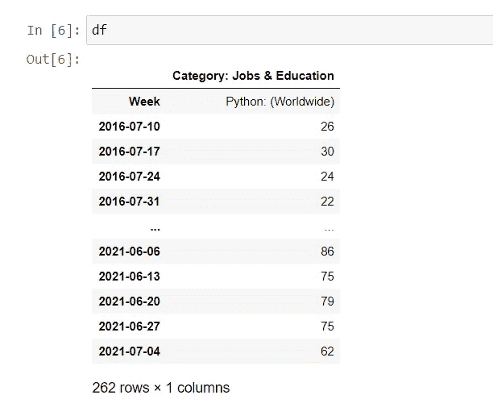

如上所述，该数据包含从 2016 年 7 月 10 日至 2021 年 7 月 4 日(5 年，即 261 周)期间，全球范围内“工作与教育”类别中术语“Python”的每周“搜索得分”。

## **2。探索性数据分析**

我们做了一些基本的清理，将 week 列转换为 Pandas datetime 类型，然后分别提取年、月和日(请参考笔记本中的这些步骤)。

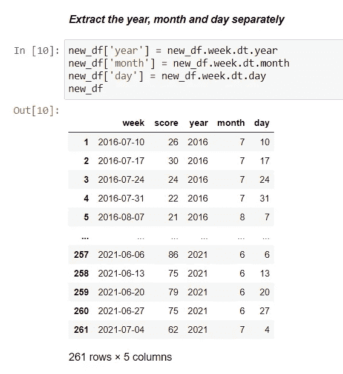

我们将做一些基本的探索性分析。

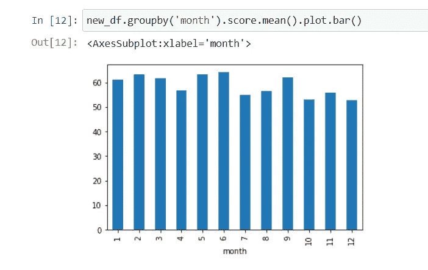

Month Wise Trend

所有月份的平均搜索分数几乎保持不变。

Year Wise Trend

2016-2020 年搜索得分有明显上升趋势。2021 年看起来和 2020 年差不多。
然后我们将绘制时间序列，看看它看起来如何。

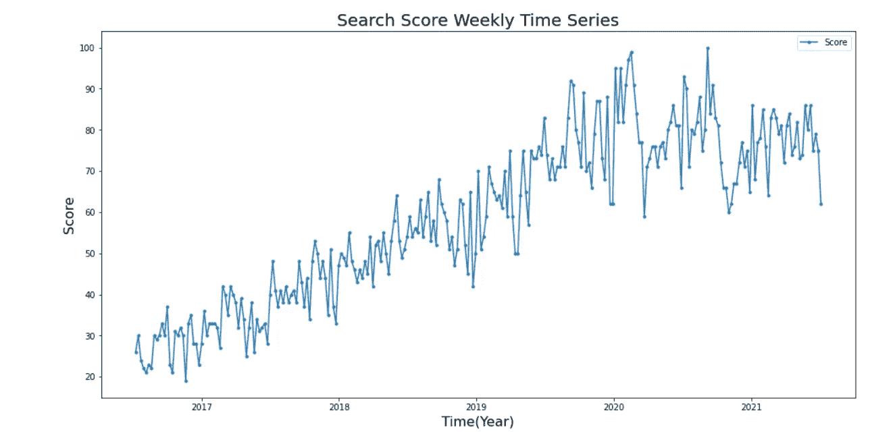

Weekly Time Series Data For Five Years

从 2016 年到 2020 年有一个**明显的上升趋势，然后剧情稳定下来。**

## **3。建模**

由于每周时间序列看起来有点混乱，我们可以将其聚合并转换为每月序列。

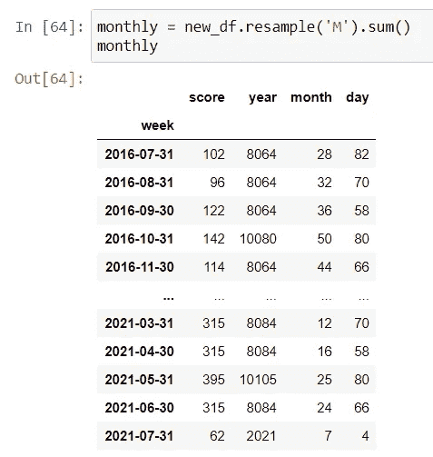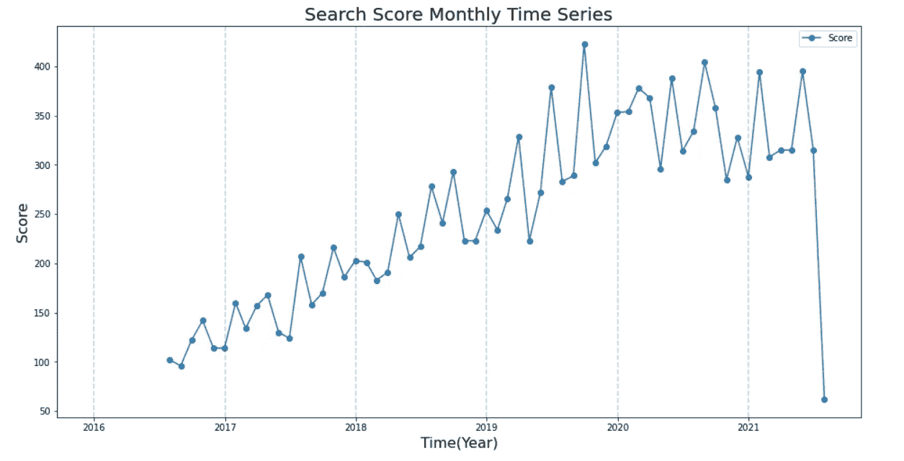

Monthly Time Series Data For Five Years

**我们在时间序列中看到一些季节性模式和一个上升趋势，直到 2019 年底**之后趋于平缓。

为简单起见，我们将选取 2017 年 1 月 1 日至 2020 年 1 月 1 日的有限数据进行进一步分析和建模。

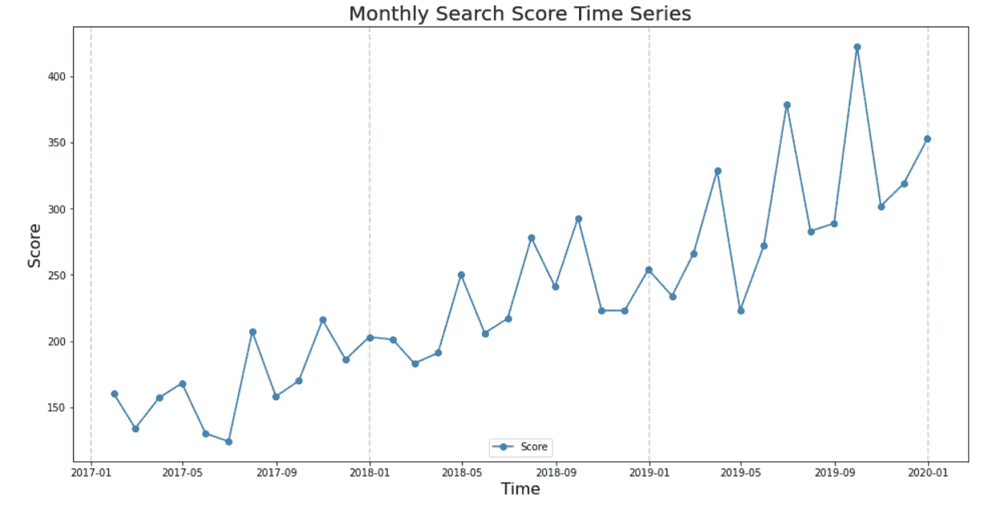

Limited Time Series Plot

## **平稳性**

因为我们看到时间序列有上升趋势，所以它不是静止的。

**满足以下三个条件的时间序列是平稳的。**

1.一段时间内序列的平均值是常数
2。时间序列的方差是常数。
3。没有季节性。

经典的时间序列建模技术，如 AR(自回归)、MA(移动平均)、ARMA (AR + MA)等。，如果时间序列没有平稳性就行不通。

我们必须通过以下方法来检验级数的平稳性

1.如上所述目视检查地块。
2。先进的测试方法，如我们下面要做的 Dickey Fuller 测试。

## **3.1 测向测试**

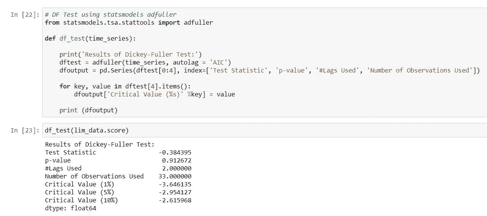

DF Test Results

我们从 statsmodels 库中导入 adfuller 并进行如上所示的平稳性测试。
p 值为 0.91，显著高于预期值(< 0.05)。根据 DF 检验，零假设是给定的时间序列不是平稳的。**高 p 值支持零假设**。这证明了我们的时间序列不是平稳的。

## **3.2 一阶差分**

我们必须先去除趋势，使时间序列平稳。我们可以通过**差分技术**来做到这一点。这种技术采用每个时间步长的值与其对应的前一个时间步长的值之间的差值。例如，一阶差分是减去每个时间步长(t)的值和时间步长(t-1)的值。

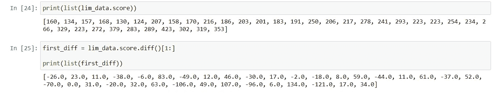

First Difference

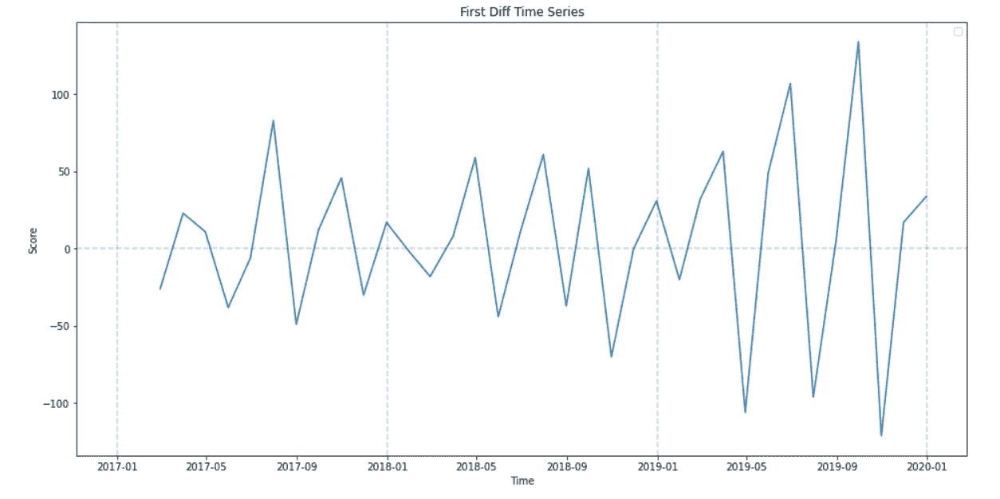

Plot of the First Difference

第一个差分序列看起来具有恒定的均值和方差，以零为中心(尽管方差不是完全恒定的)。让我们对这些数据进行 DF 测试。

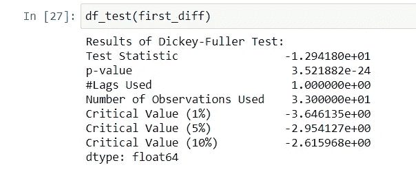

现在 p 值非常低，表明差分时间序列是平稳的。

我们还可以分别分解趋势、季节性、残差(噪声)分量，并使用 statsmodels api 提供的 seasonal_decompose()方法进行可视化。

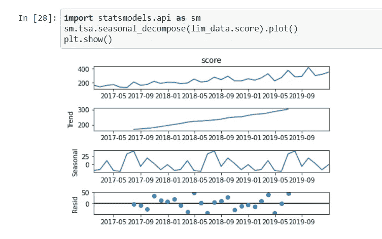

我们在原始时间序列中看到了上升趋势和明显的季节性(重复模式)。残差看起来正态分布在零附近，这很好。

## **时间序列建模的萨里玛算法**

由于我们在原始时间序列
**中看到了季节性和趋势，我们将使用 SARIMA 算法，它代表季节性 ARIMA(季节性自动回归综合移动平均)**

S-AR-I-MA 是 ARIMA 的变体(它依次是 AR 和 MA 的组合，中间有一个“I”，代表“集成”)。

它有两组参数——非季节性的(P，D，Q)和季节性的(P，D，Q，m)。

我们可以把萨里玛训练成

**1。季节性**

该算法通过我们输入的一些参数(P，D，Q，m)来考虑时间序列的季节性。

**2。AR-自回归**

这种预测方法假设任何时间步长 t 的值都可以计算为涉及一个或多个先前时间步长中相同序列的值的回归(这被称为 Auto 即它自己的先前值)。这些时间步长的数量称为 AR 滞后(用参数 p 表示)。

**3。I- Integrated** 
差分是为了消除趋势和实现平稳性。差分的顺序由参数 d 给出。在我们的例子中，d=1，因为我们做第一次差分。

**4。MA-移动平均** 
这种预测方法假设任何时间步长 t 的值都可以计算为一个回归值，其中包含以前时间步长的误差(在预测中)。这些时间步长的数量称为 MA 滞后(用 q 参数表示)。

参数(P，D，Q)是 P，Q 和 D 的季节性对应物。
‘m’是季节性重复的时间步长数(例如，如果一个时间步长为一个月，则为 12 个月，季节性模式重复持续一年)。p 是季节性 AR 滞后，Q 是季节性 MA 滞后，D 是季节性差序。

从我们之前看到的时间序列和季节性图中，我们可以观察到 m = 12(一年)。

## **3.3 ACF 和 PACF 分析**

为了确定 p 和 q，我们需要分别绘制 PACF(部分自相关函数)和 ACF(自相关函数),这是我们接下来要做的。

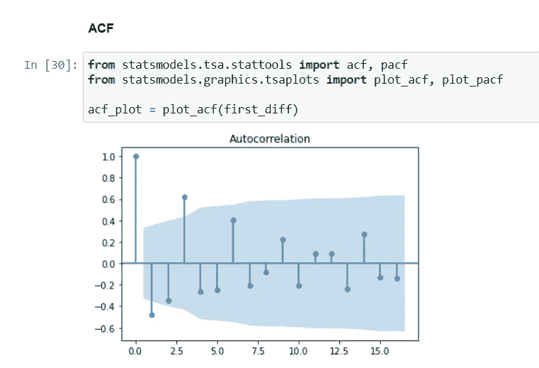

ACF Plot

图中的每个棒对应于从 0 开始的滞后(其最大相关性为 1，因为它是时间步长值与其自身的相关性)。

从 ACF 来看，滞后 1 (t-1)和 2 (t-2)对于 MA (q 参数)来说是显著的。

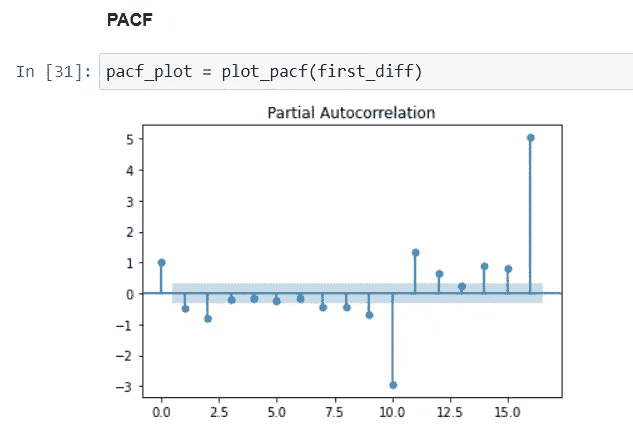

PACF Plot

图中的每个棒对应于从 0 开始的滞后(其最大相关性为 1，因为它是时间步长值与其自身的相关性)。

从 PACF 看来，滞后 1 (t-1)和 2 (t-2)对 AR (p 参数)是显著的。下一个滞后 10 太远，但表明季节性模式。

在我们进一步使用高级算法之前，让我们建立一个基线模型(基于霍尔特温特斯算法)

## **3.4 基线模型—霍尔特温特斯算法**

霍尔特温特斯方法背后的想法是，除了水平和趋势之外，对季节成分应用指数平滑。
我们首先将时间序列分割成基于日期的训练和测试数据。

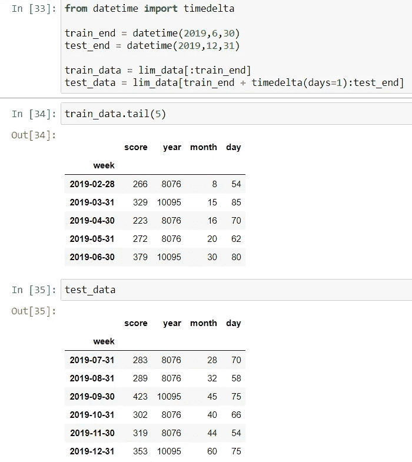

因此，我们有最近 6 个月的数据作为预测的测试数据。

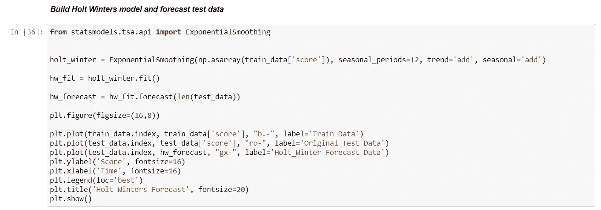

如上所示，我们使用 statsmodels 的指数平滑()来创建 Holt Winters 模型，然后将其用于预测。

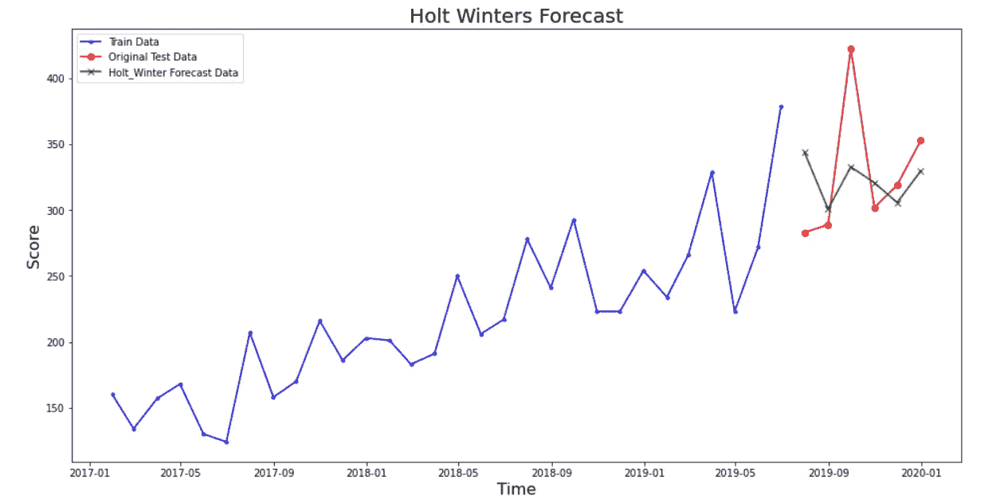

Holt Winters Model Forecast

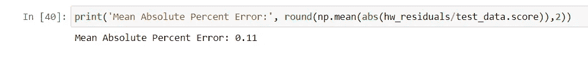

我们可以看到 Holt Winters 模型在一定程度上捕捉到了预测中测试数据的形状。MAPE(平均绝对百分比误差)被视为 11%。

## **3.5 找到萨里玛的最佳参数——P，Q 和 P，Q**

我们将使用自动 ARIMA 方法来自动调整/找到最佳的 P，Q 和 P，Q

我们设 d=1(第一差)，D 也为 1。

*作为一般规则，设置模型参数，使 D 永远不会超过 1。并且总差值‘D+D’从不超过 2。如果你的模型有季节性成分，尽量只保留 SAR 或 SMA 项。礼貌-* [*本文*](https://www.machinelearningplus.com/time-series/arima-model-time-series-forecasting-python/)

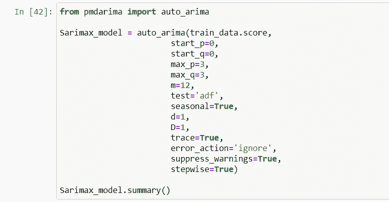

Auto ARIMA Results

正如在上面的输出中观察到的，自动 ARIMA 选择的最佳模型是

最佳模型:ARIMA(2，1，0)(0，1，0)[12]

p=2，d=1，q=0
P=0，D=1，q=0，m=12

## 3.6 SARIMA 模型培训和预测

让我们使用自动 ARIMA 选择的这些参数值来拟合 SARIMA 模型，并绘制预测和残差(预测中的误差)。

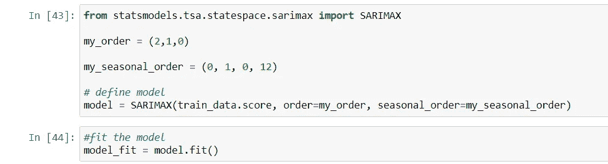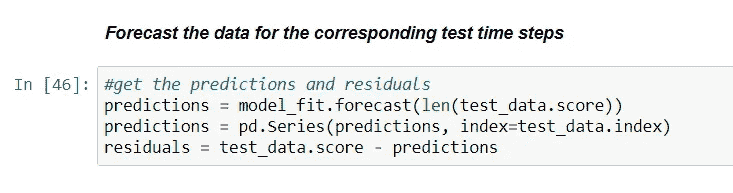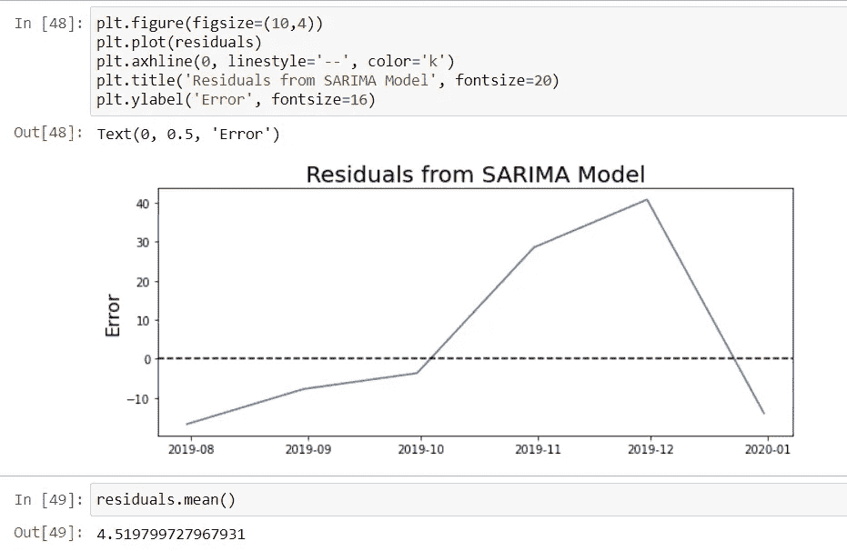

Residuals Plot

理想情况下，残差的平均值应该是 0，但是我们看到它是 4.5，这还不错..

然后我们将看到 SARIMA 模型所做的预测。

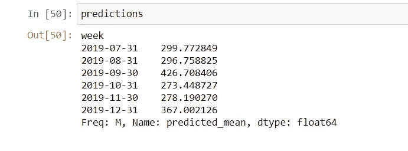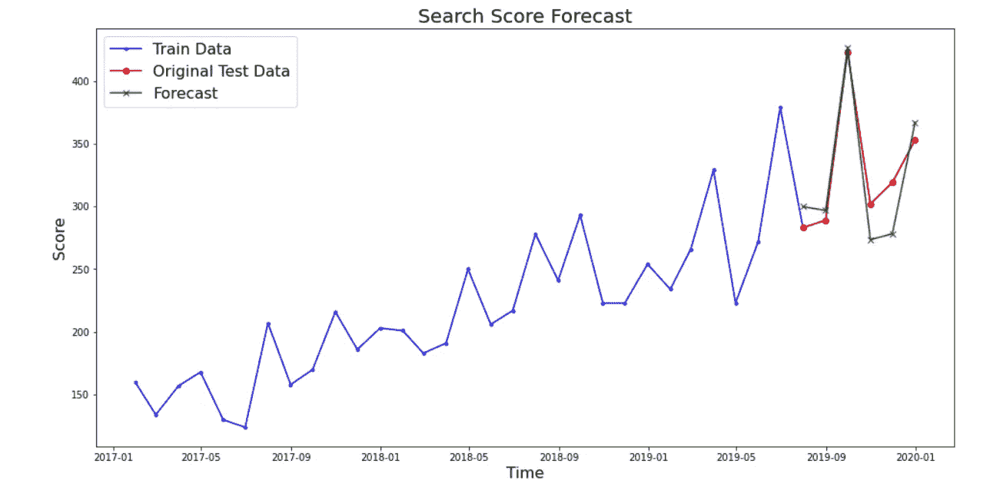

SARIMA Model Forecast

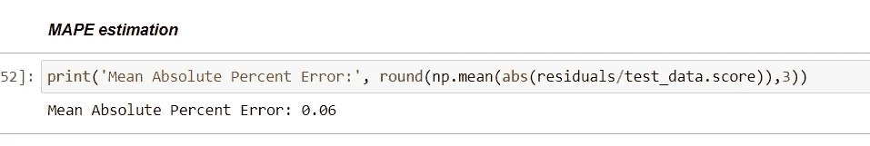

## 预测看起来不错，相当接近原始时间序列的形状！

我们得到了接近 6%的 MAPE，这比给出 11%的基线模型好得多。

# 结论

我们看到了如何使用名为 SARIMA 的经典时间序列预测方法来建模和预测时间序列。在我的下一篇博客中，我将计划采用另一个时间序列示例，并解释深度学习(RNN / LSTM)如何用于预测，而不必担心趋势、季节性因素等复杂性。我们必须用时间序列预测的经典方法。