# 基于深度学习的时间序列预测

> 原文：<https://medium.com/geekculture/time-series-forecast-using-deep-learning-adef5753ec85?source=collection_archive---------0----------------------->

Keras 循环神经网络和 LSTM 的练习

Photo by [Markus Winkler](https://unsplash.com/@markuswinkler?utm_source=medium&utm_medium=referral) on [Unsplash](https://unsplash.com?utm_source=medium&utm_medium=referral)

在[之前的博客](/geekculture/time-series-forecast-in-python-5c4c61e1c2c2)中，我解释了一个用 Python 进行时间序列预测的例子，使用了像 SARIMA 这样的经典时间序列分析方法。在这篇博客中，我举了一个训练深度神经网络的例子，比如 Keras 的 RNN / LSTM，用于预测时间序列。

# 介绍

时间序列通常被定义为一个或多个变量在连续时间段内的一系列值。例如，连续几年的销售量、一个城市几个月的平均温度等。如果该序列只涉及一个变量，则称为单变量时间序列。如果该序列列出了多个变量在不同时间点的值，则称为多元时间序列。在这个博客的例子中，我们将处理一个单变量时间序列。

连续的时间点称为时间步长。例如，每个时间步长可以是 1 到 12 个月或 1 到 31 天或一系列年份等。

关于时间序列成分和经典预测方法的更多基本细节，请参考我之前的[博客。](/geekculture/time-series-forecast-in-python-5c4c61e1c2c2)
在这篇博客中，我们将重点讨论使用深度神经网络(递归神经网络)进行时间序列预测。

# 基于深度神经网络的时间序列预测

在深度学习神经网络，尤其是递归神经网络流行之前，有许多经典的分析方法/算法用于时间序列预测- **AR、MA、ARMA、ARIMA、SARIMA 等。由于其有效性以及在大量数据不可用的情况下(这些数据对于训练 rnn 至关重要),它们甚至在今天仍被使用。**

## 深度学习与经典时间序列预测方法的比较

*   在上述经典方法中，我们必须对时间序列数据进行预处理，如分析和去除趋势、季节性等。没有这个时间序列，像 ARIMA 这样的算法就无法工作。但深度神经网络是“神奇的”，因为它们可以学习不同时间序列中的内在模式，并提出一个合理的模型，而无需我们费心打破时间序列数据中存在的趋势和季节性模式。
*   但神经网络的缺点是，你需要大量的数据来训练一个模型，不像经典方法那样不需要大量的数据。此外，神经网络还涉及到超参数的配置和学习率等问题。，这并不简单，需要一些迭代和微调。深度学习网络的训练也很耗时，并且需要 GPU 来提高速度。

然而，深度网络(递归神经网络)在预测时间序列方面是有效的，我们将在下面讨论的例子中看到这一点。

# 递归神经网络

递归神经网络(RNNs)专门设计用于处理**序列数据。** RNNs 已经能够在**自然语言处理、**计算机视觉、**时间序列分析等领域产生最先进的结果。**在 RNNs 中，神经网络的每个隐藏层将其输出(前馈)提供给下一层，并在时间步“t”提供给自己输出，同时在下一个时间步“t+1”训练数据。也就是说，RNN 试图学习一系列数据，而不是普通神经网络学习的独立数据。由于这种序列学习能力，rnn 具有学习语言(单词/句子的序列)、视频、时间序列等的能力。

## LSTM ( L **ong，短期记忆网络)**

LSTM 是 RNNs 的流行变体，它解决了常规 RNNs 中的问题，如非常深的 RNNs 中的“消失梯度问题”,当误差梯度通过具有许多隐藏层的 RNNs 中的时间反向传播(BPTT)传递时，该问题阻碍了初始层中的学习过程。LSTMs 还解决了当训练序列变得太长(例如，一段很长的文本)时，正常 rnn 面临的记忆丢失问题。LSTM 变得如此受欢迎，以至于它们几乎取代了 rnn，当人们提到 rnn 时，他们大多指的是 LSTM。

# 使用 RNN / LSTM 进行单变量时间序列分析的分步示例

现在让我们直接进入本博客的主题…一步一步的例子，如何训练时间序列数据和未来预测值的 RNN 和 LSTM 模型..

# 问题

**预测维基百科文章的未来浏览量。**我们将在 70K 个时间序列样本的训练集上训练和拟合时间序列模型，每个样本都包含一些跨多个月的维基百科文章的每日查看计数。然后，我们将使用模型来预测任何给定样本在未来一天或多天的未来视图计数。

我们将探索 RNN(递归神经网络)，特别是 LSTM(长短期记忆)的 RNN 变种来训练和预测。

# 数据集

数据集取自 Kaggle 上的[网络流量时间序列预测竞赛](https://www.kaggle.com/c/web-traffic-time-series-forecasting/)。

训练数据集由大约 145k 个时间序列组成。从 2015 年 7 月 1 日到 2016 年 12 月 31 日，这些时间序列中的每一个都代表了不同维基百科文章的日浏览量。

# 密码

这个练习的完整笔记本代码可以从我的 [github 链接](https://github.com/raja-surya/Time-Series-RNN)下载。

让我们从加载数据的第一步开始练习..

# **1。读取数据**

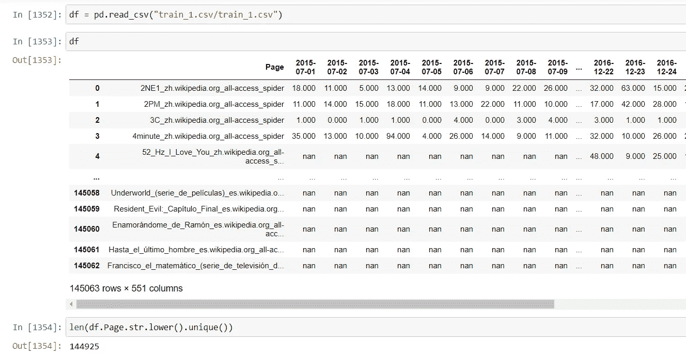

我们看到数据集包含近 145K 行和 551 列。每一行都是一个独特的时间序列。对于每个时间序列，您将获得相应文章的名称以及该时间序列所代表的流量类型(全部、移动、桌面、蜘蛛)。这些列是从 2015 年 7 月 1 日到 2016 年 12 月 31 日的每日日期。因此每个时间序列的长度为 550 天。

# **2。数据清理**

我们在数据集中看到许多缺失(NaN)值。不幸的是，该数据集的数据源并不区分零流量值和缺失值。缺少值可能意味着流量为零，或者当天的数据不可用。
由于缺少关于丢失值的清晰度，我们可以安全地忽略那些具有空值的时间序列，因为数据集对于时间序列建模来说是足够大的。

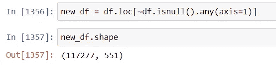

然后，我们删除不必要的“页面”列，并将列名从日期改为时间步长，这将有助于我们稍后操作数据。

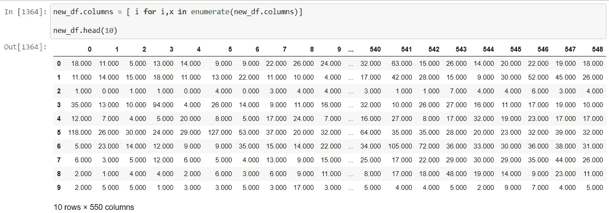

# 3.数据准备和可视化

让我们将最大时间步长设为 160 ( 160 天)。rnn 要求数据以三维形式输入— [批量大小、时间步长、单个时间步长中的元素数量]。所以我们首先把所有的数据转换成三维数组。

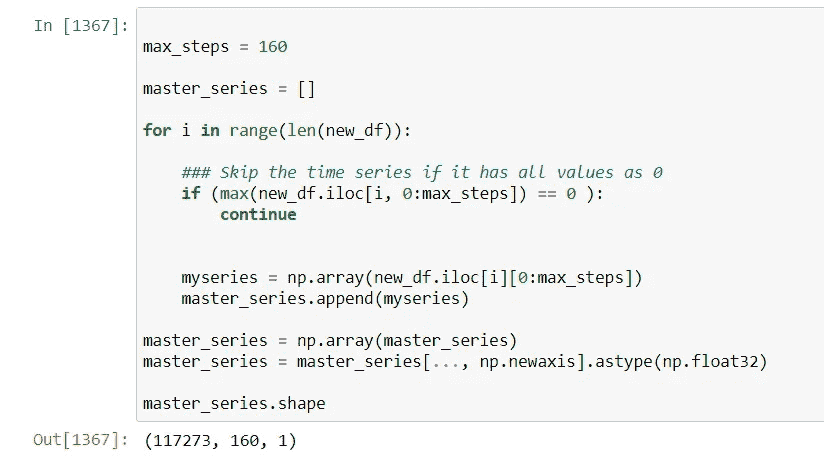

## **3.1 检查并移除异常值**

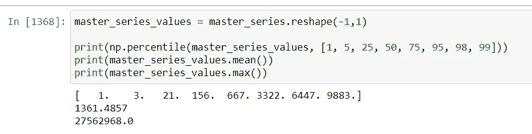

我们看到在我们的时间序列中有极高的值，如上面看到的最大值。第 99 百分位的值只有 9883。因此，显然存在一些异常值，它们在 99%以上。让我们只取第 99 个百分点进行分析。

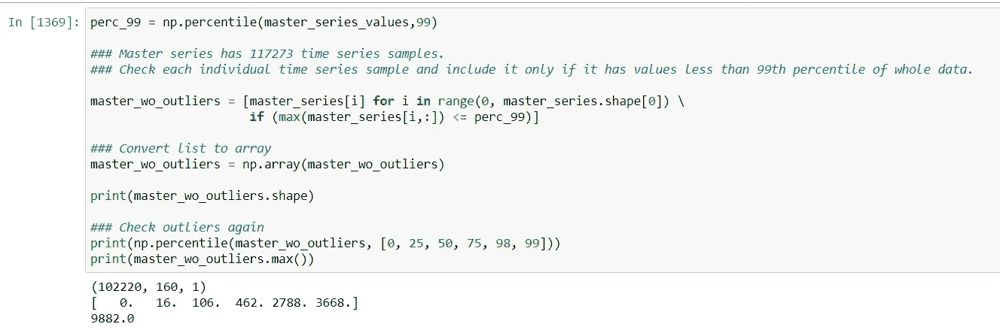

现在我们有 102220 个剔除异常值后的时间序列样本。

接下来，我们将绘制一个时间序列样本。

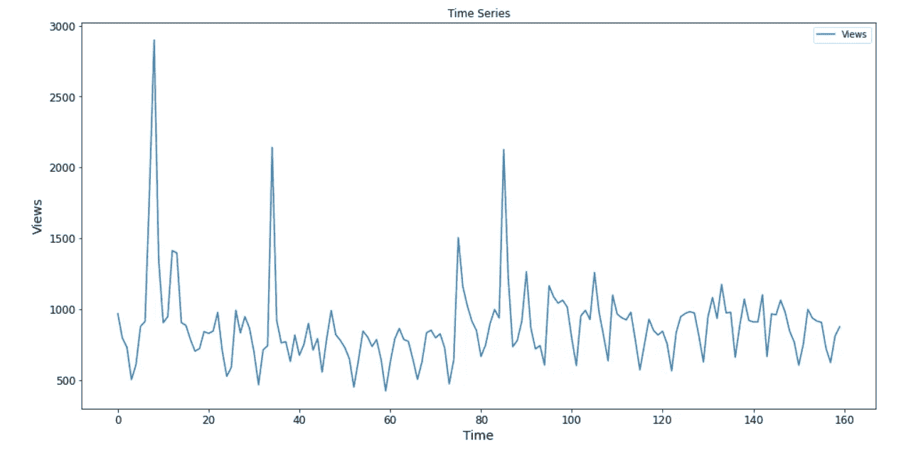

Time Series Sample

我们在上面的时间序列中看到一个高范围的值。因此，需要对数据集进行缩放。

## **3.2 时间序列数据的缩放**

我们将首先对整个数据进行对数转换。

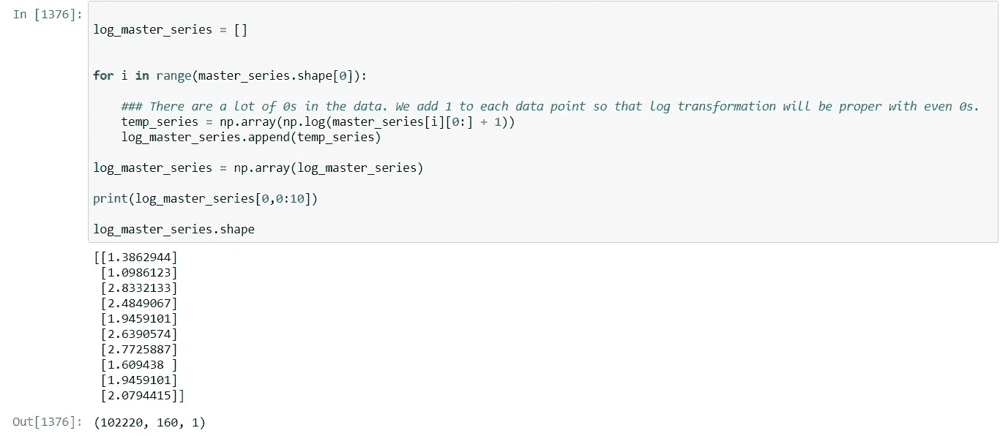

我们将进一步规范化数据集，使其值介于 0 和 1 之间(最小最大缩放)。

在此之前，我们将把数据分成训练集、测试集和验证集。首先，我们将在 150 个时间步长上进行训练，并预测第 151 个时间步长的值。
训练集= 70K 时间序列
有效集= 20K 时间序列
测试集= 10K 时间序列

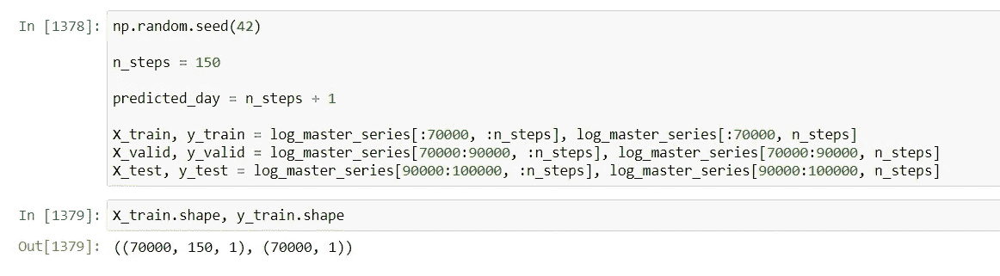

让我们了解一下 X_train 和 y_train 的尺寸

**X _ train:**
70000——单个时间序列数(总批量)。
150-在 70K 训练数据的每一个中，用于训练的连续天数(时间步长)。
1-值的数量(此处为单变量，只有一个变量，即特定日期的查看次数)。

**y_train:** 70000-单个时间序列的数量(总批量)
1-每个时间序列的目标值的数量(我们预测第 151 天的值)

**最小最大归一化**

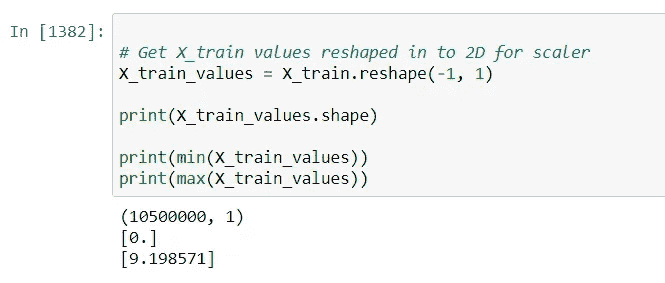

对数变换训练数据集的最小值为 0，最大值约为 9。我们将在这个经过对数变换的训练数据集上安装一个最小最大缩放器，以进一步缩小 0-1 范围内的所有数据点。

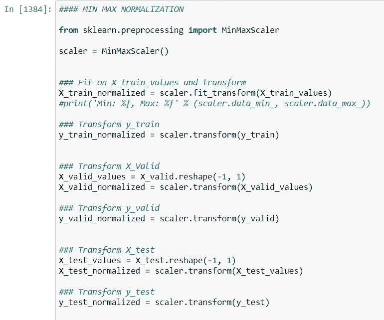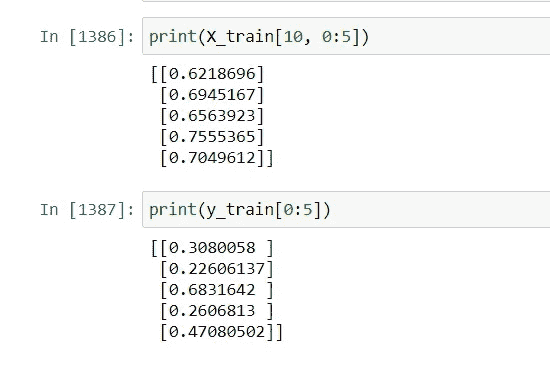

我们看到数值在 0-1 范围内变化。

现在我们有了训练数据、有效数据等。准备好了，我们现在准备好为时间序列建立模型了。

# 4.建模和预测(单日)

我们将从创建一个简单的基线模型开始建模，这将有助于我们稍后评估高级模型的性能。

## 4.1 基准模型

**4.1.1 天真的预测**

在简单预测中，我们只预测最后一个观察值，即预测时间步长 t+1 的值与前一个时间步长 t 的值相同

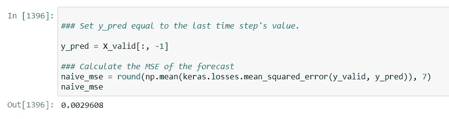

我们得到基线均方误差为 0.0029608。

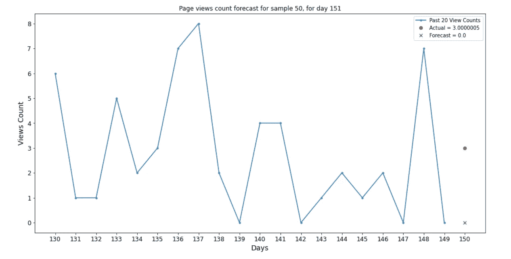

Naive forecast for a sample

如果您在第 151 天的样本图上看到**(图上的 150，因为它从 0 开始)，**预测值与前一时间步的值相同。与实际值相差甚远(红圈)。

**4.1.2 线性回归模型**

接下来，我们将使用 keras 构建一个线性回归模型。
我们使用平坦层和密集输出层来实现线性回归模型。

回想一下，输入维度= batch_size，n_steps，1。平坦层使由 n 个步骤(在我们的例子中是 150 个时间步骤)组成的输入平坦化，并将这 150 个元素馈送到具有一个神经元的密集层。因此涉及 150 个前馈权重+一个偏差，这相当于一个回归方程

y = (W0 * t0) + (W1 * t1) +……。(W149 * t149) + b

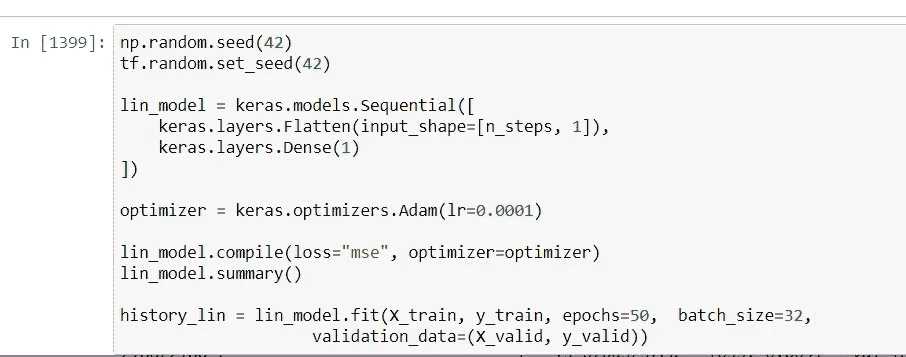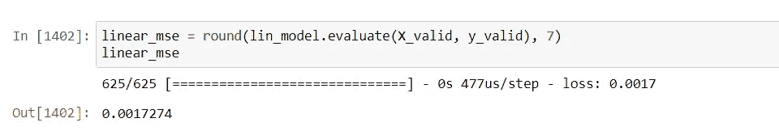

我们从线性模型得到 0.0017274 的均方误差，这优于 0.0029608 的原始预测。

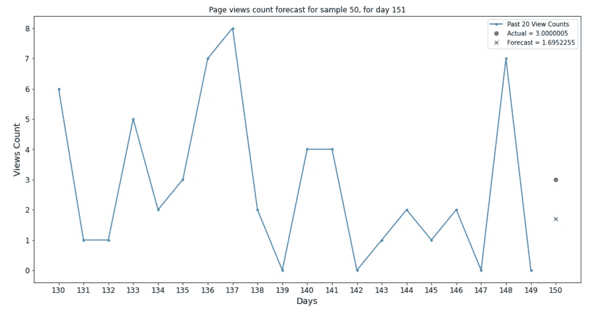

Linear Regression model forecast for a sample

我们可以看到，由 keras NN 建立的线性模型给出了比简单预测模型更好的更接近的预测。

现在我们将尝试高级模型，我们将从简单的 RNN 架构开始。

## 4.2 简单的 RNN

我们将尝试最简单的只有一层和一个神经元的 RNN。
注意**如果确认损失在多个连续时期内没有改善(减少)，我们使用 Keras** 提供的提前停止回调 **来停止训练过程。**

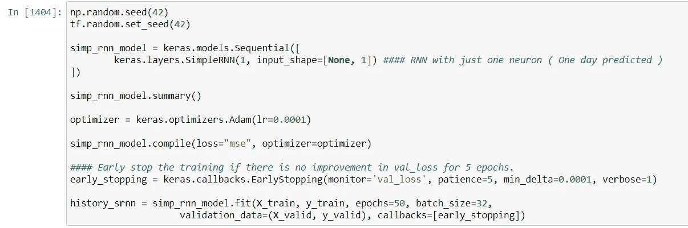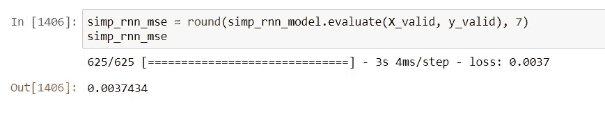

我们在验证集上对模型进行评估，得到简单 RNN 模型的均方误差为 0.0037434，比线性模型的均方误差 0.0017274 差。

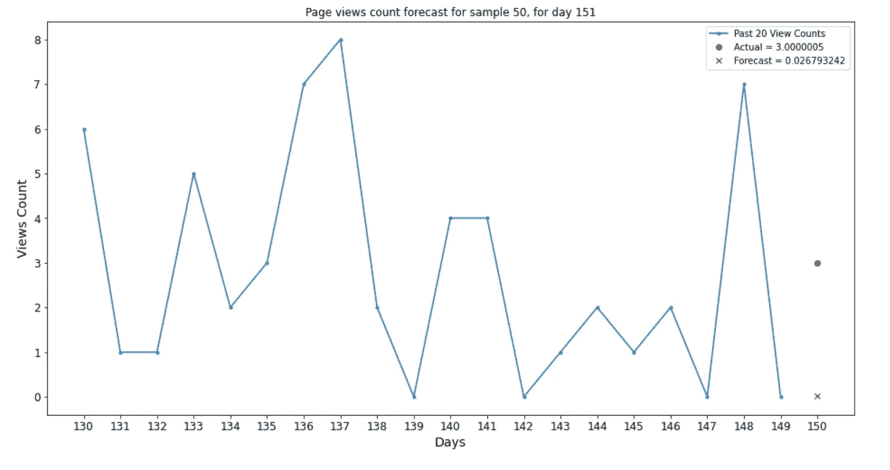

Simple RNN forecast for a sample

简单 RNN 对样本 50 的预测不如线性回归模型好..

## 4.3 深度 RNN

让我们尝试一个稍微深一点的 RNN(增加一个 RNN 层)。

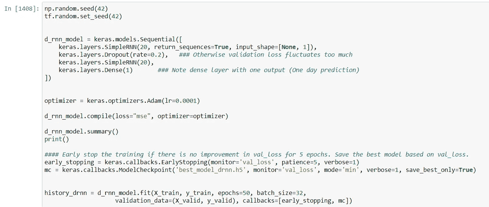

除了提前停止，**我们还使用 Keras 的 ModelCheckpoint 回调来保存跨运行时期的最佳模型。**

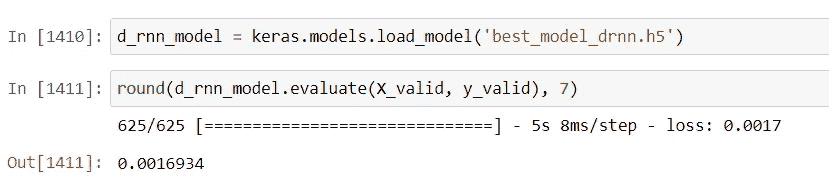

我们从深 RNN 模型得到的均方误差为 0.0016934，比简单的 RNN 要好。

我们对验证集进行预测，然后对一些时间序列样本绘制简单 RNN 和深度 RNN 预测与原始值的关系图。

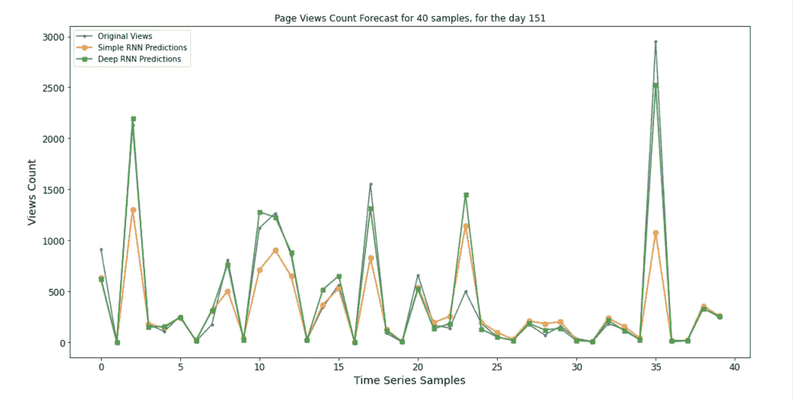

Comparison of Deep RNN forecast with Actuals

我们在验证集中为 40 个不同的时间序列绘制了第 151 天的预测。我们看到，深度 RNN 预报几乎紧跟原始计数，总体上比简单的 RNN 要好。

所以 rnn 在预测方面做得非常好。

让我们看看深 RNN 对某一特定样本的预测图。

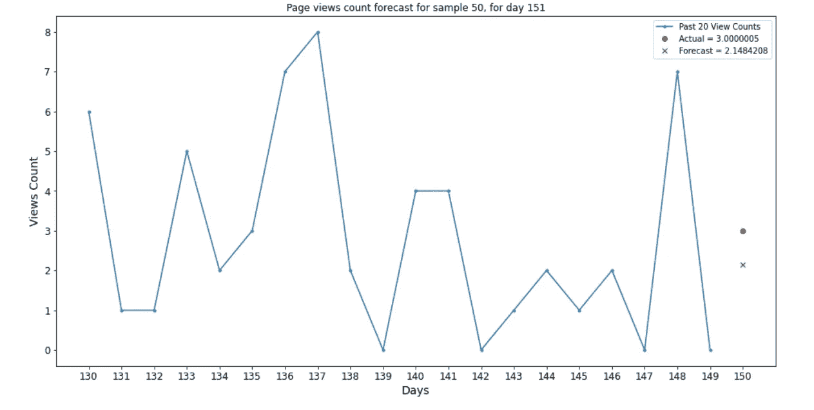

Deep RNN forecast for a sample

样本 50 的预测比简单 RNN 好得多，更接近原始值。

## 4.4 LSTM 模式

现在让我们去找一个 LSTM 模型。

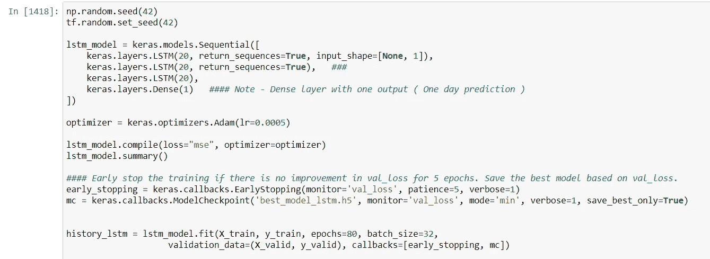

我们对验证集进行了评估，LSTM 的 MSE 为 0.0016625，看起来略好于深度 RNN。

接下来，我们对验证集进行预测，并绘制一些时间序列样本的 LSTM 预测值与原始值的关系图。

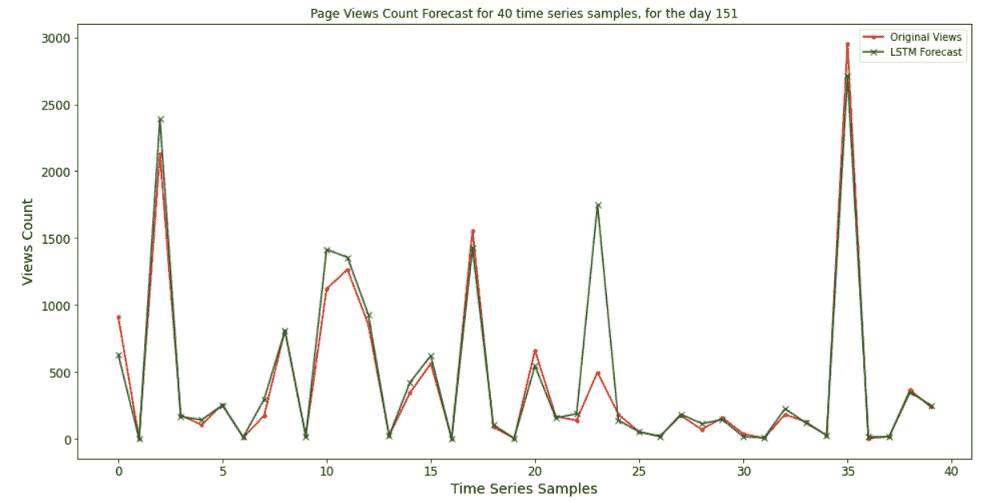

Comparison of LSTM forecast with Actuals

上述原始值与预测值的图表显示，LSTM 在预测不同时间序列样本的第 151 天的值方面做得非常好。

让我们来看看 LSTM 对某一特定时间序列的预测。

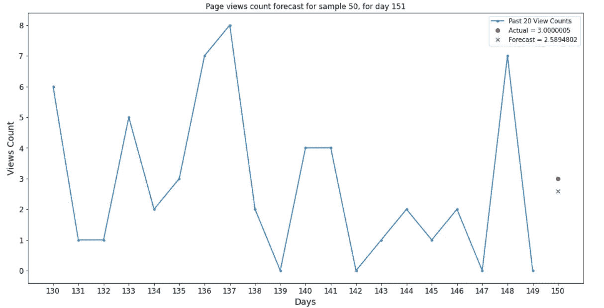

LSTM forecast for a sample

**与我们目前尝试的所有模型相比，LSTM 对样本 50 的预测最接近实际值！**

# 5.提前几个时间步(天)的预测

让我们做一些更有趣的事情..
我们现在将预测多个天数(一次 k 天),即 n+1 天，n+2 天…通过在前 n 天的数据上训练 n+k。

## 5.1 将“n”天的值作为一个整体进行训练，并对第 n+1、n+2 天进行预测…..n+k

在这一部分中，我们像以前一样训练前 n 天的时间序列值，但目标将是多个预测，即未来 3 天，而不是我们在前面章节中看到的 1 天预测。

由于目标现在是 3 天，我们必须为训练、测试和验证数据准备一组新的目标(每个时间序列有 3 个值)。

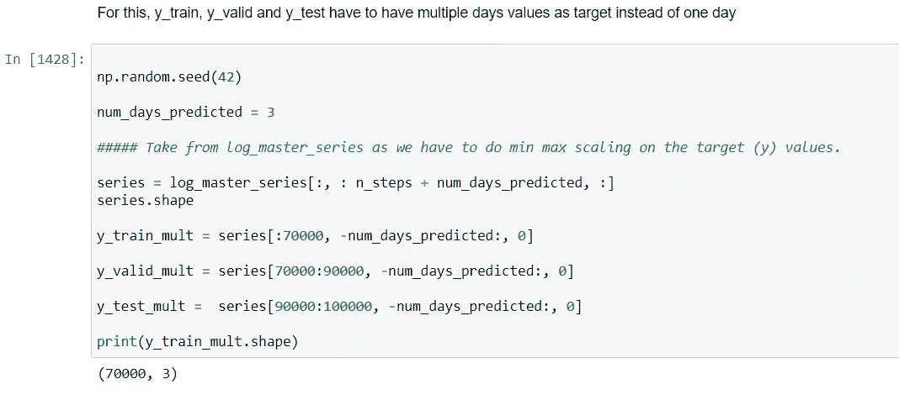

如上所述，我们将预测 3 天——第 151 天、第 152 天、第 153 天。因此，每个时间序列将有 3 个值作为目标。

我们对新形成的目标进行必要的最小最大比例变换，然后训练一个 LSTM 模型。

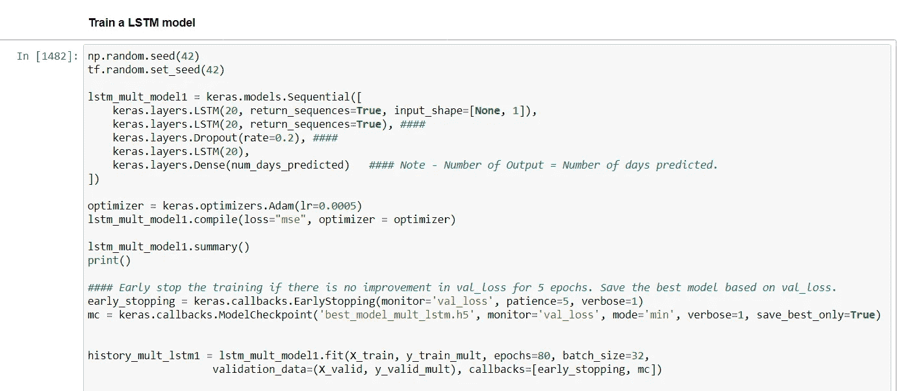

**注意，LSTM 模型的输出数量=预测天数。**

让我们对验证集进行预测，并检查其中一个样本。

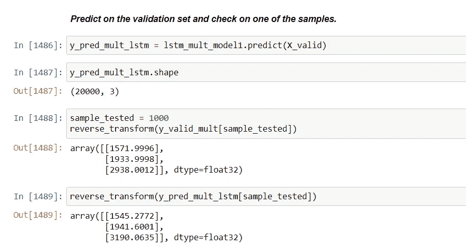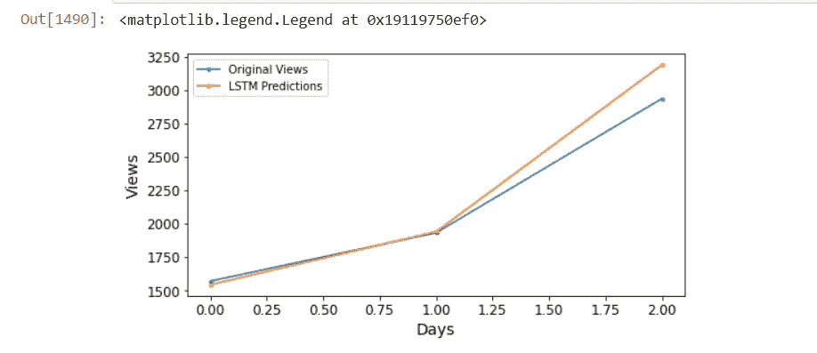

Three days forecast of LSTM

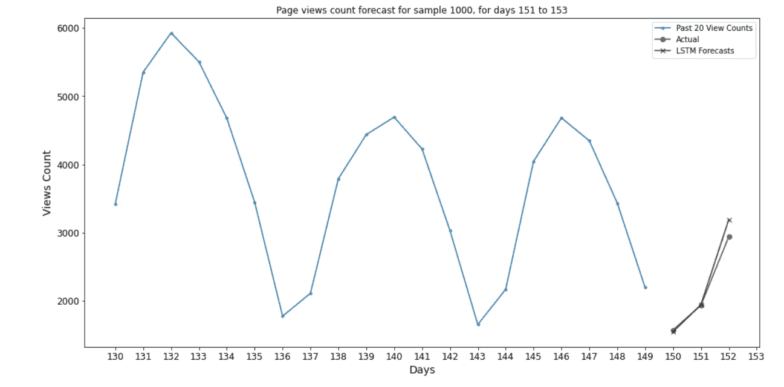

**我们看到 LSTM 在预测值接近实际值方面做得很好！**

## 5.2 序列对序列模型

**训练“n”天的值，预测每个时间步/天的下一个 k 值。**

在这里，我们将以下列方式训练 LSTM。

1.  对于从 t=0 开始的每个时间步长 t，将值传递给 LSTM，并预测接下来 3 个时间步长的值。即 t+1，t+2，t+3。
2.  对时间步长做(1)直到时间步长 150。在时间步长 0，模型将输出包含时间步长 1 到 3 的预测的向量，然后在时间步长 1，模型将预测时间步长 2 到 4，依此类推。
3.  定型模型后，使用模型预测第 151、152 和 153 天的值。

这种模型架构将不同于以前的模型。我们不是训练模型只在最后一个时间步预测接下来的 3 个值，而是训练它在每个时间步预测接下来的 3 个值。

**因此，前面的模型是序列到向量 RNNs，而这将是序列到序列 RNN。**

这种技术的优点是，损失将包含每个时间步的输出项，而不仅仅是最后一个时间步的输出项。因此，将有更多误差梯度流经模型。它们也将从每个时间步长的输出中流出。这可以稳定训练过程。

在这种方法中，训练集中的每个目标(我们在训练集中有 70K 个时间序列，所以 70K 个目标)必须是与输入序列长度相同的序列(即 150)，在每一步包含一个三维向量。

我们相应地准备目标并检查尺寸。

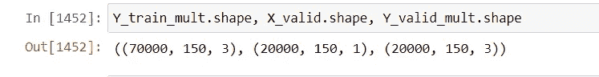

要将模型转换为序列到序列模型，我们必须在所有递归层(包括最后一层)中设置 return_sequence=True，并且我们必须在每个时间步应用最后一层(输出)。因此我们使用 Keras 时间分布层来实现这个目的。

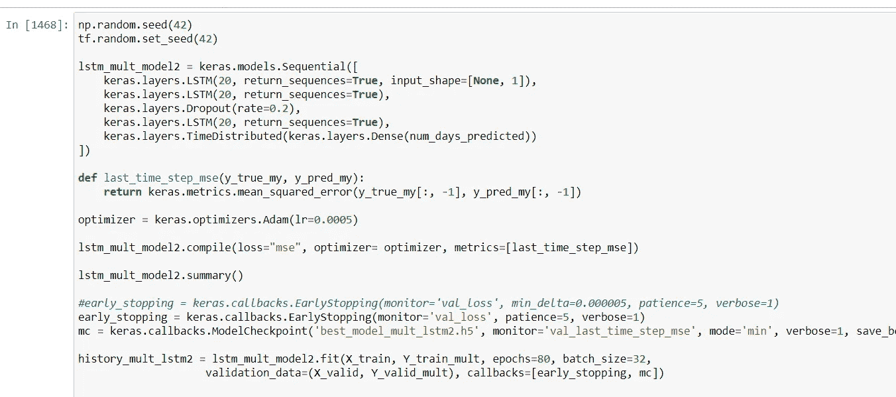

让我们对验证集进行预测，并检查其中一个样本。

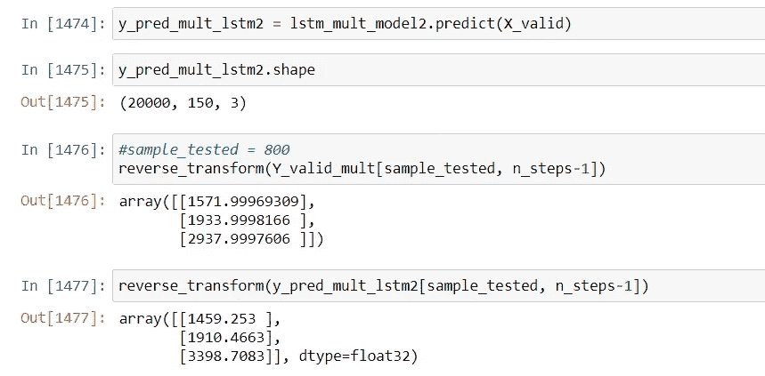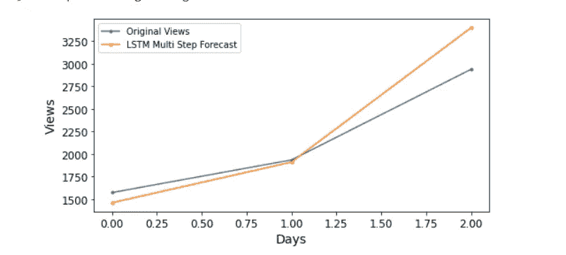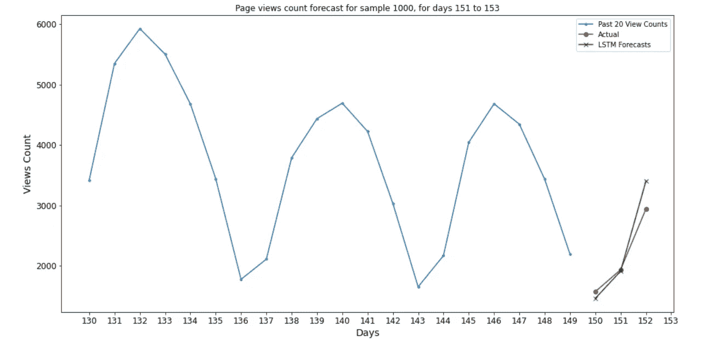

**我们看到，这一次，LSTM 也做得很好，预测值接近实际值！**

# 结论

我们成功地使用 RNNs 训练了数千个时间序列样本，并预测了未来单个和多个时间步长的值。我们不必担心时间序列的组成部分，如趋势、季节性、噪音等。，因为 RNNs 逼近任意序列的能力使我们很容易进行时间序列预测。