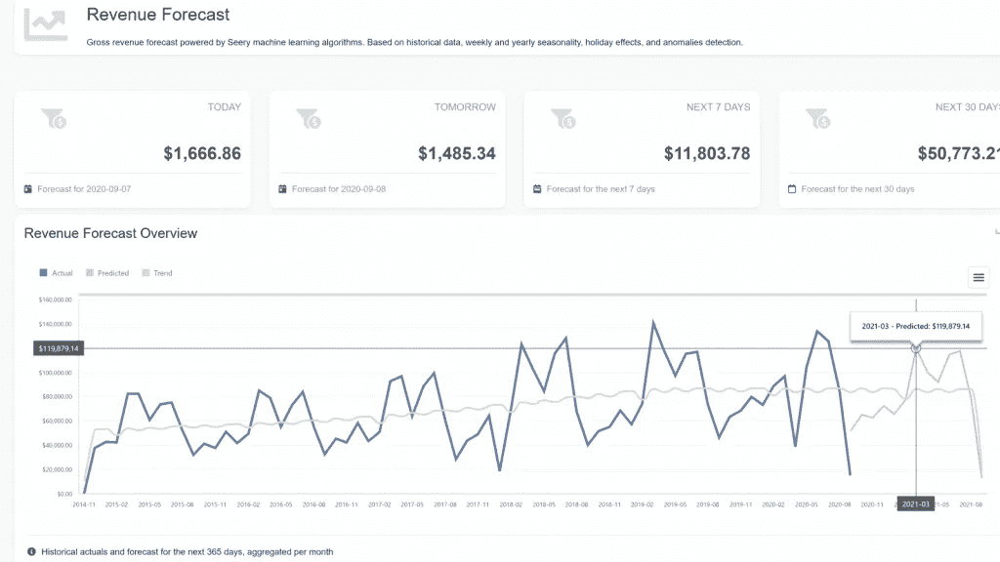
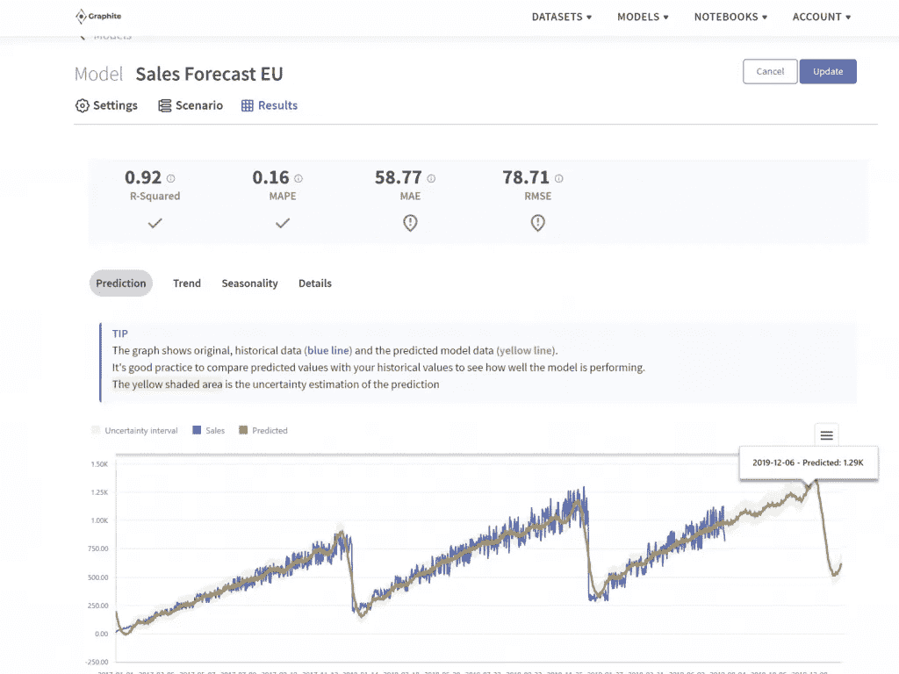

# 时间数列预测法

> 原文：<https://medium.com/geekculture/time-series-forecasting-3babecf47750?source=collection_archive---------55----------------------->

## 每当数据以固定的时间间隔被记录时，它就被称为时间序列数据。简而言之，时间序列数据是在不同时间点收集的数据——与关注特定时间点的[截面数据](https://www.investopedia.com/terms/c/cross_sectional_analysis.asp)相反。

Photo by [Aron Visuals](https://unsplash.com/@aronvisuals?utm_source=unsplash&utm_medium=referral&utm_content=creditCopyText) on [Unsplash](https://unsplash.com/s/photos/time?utm_source=unsplash&utm_medium=referral&utm_content=creditCopyText)

# 什么是时间序列预测？

例如，天气记录、人口、出生率都是时间序列数据的例子。其他例子还有国内生产总值(GDP)、消费价格指数(CPI)、标准普尔 500 指数、失业率，这些都是经济学领域使用的数据。

> 现在，时间序列预测是在未来趋势与历史趋势相似的假设下，查看一段时间内记录的数据，以预测或预测下一个时间段可能发生的事情。

这是一种跨领域使用的技术，基于模式和历史数据预测事件——并且在现代的大部分时间里已经成为数据分析的[主食](https://www.sas.upenn.edu/~fdiebold/Teaching104/Ch14_slides.pdf)。

# 时间序列预测有什么用？

在电子商务领域，时间序列预测用于预测消费者需求，通知库存管理和仓储，以及预测未来的销售、收入和可能的波动。

时间序列预测也被用于各种领域的许多目的。这些应用包括:

## ●数学金融

## ●股市分析

## ●经济预测

## ●库存研究

## 预算分析

## ●产量预测

## ●销售预测

Photo by [Markus Spiske](https://unsplash.com/@markusspiske?utm_source=unsplash&utm_medium=referral&utm_content=creditCopyText) on [Unsplash](https://unsplash.com/s/photos/algorithm?utm_source=unsplash&utm_medium=referral&utm_content=creditCopyText)

# 时间序列预测的一些基础知识

# 1.确定预测方法

预测方法主要分为两类:

定量预测方法—定量预测使用时间序列的历史数据或相关信息。您可以使用四种不同的方法:

*   天真的方法——需要查看以前的趋势，并假设这些趋势将在下一个时间段保持不变
*   趋势预测——包括观察增长或下降的轨迹，并使用它来预测下一个时间段将会发生什么
*   移动平均线——获取一系列过去时期的平均值(例如过去三个周期的平均值)并假设该平均值将是下一个时间周期的大概估计值；'随着时间推移，移动这些平均值
*   指数平滑法——在移动平均线上采用加权平均法；根据预测，不同地将权重分配给更相关的时段

定性预测方法——定性预测考虑专家、决策者或客户的意见。您还可以使用四种不同的方法:

*   德尔菲法——征求可信赖的顾问和消费者对基于他们的消费者行为将会发生什么的意见，汇编这些数据，并将其提交给决策者。
*   主管意见——期待一群主管来决定下一阶段将会发生什么。
*   消费者调查——询问消费者是否会购买某样东西，并利用这些数据预测消费者需求。
*   SalesForce Estimates —要求单个销售人员做出他们自己的预测估计，并利用这些数据预测下一阶段将会发生的事情。

# 2.了解历史数据的局限性

与任何方法一样，时间序列预测也有其弱点。一般来说，历史数据最常见的问题之一是可能存在过时和/或不准确的数据。

例如，当您出售的商品不再有库存或已从您的系统中删除时，这可能会影响数据集成。其他相关的问题是一般化、有限数据和研究的问题，以及准确识别正确的数据表示模型的问题。

# 时间序列预测有什么帮助？

> 时间序列预测使用时间序列指标来帮助制定业务决策，并根据预计的收入、销售、资源需求和产品交付来规划未来的发展。

许多组织和企业已经使用时间序列预测来最大化销售，甚至预测[密码市场表现](https://cointelegraph.com/news/forecasting-bitcoin-price-using-quantitative-models-part-3)。这是因为准确的预测在企业规划中非常有价值。

从这种分析中获得的洞察力可以让组织有效地分配资源、预算资金，并做出明智的业务决策以实现增长。

# 时间序列预测的重要方面

# 1.收入预测

时间序列预测允许您进行收入预测，这允许您考虑过去对您有效的方法，您继续推动业务的地方，以及您如何计划未来更好的财务安全。考虑您的业务收入有助于您根据具体信息(您过去的业绩)和可操作的见解(根据预测的当前趋势)做出强有力的业务决策。

收入预测可以帮助你制定发展业务的投资策略。

Image by author: time-series forecast in Seery app for Shopify

# 2.规划

时间序列预测可以帮助企业规划和发展商业战略。它有助于企业理解历史数据支持的因果关系。由于它在很大程度上依赖于分析过去来预测未来，它可以帮助企业找出什么对他们有用，什么没用，从而为下一个时期提出一个稳健的商业计划。

它在金融和商业组织中被广泛用于决策和政策规划。

# 3.准备物料库存水平的需求计划

预测需求是时间序列预测的最大优势之一。任何企业的核心都是需要吸引更多的销售，因此了解市场需求预测将有助于企业在预测客户需求方面保持敏捷。

规划客户需求是企业根据预测值有效准备物料库存水平的一种非常有效的方式。有了正确的库存水平，企业可以避免过剩，并实现收入最大化。

这也有助于那些想通过引入新产品或瞄准新的细分市场来拓展业务的企业。通过适当的需求规划，他们可以根据预计的市场需求准备适当的库存。

Image by author: Automated time-series forecast model in Graphite Note

# 一些时间序列预测模型

您可以使用各种时间序列预测模型:

# 1.指数平滑法

使用这种方法生成的预测是过去观测值的加权平均值。这些权重随时间呈指数下降，这意味着最近的观测值具有更高的权重。一般来说，这种模型可以在很长一段时间内做出可靠的预测。

# 2.动态线性模型

动态线性模型(dlm)将参数视为时变而非静态。通常用于计量经济学，DLM 可能包括历史数据之上的其他相关信息(例如。假期、经济变化、新法律、竞争对手等的影响。).在需要考虑历史变化的情况下，该模型可以导致更准确的预测。

# 3.先知

prophet 是由[脸书的核心数据科学](https://facebook.github.io/prophet/)团队开发的开源软件，是一个“基于加法模型预测时间序列数据”的程序非线性趋势适合每年、每周和每天的季节性以及节假日的影响。根据他们的说法，它最适合受季节趋势强烈影响的时间序列。

# 4.萨里玛 SARIMA

ARIMA(自回归综合移动平均模型)用于具有趋势成分的非平稳数据。它被广泛使用，通常是指数平滑的补充。然而，虽然 ARIMA 可以处理带有趋势的数据，但它不能支持带有季节成分的时间序列。

这就是萨里玛(ARIMA 的延伸)的用武之地。它支持季节性组件的直接建模。它代表季节性自回归综合移动平均线。

# 最后的想法

时间序列预测对于希望实现收入最大化的电子商务企业来说非常有价值。通过查看历史数据并根据当前趋势了解过去对他们有效的趋势和策略，他们可以提出一个可靠的业务计划并优化业务决策以促进业务增长。

> [*Graphite Note*](https://graphite-note.com/) 致力于为这些企业提供借助预测分析构建的自动化时间序列模型，以创建一个省时、专业的解决方案来满足他们的数据分析需求。

【https://graphite-note.com】最初发表于**。**