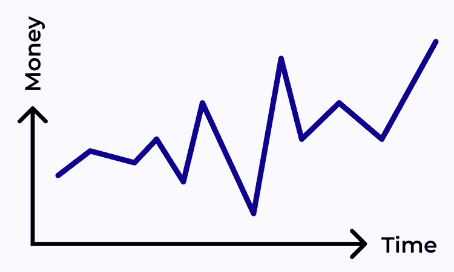
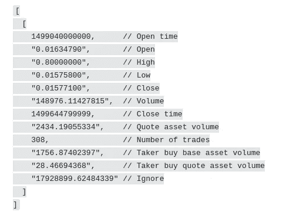

# 使用 Python 进行时间序列预测

> 原文：<https://medium.com/geekculture/time-series-forecasting-using-python-de86c05bffef?source=collection_archive---------12----------------------->

## 你有没有想过预测比特币？

当然，你有。我们都有。

在本文中，我将给出一些细节，说明如何使用 Python 和用于时间序列分析的库`sktime`来实现这一点。

不要把我当成你的妈妈，但我不建议你在生产中尝试使用它:很可能你会失去你的钱(至少我应该警告你)。

Denis Shilov (that’s me)

# 数据及其来源的选择

币安是全球最大的密码交易所之一。它还有一个相对简单的 API，所以下载数据不会花太多时间。

我们选择下载 15 分钟蜡烛线的数据，因为与预测 5 分钟蜡烛线相比，这将是一项更复杂的任务，而且比预测 30 分钟蜡烛线(etc)更容易。

我们选择了 BTC，因为这是对其他加密货币价格影响最大的主要加密货币。

# 导入和常量

我们在这里使用的是:

*   `os`包与操作系统通信
*   币安 API 获取 BTC 历史数据
*   `pickle`保存和加载数据
*   `sktime`预测我们的时间序列数据
*   `numpy`计算一些东西
*   `pmdarima`检查平稳性
*   `lightgbm`是最著名的助推器之一
*   `xgboost`是另一个著名的助力

这里我们加载一些 API 键和其他常量。

如你所见，我们将在 3 周前的 BTC-USDT 对上用 15 分钟蜡烛训练我们的模型。

# 加载数据

我们将保存数据以备后用，只是为了在每次启动笔记本时不浪费时间加载这些数据。

这里我们加载数据。如果数据已经在缓存中，那么我们从缓存中加载。

# 检查数据

哈，我们终于来了！现在我们来玩玩数据:-)

让我们看看它是什么样子的

根据币安 API，它对应于:

## 我们应该忽略:

1.  关闭时间，因为我们已经知道这是一个 15 分钟的蜡烛。
2.  API 告诉我们忽略最后一个元素
3.  “引用资产量”，因为它重复了“量”的含义
4.  “买方买入报价资产量”，因为它重复了“买方买入基础资产量”的含义

# 解析数据

我们的目标是预测*某事*。但是我们这里有 4 个价格，不是 1 个价格！

所以我们会得到一根蜡烛的加权平均值，我们会试着去预测。

价格的高低不像开盘价和收盘价那么有趣，因为它们就像离群值。

## 我们可以用什么来训练我们的模型？

1.  加权平均值
2.  卷
3.  交易数量
4.  接受者买入基础资产量

我们将尝试执行的操作称为“时间序列预测”，因为我们将预测未来蜡烛的几个属性

让我们看看最后一千个条目是什么样子的

现在我们需要测试数据的平稳性。

平稳过程是概率分布不依赖于时间的过程。

而静止的东西更适合被预测！

白噪声是平稳过程最简单的例子。

提醒:白噪声过程是一个均值为零且不同时间的值之间没有相关性的过程。

正如我们所看到的，我们的时间序列是非平稳的。为了成功地预测它，我们需要把它变成一个静止的东西。

怎么做？有几种选择:

*   差异。例如，您需要计算连续观察值之间的差异。
*   滚动平均值减法。滚动平均值是系列中前 x 次观察的平均值，其中每次观察之间的时间是一致的。
*   去趋势化是根本。这包括对时间以外的协变量进行回归。
*   季节性调整是采用差异的一种形式，但也可以理解为一种独立的技术。
*   数据的转换隐式地将差分运算符转换成其他东西；例如，对数的差实际上是比率。

有大量的技术可以使非平稳时间序列平稳。

我们决定从差异开始:

你看到了吗？现在我们有了作为平稳序列的所有时间序列！

与上面相同的事情(我的意思是差异)可以通过使用名称中带有“I”的模型来实现，这通常意味着集成。

例如，ARIMA 就是这样一个模型，我们将在下一章中尝试使用它。

# 尝试 ARIMA

首先，我们必须说明我们用来衡量模型性能的规则。

有许多不同的评估方法，它们适用于不同类型的模型:

*   均方误差(mean square error)
*   AIC，用于惩罚模型过于复杂的特殊标准
*   sMAPE，这给了我们一个百分比误差
*   …

我们的数据集由币安 4 个月的蜡烛组成。

我们将在数据集的最后一个月测试模型的性能，并在另外 3 个月进行训练。

然后我们将评估基于 sMAPE 的模型，以百分比的形式获得对我们的误差的评估:误差越低，我们的模型越好。

这里，我们将数据集分为评估模型性能所需的测试和训练部分:

# 训练一个模型

现在我们准备好为我们的时间序列建模了。

现在我们将尝试 AutoARIMA:它选择最合适的 ARIMA 模型，自动寻找最佳超参数。

默认情况下，它会比较基于 AIC 的模型，这很好:AIC 同时考虑到了模型的复杂性和准确性。

ARIMA 季节性 ARIMA(p，D，q)(P，D，Q，m)中的参数为:

*   p:非季节性 AR 部分的估计系数数
*   d:向非季节性差异过渡的次数
*   问:非季节性 MA 部分中估计系数的数量
*   p:季节性 AR 中估计系数的数量
*   d:向季节差异转变的次数
*   问:季节性 MA 部分中估计系数的数量
*   m:季节性周期

下面是使用 sMAPE 获得模型损失的一些代码:

输出我们使用的每个时间序列的损失的效用函数:

这就是分别为每个时间序列训练 ARIMA 模型的代码:

我们可以看到，对 ARIMA 来说，最容易的任务是预测交易数量，而最复杂的部分是价格。

这符合我们的常识:如果预测价格很容易，那么我们都会成为亿万富翁。

# 使用 GridSearch 进行培训

为了找到我们模型的最佳参数，我们将开始网格搜索。

这就是找出哪种模型参数组合产生最佳性能的事情。

## 网格搜索结果

我们可以看到每个时间序列的最佳参数，以及 sMAPE 中的相应损失:

# 尝试 ETS

我们想尝试的另一个模型是 ETS，它代表一个趋势分量(T)、一个季节分量(S)和一个误差项(E)。

由于 sktime 中有一个 AutoARIMA，那么 AutoETS 也呈现在这里。

我们的手很清楚:AutoETS 将自己为我们提供最好的模型，默认选择 AIC。

## 训练一个模型

由于我们已经从 ARIMA 之前的 GridSearch 结果中知道了最优 sp，并且我们有相同的数据集，因此我们将重用它:

## 使用 GridSearch 进行培训

## 网格搜索结果

从结果可以看出，ETS 的 sMAPE 小于 ARIMA。所以 ETS 在这个数据集上比 ARIMA 给出了更多的准确性。

# 尝试先知

先知是脸书开发的一个模型。事实上，它是一个由以下部分组成的加性回归模型:

季节性`s(t)`组件负责模拟与每周和每年季节性相关的周期性变化。​

组件`h(t)`负责用户指定的异常日，包括不规则日，例如黑色星期五。

我们可以看到，Prophet 比 ETS 或 ARIMA 提供了更好的准确性。

马克·扎克伯格，恭喜你，你花对了钱。

# 尝试一些梯度推进

## 训练一个模型

我们试着用一下 XGBoost，最著名的 boosting 东西之一。

## 使用 GridSearch 进行培训

## 网格搜索结果

我们可以看到一个有趣的细节。根据 GridSearch 的结果，窗口长度等于 8 给出了最有性能的预测价格。

对于其他特征(交易量、交易数量等)，需要长窗口。

# 将不同的模型堆叠在一起

栈是一种东西，它获取其他模型的输出，并使用另一个模型以某种方式对它们进行总结。

因为我们现在知道了每种时间序列的每个模型的最佳参数，所以我们可以重用它们！

我们看到，在某些情况下，回归变量整体的表现比单个回归变量要好，而在某些情况下，则不然。

这个事实可以用一个迷因来说明。类人猿在一起很强壮，但他们仍然是类人猿。

Some meme from google

# 结论

感谢你阅读这篇文章，那是一次漫长的旅行。

你可以在简介里看我的其他故事:)

这篇文章要归功于我的合著者:

*   瓦西里·基连科
*   安德烈·埃尔马科夫
*   格里戈里·布奇洛夫