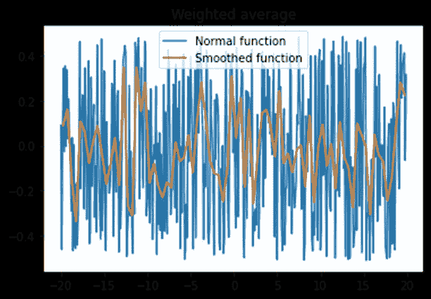
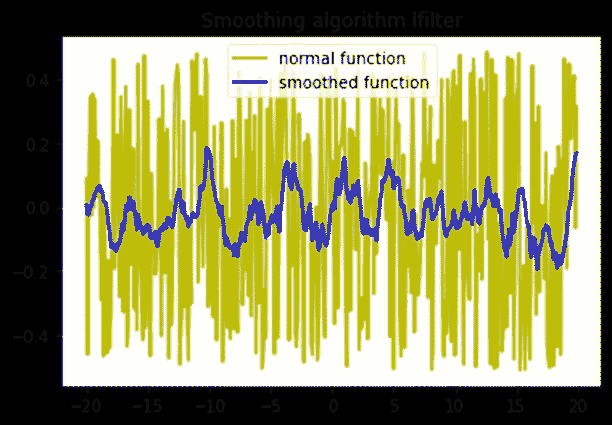
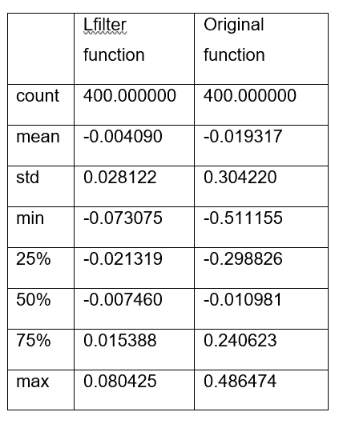
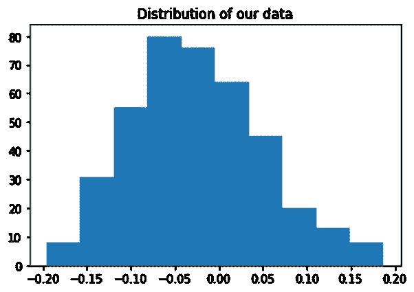
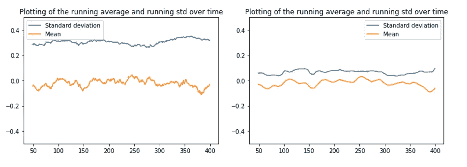
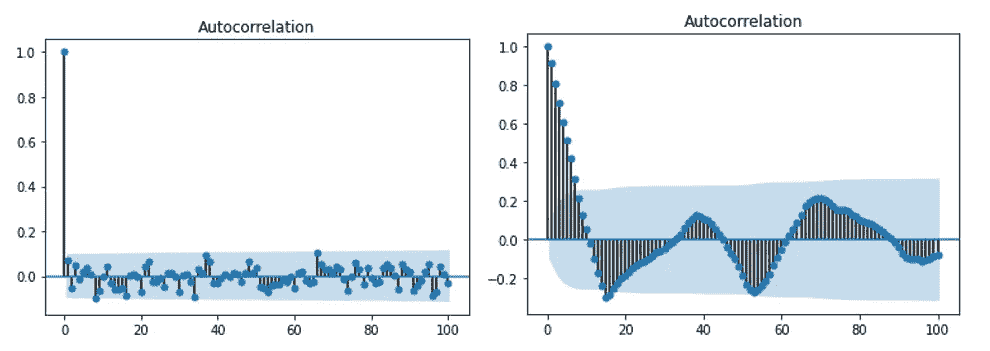
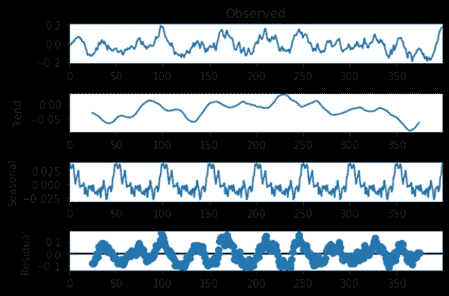
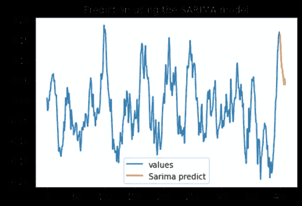

# 时间序列:Python 中有什么工具可以用来分析它们？

> 原文：<https://medium.com/geekculture/time-series-what-tools-are-available-in-python-to-analyse-them-110e17806e7?source=collection_archive---------8----------------------->

## 第二部分:数据过滤、成分分析和预测

这是我关于时间序列文章的第二部分，也是最后一部分。在这一部分中，我将深入研究数据过滤、组件分析和预测。通过以下链接，您将找到第一部分，该部分侧重于可视化和统计:

[](/geekculture/time-series-what-tools-are-available-in-python-to-analyse-them-dc2061f69e8c) [## 时间序列:Python 中有什么工具可以用来分析它们？

### 第一部分:可视化和统计

medium.com](/geekculture/time-series-what-tools-are-available-in-python-to-analyse-them-dc2061f69e8c) 

提醒一下，我对分析时间序列感兴趣(时间序列可以由一个量的时间演变来定义，在时间上有规则的间隔)。你能想到的最常见的时间序列是股票市场。在对我的数据进行可视化和统计分析之后(这些数据被有意地抽象化了)，我想对我的数据进行过滤，因为它看起来很嘈杂。


Photo by [Nick Chong](https://unsplash.com/@nick604?utm_source=medium&utm_medium=referral) on [Unsplash](https://unsplash.com?utm_source=medium&utm_medium=referral)

# 数据过滤

过滤器“应该消除所有不需要的成分”(Haslwanter，2021 年，第 72 页)。事实上，如果分析的目的是创建一个模型，“数据集中噪声的存在会增加模型的复杂性和学习时间，从而降低学习算法的性能。”(古普塔&古普塔，2019 年，第 466 页)。噪声数据可以指“错误(不正确的例子)，以及异常值(代表目标理论的一些相对罕见的子概念的正确例子)”(Gamberger 等人，2000 年，第 206 页)。如果你想识别和分析现有的模式，能够处理这些数据是至关重要的。不过，理解这一点非常重要，因为它可能会降低数据的精度，但在某些情况下，你可能会“更关心确定数据是否表现出有意义的关系，而不是确定它的精确特征。”(Janert，2011 年，第 48 页)。当然，“像样条或黄土近似这样的平滑曲线只是对数据集的粗略近似——顺便说一下，它包含了平滑参数形式的很大程度的任意性(分别为 *α* 或 *h* )。”(Janert，2011 年，第 57 页)。当然，你要注意上下文，根据上下文，做出最好的判断。这里，我将使用两种平滑算法:一种是我自己实现的，另一种是在库 SciPy 中提供的，我将比较结果，看看滤波器如何彻底改变函数及其组件。

要选择最适合的滤波器，必须考虑一些标准。第一个是确保数据以相等的时间间隔被采样，这对于那些值是真实的。在这种情况下，可以使用 FIR 或 IIR 滤波器。(Haslwanter，2021，第 90 页)否则，我将需要使用更复杂的平滑算法，如黄土或样条，来处理不规则采样数据的过滤。

无限脉冲响应(IIR)滤波器在动态系统中更有意义，因此我将使用有限脉冲响应(FIR)滤波器。FIR 滤波器的等式中没有反馈，因此非常稳定。首先，我将使用移动平均滤波器，这是 FIR 滤波器的一个特例，顾名思义，它们都具有有限脉冲响应。这种方法更加重视最近的数据，对于减少随机白噪声非常有效。

这里是使用的函数`weighted_moving_average()`。

```
def weighted_moving_average(x,y,step_size=0.05,width=1):
    bin_centers = np.arange(np.min(x),np.max(x)-0.5*step_size,step_size)+0.5*step_size
    bin_avg = np.zeros(len(bin_centers))

    def gaussian(x,amp=1,mean=0,sigma=1):
        return amp*np.exp(-(x-mean)**2/(2*sigma**2))

    for index in range(0,len(bin_centers)):
        bin_center = bin_centers[index]
        weights = gaussian(x,mean=bin_center,sigma=width)
        bin_avg[index] = np.average(y,weights=weights)

    return (bin_centers,bin_avg)
```

在下面的可视化中，我们可以比较我们的函数和加权移动平均算法的结果。



The result from a weighted moving average algorithm

另一种 FIR 滤波器是 scipy.signal lfilter，其结果如下图所示。



The result of the scipy.signal lfilter

可以看出，这两种算法给出了不同的答案，这些答案根据输入的参数也有很大的不同。选择哪一个是最好的，使用哪一个参数将极大地依赖于上下文。从这两个结果中我们可以看出，平滑“揭示了原本看不到的行为”(Janert，2011 年，第 52 页)，并证实了可视化显示的结果，即在平均值附近出现上升然后下降的现象。

汇总统计数据给出了我们的 lfilter 结果中一些有趣的见解。如果我再次使用 describe()函数，我将获得以下结果:



与原始函数相比，可以看出我们的平均值和中值更接近于零，最小值和最大值已经大大减少。因此，该功能的范围大大缩小。至于分布，我得到了下面的直方图，它似乎更接近于正态分布，但稍微向右倾斜，有更多的负数据。



Histogram of the smoothed function

要知道这些结果是否与你想要达到的一致，你需要再次检查研究和模型的目标是什么。

# 时间序列的主要组成部分分析

## 平稳性

分析的一个重要部分是了解数据是否是稳定的，也就是说，它的“统计特性是否不随时间变化”(Peixeiro，2022，第 39 页)。如果它在一段时间内具有恒定的平均值和恒定的方差，则可以说这是真的。为了计算和可视化，我使用了以下代码:

```
yy_average = smoothed_function.rolling(window=50).mean()
yy_std = smoothed_function.rolling(window=50).std()[2]
plt.ylim([-0.5, 0.5 ])
yy_std.plot()
yy_average.plot()
plt.show()
```

使用 matplotlib 绘制它，我们在左图中可以看到原始函数的结果，在右图中可以看到平滑函数的结果。



平均值和方差都没有太大的变化，除了在平滑函数中，平均值在最后一个值附近稍微变得更负。因此，我们可以说我们的数据是稳定的，这一点很重要，因为许多预测模型都假设我们的属性不会随时间而改变。这确实是有意义的，因为如果统计属性随着时间而改变，那么模型的属性也应该改变。如果数据不是稳定的，“我们不可能推导出未来值的函数作为过去值的函数，因为系数在每个时间点都是变化的”(Peixeiro，2022 年，第 39 页)。如果数据不是稳定的，稳定平均值的一种可能性是使用微分，为了稳定方差，使用对数函数。

## 自相关和季节性

理解时间序列的另一个有用的工具，更具体地说是理解其季节性的工具是自相关，它是信号在不同时间延迟上与其自身的匹配。“它可以用来检测信号中的周期性，否则可能无法看到”(Haslwanter，2021，第 114 页)。

自相关显示是否存在影响数据的周期性事件，以及当前数据和过去数据之间的关系强度。为此，我将使用 statsmodels 库，特别是它的 plot_acf()函数，左边的图显示了原始函数的结果，而右边的图显示了过滤后的结果。



透明的蓝色圆锥给出了置信区间(这里设置为 95%)。因此，如果一个点在蓝区之外，我们可以说它有 95%的概率对当前值有影响，而如果它在蓝锥之内，我们可以认为它等于零(Peixeiro，2022，第 47 页)。滞后 0 处的点是 1，因为它反映了当前值解释自身的程度。对于原始函数，我们可以看到似乎没有可见的季节性，因为系数在置信区间下的滞后 1 处直接下降。对于平滑函数来说，有点不同:我们在第一个值中看到了相关性，但是随着我们的进展，当前值越来越不能被之前的值所解释。我们可以看到与统计相关的负值下降，即在函数中“如果过去的值高于平均值，则新值更有可能低于平均值(或相反)”(Drelczuk，2020)。这可能是一个指标，表明我们正面临均值回归，在大幅波动后，价值往往会回归到以前的水平。我们还可以看到它具有季节性，尽管它还不足以得出任何结论，当然，如果没有给 x 轴一个时间度量，就很难得出结论，但似乎正在形成一个循环，数据在 15 秒/天/月/年内从正变到负…

## 季节性分解

statsmodels 包有另一个非常有用的特性，称为 seasonal_decompose()，它实际上让您将时间序列分解成它的主要特性:趋势、季节性和残差。将此应用于平滑的数据，我获得了下图中可见的结果。



“季节性”图显示了我们的数据是如何偏离总体趋势的。它有超过趋势的常规峰值，而数据的主要部分停留在趋势之下。至于代表“时间序列中缓慢移动的变化”(Peixeiro，2022，第 6 页)的趋势，我们看到它似乎停留在均值附近(对于平滑函数来说略低于零)，即使最后 50 点似乎显示出下降的趋势。

# 预言；预测；预告

这些对函数的精确描述将有助于走向预测的最后一步，即“使用历史数据和可能影响我们预测的未来事件的知识预测未来”(Peixeiro，2022，第 6 页)。为了做到这一点，我们需要考虑我们已经强调的特征，特别是季节性，众所周知，季节性对时间序列有重大影响。

用于预测未来结果的方法之一是随机行走。为了能够使用随机游走，数据必须是稳定的，我之前已经展示过原始函数是完全随机的，没有明显的趋势或季节性，例如 ACF 图、移动平均值等测试。因此，在这种情况下，随机漫步是可能的。然而，这些值似乎太嘈杂，以至于看不出这样做有什么意义。

如果数据是自相关的，另一个合适的选择是移动平均。事实上，在这种情况下，“现值线性依赖于当前和过去的误差项。”(Peixeiro，2022 年，第 88 页)。然而，对于这种平滑的数据，自相关系数下降得太慢，无法使用这种方法，我已经反复证明，它似乎有一个正弦模式，这使得这种模型不合适。因此，考虑到这些特征，自回归模型可能是预测这组数据的最佳答案。这一过程“确立了输出变量线性依赖于其之前的值”(Peixeiro，2022，第 91 页)，这意味着我将使用滞后值进行预测。

在这种情况下，我将使用 SARIMA 模型，它是 ARIMA(自回归综合移动平均)的一个更强大的扩展，支持数据的季节性成分。理想情况下，为了找到模型的最佳参数，我需要使用之前收集的所有元素。然而，如果没有 x 轴上的实时帧，当然很难设置适当的参数。但是我仍然通过使用 pmdarima 库获得了一个真实的结果，pmdarima 库有助于为 arima 模型设置最佳参数。结果如下所示。这似乎是有意义的，因为对高于 400 点的值的预测似乎朝着平均值回归，这是我之前展示的数据的一个特征。



时间序列到此为止。在这两篇文章中，我试图展示如何借助 Python 中一些优秀的库来分析这些数据。关注我了解更多！