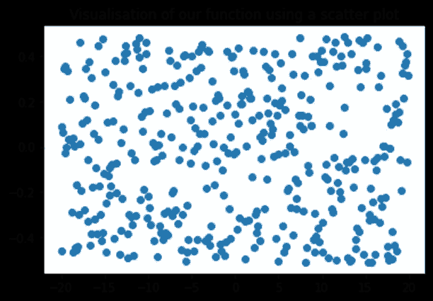
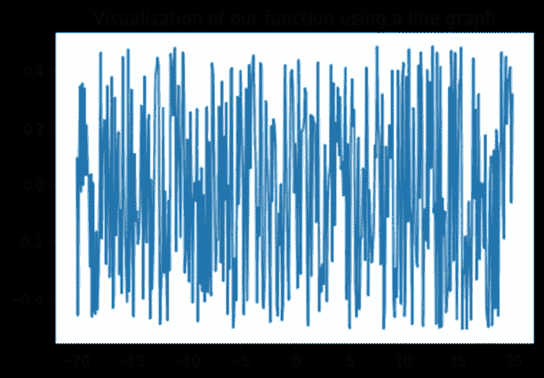
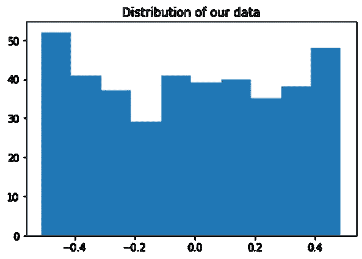

# 时间序列:Python 中有什么工具可以用来分析它们？

> 原文：<https://medium.com/geekculture/time-series-what-tools-are-available-in-python-to-analyse-them-dc2061f69e8c?source=collection_archive---------8----------------------->

## 第一部分:可视化和统计

在这篇文章中，我将分为两个部分，我想把重点放在时间序列上，这是一个数量的时间演变，在时间上有规律的间隔(每小时，每月，每年…)。它们可以表示温度随时间的演变、股票市场的演变、心率的监控等。在任何数据分析师的职业生涯中，处理时间序列中包含的信息都是他们工作中至关重要且反复出现的部分。然而，这些有时会令人困惑，难以阅读。那么如何处理这些数据呢？

面对这一挑战，我决定求助于有关这一主题的文献，因此本文将包含许多帮助我更好地理解这一主题的参考资料。

Photo by [Maxim Hopman](https://unsplash.com/@nampoh?utm_source=medium&utm_medium=referral) on [Unsplash](https://unsplash.com?utm_source=medium&utm_medium=referral)

自创建以来，Python 已经设法在其周围聚集了越来越多的科学家和分析师社区。这可以归功于其易于编码、开源框架和已开发的库，这使 Python 能够“执行统计计算、机器学习任务、开发网站等”(Peixeiro，2022，第 1 页)。事实上，其中几个库通过自动化复杂的程序和提供许多可视化和计算数据的工具，极大地方便了任何研究人员的工作。当然，时间序列也是如此。

为了帮助你更好地理解这个过程，并使它尽可能的具体，我建议使用没有背景的具体数字。我选择故意将这些值抽象化，以尽可能具有普遍性，尽管很明显，对这些值所在行业的了解将是彻底和完整分析的一部分，并可能使我更快地得出哪种方法最相关和最有效的结论。正如 Chatfield 在他的书*时间序列的分析:介绍中所说，*证实了“给定问题的背景在时间序列分析中是至关重要的”(Chatfield，2004，第 11 页)。

# 1.(英)可视化(= visualization)

在任何分析中，数据的可视化应该是第一步。许多专业人士都证实了这一点:“制作图表和静态或交互式可视化是数据分析中最重要的任务之一。”(McKinney，2018 年，第 219 页)Janert 在他的书*中解释道:“看着数据，你会注意到一些事情——数据点的分布方式，或者一个量随另一个量变化的方式，或者大量的离群值，或者完全没有它们。”(Janert，2011 年，第 1 页)*

正如 Chatfield 所证实的那样，这在时间序列中显得更加重要:任何试图分析一个时间序列而不先绘制它的人都是在自找麻烦。图表不仅会显示趋势和季节变化，还会揭示任何与其他数据不一致的“野生”观察结果或异常值。(查特菲尔德，2004 年，第 6 页)

如果我将数据绘制成散点图(图 1)，乍一看似乎看不出具体的趋势。

然而，如果我使用如下图所示的线形图，我会得到一个完全不同的图像。线形图通过显示两点之间的变化，让我们看到了似乎是“定期重复出现的特征”(Janert，2011 年，第 80 页)，看起来几乎像一个正弦函数。这一点，加上周围的噪音，使散点图混乱。当我们不仅需要看到总体趋势(在这种情况下，这太混乱了)，而且需要区分一组点之间的局部趋势时，折线图会很有用(“折线图和散点图”，2005)。这里它让我们看到重复的模式。因此，正确选择可视化是一个重要的步骤，必须考虑不同的标准，例如“数据中的噪声和异常值的数量”(Wang 等人，2018)，或者数据是离散的还是连续的。

这个形象化给了我们第一个暗示，关于我们函数的一个主要组成部分:季节性的存在。至于被定义为“平均水平的长期变化”(Chatfield，2004，第 12 页)的趋势(时间序列的另一个重要组成部分)，似乎没有。然而，我们需要更深入地了解我们的函数，才能清楚地说明这一点。

# 2.统计数字

Halswanter 在他的书中说,[统计学]为我们提供了从给定数据中提取最大量知识的工具。(Haslwanter，2021，第 123 页)因此，汇总统计数据对我们理解函数有很大帮助。然而，重要的是要谨慎对待这些信息，因为查特菲尔德警告说，对时间序列的汇总统计要非常小心，因为它们可能具有误导性(Chatfield，2004，第 11 页)。

数据由 400 个点组成，x 轴从-20 到 20，y 轴从-0.511 到 0.486。它的平均值为-0.019。x 轴上的每个值在 y 轴上只有一个对应的值，并且它们的间距相等。使用 describe()函数返回我们的数据帧的统计摘要，我得到以下结果:

平均值(-0，019)和中位数(-0，010)非常接近，这意味着我们的分布是对称的，可能是正态分布。然而，快速浏览直方图会告诉我们不同的结果:最大数量的值出现在极值处，但在每个箱中具有一般的均匀分布。因此，我们的数据围绕零对称分布，并在-0.5 和 0.5 之间振荡。

但是，感谢线图，很明显，数据似乎是嘈杂的。为了进一步理解这个图，我需要过滤掉这个特性。这也是我将在下一篇文章中做的事情。请务必阅读下面的内容，我们将重点介绍过滤、分析和预测。

感谢您的阅读！