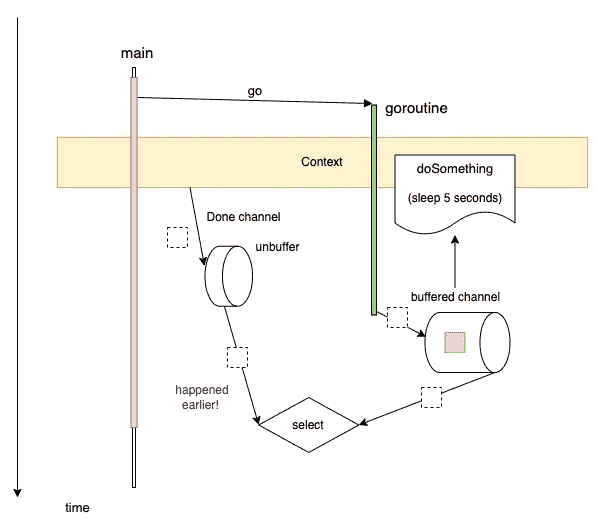

# Go 中的超时上下文

> 原文：<https://medium.com/geekculture/timeout-context-in-go-e88af0abd08d?source=collection_archive---------0----------------------->

在用 Golang 进行并发编程时，[上下文包](https://pkg.go.dev/context)是一个强大的工具，用来管理诸如**超时**、**取消**、**截止日期**等操作。

在这些操作中，带有超时的上下文主要在我们想要发出外部请求时使用，比如网络请求或数据库请求。在这篇文章中，我将向你展示如何使用它来超时一个 goroutine。

我们先来看一个简单的例子。

Timeout Context Example