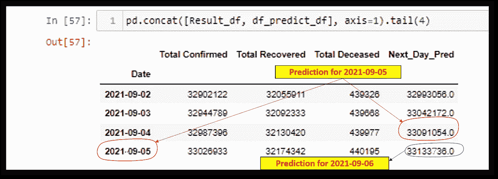

# 基于张量流的时间序列预测

> 原文：<https://medium.com/geekculture/timeseries-prediction-using-tensor-flow-e85aa3ab8648?source=collection_archive---------20----------------------->

在这篇文章中，我们将使用神经网络对未来 24 小时内确诊的新冠肺炎病例总数进行预测。用于进行预测的数据已从 URL[https://API . covid 19 India . org/CSV/latest/case _ time _ series . CSV](https://api.covid19india.org/csv/latest/case_time_series.csv)获得，它涉及印度新冠肺炎病例的汇编细节。本文的目的是学习使用张量流的神经网络(AI)的应用，以使用时间序列数据进行预测。

为了设置环境，我们将在 Google colab 中打开一个新的 Jupyter 笔记本，并导入一些基本的包。这些被导入到环境中的基本包/库是 pandas、numpy 和 matplotlib。这些将分别用于操纵数据框架、使用数学函数和创建数据集图形可视化的图形。为此，需要执行下面 Jupyter 笔记本单元中提到的代码

***导入熊猫为 pd
导入 numpy 为 np
导入 matplotlib.pyplot 为 PLT
% matplotlib inline***

这里的下一步将是导入数据集，该数据集将用作获得预测的输入。该数据集与每天更新的印度新冠肺炎病例汇编有关。该数据集可在网站[https://API . covid 19 India . org/CSV/latest/case _ time _ series . CSV](https://api.covid19india.org/csv/latest/case_time_series.csv)上开源获得。导入后的数据集存储在工作环境中新创建的数据框(df)中。一旦数据成功导入数据框，将使用函数 df.head()对数据集进行可视化分析。为此，需要执行下面 Jupyter 笔记本单元中提到的代码

***URL = '***[***https://API . covid 19 India . org/CSV/latest/case _ time _ series . CSV '***](https://api.covid19india.org/csv/latest/case_time_series.csv') ***df = PD . read _ CSV(URL)
df . head()***

需要格式化数据帧的日期列，然后指定“**日期**列作为索引，此后我们将使用数据集作为时间序列数据集。此外，我们将通过删除不再需要的列来刷新数据集(这一步是可选的)。为了便于上述步骤，需要执行 Jupyter notebook 单元中下面提到的代码(下面的 df_tail.head(7)单元用于检查现在获得的新数据集:-

***从日期时间导入日期时间
df。Date = pd.to_datetime(df。Date，format = ' % d % B % Y ')
df . set _ index(' Date，in place = True)
df = df . drop([' Date _ YMD '，'每日确认'，'每日恢复'，'每日死亡']，axis=1)
df.tail(5)***

下一步是将数据集划分为训练和测试目的。这是一个时间序列数据集，我们将其分为两部分，即截至 2021 年 4 月 30 日的数据集，作为训练模型的数据集，以及此后 2021 年 5 月 1 日以后的数据集，用于测试模型。请注意，将数据集划分为时间序列数据的测试和训练数据集的这一步骤不同于划分非时间序列数据集的步骤。Jupyter 笔记本单元中的下述代码就是为此目的而执行的

***df _ train = df[' 2020–01–30 ':' 2021–05–30 ']
df _ test = df[' 2021–06–01 ':]***

因为在这个例子中我们会用到张量流。我们将导入张量流包，也将时间序列生成器导入到环境中。时间序列生成器接收以相等间隔收集的一系列数据点以及时间序列样本参数，并使用输入和输出组件转换样本，还通知模型将学习的内容，即进行预测所需的内容(输入)和要进行的预测(输出)。下面提到的代码一旦在 Jupyter notebook cell 中执行，将导入张量流，时间序列生成器:-

***从 tensorflow . keras . preprocessing . sequence 导入时间序列生成器*** 导入 tensor flow 作为 tf

在下面提到的代码中，TimeseriesGenerator 会将 timeseries 数据集分别转换为 train 和 test 数据集(generator_train/generator_test)。我们将尝试通过使用前六天的数据集(相应地，以参数表示的长度=6)作为 tensorflow 模型的输入，得出第七天“总确诊病例”的预测值。批量大小将定义在给定时间将通过网络传播的样本数量。将执行下面给出的代码，以准备将在张量流模型中使用的训练和测试数据集(发电机 _ 训练和发电机 _ 测试)

***generator _ train = TimeseriesGenerator(df_train['总确认']，df _ train['总确认']，length=5，batch _ size = 1)
generator _ train[0]
df _ train['总确认']。head(6)
generator _ test = TimeseriesGenerator(df_test['总确认']，df _ test['总确认']，length=5，batch _ size = 1)
generator _ test[0]
df _ test['总确认']。*头(6)**

下一步是设置 random.set.seed()，它将“锁定”伪随机数生成器，以便在使用 tensorflow 模型(下面代码中的 model_1)时帮助进行可复制的分析。张量流模型有三层，第一层是输入层(tf.keras.layers.Dense (64，activation='relu '，input_dim=6))，下一层是隐藏层(tf.keras.layers.Dense(64，activation='relu ')，最后一层是输出层(tf.keras.layers.Dense(1))。输入层中的 input_dim 将输入维度指定为 6，因为有六个输入。此外，维度 1 是在输出层中指定的，因为我们将得到一个输出。此外，r 个整流线性激活单元函数(‘ReLU’)将用于已经创建的模型中( **ReLU function(f(x)=max(0，x))如果它接收到任何负输入，则返回 0，但是对于任何正值 x，它返回该值。因此，它给出的输出范围从 0 到无穷大)**。上述步骤将通过执行包含以下命令的 Jupyter 笔记本单元来执行

#建立模型 ***TF . random . set _ seed(13)
Model _ 1 = TF . keras . sequential([
TF . keras . layers . dense(64，activation='relu '，input_dim=5)，
tf.keras.layers.Dense(64，activation='relu ')，
TF . keras . layers . dense(1)
)***

为了总结模型，我们将执行命令 model_1.summary()。模型中共有 4609 个可训练参数(第一层 **64* 6，第二层 64+1* 64，第三层**64+1)。下一步是编译模型。为编译给出的参数是 optimizer ='adam '、loss='mse '(均方误差，即它提供了通过对数据集的平均差进行平方而提取的原始值和预测值之间的差)和 metrics = 'mae '(平均绝对误差，即。它提供了原始值和预测值之间的差值，该差值是通过对数据集上的绝对差值进行平均而提取的)。Jupyter 笔记本单元中的下述代码就是为此目的而执行的

***model _ 1 . summary()
model _ 1 . compile(optimizer = ' Adam '，loss='mse '，metrics = 'mae')***

下一步是使用 train(generator_train)，test(generator_test)数据集拟合模型。进一步的时期参数被给定为 50，这意味着机器学习算法将在该训练期间对训练数据集进行 50 次遍历。如此获得的值即 loss、mae 和 val_loss 以及 val_mae 将被转换成数据帧(结果)并显示。为了检查有效性，我们可以在图中用图形比较损失和 val_loss。loss 和 val_loss 的值应该匹配，以获得接近完美的预测值:-

***历史=模型 _1.fit(发电机 _ 列车，历元= 360，验证 _ 数据=发电机 _ 测试)
历史.历史
结果=pd。data frame(history . history)
result . head(10)
结果[['loss '，' val_loss']]。*剧情()**

下一步是使用训练好的模型进行预测。我们需要记住，对特定日期获得的预测值实际上是对第二天(未来)的预测。此外，该模型不会对训练数据集的前 6 天进行预测，因为该模型已经使用 6 天的值进行了训练，以达到在当前情况下对第 7 天的预测。在当前情况下，df_predict 用于存储预测值，df_predict_df 是创建的数据帧，用于存储列' **Next_Day_Pred'** 中的预测值。此外，我们可以直观地比较实际值(通过绘图以图形方式显示 df_test 和 df_predict 值)。所有这些步骤都可以通过在 Jypyter notebook cell 中执行下面提到的命令来实现。

***df _ predict = model _ 1 . predict(generator _ test)
df _ predict = TF . squeeze(df _ predict)
df _ predict . numpy()。形状
df_predict_df = pd。DataFrame(df_predict，columns =[' Next _ Day _ Pred '])
df _ predict _ df . head()
df _ test[6:]。tail()
PLT . scatter(df _ predict，df_test['已确认总数'][5:]，color='red')
plt.xlabel('预测值')
plt.ylabel('实际值')
plt.title('Covid 病例:已确认总数预测数')
plt.plot(df_predict，label= '预测值')
plt.plot(df_test['已死亡总数')][5:]。values，label= '实际值')
PLT . legend()；***

最后，为了比较预测值和实际值，我们将向预测值数据集(df_predict_df)添加日期，以创建一个时间序列数据集。为了进一步进行有意义的比较，我们将采用 df_test 数据帧(删除前 6 个值),创建一个新的数据帧(Result_df ),并将 df_predict_df 数据帧中的“**Next _ Day _ Pred*”***添加到该数据帧中。所有这些都将通过在 JupyterNotebook 单元格中执行以下命令来实现。

***Result _ df = df _ test[5:]
df _ predict _ df . head()
df _ predict _ df[' Date ']= PD . Date _ range(start = ' 2021–05–06 '，periods=len(df_predict_df)，freq='D')
df_predict_df。date = PD . to _ datetime(df _ predict _ df。Date，format = ' % d % B % Y ')
df _ predict _ df . set _ index(' Date '，in place = True)
PD . concat([Result _ df，df_predict_df]，axis=1)***

上述问题陈述和解决方案(**对未来 24 小时**的预测)是为了学习神经网络在真实数据集中的应用。为了获得近乎完美的结果，无疑需要对模型进行细化和微调。这个模型也可以用来预测股票价格。我期待社区对此模型的改进提出建议。

**参考文献**

1.[https://API . covid 19 India . org/CSV/latest/case _ time _ series . CSV](https://api.covid19india.org/csv/latest/case_time_series.csv)。
2。使用来自 **TalentEdge** 平台的 R 和 Python 进行财务分析时获得的知识