# 熊猫的时差、时差和周期

> 原文：<https://medium.com/geekculture/timestamps-and-date-ranges-in-depth-work-with-special-date-and-time-objects-in-pandas-692ae6ff02d0?source=collection_archive---------7----------------------->

## 你应该知道的特殊日期和时间对象。

Photo by [geralt](https://pixabay.com/users/geralt-9301/) from [pixabay](https://pixabay.com/)

在 pandas 日期和时间系列的第一部分中，我已经探索了 pandas 时间系列功能的核心——在本文中，我想看一下更特殊的时间对象，这些对象旨在简化时间戳算法，并满足在数据中标记时间的特殊需要。

 [## 深入研究时间戳和日期范围:在 Pandas 中处理日期和时间

### 深入研究时间戳，它是熊猫日期和时间功能的核心数据对象。

medium.com](/geekculture/working-with-dates-and-time-in-pandas-part-1-timestamps-and-date-ranges-ac87e74878cf) 

对于本文，我将使用 Kaggle 的“Twitter 上的平坦地球”数据集。

注意:本文中展示的特性只是 Python 和 Pandas 中不同时间对象的所有功能的一小部分——我觉得值得在一篇介绍性的文章中展示这些特性，只是为了体验一下这些对象的强大功能。我不想给人留下这样的印象，即这些是这个话题的极限——无论怎么想象都不会是真的。

## **时间差**

> *时间增量*是表示两个时间戳之间的两个时间点之间的差异的对象。

它可以使用几种不同的度量单位(例如分钟、天)，可以是正数也可以是负数。

创建*时间增量*的一种方法是从另一个时间增量中减去一个时间戳:

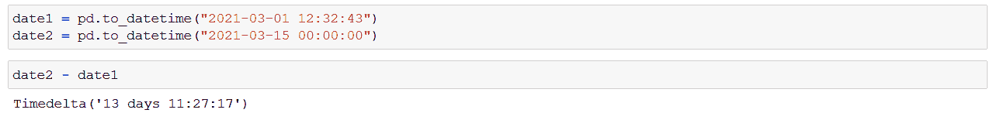

Screenshot by Author

您可以使用 [Pandas 构造一个 *Timedelta* 对象。时间增量](https://pandas.pydata.org/docs/reference/api/pandas.Timedelta.html#pandas-timedelta)。这里您需要指定您想要的时间增量持续时间作为参数。为此，例如，您可以使用字符串作为参数，或者提供整数作为关键字参数(在文档的[解析时间增量](https://pandas.pydata.org/pandas-docs/stable/user_guide/timedeltas.html#parsing)一节中，您可以找到其他几种方法):

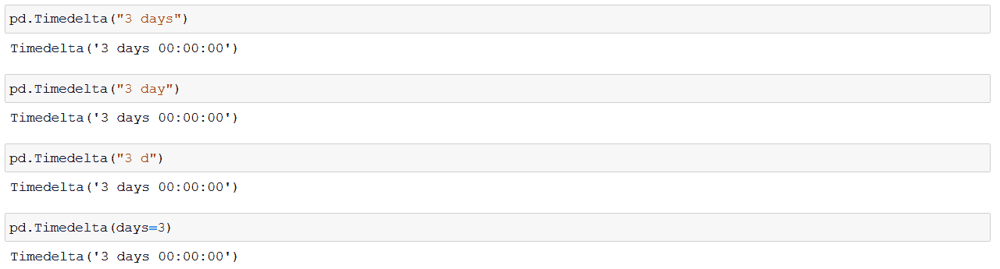

Screenshot by Author

如果我们想要增加一个特定时间量的*时间戳的*值，我们可以使用 timedeltas 来完成这个操作。假设你不能等到圣诞节，所以你决定将时钟拨快 3 天:

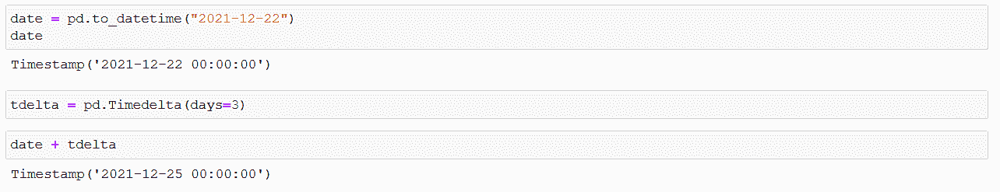

Screenshot by Author

注意:如果你想执行这个操作，你必须在你所在的宇宙中找到一个足够重的物体(黑洞总是一个不错的选择)，它可以帮助你度过等待圣诞老人的这段时间。

我们当然也可以从*时间戳*中提取*时间增量*，更重要的是，我们可以对整个日期范围进行操作而无需循环:

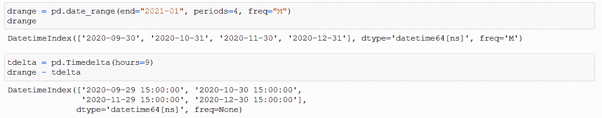

Screenshot by Author

*时间增量*也可以应用于日期时间序列。回到我们的 Flat Earth 数据，我们可以根据原始用户创建日期轻松创建一个新系列:

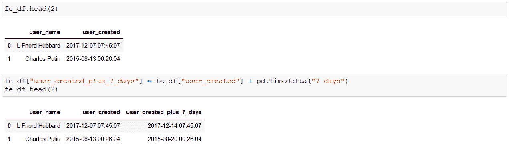

Screenshot by Author

假设我们想知道示例数据帧中的用户是多少天(月、年、秒)前创建的。我们可以使用标记今天和创建日期之差的 *Timedelta* 对象除以另一个 *Timedelta* ，其值取决于我们希望看到的度量:

Screenshot by Author

Timedelta 对象具有访问数据的特定部分或执行进一步操作的属性和方法——所有这些都可以在[文档](https://pandas.pydata.org/pandas-docs/stable/user_guide/timedeltas.html#attributes)中找到。

> 如果你想让我保持咖啡因创造更多这样的内容，请考虑支持我，只要一杯咖啡。

## **日期偏移**

*DateOffests* 与 *Timedeltas* 密切相关，但是工作方式略有不同。这两者背后的不同逻辑是，例如，有时连续两天的午夜之间的差异不是 24 小时:例如，夏令时可以稍微改变一下。1 天*时间增量*将始终为时间戳增加 24 小时，而*日期偏移*将时间戳向前移动到第二天以及原始时间戳的确切时间:

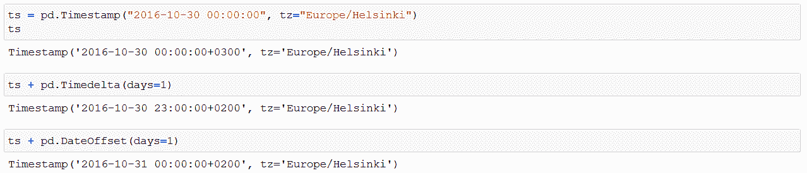

Screenshot by Author

偏移对象提供了很多机会将时间戳向前或向后移动到某个逻辑时间点，而不是一个固定的时间段。使用平面地球数据，让我们找出离创建用户帐户最近的工作日:

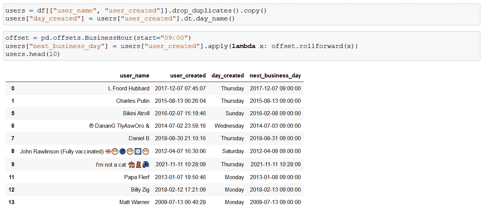

Screenshot by Author

如您所见，如果一个*时间戳*是在营业时间，那么“下一个营业日”*时间戳*与原始时间戳相同。在工作时间之外，向前滚动将*时间戳*移动到下一个工作日——如果它碰巧在星期六应用，而不是翻转到第二天，偏移将寻找下一个星期一。

## **周期**

> *周期*是时间对象中表示的某个时间段(小时、天、周、月、季度等)。

这背后的主要思想是，当一个*时间戳*表示某个时刻时，当你的数据被标记为与周期性重现相关联时，使用一个*周期*(即使它可能非常高的分辨率，例如它指向某一秒)，该对象与数据链接的时间跨度相关联。

销售数据就是一个很好的例子:每次你在商店里卖一个甜甜圈，你就做一个销售记录，销售时间(一个*时间戳*)与每笔交易相关联。一天 100 次购买导致多达 100 个不同的*时间戳*。然而，当你在一天结束时总结你的收入时，你得到的是收入和收入实现的那一天(T4 期)的总和。第二天，交易的下 100 个*时间戳*，但是你的每日收入只有 1 个*周期*标记——不需要特定的*时间戳*。你每天的*周期*也可以总结成每月、每季度和每年的*周期*。关键是这些时间段以某种逻辑重新出现，这就是*时间段*所捕捉的内容。

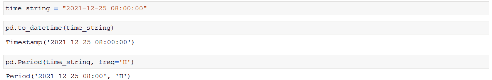

Screenshot by Author

很快，时间戳和周期*之间似乎没有太大的区别——当我们开始处理与周期*相关的算法和方法/属性时，这一点开始变得清晰起来。例如，频率参数在逻辑中起着巨大的作用:当对一个周期进行加减时，频率参数中指定的数量将被相加:**

**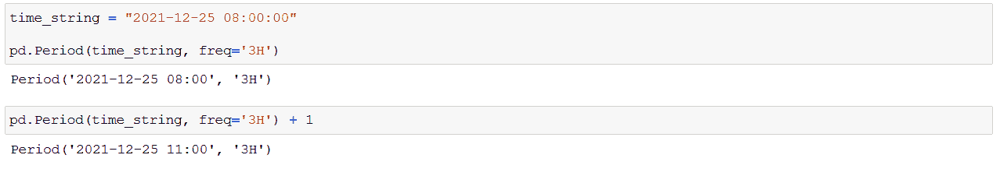**

**Screenshot by Author**

**正如您所看到的，由于在上面的示例中频率设置为 3 小时，所以加 1 会增加 3 小时(=频率的 1 个单位)。**

**创建*周期范围*是我认为使用这些对象时的基本用例之一，毕竟在使用这些类型时，重点是要有某种规则的循环:**

**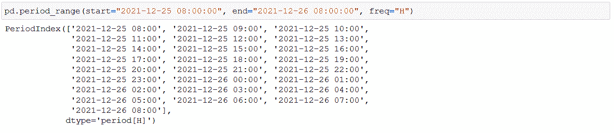**

**Screenshot by Author**

***Periods* 包含给定的时间跨度，对象可以返回这些时间跨度的开始和结束。创建一个*周期范围*，其中频率标记季度，开始和结束日期如下所示:**

**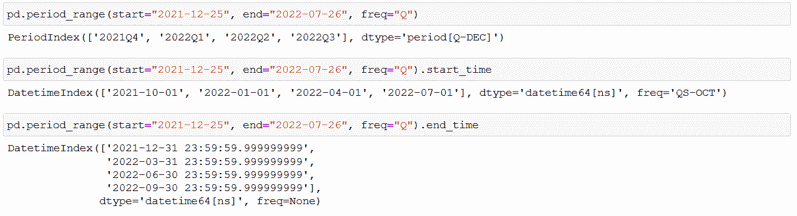**

**Screenshot by Author**

**在[文档](https://pandas.pydata.org/docs/reference/api/pandas.Period.html)中可以找到周期对象中可用的属性和方法的完整列表。**

***时间戳*可以转换为*周期*当然(反之亦然):在平地数据集中添加每个用户被创建的季度的开始就像下面一行代码一样简单:**

**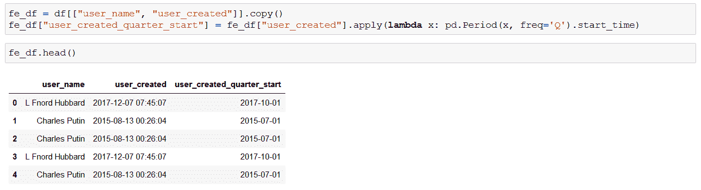**

**Screenshot by Author**

**熊猫的日期和时间功能有着难以置信的深度。根据这两篇关于这个主题的文章，你可能会发现，很难想象有什么问题是你不能使用现有的内置解决方案来解决的。我希望您已经找到了这 2 部分系列的教育意义，并且一如既往地鼓励您访问和阅读链接文档以了解更多信息。**