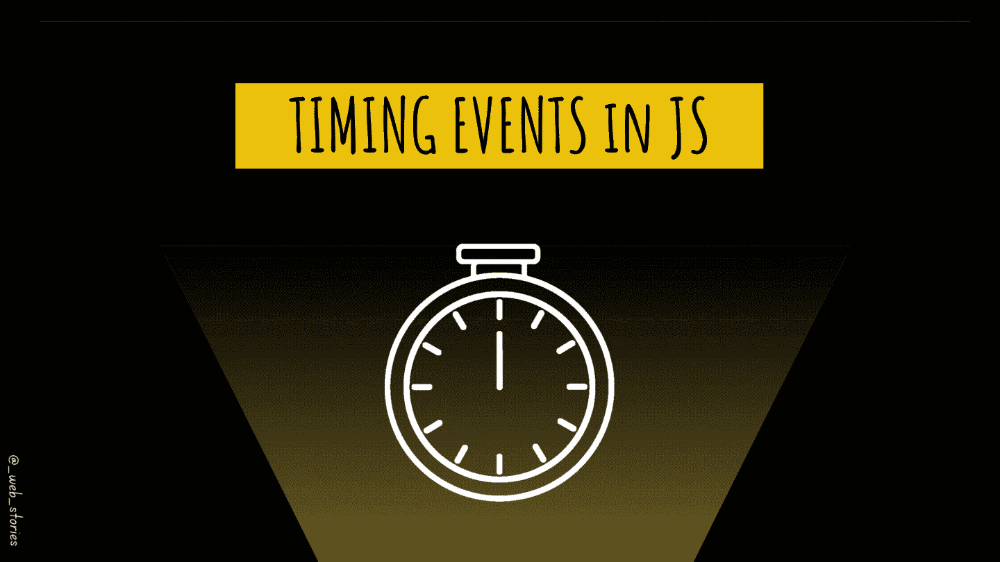

# JavaScript 中的计时事件

> 原文：<https://medium.com/geekculture/timing-events-in-javascript-d44c24ed8641?source=collection_archive---------9----------------------->

## JavaScript 中的超时和间隔

By FAM

## 你好👋

你听说过 JavaScript 中的超时和间隔吗？这次我们将讨论 JavaScript 中的定时事件。

我们已经在之前的文章中讨论过`***window***`对象。

> window 对象代表一个打开的窗口…