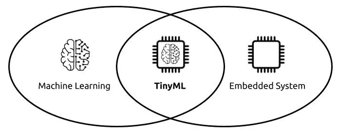
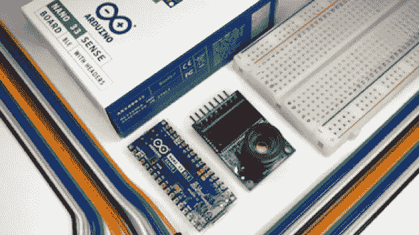

# 微小 ML

> 原文：<https://medium.com/geekculture/tiny-ml-ca0dd5ca8dd2?source=collection_archive---------9----------------------->

Source: Medium

## 关于 TinyML:

TinyML 是**深度学习**发展最快的领域之一。简而言之，这是一个新兴的研究领域，探索可以在小型低功耗设备上运行的模型类型，如**微控制器**。

TinyML 位于嵌入式 ML 应用程序、算法、硬件和软件的交叉点。目标是在通常只消耗几毫瓦电池电量的设备上的边缘设备上实现低延迟推断。相比之下，一个台式机 CPU 将消耗大约 100 瓦(几千倍以上！).这种极低的功耗使 TinyML 设备能够在不插电的情况下运行，并持续数周、数月甚至数年，同时在边缘/端点运行始终在线的 ML 应用。

尽管我们大多数人都不熟悉 TinyML，但当你得知 TinyML 已经在生产 ML 系统中服务多年时，你可能会感到惊讶。当你说**【OK Google】**来唤醒一个 Android 设备的时候，你可能已经体验过 TinyML 的好处了。这是由一个始终在线，低功耗的关键字检测器。

## 为什么是 TinyML？

如果我们考虑到这一点，根据 ABI 研究公司的预测，到 2030 年**时**，可能会有大约**25 亿**设备通过 TinyML 技术进入市场，主要好处是智能物联网设备的创造，更重要的是，通过可能的成本降低来普及它们。

大多数物联网设备执行特定的任务。它们通过传感器接收输入，执行计算，发送数据或执行操作。
通常物联网的做法是收集数据，发送到一个集中的注册服务器，然后，你可以使用机器学习来得出结论。
但是我们为什么不在嵌入式系统层面让这些设备变得智能呢？我们可以根据交通密度建立智能交通标志等解决方案，当你的冰箱缺货时发出警报，甚至根据天气数据预测降雨。

嵌入式系统的挑战在于它们很小。大多数都是靠电池运行的。ML 模型消耗大量的处理能力，像 Tensorflow 这样的机器学习工具不适合在物联网设备上创建模型。

## 用 TinyML 构建模型:

在 TinyML 中，使用了相同的 ML 架构和方法，但在能够执行不同功能的较小设备上，从回答音频命令到通过化学交互执行动作。

最著名的是 **Tensorflow Lite** 。使用 Tensorflow Lite，您可以将 Tensorflow 模型分组以在嵌入式系统上运行。Tensorflow Lite 提供能够在低功耗嵌入式系统上运行的小型二进制文件。

Tensorflow Lite: Tiny ML

一个例子是 TinyML 在环境传感器中的应用。想象一下，该设备被训练来识别森林中的温度和气体质量。这种装置对于风险评估和火灾原理的识别是必不可少的。

连接到网络是一项消耗能量的操作。使用 Tensorflow Lite，您可以部署机器学习模型，而无需连接到互联网。这也解决了安全问题，因为嵌入式系统相对更容易被利用。

## TinyML 的优点:

**数据安全:**由于不需要将信息转移到外部环境，数据隐私更有保障。‍

**节能:**传输信息需要庞大的服务器基础设施。当没有数据传输时，节省了能量和资源，从而降低了成本。
‍
**无连接依赖:**如果设备依赖互联网工作，而它出现故障，将无法向服务器发送数据。您尝试使用语音助手，但它没有响应，因为它已断开互联网连接。

**延迟:**数据传输需要时间，通常会带来延迟。当它不涉及这个过程时，结果是即时的。

> **“哪里有数据的硝烟，哪里就有生意的火。”—托马斯·莱德曼**