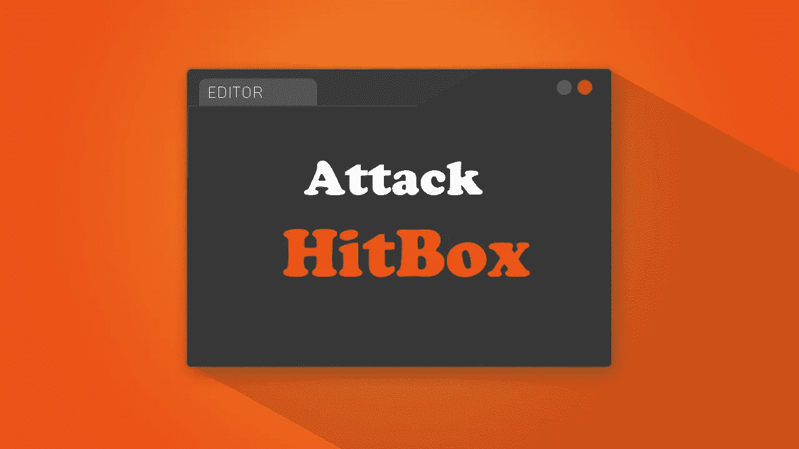
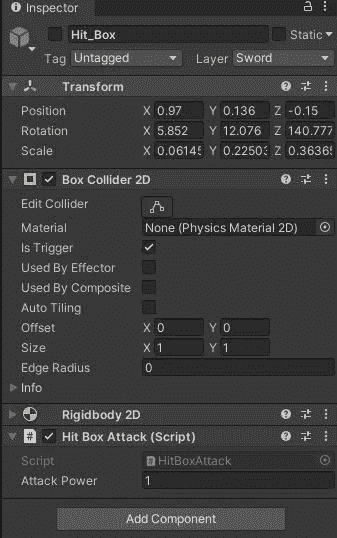
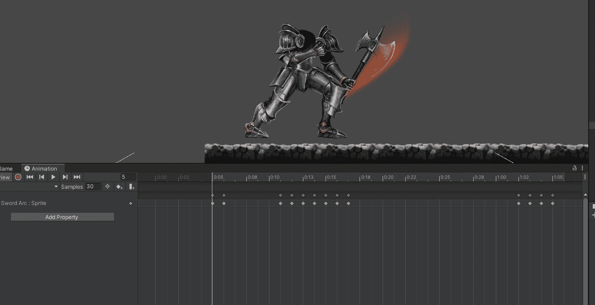
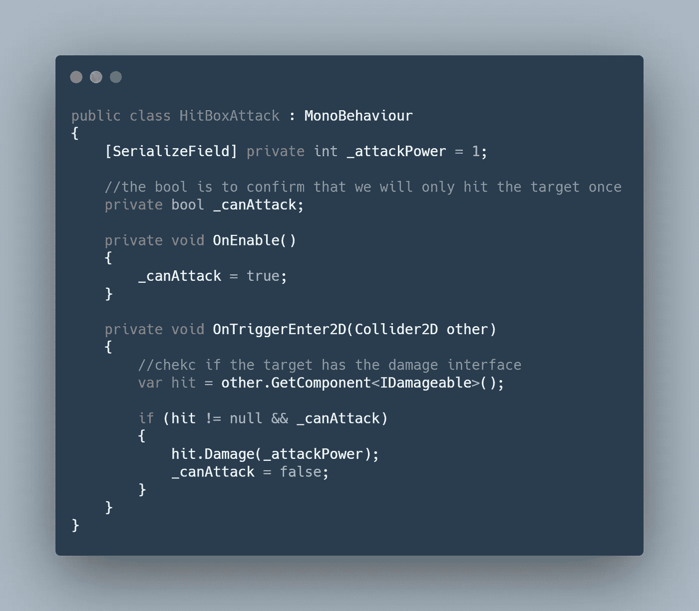
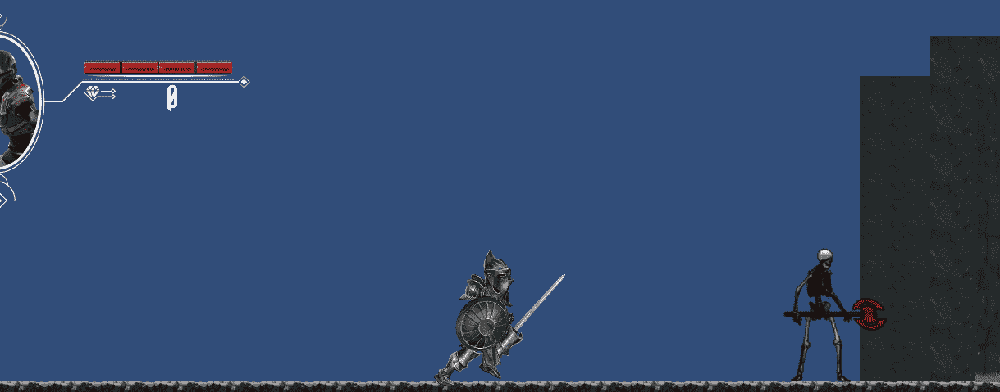

# 日积月累:攻击 Unity 中的 Hitbox

> 原文：<https://medium.com/geekculture/tip-of-the-day-attack-hitbox-in-unity-42a9da4107dd?source=collection_archive---------7----------------------->

打击敌人并杀死他们是电子游戏中最有趣的部分。无论你是朝他们的脸开枪，还是用剑砍他们，作为一名开发者，你需要在 Unity 中找到打击敌人的最佳方式。

今天，我们将探讨近战格斗，以及你如何记录你的敌人，反之亦然，敌人打你。我们将使用 Hitbox 技术。

> Hitbox 技术

基本上，这里的想法是在你的近战武器周围创造一个箱子碰撞器，在武器和敌人碰撞的瞬间，你激活这个碰撞器以击中敌人。

A.创建一个空的游戏对象作为你的玩家的孩子，添加一个盒子碰撞器，检查触发盒，添加一个刚体(运动学)，这样我们就可以检测碰撞。

B.创建一个 C#脚本，让我们称之为 HitBoxAttack，并将其添加到您的 hitbox gameObject 中。

C.暂时关闭 hitbox 游戏对象。(请稍等，我稍后会解释原因)

Hitbox Game Object

D.我们将在动画窗口中设置它。在下面的例子中，骑士用斧头攻击，我们用弧线来表示攻击。

1.  在弧形动画中，按“录制”按钮。
2.  选择你想要激活碰撞盒的时刻，并相应地调整碰撞器的大小。
3.  前进几帧，再次调整碰撞器的大小。
4.  最后，关闭点击盒

Recording the animation

这将需要更多的测试，以完善 hitbox 的正确位置，以确保它确实击中敌人。

## 现在来看剧本

我们将利用我们在前一篇文章中学到的接口。(=> [Unity 接口 101](https://levelup.gitconnected.com/tip-of-the-day-interfaces-101-in-unity-bc0fd1961cf) )

在这里，我们将检测目标是否有 IDamageable 接口，这样我们就可以攻击它。如果我们能攻击它，那么我们就击中敌人并触发伤害方法。

如你所见，这种方法对玩家和敌人都有效。我们在敌人身上使用了 hitbox 技术，并在玩家身上增加了界面。

这就是你的游戏的高效快速的攻击系统。

快速提示:使用这种方法会导致一个错误，即你的生命盒也会击中玩家，而敌人的攻击生命盒会攻击敌人本身。要解决这个问题，请阅读下面的文章:[日积月累:Unity 中的碰撞层](https://novusxdev.medium.com/tip-of-the-day-collision-layer-in-unity-e2c5e0db210f)