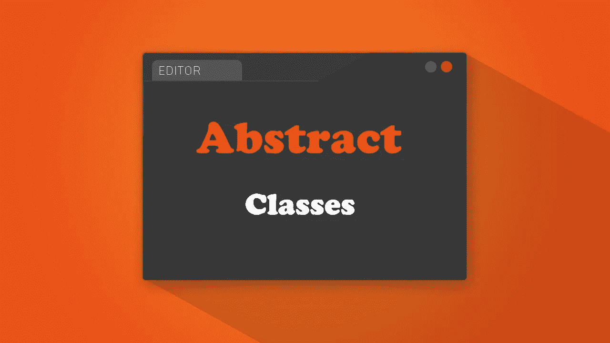
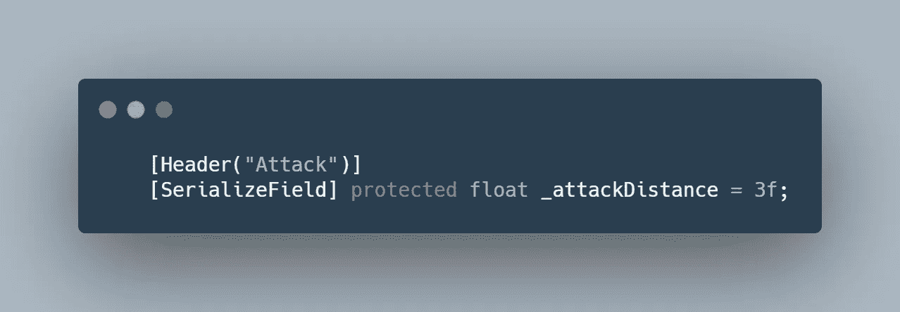
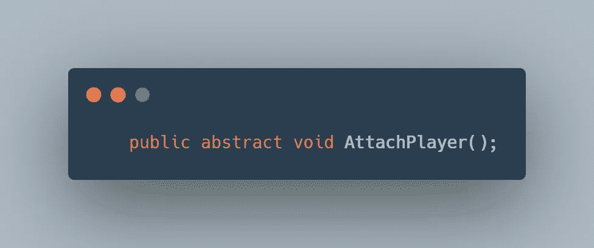

# 日积月累:利用 Unity 中的抽象类

> 原文：<https://medium.com/geekculture/tip-of-the-day-taking-advantage-of-abstract-classes-in-unity-3a6cc012ad86?source=collection_archive---------2----------------------->

直截了当地说，抽象类同时是一个单行为和一个接口。从某种意义上来说，它们作为一个接口，它们不能成为场景中游戏对象的一个实例或组件。也像接口一样，你可以拥有必须出现在继承类中的方法。

它们作为一种单行为，在某种意义上，你可以添加变量和带参数的方法。

> 抽象类的实际例子

在我的 GameDevHQ 最新项目([移动项目进展报告:敌人设置统一](/nerd-for-tech/mobile-project-progression-report-enemy-setup-unity-145bbe43f0bc))中，我们有一些敌人类型共享相同的生命系统、移动系统和攻击系统。想象有 15 种不同类型的敌人，通常你需要写 15 种不同的脚本，每种类型一个。

但是有了抽象类，你可以制作一个适用于所有这些敌人类型的模板，而且你可以专门化每一个敌人类型而不用接触模板代码。

o，要声明一个类是抽象的，只需在类前加上“abstract”即可。

*对于变量*，我建议你把它们都保护起来。Protected 类似于私有变量，但总是用于继承类中的受保护变量。

## 对于这些方法，有两种方法来声明它们。

**A .声明一个抽象方法**。抽象方法必须是公共的和空的。您不能在抽象类中编写任何代码，但是它们会强制继承类使用这些抽象方法。

所以这个抽象方法必须在继承类中被调用，否则你会一直得到一个错误，直到你添加了这个抽象类。就像接口一样，一旦从接口继承，就必须实现接口的方法。

**B .声明虚方法**。虚方法(私有的或公共的)就像普通的方法，如果需要的话，你可以用参数在它们中编写你的代码，但是在继承类中，你可以不加修改地使用它们，或者你可以重写它们，并且为继承类专门化这个方法。

在上面的例子中，EnemySkeleton(继承类)覆盖了抽象类的 Init()虚方法。“基地。Init()”将允许该方法使用抽象类中的任何代码，然后向其中添加专门的代码。或者可以完全重写该方法，而不调用“base”。

正确使用抽象类是非常强大的，我在 GameDevHQ 移动项目中使用了它们，你可以自己看到结果。
[移动项目进展报告:敌人设置统一|作者 Mohamed Hijazi |技术呆子| 2021 年 5 月| Medium](/nerd-for-tech/mobile-project-progression-report-enemy-setup-unity-145bbe43f0bc)