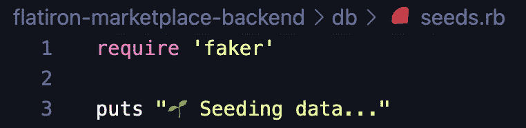
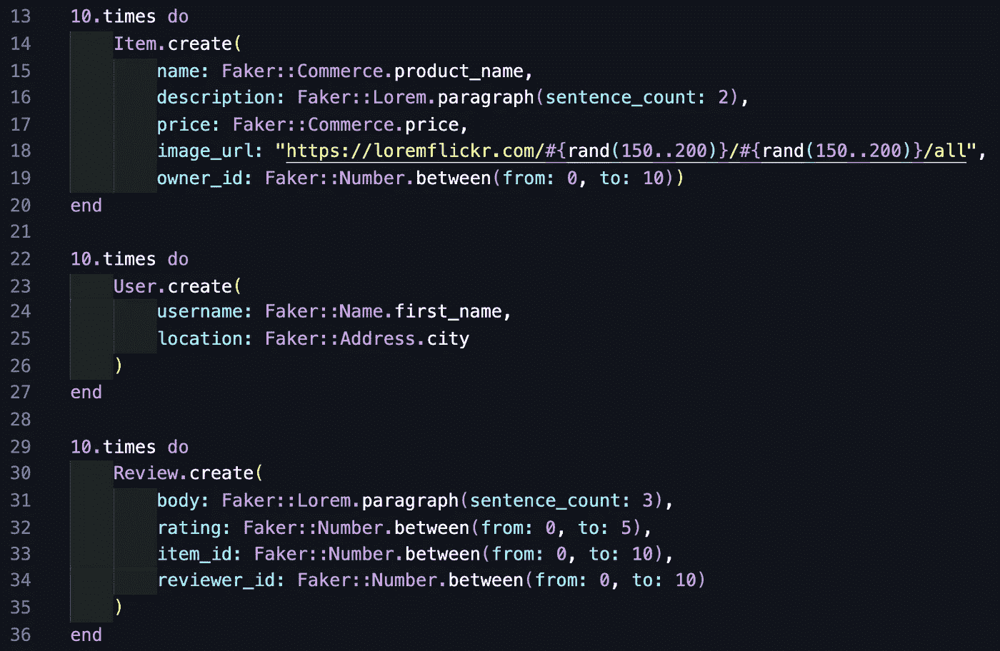
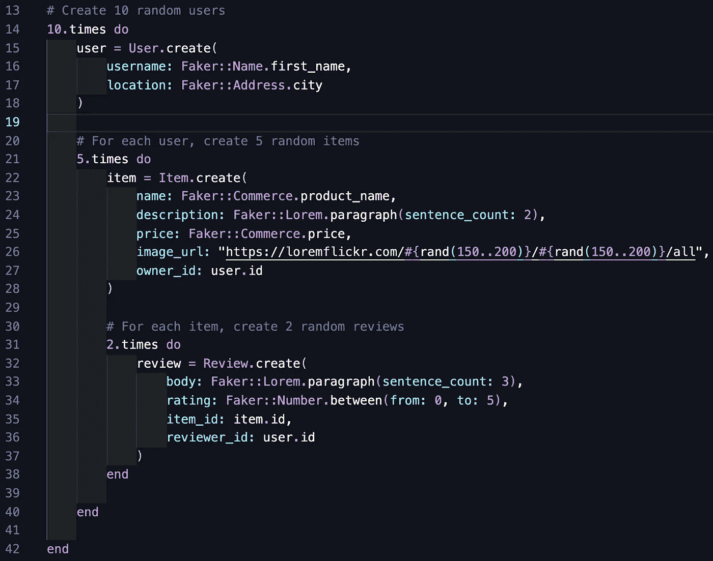
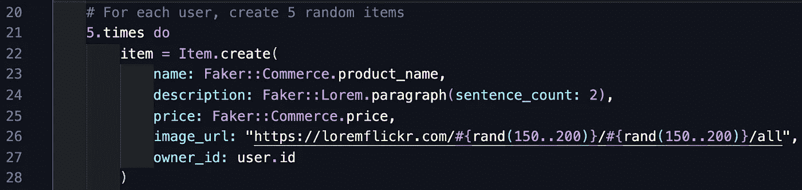
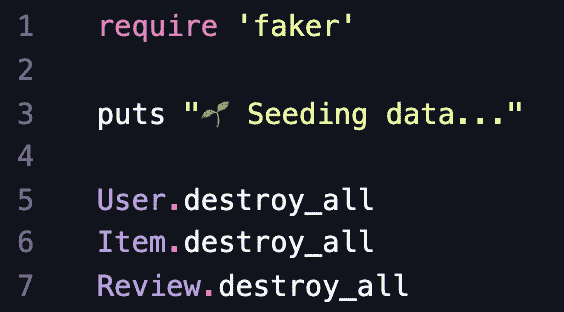

# 提示和技巧:将 Ruby Faker 宝石添加到您的项目中

> 原文：<https://medium.com/geekculture/tips-and-tricks-adding-the-ruby-faker-gem-to-your-project-8f8c67361fe3?source=collection_archive---------9----------------------->

我最近构建了我的第一个完整的全栈应用程序(太令人兴奋了！)并学习了如何将 Ruby Faker Gem 合并到我的项目的 Ruby 后端。这非常方便，为我节省了大量时间，否则我需要手动将占位符数据放入 seeds.rb 文件中。现在我想和大家分享这个新知识！

我将带你了解如何设置 Faker 宝石，然后分享我在自己的项目中使用宝石时学到的技巧和诀窍。请继续阅读，了解如何自己实现它！请在评论中告诉我这是否有帮助，或者你是否有其他你喜欢和推荐的类似宝石。

A gif that says “How to use the Ruby Faker Gem (+ tips and tricks!)”

# 操作方法:

下面是 Github 中 Ruby Faker 宝石的链接:[https://github.com/faker-ruby/faker](https://github.com/faker-ruby/faker)

1.  将 gem 添加到您的项目中——您可以通过两种方式来完成。您可以在项目终端中运行“gem install faker”，也可以将“gem‘faker’”与您的其他 gem 一起添加到您的 gem 文件中，如下所示:

I like to leave myself comments about this kind of thing, like the one above on line 37.

2.将“要求‘faker’”添加到 seeds.rb 文件的顶部，如下所示:

I like to leave myself a little terminal message, too, which you see on line 3 above.

从技术上讲，这就是全部要求！现在，您可以使用方便的 Faker gem，而不是手动将占位符属性填充到 seeds.rb 文件中！

上面 Github 链接中包含的文档对于入门非常有用，但是我在自己的项目中使用 Faker gem 时想到了一些额外的提示和技巧。请继续阅读，并从我的经历中学习！

# 专业提示:

## 播种前考虑数据中的关系

为了这个项目，我和我的同事建立了一个市场应用程序，很像 Craigslist 或 Facebook Marketplace。在这个例子中，有三个模型和它们对应的表——条目、用户和评论。正如你所想象的，我们希望我们的应用程序与我们的参考应用程序功能相似，所以我们决定:我们的商品应该能够有许多评论，我们的用户应该能够销售许多商品，每个评论应该属于一个商品(它所应用的)和一个用户(发布评论的)。为了确保所有的表都能正常工作，在播种之前考虑这些关系是很重要的！

我们可以分别播种一些项目、一些用户和一些评论。像这样:

只要我们确保第 19、33 和 34 行中的 ID 号参数与每个表格中的行号和 ID 号匹配，这就可以工作*好的*。但是我们很自豪地提出了一个更复杂的解决方案！

由于任何一个用户都可以拥有许多不同的项目，并且任何一个项目都可以有许多评论，所以经过反复试验后，我们采用了以下种子结构:

这一次，您可以看到种子是嵌套的，因此我们创建用户，然后为每个用户创建项目，最后为每个项目创建评论。因为我们使用循环来创建这些相互关联的记录，所以不再需要随机分配外键。相反，我们在第 15、22 和 32 行给每个新实例一个变量名，然后我们可以在第 27、35 和 36 行使用这些变量名来编码用户、条目和评论之间的所有权！

## 如果你想一次得到多个随机图像，尝试插值。兰德()

您可能已经注意到，上面的第 26 行看起来不太像使用 Faker 数据来填充记录种子的其他行。在用 Faker gem 的随机图像生成器(LoremFlickr)进行了大量的试验和错误之后，我们得出结论，gem 每次使用只会返回一张图像。在我们的例子中，我们希望我们市场上的每个商品都有不同的随机图像(因为你不会在 Craigslist 上看到每个商品都贴有相同的产品照片，对吗？)但 LoremFlickr Faker 只生成了一张图像，并将其应用于每件商品。

虽然有许多创造性的方法来解决这个问题，但我们最终添加了一些额外的随机化。这样使用。rand()在随机照片尺寸参数中进行插值，这迫使 LoremFlickr 在每次循环项目创建代码时实际返回一个新的随机图像。你可以在下面的第 26 行看到:

## 注意，Lorem.sentences Faker 会将所有内容放在数组括号中。请考虑改用 Lorem.paragraphs

对于这个项目，我们想随机生成一个占位符描述，每个项目有几个句子长。最初，我们尝试使用 Lorem.sentences Faker，但我们意识到它将每个单独的句子包装在直括号中，就像我们看到的用于保存数组一样。

虽然使用这些括号并简单地遍历每个句子来删除它们完全没问题，但我们发现现有的 Lorem.paragraphs Faker 是更好的选择。它立刻为我们提供了一个更简单的解决方案，因为它没有给我们每个句子加括号。

## 使用 Class.destroy_all 和 rake db:reset(针对特定情况)

> **注意:请谨慎使用最后这些提示！如果你在做自己的项目，只有你一个人在使用数据库，这两个工具确实很方便，但是我不建议在其他情况下使用它们！如果您将这些应用到一个更大的项目中，其中的数据库可能更大或更重要，那么您可能会意外地用这段代码破坏那些记录。**

如果您还没有尝试在自己的项目中使用这两段代码，这就是您的标志！在许多情况下，它们使事情变得简单和顺利。

首先，我喜欢将“Class.destroy_all”添加到每个类的 seeds.rb 文件的顶部，如下所示:

这样，如果我必须多次运行我的种子文件(这几乎是肯定的)，它将在执行将向这些表添加新数据的其余 seeds.rb 代码之前销毁这三个表中的所有用户、项目和评论记录。这是很方便的，这样当你只是在个人项目上修修补补时，你就不会有大量的表格。

很棒的是使用。destroy_all 销毁记录，但是那些记录中的 ID 号呢？因为我们知道 ID 号通常不会被覆盖，所以如果您重新运行一个创建了大量记录的种子文件，最终很容易得到大量的 ID 号。如果 ID 号对您的程序很重要，请尝试使用命令“rake db:reset”。

你可以在运行“rake db:migration”*和*“rake db:seed”的地方使用这个命令。本质上，“rake db:reset”将删除您的数据库，运行您的迁移文件，*然后*运行您的种子文件。同样，使用这种方法要特别小心，但是如果应用到正确的程序中，它可以保持数据库的美观和可管理性。

我希望这些提示和技巧对你有所帮助！欢迎在评论中留下反馈，祝编码愉快！