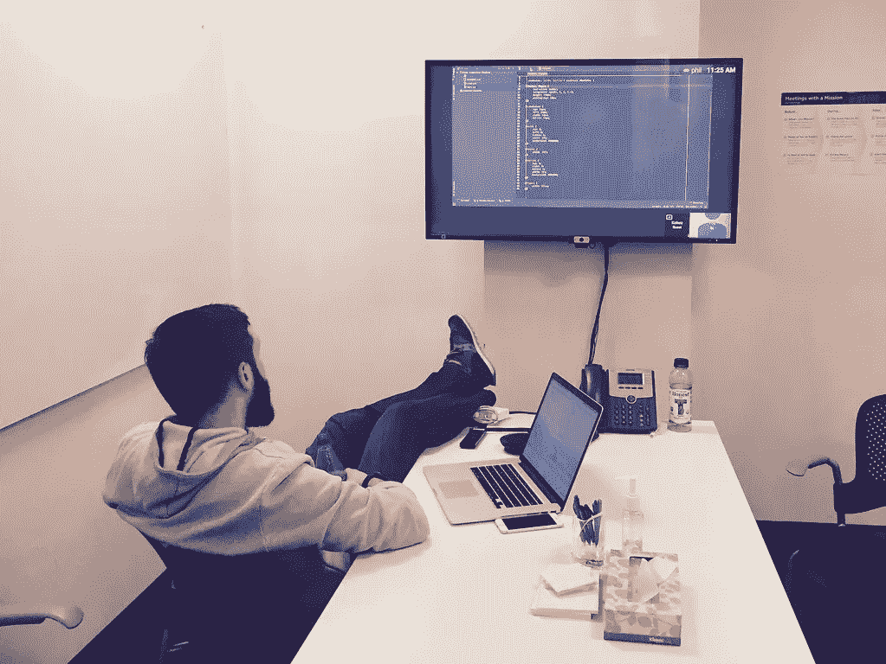

# 获得第一份软件工程工作的技巧

> 原文：<https://medium.com/geekculture/tips-for-getting-first-software-engineering-job-460c2e748fe5?source=collection_archive---------20----------------------->

祝贺你几乎完成了这方面的课程/学位。所以你真的不知道你想用它做什么，欢迎加入俱乐部。

我将在申请过程的开始浏览一些非常有用的信息，并在面试中提供一些可以帮助你脱颖而出的建议。

Reference: [https://www.flickr.com/photos/superic/25450419302](https://www.flickr.com/photos/superic/25450419302)

**申请前:**

仔细回顾你在整个课程/学校中所取得的成绩。以下是需要完成的事项列表:

*   你参加了什么活动/俱乐部？
*   有什么有趣的项目吗？有潜在的副业吗？
*   你参加过黑客马拉松、网络安全竞赛、谷歌编码竞赛等活动吗？
*   你参加过什么会议/讲座吗？

请注意，除了作为教育一部分的项目之外，所有这些基本上与你在学习阶段所做的事情无关。请记住，几乎每个申请人都曾经上过学校和类似的课程。除非你从名牌大学毕业(是的，这对人们来说仍然很重要)，否则教育不会让你脱颖而出。

**如果我什么都没发生呢:**

如果你有时间，我强烈建议开始，但你可以在课堂上强调谈话，课堂项目和其他学到的东西。我会告诉他们重点，我会记下来。

**简历** **温馨提示:**

应该着重强调上述各项，主要讨论所使用的技术、您学到了什么以及完成了什么的简要概述。

举个例子，

您参加了一个黑客马拉松，构建了一个简单的 web 应用程序来显示来自 Google maps 的信息。

以下是简历中可以用到的一些东西:

*   熟悉谷歌地图 API
*   使用 w/ a 语言的 web 框架
*   在团队中工作(如果是这样的话)
*   后端语言的使用(如果使用了后端语言，通常黑客马拉松代码只是把所有东西都拼凑在一起)
*   构建 API 的知识

看你能加多少，就算你没赢赛事也没拿什么奖？在一次活动中接触到的技术比你在一堂结构课中学到的要多得多。您已经学习了如何使用库 API(这是我每天都在做的事情)，如何构建 API，如何将数据格式化为服务可用的格式，以及如何构建实时应用程序。

添加这些信息的主要原因是为了与面试官讨论话题，以展示对该领域的实际兴趣。无论我看到多少空缺的职位，最低工资也不再那么有用了。

另一个简单的技巧是保持 LinkedIn 个人资料和简历之间的信息一致。我不会把你个人资料中的所有内容都添加到简历中，但是把它们放在两个地方至少会让事情变得简单。

最后一个提示是，我们大多数人在学校的某个位置都在零售领域工作过。我强烈建议，如果你在这份工作上呆了几年，就只增加一小部分职位。你想展示的是为一份工作呆在一个地方的一致性，我可能会补充一句，但不要深入，因为这无关紧要。

**申请提示:**

因为你是新来的，没有招聘人员 24/7 联系你，所以你必须按规矩办事以确保成功。我建议只申请你感兴趣的职位(尤其是如果你有网络安全方面的专长)。我保证你会出色地申请更少的职位，而不是半吊子地给几个职位发垃圾邮件。不幸的是，这是一个游戏，但是为一个职位量身定制求职信和技能会有很大帮助。

我对许多职位寄予厚望，一些公司被要求发布职位，即使他们计划雇用实习生在当地工作或内部调动。这在业内很常见，所以如果你认识谁，就用那个参考。

**招聘人员面试提示:**

招聘人员面试相当简单，主要是为了收集你的个人信息。我会专注于直截了当地讨论与工作技能相匹配的事情。

与招聘人员讨论的事项:

*   使用的技术和框架
*   实习(或之前的工作经验，如果有相关的话)
*   用 1-2 句话描述俱乐部/活动。我会强调领导角色，参与俱乐部等等。
*   任何附带项目的简短 1-2 句描述，包括关于项目的任何关键字，如 API、前端、后端等。
*   关于其他非技术相关的工作、学校和课程的小花絮(有些人可能想知道更多，但我不常看到)

Reference: [https://pixabay.com/photos/job-interview-colleagues-business-437026/](https://pixabay.com/photos/job-interview-colleagues-business-437026/)

**主要面试技巧:**

回顾你申请的职位，确保你了解你打算申请什么样的职位。

例如，如果你申请一家网络安全领域的公司，了解一些关于威胁英特尔空间的信息是有价值的。

一个主要的建议是理解你在简历中声称的语言和技术。大多数从事技术工作的人都了解相当多的技术，所以有可能有人会问你喜欢/不喜欢编程语言 x 的什么。我会准备好像这样的常见面试问题，只是为了表示理解。

例如，如果您将 Python 作为主要语言，您可以这样说:“Python 缺乏对数据类型的强制，在没有任何强制的情况下运行代码时，会导致一些意外的数据类型”。我至少准备了一个例子来说明 None、False、True 和 0 这样的值如何在一个`if my_var:`类型的语句中产生相同的结果。

这主要是我在面试过程中得到的所有面试技巧。我经历了一个艰难的过程，所以希望你能从中挑选出一些信息，对你未来的面试有所帮助。

如果你愿意，这里有一个我在 LinkedIn 上的简介:[https://www.linkedin.com/in/daryan-t-h-974036141/](https://www.linkedin.com/in/daryan-t-h-974036141/)

我的简历只是这里的一点一滴。