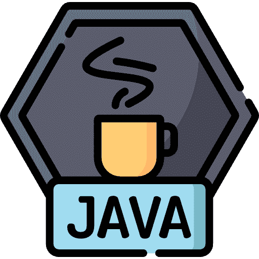

# 轻松学习核心 Java 的技巧

> 原文：<https://medium.com/geekculture/tips-for-learning-core-java-very-easily-2ba7ea509001?source=collection_archive---------25----------------------->

Java 编程可能是最广为人知的编程语言，所以如果你想开始编程生涯，这是一项很好的技能。在这里，我会给你你需要知道的一切，以及你应该如何开始有效地学习。

# 学习基础知识

和任何事情一样，了解 Java 的基础知识是最好的起点。这是你可以马上开始的事情。在线学习基础知识对开始你的 Java 编程有很大的帮助。像许多事情一样，开始时可能会有点让人不知所措。如果你是一个完全的初学者，代码看起来真的很难。请记住，每个人都是从同一点开始的。

# 练习编码

如果你不想学习或练习，你就不会成为一个成功的 Java 程序员。幸运的是，您可以在家练习 Java 编程，而不需要任何花哨的软件或设施，所以最好的办法是一旦掌握了基础知识就开始练习。你如何开始？

# 定期阅读 Java 编程的资料

阅读 Java 编程，就像你现在正在做的，只会让你受益。当然，你的大部分信息来源都可以在网上找到。你会在看起来很棒的网站上获得最新的、定期检查的资源。无论您是 Java 的学生还是自学的 Java 专家，在线资源对您来说都是无价的。

加入一些论坛[(比如这个](http://www.javaprogrammingforums.com/))也是一个好主意，在那里你可以和其他 Java 程序员谈论任何困扰你的问题，或者只是聊聊你有多爱 Java。

# 每天编码

你可以买很多很棒的书来学习 Java。几个世纪以来，书籍一直是保存知识的最佳方式之一。他们会增加你的知识，但他们不能让你成为一个伟大的程序员。根据这个行业的性质，书籍不是最好的选择。你可以查阅一本书来寻找语法，但这将需要足够的时间来搜索它。你可以在很多免费或付费的在线课程上轻松学习 Java，比如 [CodeGym](https://codegym.cc/) 。

# 我什么时候知道我已经准备好开始做基础工作了？

掌握基础并不一定意味着死记硬背语法，不能用它做任何事情。这实际上意味着你能自如地使用关键字，了解语言协议，聪明地使用变量和循环。知道如何根据特定的问题选择数据结构。能够实现面向对象方法，因为 Java 是一种面向对象的语言。了解封装以及如何篡改封装。由于网上有这么多免费的内容，新手最有可能在更短的时间内学到更多。然而，你必须明白这是行不通的。你的知识质量比数量更重要(至少目前如此)。你需要问自己一些问题，以了解你是否准备好开始学习基础知识。

## 你对“排练”熟悉吗？

当你开始编码的时候，错误、错误和阻碍是必然会发生的。面对挑战，不气馁，继续潜水的人是保持不败的人。如果你不明白为什么你的代码没有按照预期的方式运行，有一个传统的方法“试运行”代码。您可以执行一张纸上的指令，并逐行运行代码。最好将每行计算的结果写在输出中，看看它与期望的有什么不同。它将帮助你阅读其他开发人员的代码，经过一段时间后，你一眼就能理解这个问题。

## 你在调试你的代码吗？

通过在调试模式下运行您的程序，您可以在 IDE 中逐个查看每一行的输出。它将帮助您解决程序中可能出现的错误。养成调试的习惯会训练你产生无错的代码。

## 你在构建有意义的代码吗？

学习一门语言而没有建立任何有用的东西将会使你一事无成。最好是通过创建小程序对两个数字或一个基本的计算器进行排序来练习你的编码技能。开发这样的程序将有助于你在现实生活中理解软件。在你擅长这个之后，你可以进入更高的层次，比如从一个文件中获取输入，搜索/排序它的内容。

## 你熟悉标准库吗？

计算机编程中的 [**标准库**](https://en.wikipedia.org/wiki/Standard_library) 是一种编程语言实现中可用的库。这些库通常在编程语言规范中描述；然而，一种语言的相关库的内容也可以由一种语言的社区的更非正式的实践来确定(部分或全部)。

# 结论

如果所有问题的答案都是“是”,那么你就准备好进入这门语言的更高级阶段了。