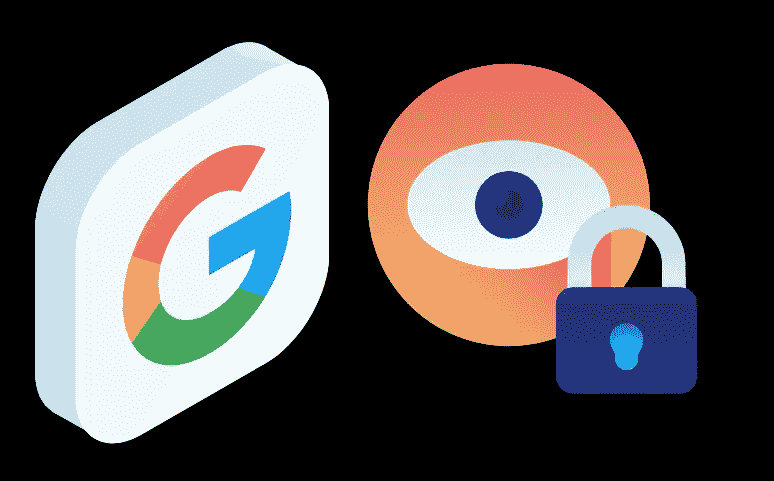

# 管理您的 Google 隐私首选项的提示

> 原文：<https://medium.com/geekculture/tips-for-managing-your-google-privacy-preferences-fea9be5f8d7d?source=collection_archive---------10----------------------->

Photo By [PopularData](http://www.populardata.co)

隐私政策旨在成为你和公司(尤其是大型科技公司)之间的合同，确保这些公司保护你的个人信息。

谷歌是一家可以获取大量数据的公司，这些数据包括从电子邮件和图像到电影和文档的所有内容。