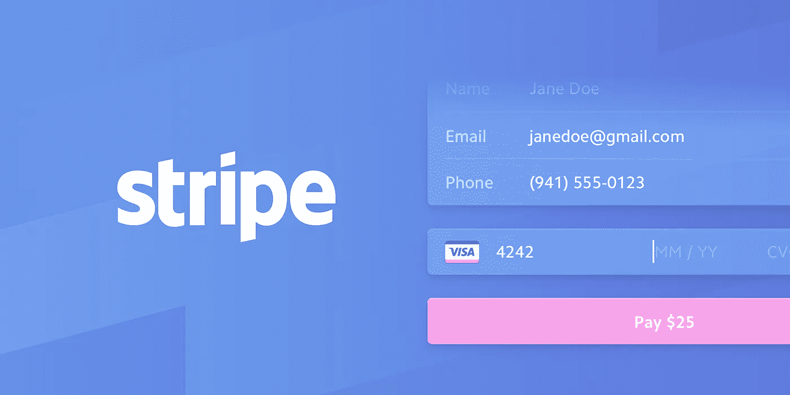
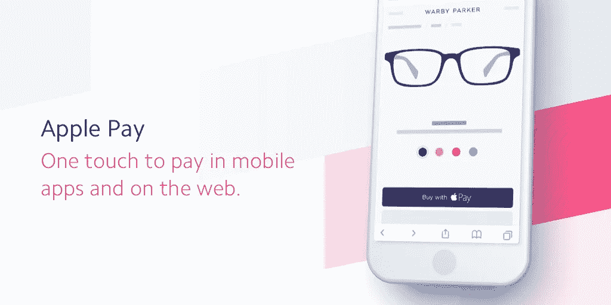
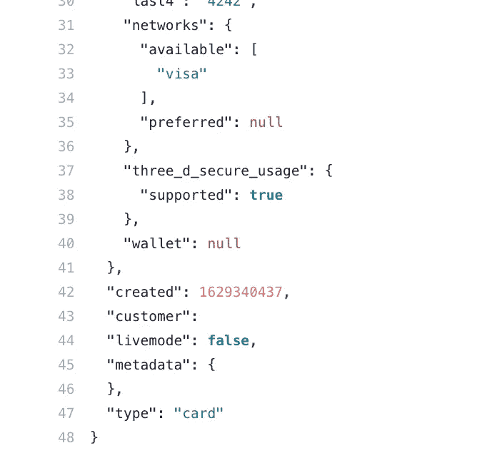
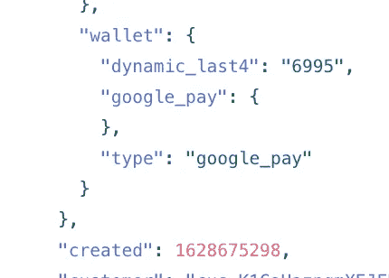
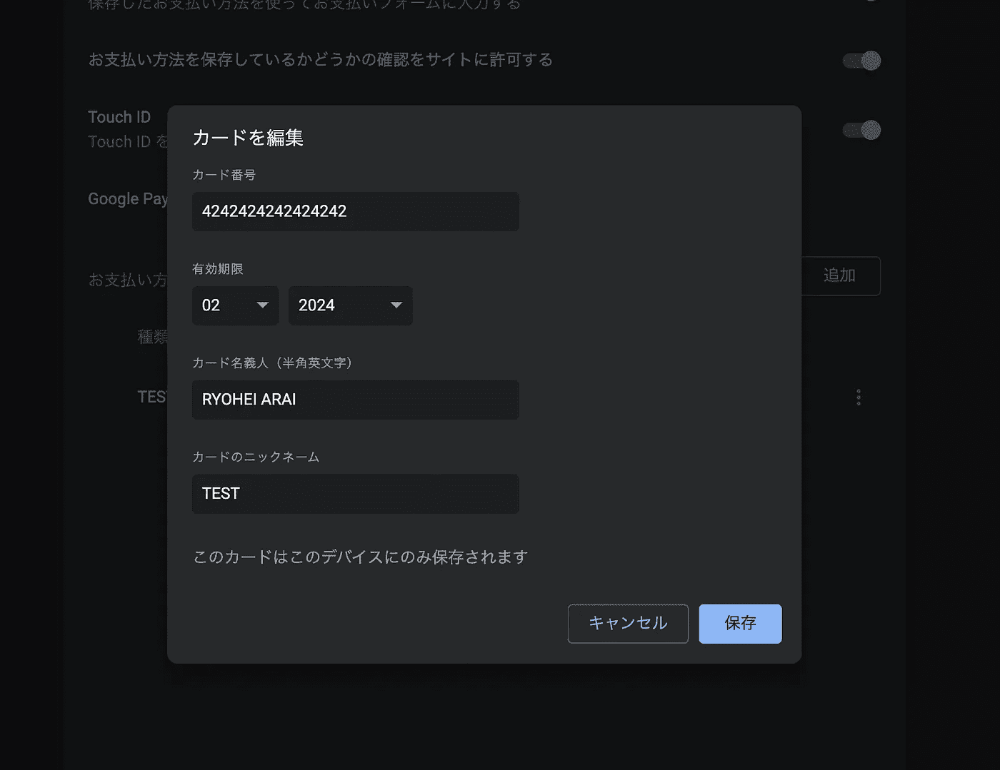
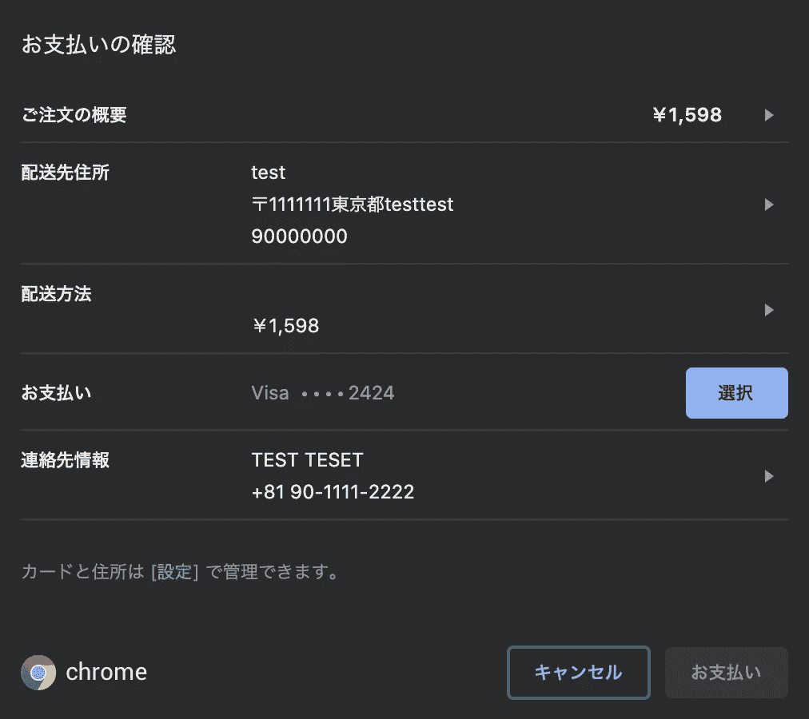
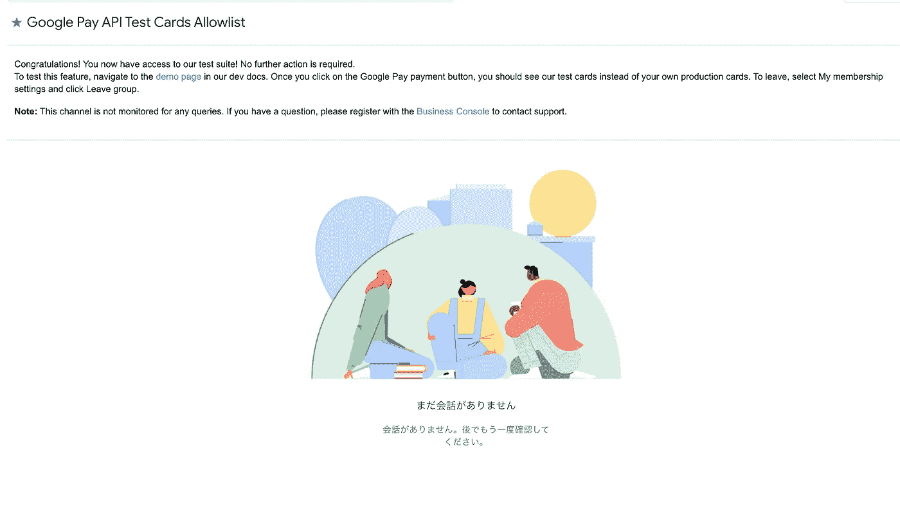
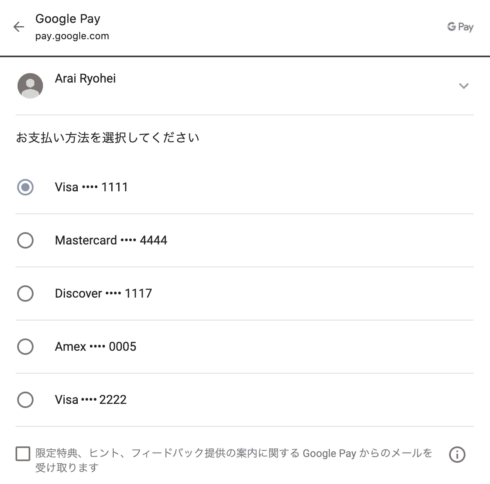
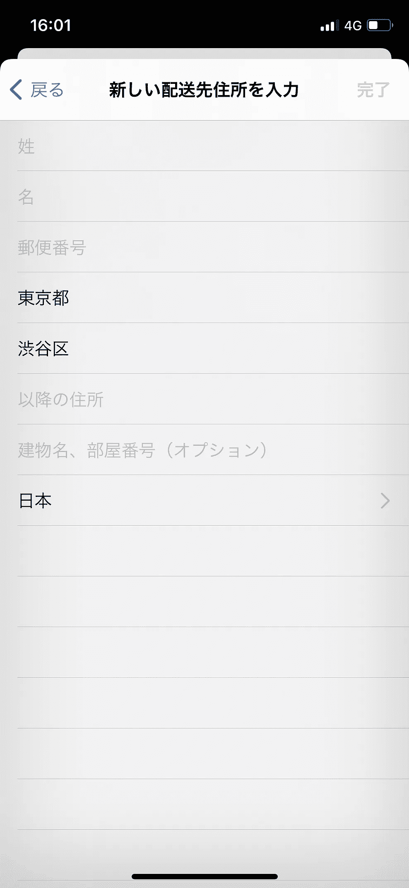
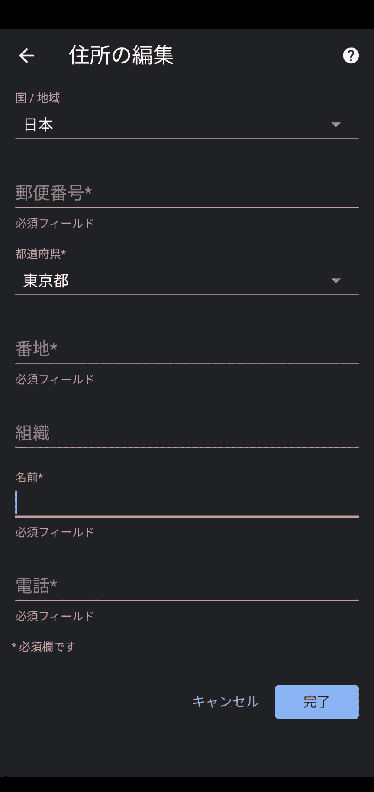

# 关于 Google Pay 和 Apple Pay 使用 Stripe 的提示

> 原文：<https://medium.com/geekculture/tips-on-google-pay-and-apple-pay-with-stripe-3eaaabd6ccab?source=collection_archive---------2----------------------->


Photo by [Blake Wisz](https://unsplash.com/@blakewisz?utm_source=medium&utm_medium=referral) on [Unsplash](https://unsplash.com?utm_source=medium&utm_medium=referral)

## 这是我在实现支付请求按钮时学到的全部内容，这是 Stripe Elements 的一个特性。

这篇文章收集了我到目前为止在研究中偶然发现的东西。我将提供如何使用支付请求按钮测试 Google Pay 和 Apple Pay 的技巧，官方文件中没有写。

# 关于条纹元素



Stripe 元素是丰富的预构建 UI 组件，可帮助您跨桌面和移动设备创建自己的结账流程。

如果您有兴趣了解更多有关如何创建信用卡支付的信息，那么 [Stripe Elements](https://stripe.com/docs/stripe-js) 将帮助您入门。一打开页面，您就会发现 Card Element 提供了一组预构建的 UI 组件。这些组件将帮助您构建一个支付表单，而不用担心处理敏感信息。您可以依靠 Stripe 安全地处理所有这些问题。

对于实际开发细节，[元素-示例](https://github.com/stripe/elements-examples)将是最有帮助的资源之一。

仅供参考，在撰写本文时，有一个名为[条纹支付元素](https://stripe.com/docs/payments/payment-element) 的新功能正在测试中。

根据文件，上面写着:

> Stripe 正在开发一套扩展的可嵌入组件，以帮助您在网络和移动设备上构建定制的支付表单，所有这些都旨在提高您的结账转化率。付款元素是这些新组件中的第一个，它在嵌入到您的结帐页面中的定制 UI 中显示多种付款方式。

此外，我最近加入了他们的用户反馈视频电话，请求测试访问。他们提到今年会有更多的特性被开发并添加到组件中。如果您有兴趣了解即将推出的内容，您可以从[这里](https://stripe.com/docs/payments/payment-element#join-payment-element-beta)注册，请求测试版访问，并通过视频电话向工程师提问。

我听说他们正在开发 Apple Pay，所以它很快就会在组件中可用。条纹支付元素中还有更令人兴奋的东西。我确信这个组件将会减少大量的开发时间，并允许更快的开发。👏



我们现在将进一步研究的实际上是条纹元素功能中的一个，称为[支付请求按钮](https://stripe.com/docs/stripe-js/elements/payment-request-button)，允许用户使用 Apple Pay 和 Google Pay 支付。所有的细节都在那一页上详细说明了，所以我的文章只是帮助你一些没有写在文档中的提示。

# 用卡片测试

> 我不能 100%确信我发现的这些信息是真实的，但是我分享这些信息是因为它们在我的项目中发挥了预期的作用。这都是基于我对付款请求按钮的实验。

## 付款流程

首先，请阅读下面的数字列表，它描述了用户实际上是如何与您的结帐页面中的付款申请按钮进行交互的。

```
1\. Users land on your checkout page where the payment button is.2\. Stripe will automatically show an appropriate Payment Method for users: It could be Apple Pay, Google Pay or other methods, depending on browsers or devices of users.3\. The button is clicked by users.4\. Payment sheet is presented over to the screen where users can click the Pay button.5\. Stripe handles the payment6\. Payment succeeds or fails.
```

通过这种方式，用户与您的支付请求按钮进行交互。

## 设置测试卡

在你开发和测试这些支付方式之前，*确保你设置好你的卡用于测试目的*。

重要的是，在生产和开发环境中，付款请求按钮是不可见的，除非您适当地保存您的卡。只有当您的浏览器检测到您的卡存储在钱包中时，它才可见，这是由支付请求按钮自动完成的。

## 小跟班

将按钮集成到您的应用程序后，用户会看到这些按钮中的一个，这取决于他们的设备和浏览器组合支持的内容。


Image from Stripe Doc

Pay Now 和 Google Pay 的区别只是简单的解释为 Chrome 钱包和 Google Pay 钱包的区别。我看到网上有些人把 Google Pay 误认为是 Pay Now，因为它们是 Google 服务的一部分。

## 付款类型

此外，现在支付是钱包支付的一种，但从技术上来说*不*。这是因为 Stripe 会检索存储在 Chrome 钱包中的信用卡，并使用该信用卡进行支付。如您所见，我们下面的 Stripe 测试环境中的支付意向日志确认它不包含钱包信息。Stripe 只是使用了 Chrome 钱包中保存的卡信息。



如果你用 Apple Pay 或 Google Pay 支付，钱包里要么有 google_pay，要么有 apple_pay。



下面我会解释如何测试 Pay Now，Google Pay，和 Apple Pay。

# 立即支付和 Google Pay

真正的卡不接受创建一个虚拟的购买与谷歌支付和现在支付。请注意，如果您在测试环境中使用真实的卡，Stripe 将会抛出错误，反之亦然。

根据官方教程视频，她提到如果你需要为集成测试一张卡，你需要在开始开发之前在*钱包*中设置你的条纹测试卡。说了这么多，我听着不清楚。我不确定她说的*钱包*是什么意思，因为有两种钱包——chrome 或 Google Pay。

## 切换测试环境

经过一番研究后，我意识到这两种支付方式可以进行不同的测试:

1.  为*立即支付*按钮添加来自`chrome://settings/payments`的条纹测试卡
2.  从[测试卡糖果](https://developers.google.com/pay/api/web/guides/resources/test-card-suite?hl=ja)加入用户组为 *Google Pay* 按钮。

通过我自己的研究和理解，我发现现在支付按钮只有在 chrome 设置的支付中注册了多个支付时才显示和可用，而*最重要的是* *当 Google Pay 中没有存储卡并且您不在群组*中时。这确实起了作用，但我应该说，至少，我观察到它起了作用。

## 1.现在付款

如果你以前有过使用经验，先去`chrome://settings/payments`把`4242 4242 4242 4242`添加到卡号框里，方法和卡元素一样。其他字段，如到期日，姓名和昵称可以是任何随机的。

注册以 4242 开头的条纹测试卡永远不会在 Google Pay 的支付钱包中获得批准。只能在 Chrome 的钱包里用。

> 如果您也想创建一个失败或认证模式，请参考此[页面](https://stripe.com/docs/testing)来测试各种类型的场景。



如果你去你的结帐页面，你应该看到蓝色或紫色的按钮，如下所示。我的环境是日本的，所以文本可能与你的不同，但它的意思是现在支付。箭头应该是动态的。


如果你按下按钮，确认视图就会弹出来。现在，您可以测试“立即支付”按钮👍

如果你想修改卡片或地址信息，你可以在那里做或者直接在 Chrome 设置中修改。



## 2.Google Pay

接下来，如果你想用 Google Pay 测试，首先请加入[用户组](https://developers.google.com/pay/api/web/guides/resources/test-card-suite?hl=ja)。正如医生所说:

> 新的测试卡套件使 Google Pay 开发者能够运行集成和 API 测试，而无需在他们的 Google 帐户中添加真正的信用卡。

你需要做的只是“入群”。在链接页面的底部，您会发现一个可点击的文本，上面写着 join。


Join User Group

加入后，您将被重定向到 Google Pay API 测试卡允许列表页面。注册成功后，无需采取进一步的措施。



Google Pay API Test Cards Allow list

您可以访问此演示页面，在这里您可以检查是否启用了 Google Pay。然而，即使它在那里看起来是启用的，它可能需要几个小时才能在您加入该组后在您的收银台可用。如果它似乎没有出现，只是耐心地等待几个小时，有时会刷新结帐页面。它应该很快就会出现。


Google Pay button

另外，*如果有用户群的话，最好在加入之前先删除 Chrome 钱包里的卡*。

供您参考，当我测试时，我的设置如下:

*   与我的个人资料相关的国家设置为美国(任何国家都可以，但我还没有确认哪个不行)
*   我在谷歌账户支付和 Chrome 支付上都没有注册信用卡。
*   加入了用户组。
*   大约过了一个小时，谷歌支付才出现在我的应用程序中。

> 根据这个回答，自 2021 年 4 月起，Google Pay 为选项时显示 Google Pay。

这意味着如果你在两个钱包中都注册了卡，Google Pay 是默认按钮，因此 Google Pay 应该优先于 Pay Now。我没有测试过这个，所以如果你想了解这个，请尝试一下。

[](https://stackoverflow.com/a/62288698/5790320) [## 将条纹支付请求按钮显示为 Google Pay 按钮

### 感谢贡献一个堆栈溢出的答案！请务必回答问题。提供详细信息并分享…

stackoverflow.com](https://stackoverflow.com/a/62288698/5790320) 

点击 Google Pay 会触发 Google Pay 表单呈现给你。有一个预先注册的测试卡列表，因此您可以选择其中一个来测试您的虚拟购买。



现在你可以测试谷歌支付按钮了👍

## Apple Pay

另一方面，与 Google Pay 或 Pay Now 不同，使用 Apple Pay 进行测试购买需要钱包中的真实卡。Stripe 会检测您所处的环境，因此所有使用开发中的真实卡的交易都不会被计费。StackOverFlow 中一个问题的回答说:

> 苹果不会让你在 Passport 和 iPhone 上加假信用卡的。然而，如果你使用的是 Apple Pay 和你的测试条纹 API 密钥，我们会在发出 Apple Pay 请求时识别这种情况，并返回一个成功的测试卡令牌。要在实时模式下测试支付，你需要使用一张可用的信用卡。

[](https://stackoverflow.com/a/27073235/5790320) [## 如何测试基于 Stripe 的 Apple Pay？

### 被问到想改善这个问题？更新问题，使其成为关于堆栈溢出的主题。4 年前关闭…

stackoverflow.com](https://stackoverflow.com/a/27073235/5790320) 

但是为了激活 Apple Pay，正如这里的[所描述的](https://stripe.com/docs/stripe-js/elements/payment-request-button?html-or-react=html#verifying-your-domain-with-apple-pay)，你需要一些额外的步骤。

1.  下载一个众所周知的文件，并把它放在你的域名下。如果你的域名是[https://domain.com、](https://sennin.mode,)，那么你把下载的文件放在[http://](http://sennin.mode/apple-developer-merchantid-domain-association)[domain.com](https://sennin.mode,)[/apple-developer-merchantid-domain-association](http://sennin.mode/apple-developer-merchantid-domain-association)下(域名是虚拟的)
2.  向 Apple 注册您的域名。你可以在[这里](https://dashboard.stripe.com/account/payments/apple_pay)做这个。

一旦所有步骤完成，你就可以开始测试 Apple Pay 了👍

YouTube 上还发布了一个关于 Apple Pay 集成的详细教程视频。您可以在此登记:

从这里开始，我将解释现在支付、谷歌支付和苹果支付之间的共性。当你测试那些支付方式时，卡信息不是唯一重要的东西；送货地址和支付按钮的设计也是你需要考虑的因素。

# 其他提示

我们已经在上面看到了测试卡。以下是我在研究实施这些支付方式时遇到的其他技巧

## 送货地址。

当你从 Apple Pay 和 Google Pay 提取发货时，我发现地址格式不同。这里需要注意的重要一点是，Google Pay 不提供 line2 或建筑信息。这个地址来自一个句子，所以如果你像实现 Apple Pay 一样实现这个发货部分，它可能会引起一个不受欢迎的错误。



Apple Pay and Google Pay

条带提供事件来侦听更改/更新。您可以使用`shippingaddresschange`事件，然后使用接收到的运输信息，您可以在您的前端或后端正确地解析它。

## 支付

创建购买时，需要在 30 秒内完成支付*，否则失败。如果您遇到了在服务器中支付成功但支付单一直抛出失败错误的错误，建议优化支付流程。顺带一提，用户体验。*

## 式样

这些预建支付方式的设计并不完全灵活，但你可以选择改变颜色、宽度或高度以及类型。类型是按钮的标题。它提供了几个选项供选择——捐赠、预订或购买。

如果你想创建一个可定制的按钮，你可以设计你自己的按钮。在这种情况下，你需要遵循 Apple Pay 的[人机界面指南](https://medium.com/r?url=https%3A%2F%2Fdeveloper.apple.com%2Fapple-pay%2Fweb-human-interface-guidelines%2F])和 Google Pays 的[品牌指南](https://developers.google.com/pay/api/web/guides/brand-guidelines)。

# 结论

我花了大量的时间来理解如何通过付款请求元素以正确的方式测试那些付款方法。看起来网上的人也在纠结如何测试，尤其是在 Google Pay 和 Pay Now 周围。我希望这篇文章有助于开发人员社区，并帮助那些正在经历同样情况的人。

如果你觉得我的文章有帮助，可以推荐给你的朋友，请为我鼓掌！这让我更有动力分享我的学习。🙌

(如果您希望向我发送提示🙂☕️)
-以太坊地址
0x 45 b 8 c 8712159 be fab 29 C3 B1 e 97 b 4534272 ADF 31