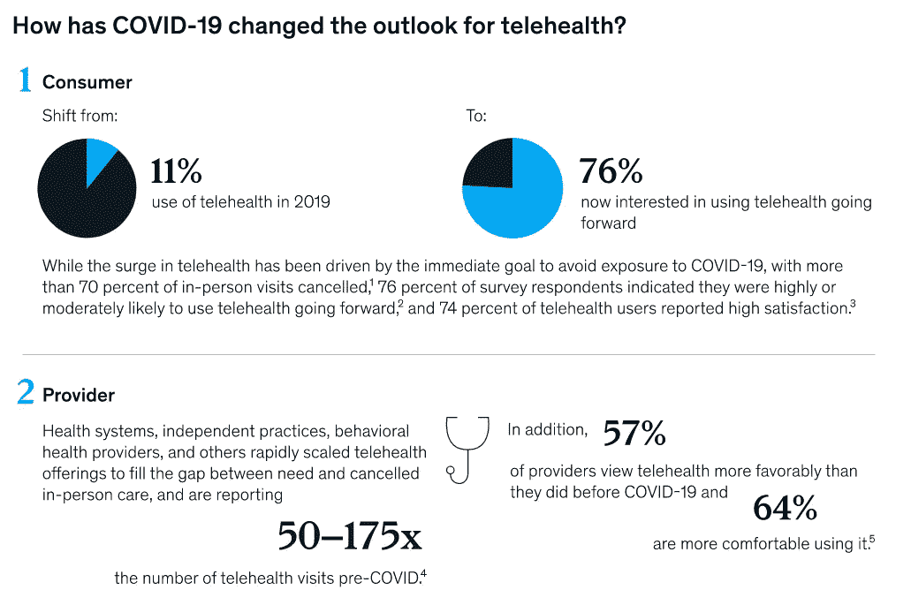

# 设计远程医疗应用程序的技巧

> 原文：<https://medium.com/geekculture/tips-to-design-a-telemedicine-app-2fdd20bb5912?source=collection_archive---------43----------------------->

去年，我们都目睹了全世界医疗服务的短缺。不幸的是，COVID 疫情证明了医疗保健行业距离 IT 技术的全球采用还有多远。然而，世界卫生组织发布的特别文件反映了对这种迫切必要性的认识。世卫组织表示，远程医疗是当今需要发展的基本服务之一。

COVID lockdowns 的严峻形势使许多人改变了他们对远程医疗服务的看法。来自麦肯锡的[统计数据](https://www.mckinsey.com/industries/healthcare-systems-and-services/our-insights/telehealth-a-quarter-trillion-dollar-post-covid-19-reality)显示，远程医疗保健的软件解决方案有史以来需求量最大。

从一般意义上来说，远程医疗意味着某种远程医疗援助。因此，远程医疗解决方案有可能覆盖大量受众。基于网络和移动的应用为远程医疗提供了大量的机会。用户友好的远程医疗应用程序应具备哪些关键功能？如何开发这样的解决方案？在下面找到我们设计远程医疗应用的技巧。

# 远程医疗的工作方式和地点

当患者既没有机会也没有必要亲自去看医生时，远程医疗是一个不错的解决方案。合适的用例多种多样:

*   发烧病人很难到达远处的医院；
*   健康问题似乎不太危险，病人只需要咨询医生；
*   你所在的地区出现自然灾害(飓风、地震、洪水等)，当地医院挤满了受害者；
*   另一次封锁是为了阻止你亲自去看医生；
*   你在离家很远的地方面临健康问题，去见你的家庭医生不会有什么问题；
*   一些棘手的病例需要外国医院的著名医学专家的第二意见；
*   你需要立即会见几个不同的专家，而不用排队等候；
*   医生想要将诊断与最新的在线医学证据数据等进行交叉引用。

这不是远程医疗可以提供的机会的完整列表。他们真的很多。但最关键的特征可能被定义为:你确信你的“本地”医生(比任何人都更了解你的健康状况的人)总是可用的。省时省力，显著提高生活质量。

# 远程医疗的利与弊

除了上述远程医疗提供的便利之外，大多数用户最常提到的一些明确的优点是:

1.  **省时**。有了远程医疗应用程序，医生的预约几乎可以立即进行，而花时间搜索医院也变得没有必要。
2.  **可达性**。要获得专业护理，你需要的只是互联网。“纸”时代固有的许多医学博士似乎是多余的。
3.  **低成本**。由于没有与候诊室相关的有形设施，在线医疗咨询的费用大大低于亲自去诊所。
4.  **扩大患者基数**。病人和医生的位置并不重要，海外专家变得和隔壁的医生一样容易找到。

尽管远程医疗的好处显而易见，但也存在一些与该技术相关的具体问题:

*   与医生的情感接触较差；
*   向某些第三方披露私人病历的风险；
*   有机会面对无执照的服务，甚至巫医；
*   无法通过网络摄像头全面评估患者的状况。

尽管远程医疗的优点明显多于其可能的缺点，但这种方法可能会受到开发不良的软件解决方案的影响。为了避免这种悲惨的结果，远程医疗应用程序的结构和设计都应该根据下面描述的必备功能来创建。

# 远程医疗应用的功能

当开发者关注由某个客户预先定义的特定能力时，远程医疗解决方案可能在某种程度上有所不同。然而，有一组强制功能，没有这些功能，任何远程医疗应用程序都难以满足用户的期望。一般来说，这些功能可以分为三个主要部分。

# 1.患者相关特征

它们反映了患者在使用远程医疗应用程序时所处理的内容。

*   **报名**。注册功能必须包括先进的用户认证技术，因为该程序意味着传输敏感的个人数据。短信，电话号码，双因素认证，人脸识别，指纹，和其他现代信息技术的成就值得使用。
*   **剖面图**。填写长表单不太可能带来良好的用户体验。患者应该能够通过几次点击上传他们的医疗记录。
*   **搜索**。为了帮助患者选择合适的专家，在搜索部分应该提供一些选择标准:医生的专业、医院的远近、明显的症状、患者的反馈(医生的评价)等。
*   **约会**。这是一个类似日历的功能，为患者提供根据可用医生的时间表来预约他们的预约。批准和确认可以通过 web 推送通知或 SMS 来实现。
*   **沟通**。远程通信技术构成了远程医疗的本质。视频会议和类似 messenger 的聊天应该通过基于网络的平台和移动平台提供实时在线会议。
*   **付款**。可靠的支付网关以及易于跟踪的支付历史使患者能够接受并欣赏远程医疗解决方案的货币化方式。

# 2.医生相关特征

医生和医疗保健组织反映了硬币的另一面。医生部分的功能与患者相关的功能没有太大的不同。然而，存在一定的特异性。

*   **简介**。医生要填写的表单应该有必要的上传选项来表示相关的文档，如执照、文凭、证书和其他证明医生资格的关键信息。
*   **预约管理**。该功能应该为医生提供调度工具，以选择和批准所有预约。包括来自患者的自动请求。
*   **记录**。该科使医生能够访问各种数据库，如病人简介、医院记录、调查表等。
*   **通讯**。该功能与患者可用的功能相同。
*   **EHR 整合**。医生应该能够访问电子健康记录系统，以核实病人的病史。当记录可以与视频会议一起观看时，该选项意味着一定的操作灵活性。

# 3.管理面板

在使用远程医疗应用程序时，患者和医生都可能面临技术问题。他们都会犯操作上的错误。为了给所有用户提供流畅的用户体验，管理员应该有特殊的管理功能来控制和支持整个应用程序的功能。否则，解决方案的货币化很难成功。

*   **管理员档案**。用户应该知道谁控制和调节所有的应用内数据。此外，不同级别的敏感信息访问权限值得安排。该部分显示了管理员任务中固有的责任范围。
*   **档案管理**。该选项使管理员能够查看和调节患者和医生个人资料中的信息。删除违反服务策略的用户的帐户的能力对于保持远程医疗解决方案的可信性是很重要的。
*   **分析**。有必要从技术角度和营销业绩两方面评估远程医疗应用。即使是最简单的关于有多少病人注册了远程医疗服务的数据也能告诉我们很多关于应用程序性能的信息。
*   **管理通知**患者和医生都应该被及时告知关于更新、新特征、即将到来的事件、特别优惠以及与远程医疗服务的工作流程相关的任何其他事情。推送通知似乎适合这个目的。

# 远程医疗应用程序的用户界面/UX 设计

远程医疗应用的可行性直接取决于所提供的用户体验，而用户体验又取决于用户界面的设计。远程医疗应用程序的用户界面/UX 设计应在解决方案的原型设计阶段充分考虑。下面列出了远程医疗应用程序的正确 UI/UX 设计的一些关键方面。

1.  **易于掌握的入职培训**。可以合理地说，远程医疗服务的很大一部分潜在用户似乎不太擅长信息技术。许多年轻人不太懂技术，更不用说对医疗保健需求更强烈的老一辈人了。因此，开发人员应该关注让用户尽可能直观地加入。像用户保留率这样重要的指标与入职流程的可掌握程度直接相关。
2.  **可用性**。为了实现他们的目标，用户需要知道用户界面的所有元素是如何工作的。设计师应该让所有按钮和图标的功能显而易见，不言自明。用户应该根据清晰的 UI 布局的结构和内容轻松地点击、选择和滑动 UI 元素。
3.  **简化搜索**。如果用户能够不费吹灰之力找到他们需要的东西，他们就会对应用程序感到满意。关键是要用一切可以让查找任何信息变得容易的东西来促进搜索功能:关键词搜索、二维码等。
4.  **减少用户输入**。在注册期间要上传的各种用户数据以及填写表格中的信息可能会对用户构成挑战，尤其是当他们使用移动版本的远程医疗应用程序时。因此，UI/UX 设计者的任务意味着在尽可能减少各种用户输入的同时保持服务的安全性。
5.  **个性化**。尽管个性化成为当代营销人员的一个花哨的咒语，但这种属性的重要性很难被高估。它为用户提供最相关的用户体验。应用程序 UI 中的个性化选项越多，应用程序在用户眼中就越独特。

# 结论

如今的“新常态”生活方式需要利用 IT 技术开发各种远程解决方案。远程医疗应用正在引领潮流。尽管远程医疗的影响可能多种多样，但任何[远程医疗解决方案](https://angle2.agency/cases/telemedecine/)都有一系列必备的固有特性。

但是远程医疗应用的结构要素本身不可能导致远程医疗的广泛采用。远程医疗服务的正确用户界面/UX 设计可以决定患者和医生是否认为所提供的用户体验足够吸引人，从而继续使用该应用程序。

只有当逻辑、导航、布局、个性化和所有其他 UI/UX 方面满足用户的期望时，任何远程医疗应用程序才显得用户友好。它们应该在应用程序原型的最初阶段就被考虑在内。这就是有经验的远程医疗解决方案开发者需要发挥作用的时候了。

[立即联系我们](https://angle2.agency/contact/)获得您的远程医疗服务想法的帮助，该服务可以根据时代精神开发，并具有深厚的远程医疗专业知识背景。

*原载于 2021 年 6 月 10 日*[*https://angle 2 . agency*](https://angle2.agency/tips-to-design-telemedicine-app/)*。*