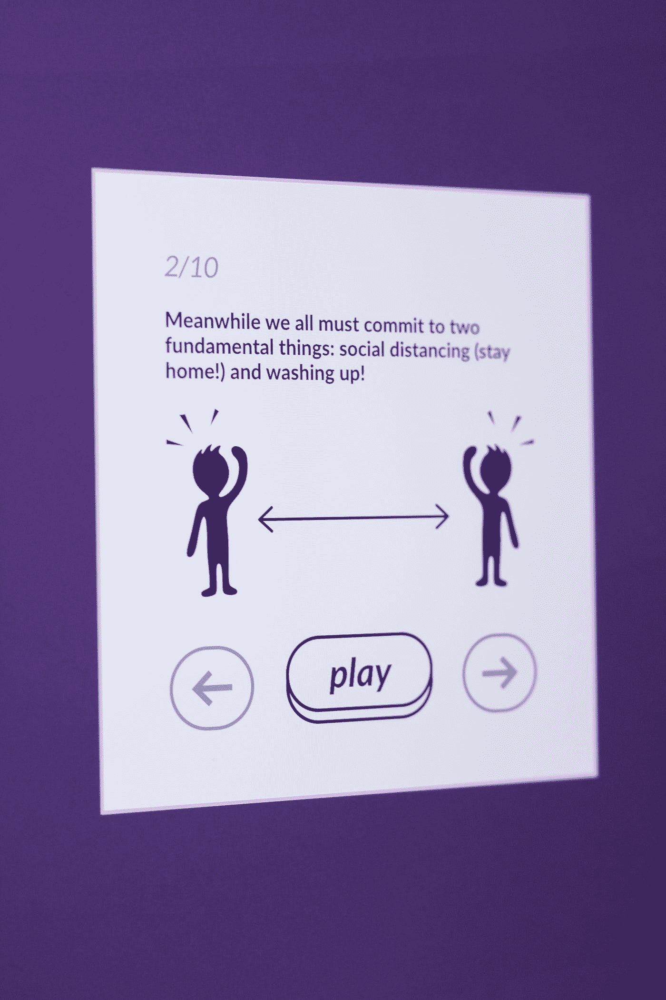

# 改进用户界面设计的技巧

> 原文：<https://medium.com/geekculture/tips-to-improve-ui-design-2fee4c41a9c4?source=collection_archive---------15----------------------->

## 好的设计都是为了解决问题！

Photo by [KOBU Agency](https://unsplash.com/@kobuagency?utm_source=medium&utm_medium=referral) on [Unsplash](https://unsplash.com?utm_source=medium&utm_medium=referral)

UI(用户界面)设计是创建用户界面的外观和感觉，它是软件或网站的一部分，用户可以看到并与之交互。一个设计良好的 UI 可以让一个糟糕或平庸的产品看起来不错，帮助用户更有效地导航和使用系统。