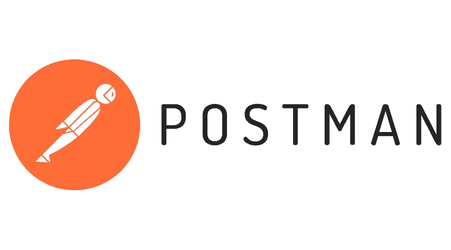
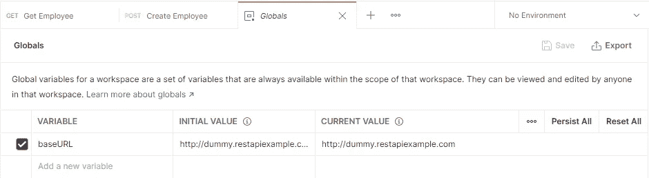
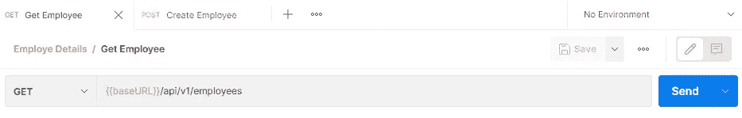
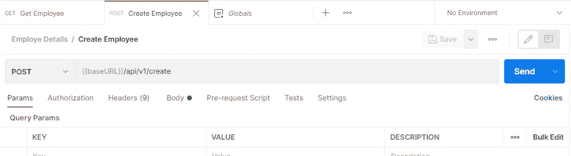
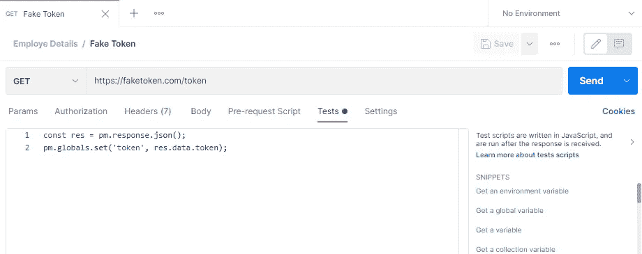
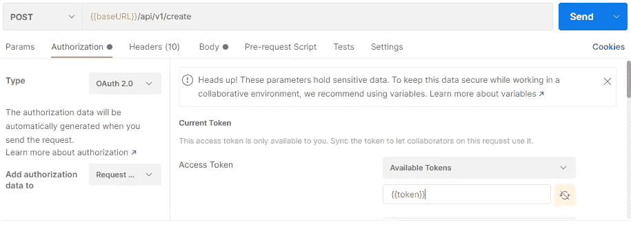

# 更好更方便地使用 Postman 的提示

> 原文：<https://medium.com/geekculture/tips-to-use-postman-better-and-easier-7f3c4ede5d4e?source=collection_archive---------24----------------------->

这篇文章的目的是展示 postman 的一些不为很多用户所知的特性。

# 第一个技巧:使用变量

使用 postman 中的变量特性，您可以将一个值存储到一个变量中，并在请求中重用该变量。这样做的好处是，如果需要更新值，只需在一个地方进行更改。假设您有一组用于获取、添加、编辑和删除员工详细信息的 API，并且所有请求都有相同的基本 URL，可以存储在 postman 变量中并为每个请求重用。

## 创建变量的步骤

*   单击 Postman 右上角的环境快速查看(眼睛按钮),然后单击全局旁边的编辑。
*   添加一个名为 baseURL 的变量，并给它一个初始值[http://dummy.restapiexample.com](http://dummy.restapiexample.com)点击保存并关闭环境模式。

*   打开一个新的请求选项卡，输入*{ { base URL } }/API/v1/employees*作为 URL。将鼠标悬停在变量名上，您将看到值。

*   为另一个 API 重用相同的 baseURL 变量来创建员工详细信息

# **第二个技巧:运行脚本**

我们可以基于 API 的响应运行脚本；例如，一些 API 需要一个授权令牌，我们必须生成令牌并将其放在 API 授权上。这些令牌在特定时间后过期，需要再次重新执行该过程以进行另一个授权的 API 调用。但是 postman 有一个隐藏的功能，我们可以运行脚本并自动完成这个过程，比如每次创建新令牌时在授权时放置一个令牌。它可以通过编写一个脚本来实现自动化，该脚本在一个变量上设置新创建的令牌，并将该变量置于授权状态。

## 编写脚本的步骤

*   打开请求并在 Tests 选项卡中输入您的脚本。脚本将在请求运行后执行。
*   在我们的示例中，我们编写了一个脚本来从令牌生成 API 获取令牌，并将其设置到名为 token 的 postman 变量中。

*   然后我们切换到 Authorization 选项卡，将之前通过脚本生成的变量放在访问令牌上。

# 结论

感谢您的阅读。我希望你已经发现这是有帮助的，并且觉得使用 Postman 更容易。