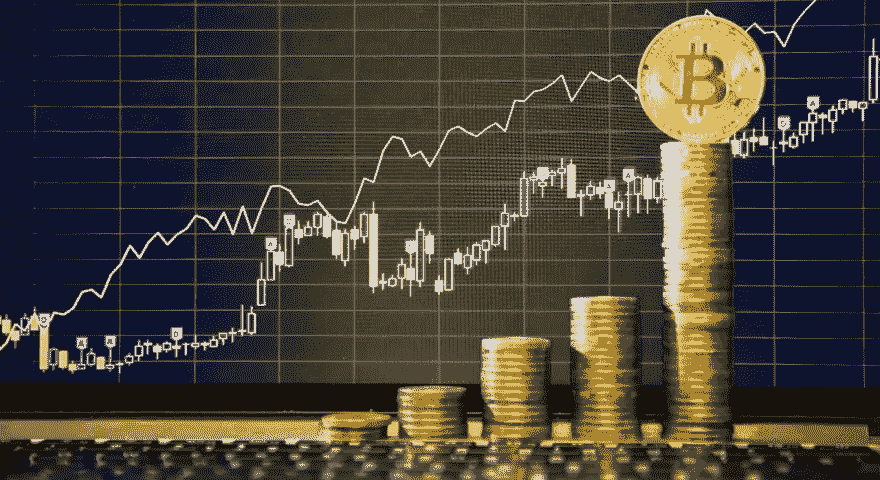

# 加密货币投资者的技巧和工具

> 原文：<https://medium.com/geekculture/tips-tools-for-cryptocurrency-investors-5ff20685d9f8?source=collection_archive---------20----------------------->

## 以最佳价格购买，赚取被动收入，最小化风险，…

当谈到投资加密货币时，人们可能会有点迷失。

区块链和投资都是复杂的话题。为了在这片丛林中闯出一条路，并最终成为一名成功的投资者，我相信遵循最佳实践和使用高效工具很重要。

在一个简短的系列文章中，我结合专家的见解和我个人的实地经验，分享了我对区块链和加密货币的了解。

在这篇文章中，你会发现:

1.  **投资最佳实践**最小化风险，做出理性决策。
2.  **工具**到以最佳利率购买加密货币，通过赚取被动收入来增加资产，甚至使用加密友好的 VISA 卡以加密货币支付。
3.  **补充提示&工具**在你作为加密货币投资者的旅程中可能有用。

我还写了一篇关于如何保证加密货币安全的补充文章，重点是加密货币钱包和安全最佳实践。

无论你是一个新手还是已经在游戏中，我希望这能帮助你在密码世界的旅程！

# 投资最佳 practices⭐

以下是投资加密货币时需要牢记的几条准则。

> ***1。不要把所有的鸡蛋放在一个篮子里***

投资一种加密货币是有风险的。如果这个项目因为任何原因失败了，它会导致你失去所有的初始投资。**通过投资几种不同的加密货币使你的投资组合多样化**可以防止这种情况发生。

还要记住的是，**已经存在很长时间并证明了其稳健性的加密货币通常“更安全”**(例如比特币、以太坊)。你可以在 T21 的货币市场网上查询这一信息。

此外，**将投资分散到加密货币**之外的其他项目，如 [RealT](https://realt.co/ref/YannD/) 、 [Republic](http://republic.co/note/i/thmy3v) 或 [Seedrs](https://www.seedrs.com/signup?promo_code=8ZXG497T) 也可能是明智的(更多细节参见上一节)。

> ***2。提出自己的看法***

为什么这个项目很有前景？它解决什么问题？商业模式是否稳健？什么是令牌实用程序？这个项目背后的团队是谁？有竞争对手吗？支持合作伙伴？

在做出任何投资决策之前，这些问题都是相关的，可以通过进行[基本面分析](https://academy.binance.com/en/articles/a-guide-to-cryptocurrency-fundamental-analysis)来回答。

> ***3。保持理智***

由情绪主导的投资决策可能代价高昂。

在这方面，意识到经典的认知偏差[如锚定效应、FOMO(害怕错过)和损失厌恶可以防止采取适得其反的行动。](https://www.magellangroup.com.au/insights/10-cognitive-biases-that-can-lead-to-investment-mistakes/)

此外，使用市场指标(如恐惧和贪婪指数、社会指数……)可以帮助退一步，做出更理性的决定——对于比特币，可以使用[scrap ex 指数](https://scalpexindex.com/app)应用。

# 回顾我最喜欢的工具💡

为了正常工作，一个优秀的机械师也需要合适的工具。这里列出了我最喜欢的投资工具，我用它们以最优惠的价格购买加密货币，通过赚取被动收入来增加我的资产，甚至用加密友好的 VISA 卡支付加密货币。

> [***Crypto.com***](http://crypto.com)***(手机 app)***

在我看来，这是最好的起点。

✅ **优点**:用户友好的手机应用；收费低；每年为你的资产赚取高达 15%的利息(被动收益)；加密友好的 VISA 卡，返现高达 8%(参见[卡计划](https://crypto.com/en/cards.html))；高安全级别(与[总账](https://shop.ledger.com/?r=795240e8c7c7)合作)。

📛**缺点**:保管(集中)。

🎁加盟奖励—通过使用我的代码 **7nhae26fv** 在注册时获得 25 美元

> ****【网络平台】****

*一个完整的解决方案，既适合主动交易者，也适合“持有者”(被动投资者)。*

**

*✅ **优点**:有多种加密货币和服务可供选择，多种被动收入选择(贷款、赌博、农业、联营……)；加密友好的 VISA 卡，返现高达 8%。*

*📛**缺点**:保管。*

*🎁会员奖励——通过这个[链接](https://accounts.binance.com/en/register?ref=WPBYWVU3)注册，在你的交易中获得 10%的回扣。*

> *[***瑞士堡***](https://join.swissborg.com/r/yannIQ4K) ***(手机 app)****

*以最佳价格购买加密货币。*

**

*✅ **优点**:人性化的手机 app 人工智能驱动的工具，保证最佳的价格/比率(智能引擎&智能产量)；透明流程(交易跟踪模块)。*

*📛**缺点**:保管，可用的加密货币对数量有限。*

*🎁会员奖励——通过此[链接](https://join.swissborg.com/r/yannIQ4K)注册，赢取高达 100€的比特币(欢迎礼物)。*

**注:瑞士堡还开发了一个二级移动应用程序(* ***瑞士堡社区应用程序*** *)，你可以在那里玩预测比特币价格走势，并最终获得奖励(请随意使用我的注册码:****RGONEJI****)**

> *****【网络平台】*****

**美好的老比特币基地…我确实喜欢它的比特币基地特色。**

****

**✅ **优点**:用 **Coinbase Ear** n ( [恒星流明(XLM)](https://coinbase.com/earn/xlm/invite/z537msw1) 、[复合(COMP)](https://coinbase.com/earn/comp/invite/xm2679ck) 、[波段协议(BAND](https://coinbase.com/earn/band/invite/k8vr5t26) )、 [EOS (EOS)](https://coinbase.com/earn/eos/invite/rfy01kqh) )学习的同时赚取加密奖励；通过卡加密友好；方便用户。**

**📛缺点:保管费用比市场标准高。**

**🎁会员奖励—通过此[链接](https://www.coinbase.com/join/delclo_8)注册，赢取 10 美元(欢迎礼物)。**

> **[***PrimeXBT***](https://primexbt.com/?signup=225750)***(网络平台)*****

**排名第一的比特币交易平台。**

****

**✅ **优点**:模仿优秀的交易者，获得相同的回报。**

**📛**缺点**:保管，只针对比特币。**

# **补充工具和提示🚀**

**更多提示和工具可能对您的旅程有用。**

> *****分散投资*****

**[**RealT**](https://realt.co/ref/YannD/)**—**区块链提供动力的房地产:购买物业股份/代币(~ 50 美元/代币)，获得稳定的每周租金支付，而无需担心物业管理。**

**[**共和国**](http://republic.co/note/i/thmy3v) 和 [**Seedrs**](https://www.seedrs.com/signup?promo_code=8ZXG497T) —股权众筹投资你相信的项目或初创企业(20 美元起)，分享他们的成功。**

> *****网络&网购*****

**[**勇敢**](https://brave.com/) —基于区块链的网络浏览器:**私人**(区块追踪器、非必要的 cookies 和添加)、**安全**(通过升级 HTTPS 的网站来提高安全性)、**快速**(与其他网络浏览器包括 Chrome、Safari 和 Mozilla Firefox 相比速度更快)和**奖励**(通过允许尊重隐私的添加来获得加密奖励)。**

**[**折**](https://use.foldapp.com/r/KLUMKATT) 和 [**萝莉**](https://lolli.com/ref/CiGzRFGayV)——在网上购物时赚取高达 30%的比特币返现。**

> *****空投*****

**获得免费加密！**

**空投是指**加密项目提供免费令牌**，有时以执行特定操作作为交换(例如，在社交网络上共享项目，邀请一些朋友等等)。**

****

**➡️看看目前市面上可用的空投: [airdrops.io](http://airdrops.io) 、 [free-crypto](https://free-crypto.io/) 、 [airdrop alert](https://airdropalert.com/) 。**

***我希望你喜欢这篇文章！***

***如果是这样，请不要犹豫，分享您的反馈*👏**

***联系人:*[*LinkedIn*](https://www.linkedin.com/in/yann-delclos/)*或* [*脸书*](https://www.facebook.com/yann.delclos.9/) *。***

*****免责声明*** *:本文内容基于个人观点，不建立任何理财推荐。你只对你过去和未来的投资负责。***