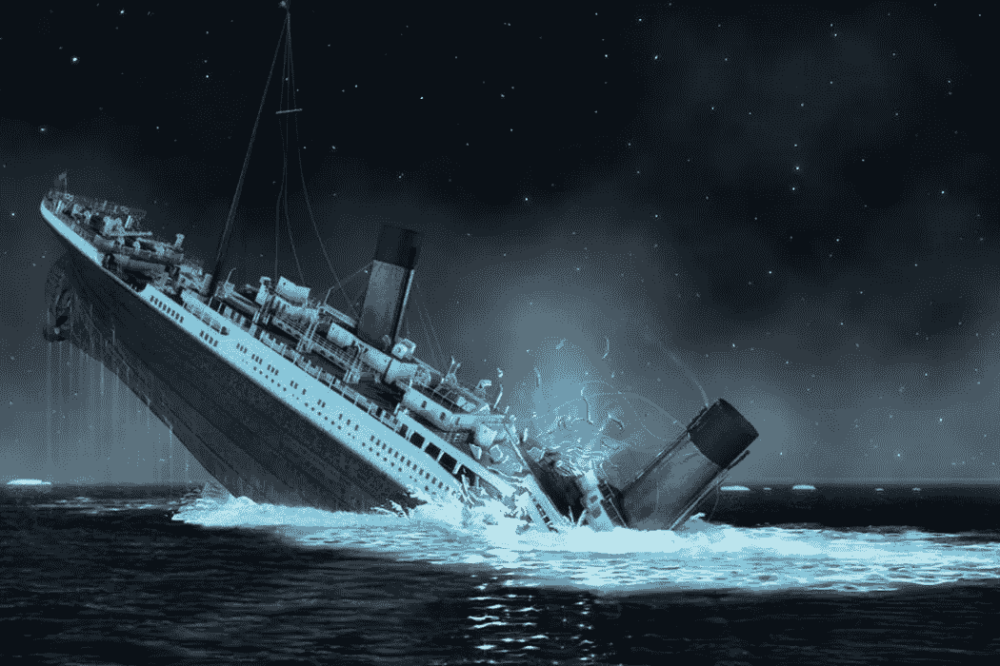
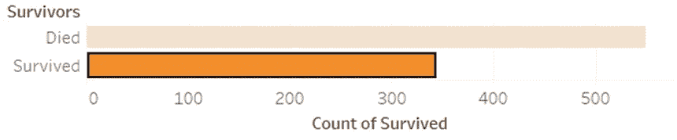
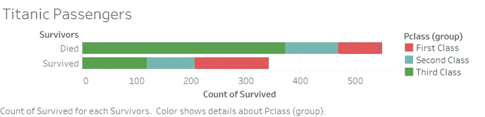
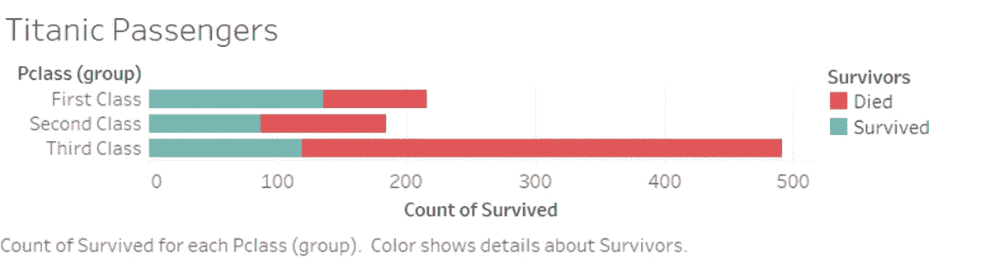
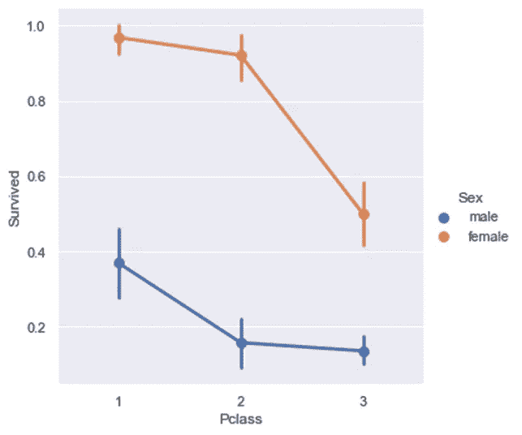
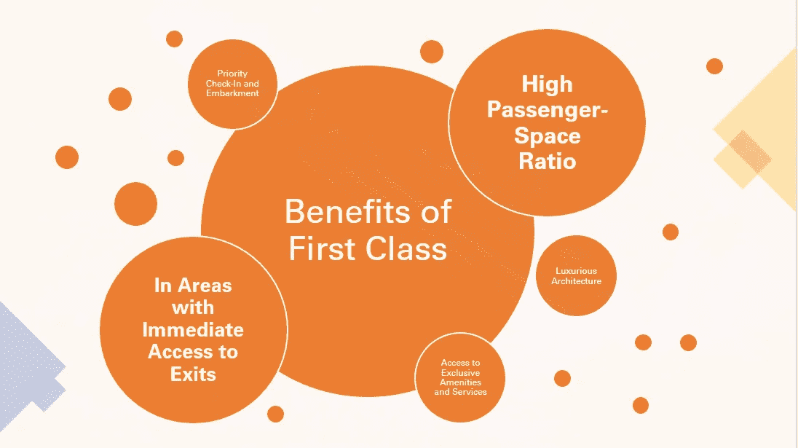
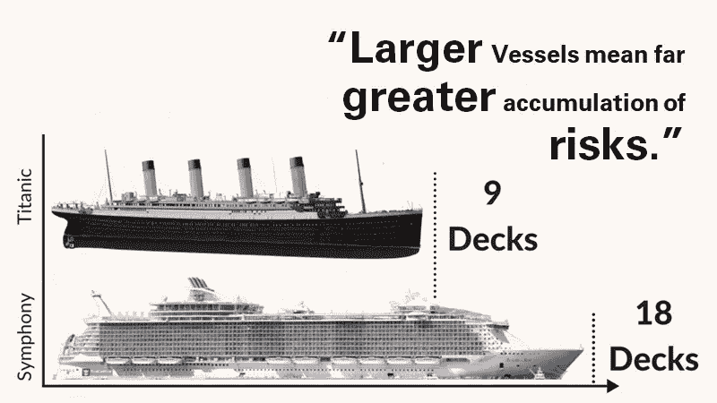
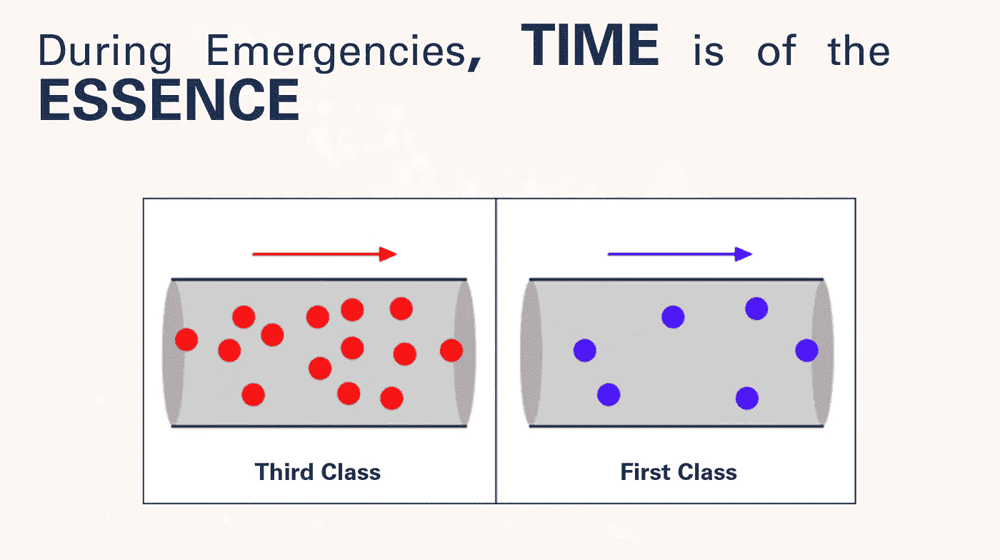

# 泰坦尼克号和现代游轮

> 原文：<https://medium.com/geekculture/titanic-and-modern-cruise-ships-80f8091e3e1c?source=collection_archive---------21----------------------->

## 了解过去—准备未来

> “不了解历史的人注定会重复历史”——埃德蒙·伯克

# 这艘船

**泰坦尼克号**是由白星航运公司运营的最豪华的蒸汽客轮之一，也被认为是世界上最快的**船。**作为当时世界上最大的可移动人造物体，骄傲的船长爱德华·约翰·史密斯给媒体留下了一句标志性的话，“ ***连上帝自己也不能击沉这艘船。”***

# **悲剧**

Photo from the National Geographic Channel

1912 年 4 月 15 日，不沉的泰坦尼克号在未能从冰山上偏离航道并导致至少五个船舱破裂后沉没。

# 幸存者

从这个[链接](https://github.com/awesomedata/awesome-public-datasets)中提供的一个开放数据集，以下是关于这场悲剧的一些信息:

泰坦尼克号上只有 38.38%的乘客幸存。

**没有幸存**的乘客大部分来自**三等舱乘客**死亡，这个数字比幸存者总数还多。

从好的一面来看，头等舱乘客总数的 62.9%幸免于难，而且大多数幸存者来自头等舱。

不分性别，选对阶层影响生存几率。

根据 2010 年 3 月发表的名为“探索泰坦尼克号和卢西塔尼亚号灾难的自然生存本能和内化社会规范的相互作用”的[研究](https://www.pnas.org/content/early/2010/02/17/0911303107.abstract)，泰坦尼克号的船员执行“妇女和儿童优先”的命令。为什么数据显示女性比男性有更多的机会在泰坦尼克号上幸存。

# 第一类和生存

为了获得最大的奢华体验，人们倾向于选择头等舱。在所有这些好处中，较高的乘客空间比例和可以直接到达出口(包括救生艇)的区域是为什么有很高比例的头等舱乘客在泰坦尼克号上幸存的主要原因。

**乘客空间比**是每个乘客的封闭空间，以立方英尺为单位，这意味着更高的比例意味着更大的空间，这使得乘客对悲剧的反应更快更容易。

同时，头等舱战略性地位于宽敞的区域，方便使用便利设施和开放区域，作为他们的逃生之路。

# **现代舰船**

根据本[网站](https://emmacruises.com/cruise-ships-vs-titanic-size/)作者所做的对比，现代游轮已经是泰坦尼克号的两倍大，而根据这篇[文章](https://www.agcs.allianz.com/news-and-insights/expert-risk-articles/larger-vessels-bigger-losses)，货船和游轮越大，积累的风险就越大。

为了弥补这一风险，国际安全标准正在实施，如强制性应急演习，以及超过 100%的救生艇和救生衣容量供船员和乘客使用。

尽管如此，头等舱/贵宾舱/豪华舱在紧急情况下仍然有明显的生存优势，仅仅是因为乘客空间比率高。

假设图像是甲板上走廊或通道的俯视图，圆点代表乘客数量。拥挤可能导致恐慌状态下踩踏或阻塞，从而导致更高的风险。 ***在突发事件中，时间至关重要。***

# **论据**

在最坏的情况下，头等车厢在整体存活率上有明显的优势，因为它们有很高的乘客空间比和重要的位置。在后泰坦尼克时代，有一些预防和应急措施正在实施，以弥补更大船只带来的额外风险。还实施安全标准以确保机组人员和乘客的安全。