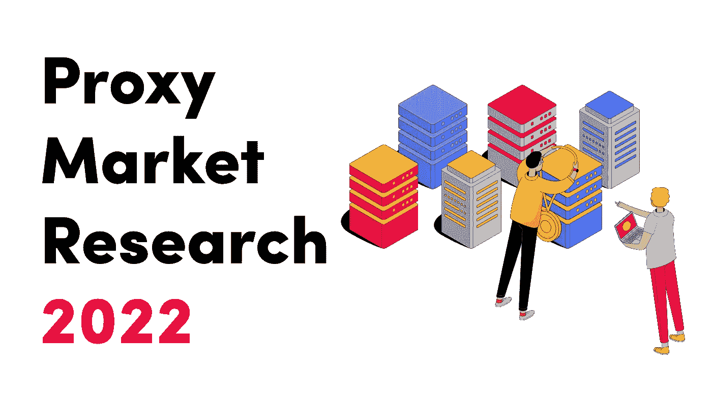
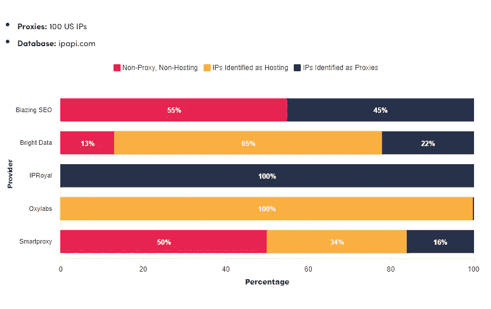
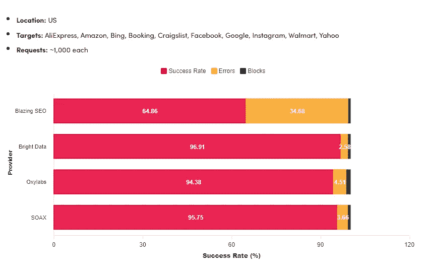
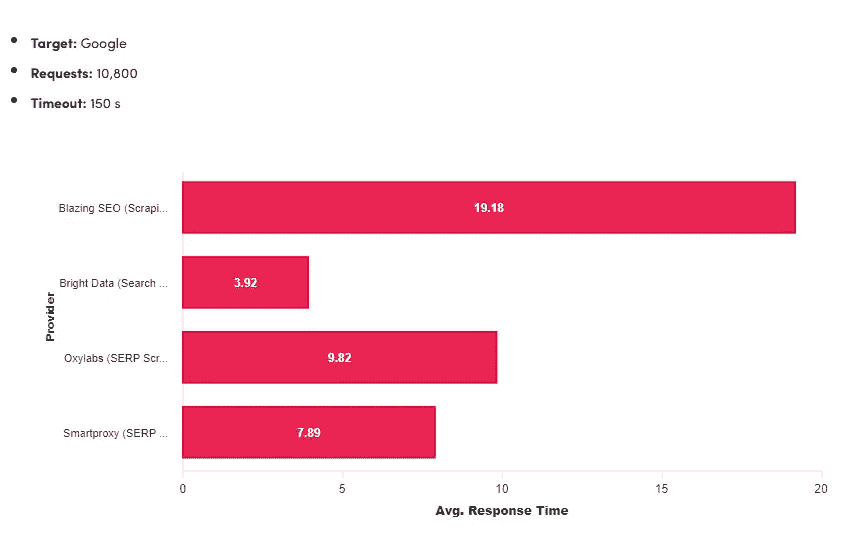

# TLDR——Proxy way 2022 年代理服务市场报告摘要

> 原文：<https://medium.com/geekculture/tldr-recap-of-proxyways-2022-proxy-service-market-report-a0f58fd1dc8e?source=collection_archive---------4----------------------->

Image licensed from Shutterstock

当一家公司想要在网络竞争中保持领先时，该怎么做呢？许多人转向代理服务，以便在收集网络数据、分析数据以及根据经验证的数据优化他们的活动和产品列表时保持隐蔽。然而，即使市场上有如此多的选择，哪种代理服务最适合您的个人业务需求？

在过去的 4 年里， **ProxyWay** 每年都在扩大其**代理市场报告**，该报告深入研究了所有顶级代理提供商。《2022 年代理市场报告》是一篇文章的**巨作(超过 13000 字)，读完它可能比完成*挖掘海量数据集*证书课程更具挑战性。**

该报告还包括全面的图表和直观的排名辅助工具，但我们认为其中一些可能无法准确反映报告中包含的数据，并可能以这种或那种方式影响读者。

在本帖中，我们将解读该报告中的一些发现，并帮助您决定哪种代理服务最适合您的组织。无论您是数据分析团队负责人、高级开发人员还是数据工程师，我们认为在选择提供商之前，理解本报告的主要观点至关重要。

# 代理服务 2022 年市场亮点

## 专用数据中心代理

*   数据中心和住宅代理仍然是最受欢迎的代理类型

## 住宅代理

*   **Bright Data、Oxylabs 和 Smartproxy** 仍然是最佳的整体住宅代理网络提供商，其中 Bright Data 拥有**最大的月度用户 IP 池。**

## 移动代理

*   移动代理仍然比住宅 IP 贵得多，而且提供商之间的差异也没有其他类型的代理那么明显。

## 基于代理的 web 抓取 API

*   Proxyway 测试了五个领先的基于代理的[**Google SERP API**](https://brightdata.com/products/serp-api)并得出结论，Bright Data 的工具表现出最佳性能，每 1000 个请求的成本为 3.18 美元，并支持 CSV 输出类型。

## 用户体验和计费

*   NetNut 和 Bright Data 拥有最全面的仪表板使用图表，而 Smartproxy 提供了最好的整体用户体验。

Image courtesy of Proxyway

# 代理服务测试结果摘要

2022 Proxyway 报告比较了多达 11 种代理服务。然而，美国司法部后来关闭了 Rsocks 代理提供商，因为它使用了从被黑客攻击的 PC、手机和物联网设备中窃取的 IP 地址。

非常方便的是，这留给我们一个**十大代理服务列表**，剩下的代理服务提供商是:

*   亮眼的数据
*   炽热的搜索引擎优化*
*   地理表面
*   IPRoyal
*   网络螺母
*   氧化实验室
*   分组流
*   智能代理
*   移动装置
*   SOAX

Proxyway 使用定制的 web 抓取脚本运行了自动化性能测试，以收集有关上述代理提供商的数据。他们用来自 [MaxMind](https://www.maxmind.com/en/home) 和其他 IP 数据库的额外信息丰富了数据集，并使用[数字海洋速度测试](http://speedtest-fra1.digitalocean.com/)对代理的连接速度进行了基准测试。

**自报告发布以来，炽燃 SEO 已更名为*[*Rayobyte*](https://rayobyte.com/)*，但我们仍将使用它们的旧名称来称呼它们，以免读者与图表混淆。*

# 专用数据中心代理报告摘要

*   数据中心代理是代理服务器用户的首选，因为它们提供稳定的性能、入门级价格和可用性。测试数据中心代理有其挑战性，因为同一组 IP 在不同网站上的表现可能不尽相同。
*   专用的数据中心代理拥有所有代理类型中最好的原始规格，但他们与检查 IP 信誉的网站斗争最激烈。
*   Proxyway 测试了几个数据中心代理服务。炽燃 SEO 和 Oxylabs 在测试中表现极为出色。其他人遇到了一些问题，但总体而言，大多数领先的代理服务都提供高质量的数据中心代理。
*   在大多数测试中，结果不受 IP 地址黑名单状态的影响，无论是因为目标网站利用不同的数据，还是因为他们选择不阻止仅基于此变量的 IP。
*   使用 Bright Data 和 Oxylabs 可以选择最多的国家和城市，而 blazing SEO 允许您从仪表板中选择城市。
*   数据中心代理的定价通常很简单:你购买一定数量的 IP，按单位付费，想用多少就用多少。然而，明亮的数据允许许多定制，从流量到线程，刷新和连接质量。
*   大多数数据中心代理服务按 IP 收费，而 Bright Data 提供了**最具创新性的** [**代理网络定价**](https://brightdata.com/pricing/proxy-network) 模式。
*   IPRoyal 和 Smartproxy 被认为是以价值为导向的提供商，以较低的价格计划来弥补其有限的功能。炽热的搜索引擎优化更是一个平衡的供应商，提供了相当数量的 IP 位置和功能，价格不是最低的，但涵盖了整个范围，性能非常好。

见下图显示的代理识别测试结果为炽燃 SEO，明亮的数据，IPRoyal。Oxylabs 和 Smartproxy 数据中心 IPs。“被识别为代理的 IP”的百分比越高，这些 IP 池对于网页抓取和其他使用情形就越不可靠。

Image courtesy of Proxyway

# 住宅代理报告摘要

*   因为住宅代理池总是在变化，所以很难随着时间的推移来衡量它们的大小。在服务中寻找的最重要的特征是它在世界范围内和高价值位置具有的唯一 IP 地址的数量。
*   住宅代理性能基准测试回答了四个问题:连接到目标网站时代理基础设施的可靠性如何，建立这样的连接需要多长时间，以及代理基础设施处理流量带宽的能力如何？
*   10 个供应商中有 9 个能够达到 90%以上的成功率，这表明如今代理公司拥有比以往任何时候都更加强大的基础设施。
*   响应时间取决于 IP 位置，使用 Oxylabs 和 Bright Data residential proxies 可以将响应时间提高 3 倍。Smartproxy 和 NetNut 稍微慢一点，大约 2-2.5 秒。
*   大多数失败的请求是由于连接错误，主要是超时。最难对付的两个网站是谷歌和亚马逊，它们以误导性的 200 个错误代码和 429 个验证码的形式造成了最多的屏蔽。
*   每一个被测试的代理服务都支持粘性会话，有些，像**光明数据**，比其他的提供更多的灵活性。一些提供商对端口收费，每五分钟轮换一次 IP，而其他提供商则每分钟轮换一次，或者只要可用就轮换。
*   根据这份报告，一半的供应商不支持 [**足球**](https://securityintelligence.com/posts/socks-proxy-primer-what-is-socks5-and-why-should-you-use-it/) 足球，大部分是在评估了利益和风险后选择反对的老牌公司。Proxyway 同意 HTTPS 提供更好的安全性和速度的结论，这要归功于其卓越的数据压缩。
*   住宅代理比移动或 ISP 代理便宜，但比专用数据中心 IP 昂贵。它们通常以数据有限的包月方式提供。
*   现收现付计划仍然很少，大多数提供商坚持订阅模式。Bright Data 巧妙地结合了这两种策略，与之前客户在达到更高的月承诺水平之前支付的溢价相比，最近将其现收现付率降低了近 40%。
*   总之，即使是最便宜的住宅代理也表现相对较好。主要差异体现在代理池的规模和质量上，其中 **Oxylabs 和 Bright Data** 仍然主导着市场。

请参见下面的住宅代理压力测试性能结果，红色显示正常成功率，黄色显示“压力”成功率。Bright Data、SOAX、Smartproxy 和 Blazing SEO 代理在“压力下”茁壮成长。

Image courtesy of Proxyway

# 移动代理报告摘要

*   很少有提供商提供基于对等的移动代理。上面列出的代理服务中，只有四家提供这些服务——flashing SEO、Bright Data、Oxylabs 和 SOAX。
*   移动代理具有与住宅 IP 类似的特征，只是它们连接到移动运营商 ASN，而不是固定线路 ISP 网络。
*   尽管 Oxylabs 宣传其拥有最大的移动代理池，但其全球唯一 IP 的实际数量要少一些，并不比 Bright Data 的大多少。
*   被测试的移动代理必须经过与住宅 IP 网络相同的基准测试。四个网络中有三个有近乎完美的成功率，只有出色的 SEO 有一些性能问题。
*   明亮的数据和 Oxylabs 代理比炽热的 SEO 和 [SOAX](https://soax.com/?r=cUgaoF3u) 快好几倍。
*   连接错误，而不是阻塞，实际上是流行网站上移动代理的主要问题。
*   针对特定位置的能力、IP 轮换和认证选择是移动代理服务的特色。 **Bright Data 和 Oxylabs 拥有最灵活的轮转**设置，而 SOAX 并不支持每个连接请求的轮转。
*   尽管基于流量的代理是最昂贵的 [**代理类型**](https://brightdata.com/proxy-types) ，但它们的价格通常比所有其他代理类型都高出很多。基于流量的订阅占主导地位，只有**光明数据提供无限数据计划。**
*   由于移动代理提供商存在市场缺陷，一种新的、竞争性的移动代理技术被引入市场。这是一种基于加密狗的移动代理技术，使用内置 SIM 卡的 u 盘。本次大赛中值得一提的一家公司是[proxy size](https://proxidize.com/)。然而，值得注意的是，移动代理具有某些优势，如 IP 位置的多样性或**大规模自动化的实现。**

见下图的移动代理请求成功率测试结果，明亮的数据有最少的错误和领先的网站封锁。

Image courtesy of Proxyway

# 基于代理的 Web 抓取 API 报告摘要

*   谷歌测试了四个基于代理的 API——flashing SEO、Bright Data、Oxylabs 和 Smartproxy。测试集中在性能、特性、集成、解析和价格计划上。
*   基于代理的 web 抓取 API 将 web 抓取的复杂性简化为更简单的发送 API 调用和接收返回数据的形式。它们确保 100%的成功率、快速的返回时间和大规模的数据收集。
*   所有提供商都能够及时检索数据，并且 Bright Data 的速度是竞争对手的两倍。炽热的搜索引擎优化工具花了将近五倍的时间返回结果。
*   面向搜索引擎的抓取工具通常被称为[**SERP API**](/nerd-for-tech/5-serp-apis-that-can-beat-google-at-their-own-game-665b86aa822c)，被 SEO 专家用来从搜索引擎中提取 SERP 数据。他们还通过谷歌购物、酒店、评论等提供品牌保护和电子商务情报。
*   四个工具中有三个支持 SEO 本地化，并允许修改设备签名以模拟移动查询。只有光明数据和 Oxylabs 支持按需查询和结果交付。
*   最实惠的 SERP 抓取服务是炽烈 SEO 的抓取机器人。高级提供商 Bright Data 和 Oxylabs 有更多的功能和更好的性能，而 Smartproxy 提供更低的价格，代价是 webhooks 和批处理请求。

下图显示了平均值。Proxyway 测试的 4 个主要 Google SERP APIs 的响应时间。

Image courtesy of Proxyway

# 用户体验和计费报告摘要

*   代理网络的用户体验是至关重要的，并且可以由可用的支付选项和帮助与代理网络一起工作的工具来确定。
*   大多数代理提供商提供自助服务，但 GeoSurf 要求所有客户都经历一个销售过程。
*   Bright Data 和 NetNut 提供了最详细的代理网络使用统计数据，而 IPRoyal 只提供了一个包含流量带宽支出的文本字段。六个代理服务使所有人都可以访问它们的 API，但是企业客户可能会得到不同的条件。
*   最流行的代理支持工具是代理浏览器扩展和代理检查器。Oxylabs 的代理旋转器是其数据中心代理计划的高级服务插件，Blazing SEO 和 Bright Data 的代理管理工具覆盖更多服务，Bright Data 的[代理管理器](https://github.com/luminati-io)更加实用和可定制。
*   最好的代理提供商拥有强大的文档，这在客户的整个生命周期中都很有用。Bright Data、GeoSurf 和 Oxylabs 提供了最好的文档，而 IPRoyal 和 Blazing SEO 在这方面仍然缺乏。
*   客户支持对于代理服务非常重要，尤其是如果用户的项目依赖于代理网络的高正常运行时间。高级服务提供商通过实时聊天或电子邮件雇佣 24/7 支持团队，而 NetNut、SOAX 和 Packetstream 等一些提供商存在支持覆盖缺口或仅在关键问题期间提供支持。

# 结论

分析该报告，我们的结论如下:

*   **光明数据**是最好的优质代理服务
*   **Smartproxy** 是领先的中级代理服务
*   **IPRoyal** 是廉价代理服务的首选

我们希望这份报告有助于教育代理服务用户，并为这个经常受到审查和不受监管的市场带来急需的透明度。我们感谢 [Proxyway](https://proxyway.com/) 的持续奉献和保持公正和准确的努力，尽管他们自己公开分享他们使用代理附属链接来赞助和维护他们的服务。