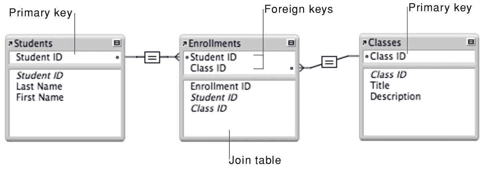
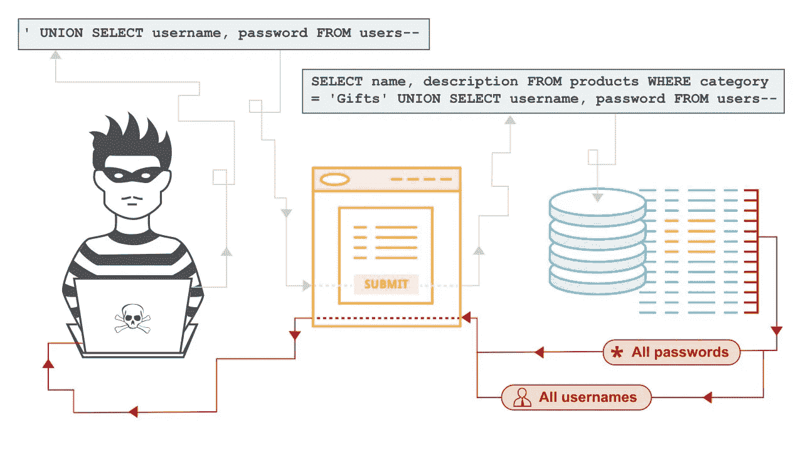

# 抽象还是不抽象:ORM 问题

> 原文：<https://medium.com/geekculture/to-abstract-or-not-to-abstract-the-orm-question-8b2f6d4e264?source=collection_archive---------11----------------------->

Norwegian Mythical Sea ORM :)

这是我在 Flatiron 完成 SE 训练营后，为了温习一些结构知识而撰写的一系列博客文章的第 2 部分。今天我想谈谈 ORM。ORM 或对象关系映射器在当今开发人员使用的许多编程语言中很常见。仅举几个例子，Java、Javascript、Python、PHP 和 Ruby 都有多个可供它们使用的 ORM 软件包。那么 ORM 除了和缩写还有什么？简而言之，ORM 是一种特定于编程语言的工具，它允许开发人员与数据库进行交互，而不必编写 SQL 查询。

既然我们正在复习，SQL(结构化查询语言)是一种特定于领域的语言，旨在管理关系数据库管理系统(RDBMS)中保存的数据。RDBMS 是一种非常常见的数据库结构形式，用于面向对象的编程语言中。在 Flatiron，我们学习 Ruby、Javascript 和 React 堆栈。Ruby 中对象的一个例子可能是学生。学生有许多属性，包括名和姓。学生将通过加入注册对象与类对象相关联。将通过数据库主键属性引用学生。注册对象是这个关系中的一个参与者，它将通过外键属性维护其与班级和学生的数据库关联。这里有更多关于面向对象编程的信息。

ORMs 作为一种工具存在是因为 SQL 作为一种语言不是面向对象的。SQL 以各种整数或字符串格式存储数据，数据组织在一个表中。因此，作为一名 Ruby 程序员，我必须将对象及其值/属性转换成适合 SQL 查询的格式，以便存储到数据库中，然后当我想从数据库中检索它们时，再将它们转换回对象。SQL 查询就是从数据库中访问、添加和检索信息的过程。为了简化工作流程，创建了工作流表单。Ruby 的一个更流行的 ORM 叫做活动记录。ORM 的设计抽象了解构和重建与 SQL 查询中传递的数据库相关联的对象的工作流。

抽象是面向对象编程中的一个关键概念，当 ORM 处理复杂的对象重构、解构和来自用户的 SQL 查询时。有些人认为用户没有必要看到或参与这个过程。在训练营，我们的首席教官经常把这些时刻描述为“红宝石魔法”。作为一名训练营的学生，当我刚刚开始思考什么是对象或数据库时，没有陷入 SQL 查询的复杂性是很有帮助的。现在，作为一名训练营的毕业生，我将回归基础，重温那些神奇的时刻，以便更好地理解在这些抽象概念下发生的事情。

尽管 ORM 很方便，但在当今的技术世界中，反对它们及其实现的案例越来越多。虽然阵营仍然存在分歧，但一些技术人员从一个更成问题的角度看待 ORM。反对 ORM 的一些更大的理由是它们:

1.  是一个漏洞百出的抽象概念。不管 ORM 有多有效，随着数据库查询变得越来越复杂，开发人员都不可避免地需要学习 SQL。
2.  产生自满的开发人员，他们依赖 ORM 的抽象，而不是原始 SQL 查询的知识和能力。
3.  通过添加库和软件依赖来产生膨胀的代码库。这些依赖关系也必须被维护和更新以正常运行，并且在一个没有被维护的情况下，开发者将必须跟踪哪个版本与其他版本一起工作。

我收集的许多观点来自于这篇博客文章，这篇文章也在 Reddit [上引发了关于这个问题的讨论。提出的许多论点是正确的，但往往过于简单。原始 SQL 查询比任何主流语言 ORM 都更高效、更强大。虽然说了很多次，但这些非常强大的查询在许多开发人员的日常生活中并不是必需的。许多开发人员通过 CRUD 功能之一与数据库进行交互。主流编程语言的形式将会被很多人使用，因此会被照看和维护。原始 SQL 查询在过去也有严重的安全问题，比如](https://www.reddit.com/r/programming/comments/7a84jf/the_case_against_orms/) [SQL 注入](https://portswigger.net/web-security/sql-injection)。

支持抽象的另一个要点是技术债务。如果开发了一个代码库，并被一堆非常复杂的原始 SQL 查询所困扰，新开发人员会发现他们花了更多的时间去理解 SQL 查询做了什么，而不是编写新的代码。因此，尽管我认为反对 ORM 的观点在很多方面都是正确的，但作为一名成长中的开发人员，我的目标是找到一个中间地带。我写这篇博客是为了学习更多关于 ORMs 的知识，这将不可避免地引导我学习更多关于 SQL 查询的知识。这些都是积极的，将加深我作为开发人员的成长，并提高我的技能，以考虑到在任何给定项目中跟随我的开发人员。

资源:

 [## ActiveRecord::Base

### 活动记录对象不直接指定它们的属性，而是用…从表定义中推断它们

api.rubyonrails.org](https://api.rubyonrails.org/classes/ActiveRecord/Base.html)  [## 对象关系映射

### 计算机科学中的对象关系映射(ORM、O/RM 和 O/R 映射工具)是一种编程技术，用于

en.wikipedia.org](https://en.wikipedia.org/wiki/Object%E2%80%93relational_mapping)  [## 面向初学者的 OOP 概念:什么是抽象？

### 抽象是面向对象编程(OOP)语言的关键概念之一。它的主要目标是处理…

stackify.com](https://stackify.com/oop-concept-abstraction/) 

[https://portswigger.net/web-security/sql-injection](https://portswigger.net/web-security/sql-injection)