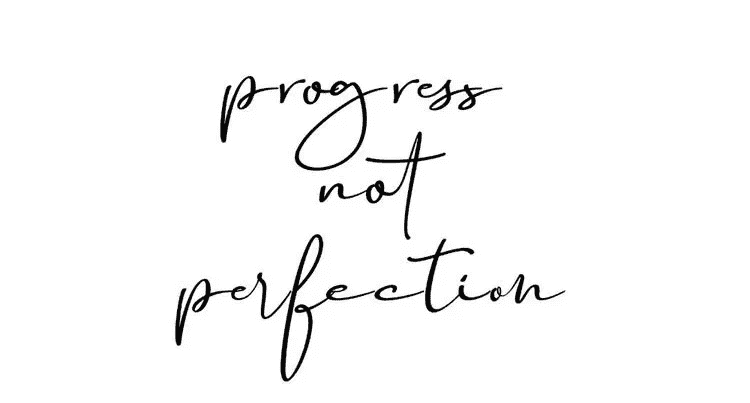

# 为🥂的新开端干杯

> 原文：<https://medium.com/geekculture/to-new-beginnings-7e69553f30fa?source=collection_archive---------11----------------------->

大家新年快乐。

2021 年是一段有起有落的有趣旅程。我们仍然处于疫情的最前沿，随着虚张声势的 COVID 变体的续集不断展开，但最重要的是我们已经走了这么远🎉

有些人已经制定了决心和个人发展计划，有些人仍在从上一年中寻求突破，并试图进入新的一年。

不管情况如何，新的一年和新的一周提供了积极改变的机会，以及翻开新的一页或持续一致的能力。

# 记得进步超越完美✨

今年，我试图更专注于技术写作、开源贡献，并获得更多关于我的技术堆栈(Java、React JS)的知识。我还将展示我在 AWS EB、S3 和 EC2 实例方面的经验，并努力加深我在该领域的知识。

我已经开始了我的#100daysofcode 挑战，现在主要关注 Springboot Java，因为我一直在使用 Spring，但是我还没有完全掌握它😅

但是，嘿，我祝你今年一切顺利，并留意我的内容(我会更加努力保持一致*小指承诺*😄).

你可以在#100daysofchallenge 上关注我的推文

⬇️⬇️⬇️⬇️⬇️

[https://twitter.com/afi_maame/status/1478463553686360071?s=20](https://twitter.com/afi_maame/status/1478463553686360071?s=20)

下次再见，注意安全，需要时请休息，保重。

#2022 #java #SpringbootJava #tech

图片来源:Pinterest