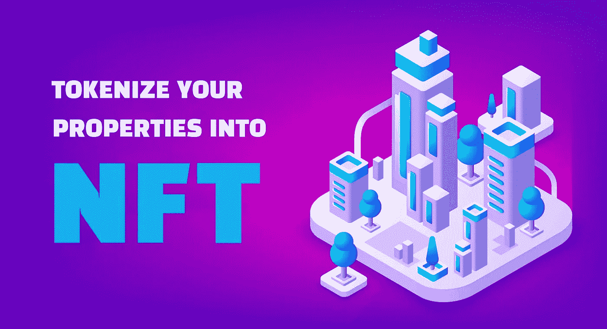
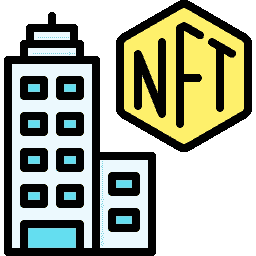
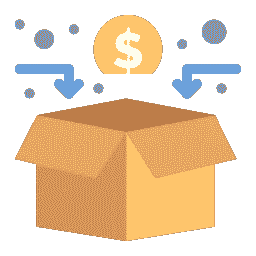

# 将房地产表征为 NFTs——未来的一种可能选择

> 原文：<https://medium.com/geekculture/tokenize-real-estate-as-nfts-a-possible-option-for-the-future-ebf0914685ee?source=collection_archive---------19----------------------->

大多数人将房地产视为长期投资的一个选择，就像黄金和宝石一样。但是，他们有较高的准入门槛和大量的法律法规。不可替代代币是一种相对较新的投资类型，最初专注于数字艺术形式。人们对这种代币持怀疑态度。NFT 世界一直期待着这两个极端的合作，通过房地产资产的象征化，这可能很快就会成为现实。在这篇博客中，我们将看到这将如何发生，以及可以获得什么好处。

# 房地产令牌化

[**房地产代币化**](https://bit.ly/3RJA21W) 就是铸造一个房地产资产的多个代币，并在市场门户中出售，就像股票市场中的公司股票一样。这个过程被称为证券化。

财产作为一个条目存在于区块链中，当代币被出售时，所有权细节被记录。

这种令牌可以是真实世界(EA)中的总资产、真实世界财产的一部分(部分所有权或 FO)、拥有一些项目的房地产公司的股份，甚至是虚拟世界(即元宇宙)中资产的一部分。

# 房地产筹资(STO)

还可以为正在建设或初步规划的项目创建房地产令牌。这种代币可以作为投机资产，投资者可以在施工期间或施工后卖出足够的代币。有时，它们也可以作为实用程序令牌，在项目运行后会带来一些好处。

但是，在有人可以出售购买的代币之前，这种基于 NFT 的建设项目将有一段时间的上限。

通过基于房地产的 NFTs 筹集资本，因为这种代币具有证券支持的特征(这里指资产或其一部分)，所以它们被称为证券化代币。销售过程被称为安全令牌产品(sto)或令牌化资产产品(Tao)。

# 房地产流入 NFT——这是怎么发生的？

尽管由于其目前鲜为人知的性质和现实世界中对房地产资产的规定，该过程可能看起来令人困惑，但将房地产资产转换为不可替代代币的过程很容易。我们可以通过下面的步骤大致了解一下这个过程:

🔸首先，需要找到需要进行令牌化 的 [**属性。这包括寻找满足某些因素的资产，如项目类型、股东类型、地点和法律管辖权，以及需要遵循的相关法规。**](https://bit.ly/3RJA21W)

🔸然后，一个人必须参与到项目的法律结构中来，提出针对具体财产的法规，并生成智能合同。根据他们的情况，可以采取各种法律手段。

🔸然后，应该选择能够满足他们各方面需求的区块链，包括安全性。代币可以通过项目自己的代币门户或与其他交易所的合作关系发行。

🔸在分发代币之前，应该采取良好的宣传活动，以便项目能够达到更广泛的基础，从而产生更多的投资者。

🔸在这之后，就可以完成出售代币的最后一步了。在出售代币时，确保你接受多个钱包和加密货币，以便在世界各地拥有大量投资者。

🔸作为一种习惯性的姿态，与投资者保持良好的关系是非常重要的，因此，应该推出一个专业的客户支持门户网站，并给予支持。

# 投资 NFT 房地产的好处

尽管基于区块链的令牌是一个相对较新的应用，但房地产令牌化可以说有很多好处，下面给出了其中的一些好处:

🔹将房地产令牌化将提高之前流动性差的资产的流动性。现在，人们可以很容易地买卖房地产资产，并在需要时迅速将其转换为法定现金。

🔹将房地产资产作为 NFT 有利于所有权细分(FO)，因为资产现在可以很容易地转换为多个令牌。这些可以出售给那些在资产中也有股份的人，并成为影响财产的任何行动的一部分。由于资产细分的可能性，进入门槛降低，任何人都可以毫不犹豫地参与 STO。

🔹一旦资产被令牌化，基于地理位置的土地买卖限制就不是问题了。这样可以获得卖方更广阔的机会和更大的收益。

🔹由于代币是点对点(P2P)出售的，因此消除了中介以及相关的成本和风险。这种交易也很快，不像传统的房地产转让，其中包括一长串的过程要做。

🔹由于条目存储在区块链中，因此不存在篡改信息或信息泄露的可能性。此外，这一过程是完全分散的，这意味着没有一个中央机构能够控制系统，从而确保敏感信息的更高安全性。

# 我现在该怎么办？

如果你已经从博客中找到了一些见解，并计划 [**投资一项基于房地产的令牌化资产**](https://bit.ly/3RJA21W) 或出售你的房地产资产作为令牌，这是开始的正确时机。这是因为各种变化正在房地产领域发生，有一天，它甚至可能成为主流炫耀你的 NFT 在迪拜的一个突出的建筑。