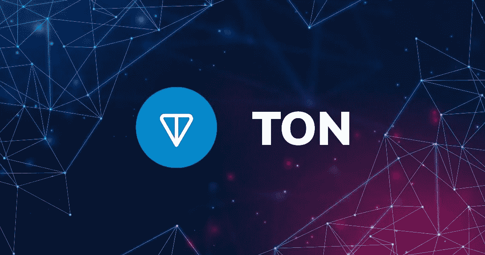

# 吨，电报加密货币

> 原文：<https://medium.com/geekculture/ton-the-telegram-cryptocurrency-f7bf2f6b047f?source=collection_archive---------13----------------------->

Telegram 是一款消息应用，允许用户在不离开应用的情况下买卖加密货币。TON (Telegram Open Network)是一个完全分散的第 1 层区块链，由 Telegram 设计用于搭载数十亿用户。开放网络被设计成可扩展、可共享的，并吸引数十亿用户。每个功能都是为日常用户设计的。TON 吸引了很多关注，并且仍在增长，尽管…