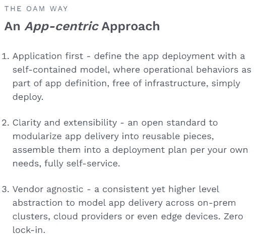
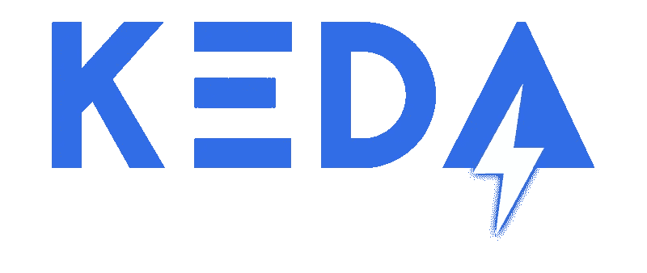
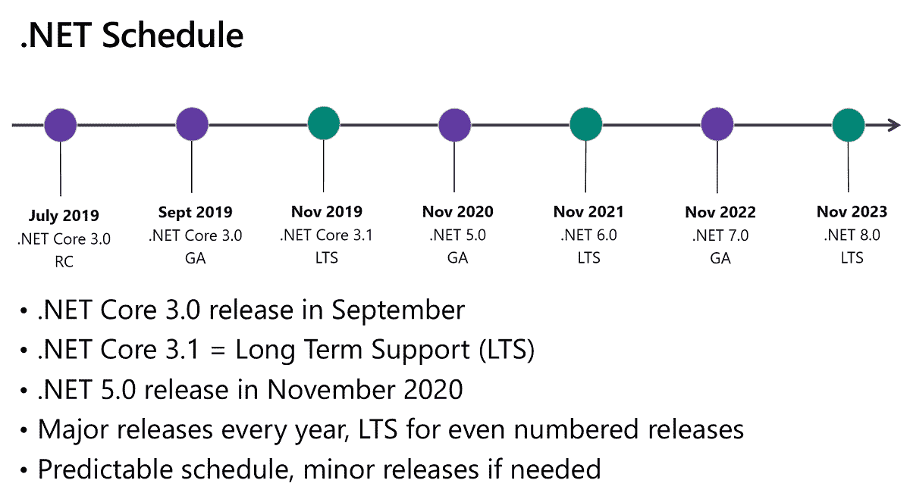
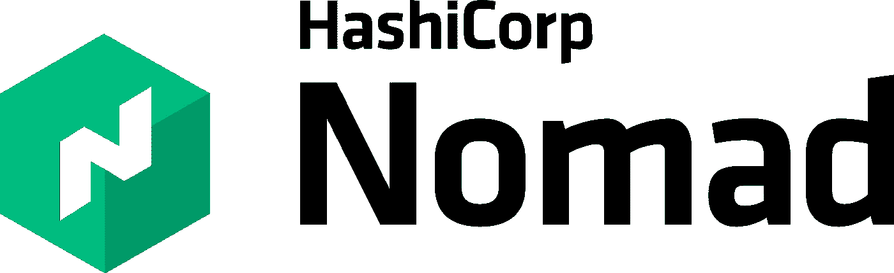

# 的框架。2021 年秋季的网络开发者。

> 原文：<https://medium.com/geekculture/tools-frameworks-for-net-developers-28a70d7a8bf0?source=collection_archive---------1----------------------->

TLDR；在这篇综述文章中，我将介绍现代的东西，如 DAPR，泰伊，游牧，领事，KEDA。NET 6，Azure 容器应用程序。我发现它们令人兴奋，值得你今年秋天花时间去学习。所以你可以开始新的一年，做一个绿色项目或者一份新工作:)。


*   基于开放应用模型的 DAPR 分布式应用运行时。
*   微服务的开发工具。
*   基于 KEDA -库伯内特事件驱动的自动缩放器。
*   。NET 6 以及实体框架、Azure 函数等新特性。
*   Azure 容器应用程序(Kubernetes 上的包装器)来运行它们↑ all:)。
*   来自 HashiCorp 的容器编制器和服务网格。

## 让我们来谈谈 DAPR。

我喜欢可插拔组件，是的，Kubernetes 提供了在不同的云提供商甚至内部移植应用程序的能力，但是改变组件是很困难的，尤其是当你需要在代码中替换 SDK 组件的时候。对于复杂的产品来说，这需要时间、精力，并且会导致很多错误。

我有过将应用从 Azure Functions 移植到 Kubernetes，然后移植到本地集群的经历。虽然进展顺利，但是在消息代理、状态存储和配置方面做了很多改变，限制了开发人员在他们不应该访问的地方调用服务的能力。

DAPR 的版本 1 带来了救赎，但在我们进入其他主题之前，请考虑下面来自 https://oam.dev/[的图片，这些图片详细解释了开放应用模型。](https://oam.dev/)



## **我们来谈谈 TYE。**

TYE 目前是一个实验，试图消除与微服务合作的复杂性。NET 开发人员。就我个人而言，我认为它将在某个时候成为 DAPR 的一部分，但我们将拭目以待。Btw，它在 GitHub 上有 3.8k 颗星，比 DAPR 还多:)，

那么，它到底有什么帮助呢？

*   提供服务发现
*   用一个命令运行包含许多微服务的应用程序
*   可以自动集装箱化。网络应用
*   可以生成 Kubernetes 清单，这对每个人来说都是一种痛苦
*   可以将您的服务部署到 Kubernetes

所以，正如你所看到的，这是额外的命令行，旨在解决你的问题与 Kubernetes:)

## 让我们来谈谈 KEDA。



本质上，KEDA 为 Kubernetes 上事件驱动的容器规模提供了一个解决方案，当您使用它与使用消息代理的现有应用程序紧密集成时，它尤其有用。您可以微调自动扩展配置，甚至可以从 0 个实例扩展到 0 个实例。

我有几个在 Kubernetes 上托管的应用程序跨云原生应用程序的内部部署使用 KEDA 的成功案例。

关键组件是缩放器，由微软开发团队或社区贡献者提供。而且它发展得非常快，当前版本是 2.4.0，目前 GitHub 库有 3.7k stars

最后，但同样重要的是，它是云计算原生计算基金会(CNCF)的一部分。

## 下面说说即将到来的。NET 6 发布。



一个。NET 来统治他们(c)，将不会有两个框架前进。

主要特点是一个”。NET 热重新加载”功能，该功能在社区中发生#$%t 风暴后发布、从 CLI 中删除并恢复。[链接](https://devblogs.microsoft.com/dotnet/net-hot-reload-support-via-cli/)。
所以在发布之后，你将能够在应用程序运行的时候修改应用程序代码:)。

## Azure 函数 v4

让我们从 Azure Functions 的重要更新开始——我们将得到 Azure Functions V4 对。网络 6

请注意 Azure Functions 代理功能的弃用，这是一个与 Functions 一起引入的“穷人”网关解决方案，我们在几个项目中成功地使用了它——现在唯一的方法是使用 API 管理服务。

新的隔离模型在独立于 Azure Functions host 的进程中运行函数代码，这将允许在不与主主机冲突的情况下灵活使用广泛的依赖关系，并大大移动高级启动配置。

进程内功能 V4 将基于。NET 6 并在。NET 版本，它们将向后兼容 V3。但是我们将会看到升级将会如何进行，我们打算在他们发布后尽快升级。

## C# v10

我真的认为每一个语言版本都给开发人员的生活带来了更多的乐趣，我仍然记得我用 C#6 工作了整整 4 年的时候，那是非常无聊的。

一些我认为很酷的功能

*   最小 API，简单如下。

```
using Microsoft.AspNetCore.Builder;var builder = WebApplication.CreateBuilder(args);
var app = builder.Build();app.MapGet("/hello", () => "Hello, World!");app.Run();
```

*   DateOnly 和 TimeOnly 类型，非常简洁，消除了许多令人头痛的问题:)

```
DateOnly date = DateOnly.MinValue;
TimeOnly time = TimeOnly.MinValue;
```

*   全局使用指令
*   同一解构中的赋值和声明

```
int x = 0;
(x, int y) = point;
```

*   新集合优先级队列，是的，我知道有 C5 个 NuGet:)
*   如果抛出异常，不需要检查是否为空

```
ArgumentNullException.ThrowIfNull(yourParameter);
```

*   MaxBy/MinBy 小而整洁的东西

```
users.MaxBy(x => x.Age);
// Instead of 
users.OrderByDescending(x => x.Age).First();
```

## 实体框架核心 6 LTS

*   试图达到整洁的性能，还没有:)
*   不支持 SLQ upserts:(
*   已更新 CosmosDB 提供程序:)
*   迁移更新、压缩、捆绑等
*   没有重大的突破性变化(如 2.2 到 3.1)

## 我们来谈谈 Azure 容器应用服务。

我对这个特别的公告感到非常兴奋，因为它是对 Kubernetes 手动配置的期待已久的预览和解决方案，是的，它建立在它的基础上，并包含其他开源框架，如 Kubernetes，Dapr，KEDA，特使。

此外，该服务可能会在正式发布后改变矿山部署和架构的格局，因为它可以轻松地与您为 Kubernetes 构建的解决方案进行互操作。它可以将容器扩展到零，在 HTTP 或其他发布/订阅和流的基础上横向扩展它们。

## 先说游牧者和执政官。



Kubernetes 是一个标准，但是容易吗？不，它有很多复杂性需要解决，而且在大多数情况下，您不需要这个额外的工具来运行您的工作负载。所以 Terraform 的创造者来帮助我们做一些更简单的事情来完成工作。专注于调度和集群管理。

Nomad 有一个非常简单的网络模型，以及稍微不同的概念，如工作、任务、任务组和分配。我鼓励你尝试一下，从 https://www.nomadproject.io/docs/install 开始。

Consul project 是另一个服务网格和服务发现解决方案:)，它在各个方面都与 Nomad 相得益彰。是的，Consul 承诺的是以零信任的安全方式联网，而没有太多的开销。它以自我管理的开源托管云模式和企业自我管理的定制部署解决方案的形式提供。

官方文档对 Consul 和 Istio 进行了很好的比较，因此我只简要介绍一些功能，如自动 TLS 证书管理、一个安装和管理服务、内置代理、仅网络层身份、基于代理的模型以及部署到每个节点的 Consul 客户端。

# 有用的链接。

*   [详细概述。NET 6 / C# 10 特性](https://dotnetcoretutorials.com/2021/09/23/net-6-c-10-top-new-features-recap/)
*   【Kubernetes 用户游牧指南