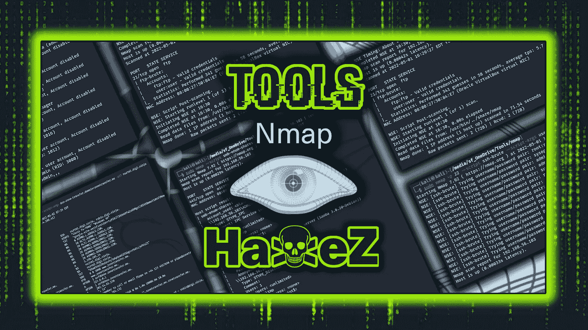
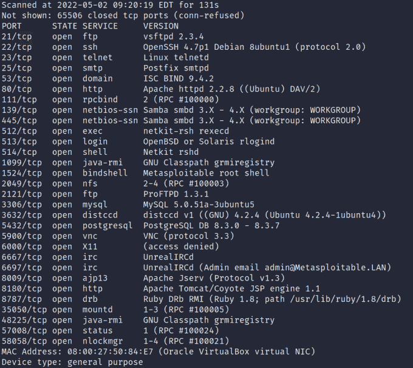
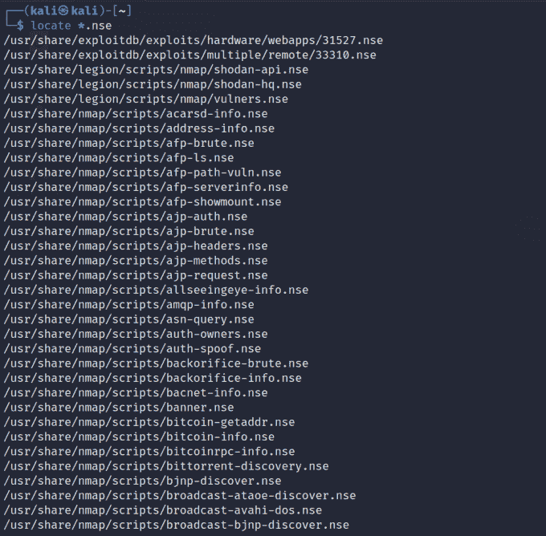
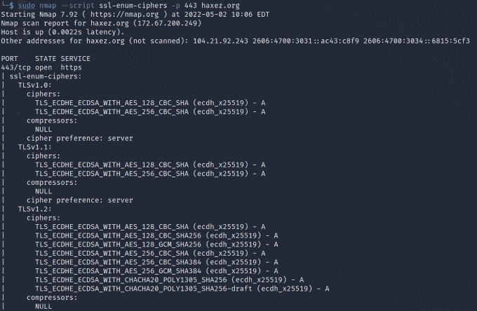
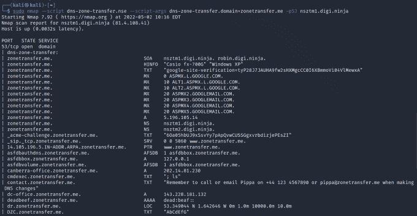
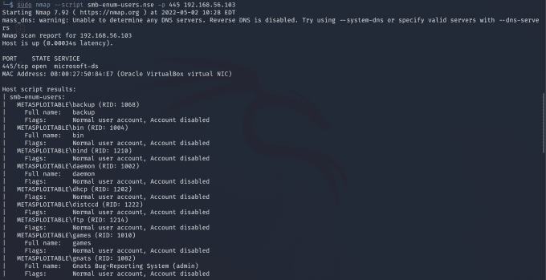
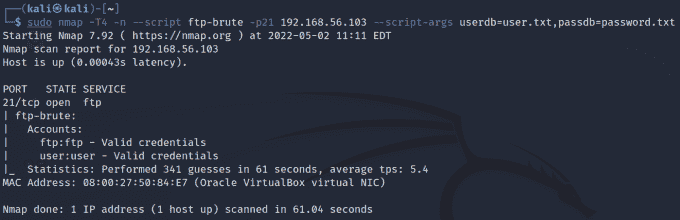
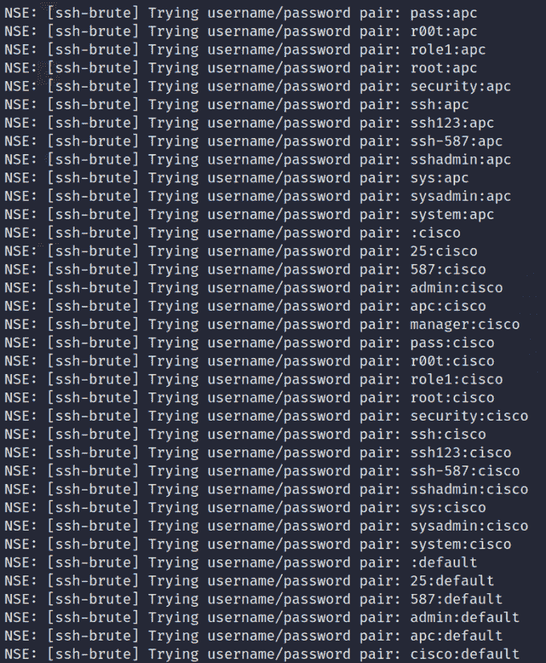

# 工具:Nmap

> 原文：<https://medium.com/geekculture/tools-nmap-e20b5091d4f8?source=collection_archive---------16----------------------->



Tools: Nmap

亲爱的朋友，欢迎来到 [HaXeZ](https://haxez.org) 今天我将谈论网络映射工具 Nmap。 [Nmap](https://nmap.org/) 是一款网络扫描仪，由戈登·里昂发明。它可以用来发现网络上的主机，方法是向这些主机发送数据包，然后分析响应。换句话说，它可以帮助你规划出一个目标网络。因此，Nmap 和其他工具如群发扫描一样，是你的道德黑客工具包中必不可少的工具。我几乎每次订婚都用它。

# Nmap 主机发现

如前所述，Nmap 可用于发现网络上的主机。这可以通过多种方式实现，但最常见的是 ping 扫描。ping 扫描就是这样做的，它对指定范围内的每台主机执行 ping 操作，并等待响应以查看主机是否在线。

```
sudo nmap -sP 10.10.10.0-255
```

这也可以在没有 DNS 解析的情况下完成。

```
sudo nmap -sP 10.10.10.0-255 -n
```

然而，这种方法并不完全可靠，因为主机可能会禁用 ICMP，这意味着它们不会响应 pings。


Nmap Ping Sweep

# Nmap TCP 端口扫描

Nmap 工具还可以扫描主机，并确定哪些 TCP 端口是打开的。这是通过启动与主机的三次握手并分析响应来完成的。您可以指定哪些端口，或者让它只扫描前 100 或 1000 个端口。此外，您还可以通过添加'-sV '参数将服务版本检测添加到扫描中。

```
sudo nmap -sT -sV -p0- 10.10.10.10
```



Nmap TCP Scan

# Nmap UDP 端口扫描

此外，Nmap 还可以对主机执行 UDP 扫描。但是，由于 UDP 是一种无状态协议，无论主机是否响应，发送方都会继续发送，因此确定端口是否打开需要时间。

```
sudo nmap -sU -p0- 10.10.10.10
```

# Nmap 脚本引擎

Nmap 最强大的特性之一是它的脚本引擎。如果你刚开始接触计算机或网络，你可能会被原谅不了解它。Nmap 不仅仅是一个网络扫描器，它是一个完整的渗透测试框架。如果您打开终端并输入:

```
sudo locate *.nse
```



Nmap NSE Scripts

你可以看到大量的脚本供你用来对付你的目标。这些脚本的范围从纯粹的信息到剥削。可以通过运行以下命令来更新脚本。

```
sudo nmap --script-updatedb
```

# SSL 脚本

我在合约中经常做的一件事是测试 SSL 证书的配置。这有助于确保发送到主机和从主机发出的所有通信都安全地完成。此外，它还有助于确保不会向主机发送巧尽心思构建的数据包来检索敏感信息。

```
sudo nmap --script ssl-cert -p 443 haxez.org
```

下面的命令可用于枚举 SSL 加密算法并检查薄弱的加密算法。

```
sudo nmap -sV --script ssl-enum-ciphers -p 443 haxez.org
```



Nmap SSL Scripts

# DNS 区域转移脚本

还有一个脚本可以执行 DNS 区域转移。虽然有其他工具，如 dig 和 heritage，它们的语法要简单得多，但如果您手头拮据，并且只有 Nmap，那么知道有这个选项就好了。这可以通过运行以下命令来完成。

```
sudo nmap --script dns-zone-transfer.nse --script-args dns-zone-transfer.domain=zonetransfer.me -p53 nsztm1.digi.ninja
```

因此，如果您正在进行一项工作，并且注意到 TCP 端口 53 是打开的。通过执行 DNS 区域转移，您可以获得绝对丰富的信息。



Nmap DNS Zone Transfer

# SMB 共享枚举

假设您偶然进入一个网络，扫描了一台主机，发现端口 445 是开放的。你知道这是服务器消息块或简称 SMB 的端口。您还知道此端口用于在网络上共享文件和文件夹/目录。如果有一种方法可以看到哪些股票被分享，那不是很好吗？嗯，有一个剧本。

```
nmap --script smb-enum-shares.nse -p445 192.168.56.103
```

# SMB 用户枚举

好了，现在您知道了共享是什么，但是您不知道系统上有哪些用户有权访问它们。有一个脚本可以让您通过 SMB 共享枚举系统的用户。

```
nmap --script smb-enum-users.nse -p445 192.168.56.103
```



Nmap SMB User Enumeration

# FTP Brute

现在你有了一个用户名列表，但是你怎么处理它们呢？你还能看到其他服务吗？那是什么？它在运行 FTP？为什么不用 Nmap 的 FTP 暴力脚本来暴力破解服务呢？

```
sudo nmap --script ftp-brute -p21 192.168.56.103 --script-args userdb=ftp_defuser.lst,passdb=ftp_defuser.lst
```



Nmap FTP Brute Force

# SSH 蛮

您注意到另一个机器或者同一个机器正在运行远程管理协议 SSH。您有一个从 FTP 服务获得的用户列表和一些密码。为什么不使用这个单词表来攻击 SSH 登录呢？

```
sudo nmap -p 22 --script ssh-brute --script-args userdb=ssh-user.txt,passdb=password.txt 192.168.56.103
```



Nmap SSH Brute Force

# 其他论点

# 增加详细程度

还有一些其他的论点可以帮助你进行扫描。如果你想知道 Nmap 到底在做什么，你可以增加详细程度。

```
-v1 -v2 -v3
```

# 加速

或者，如果 Nmap 运行太慢，您可以通过在扫描中添加 T4 参数来提高速度。但是要小心，因为一些资源最少的系统可能会被您的扫描所冒犯，并由于资源耗尽而决定崩溃。

```
-T1 -T2 -T3 -T4
```

# 结论

还有许多其他类型的扫描，如 Syn 扫描和 Xmas 扫描，我可以谈谈。我可以花几个星期来谈论所有不同的可用脚本。虽然我不想让这篇文章太长。希望我已经介绍了足够多的内容，让您开始使用 Nmap 并认识到它的巨大潜力。我在几乎所有的测试中都使用它，因为它几乎拥有我需要的一切。这并不是说我不用其他工具来验证结果，但一旦被动侦察被排除，这通常是我参与任何行动的起点。

我已经创建了一个非常基本的 Nmap 备忘单，你可以在这里下载。