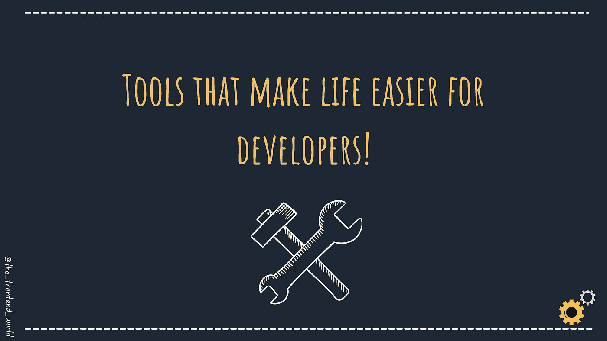

# 让开发者生活更轻松的工具！

> 原文：<https://medium.com/geekculture/tools-that-make-life-easier-for-developers-c0c8ec1c6311?source=collection_archive---------16----------------------->

## 编码时如何节省时间？秘诀是聪明地编码，而不是重复编码！

编码时如何节省时间？秘诀是聪明地编码，而不是重复编码！

这里有一些很棒的参考资料，可以帮你节省很多时间:

# 第一名——维尔塞尔