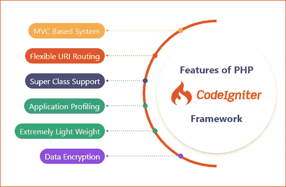

# PHP 中 Codeigniter 框架的十大高级 Web 开发特性

> 原文：<https://medium.com/geekculture/top-10-advanced-web-development-features-of-codeigniter-framework-in-php-76350aa5c94?source=collection_archive---------10----------------------->

由于 PHP 可以用于各种目的，它激发了大量框架的创建，这些框架提供了构建模块和设计来鼓励快速的 web 应用程序开发。像 **CakePHP** 、 **Drupal** 、 **CodeIgniter** 、 **Zend** 和 **Laravel** 等核心 PHP 框架被广泛使用。

CodeIgniter 经常被选为最好的 PHP 框架，因为它帮助程序员创建动态 web 应用程序，并为从头开始创建代码提供了一个方便的特性集合。

# **什么是 CodeIgniter？**

PHP 框架 CodeIgniter 可供任何人免费下载和使用。自从 2006 年 2 月 EllisLab 首次发布以来，它一直在发展以支持日益复杂的软件。包括大型库、插件、工具和其他资源来简化各种任务。

通过简化网页上的应用程序源代码和 PHP 语法，它可以缩短创建一个交互式专业网站所需的时间。

## 【CodeIgniter 是如何工作的？

换句话说，CodeIgniter 是一个 MVC ( [模型视图控制器](https://en.wikipedia.org/wiki/Model%E2%80%93view%E2%80%93controller))框架。如果用户请求资源，控制器将首先响应。一旦控制器处理了请求并完全理解了它，它接下来将进行任何必要的数据库调用。

例如，如果控制器接收到一个客户机的请求，条件是“id = 4”，它将通知模型搜索并获取相应的记录。接下来，模型会将记录发送回控制器类。然后，由控制器发送的视图将结果格式化为人类可读的格式。然后浏览器向当前用户显示这个结果。

# **为什么您应该为您的 web 开发项目选择 CodeIgniter？**

用于创建模型-视图-控制器应用程序的 CodeIgniter 框架包括几个有用的特性。借助这些工具可以快速开发 Web 应用程序。我们为您的下一个 web 开发项目编辑了一个使用 CodeIgniter 的好处列表。

**免费开源**

CodeIgniter 的可访问性部分源于它是一个免费的开源 PHP 框架。企业不断研究开发 web 解决方案的新方法，以节省资金和时间。为此，CodeIgniter 是一个可行的选择。因为它是开源的，所以使用这个框架不需要支付许可费。使用 CodeIgniter 构建的网站是企业的一个选择。他们可以通过不购买创新设备来省钱。

**优越的测试设施**

当前版本的 CodeIgniter 的逐步测试工具使它比其他 PHP 框架更有优势。这是开发任何基于网络的程序的关键一步。这种方法有可能提高测试的效率和有效性。因此，开发人员可能会跟踪各种功能的效率，并倡导更有效的方法。

**代码少效果好**

CodeIgniter 的框架鼓励用更少的代码进行快速开发，这是另一个显著的优势。减少打字时间意味着出错的机会更少，调试花费的时间更少。考虑到众所周知，代码越少需要的存储空间越少，运行越快。因此，您的 web 应用程序将会又快又小。

**强大的基于模板的解决方案**

在现代 web 开发过程中，使用预先构建的模板非常普遍。他们加快了进程，并立即提供答案。CodeIgniter 包括一个强大的模板系统。早在规划阶段，开发人员就可以从更清晰的项目结构图中获益。

## **CodeIgniter web 框架的十大高级特性:**

**1。处理错误**

如果你想创建零 bug、可用性和设计出众的网站，可以看看 CodeIgniter。我们提供了一个简单的界面来帮助你定位干扰网站正常运行的错误和缺陷，从而影响用户体验的质量。

**2。可定制性**

作为一名开发人员，你可以很容易地改变网站，以适应客户的需求，而不浪费时间。专家们一致认为，在所有框架中，CodeIgniter 是唯一一个让定制变得轻而易举的框架。

CodeIgniter 的即时错误修复和简化的文件配置是它如此有用的两个原因，特别是对于那些需要[可靠的定制 web 开发服务的人](https://jumpgrowth.com/)。

**3。更有效地优化搜索引擎**

CodeIgniter 的 SEO 增强功能是其作为商业网站创建平台的另一个令人信服的优势。当增加流量是主要关注点时，数字营销专家喜欢 CodeIgniter 开发平台。

**4。基于测试的方法**

只有 CodeIgniter 允许测试驱动开发，这意味着开发人员可以在构建网站时采用系统的方法进行测试。容易分析网站的性能或功能是可能的。

如果你采取一种系统的，一步一步的方法来测试，你可以放心，开发的每一个阶段都会被彻底有效的检查。

**5。安全结构**

提高安全性是任何网络开发公司的首要任务。注重安全性的开发人员将会欣赏 CodeIgniter 丰富的内置功能，包括用于传入和传出数据的众多过滤器。大多数描述了如何加密和解密数据，这是任何程序员在建立系统时都必须掌握的重要信息。

**6。简化设置**

CodeIgniter PHP 框架有一个带有灵活的文件夹架构的直线结构。这有助于简化框架所需的 PHP 语法。使用这种框架可以快速、轻松地构建 Web 应用程序，避免复杂代码方案中语法问题的陷阱。

**7。用于测试的一流实验室**

与其他 PHP 框架相比，当前版本的 Codeigniter 因其逐步测试特性而脱颖而出，这在任何 web 应用程序开发框架过程中都非常有用。这一独特特性的好处之一是，它使开发人员更容易比较他们工作的功能和性能，并分享对未来 web 开发工作最有用的方法。

**8。操作简单**

用 PHP 开发 MVC 应用程序的 CodeIgniter 框架有一个简单明了的接口，让新手也可以使用。由于其开放源代码的性质，这个框架可以被修改，以适应您的公司的具体需求与最小的努力。如果需求有任何变化，您可以在快速解决方案和各种控制器和工具的帮助下，轻松地将它们合并到您的项目中。

**9。用更少的代码获得更好的结果**

一个流行的应用程序开发框架，CodeIgniter 需要开发人员编写一些代码。由于不需要外部库，因此可以快速创建 web 应用程序。因此，如果您需要快速 web 应用程序开发的特性，建议使用这个框架。

**10。未完成的证明材料**

通过完整的文档，开发人员管理和引用代码以及考虑未来引用的能力得到了提高。CodeIgniter web 框架使得维护所创建代码的关键文档变得更加容易。这份丰富的代码文档是您的 web 应用程序不可或缺的 CodeIgniter 用户指南。

## **总结**

CodeIgniter 是一个顶级的 PHP 框架，可以免费开源使用。这为 PHP 开发人员简化了模块化方法的使用和任何显式函数的检索。其 URL 的结构使得大规模创建高度动态、安全的在线应用程序变得简单。它具有出色的内置调试功能，可以快速查明并报告问题和警告。

CodeIgniter 是最受欢迎的 web 框架之一，它受欢迎的原因就是充分的证据。这是从头开始创建应用程序的最佳平台。