# 2021-22 年，十大 AI/ML 开发公司值得关注的开创性网络开发

> 原文：<https://medium.com/geekculture/top-10-ai-ml-development-companies-to-watch-for-pioneering-web-development-in-2021-22-202ac8b6d093?source=collection_archive---------16----------------------->

作为各种技术的星座，人工智能允许机器像人类一样理解和行动，并以他们的智能水平思考。在深入人工智能领域的同时，你也会了解机器学习和深度学习。此外，通过数据、分析和自动化的完美结合，公司可以取得巨大成功并实现目标。

Image resource: [marketsandmarkets](https://www.marketsandmarkets.com/Market-Reports/artificial-intelligence-market-74851580.html)

MarketsAndMarkets 报告估计，人工智能市场的 CAGR 将增长 39.7%，从 2021 年的 583 亿美元增长到 2026 年的 3096 亿美元。因此，尽最大努力在全球市场中保持竞争力。

现在，您可以解释 AI/ML 的重要性和需求，以找出与顶级服务提供商联系的最佳方式。通过比较和深入的研究来深入你的大脑，以便在雇用 AI/ML 开发人员时做出密集的决策。

# 选择最佳公司的参数

没有积极的研究和进步的思考就得出任何结论都无助于获得想要的结果。为了让你的步骤更有侵略性和更有成效，在你的意识中保持一些基本点:

**公司曝光度**:提取公司曝光度及成立信息，确保其可信度。

**网站点评:**浏览他人对公司现状和工作策略的印象。

**业绩记录**:要想了解这家网络应用开发公司的奉献精神，可以看看它的业绩记录。

**项目处理:**他们目前做了多少项目？了解这些公司的项目处理后，你可以做出一个有影响力的决定。

**技术专长:**对技术技能和专业知识的深入了解决定了任何项目的成功率。

# 最佳人工智能/人工智能开发公司列表

**InData 实验室:用数据科学&人工智能技术**推进您的业务

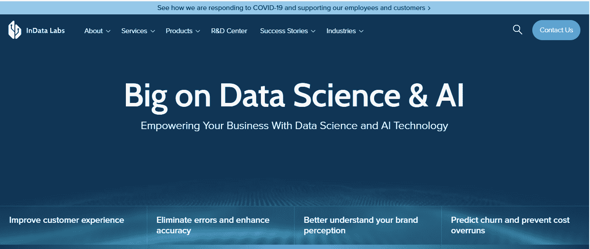

**Image resource:** [**InData Labs**](https://indatalabs.com/?utm_source=clutch.co&utm_medium=referral)

虽然有自己的 R&D 部门，但 InData Labs 是一家在全球范围内提供人工智能解决方案的领先公司。他们的开发团队尽最大努力提供对数据的宝贵见解，并自动化重复性任务，以扩大公司的投资组合和业绩。

具有创新理念的有效商业战略将引领你的企业走向巅峰。因此，使用 InData Labs 完成您的预测模型，并使用高度先进的 AI 和 ML 技术渗透您的工作流程。

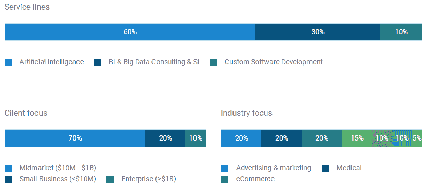

Image resource: [**Clutch**](https://clutch.co/profile/indata-labs)

**60 多名合格员工| 40 多个在全球完成的项目| 6 年以上的有效经验**

**公司成立** : 2014 年

**离合器额定值:** 5.0/5

**技术专长:**人体姿态估计、NLP 支持的客户评论收集和分析软件、图像识别解决方案、人工智能驱动的移动应用程序开发以及基于人脸识别的系统。

**地点:**塞浦路斯(总部)、白俄罗斯、美国、新加坡

**估值师:用人工智能/人工智能技术扩展你的数字世界**

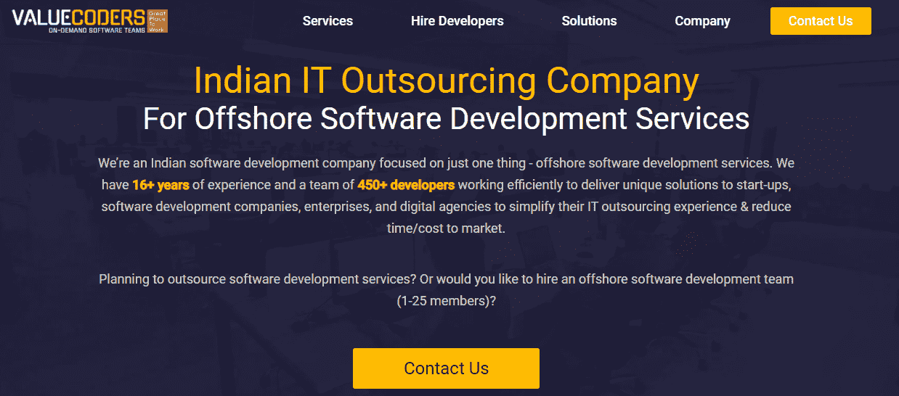

Image resource: [ValueCoders](https://www.valuecoders.com/ai-ml-development-services-company?utm_source=Ang_N12&utm_medium=medium&utm_id=geekculture)

ValueCoders 热衷于将客户的需求转化为有价值且实用的商业解决方案。从初创公司到领先企业，该公司已经准备好接受每一点挑战，以提供人工智能驱动的技术作为主动解决方案。

被认证为“最佳工作场所”的 ValueCoders 正在重新定义对待人才和提供解决方案的方式。如果你有远见，并且渴望在不限制业务能力的情况下解决你的担忧，请雇佣 AI 工程师。借助 ValueCoders 平台提供的敏捷和定制技术，扩展您的业务。

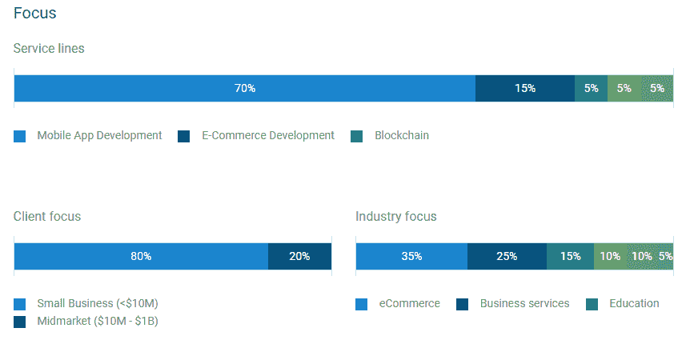

Image Resource: [Clutch](https://clutch.co/profile/valuecoders)

**97%的客户保留率| 2500 多名满意的客户| 2000 多人年的经验**

公司成立: 2004 年

**离合器额定值:** 5.0/5

**技术专长:**面向 IT 行业的移动应用开发、支持机器学习的业务解决方案、基于人工智能的解决方案、电子商务开发解决方案

**地点:**印度古鲁格拉姆诺伊达

**Xicom Technologies: ISO:9001 认证软件开发公司**

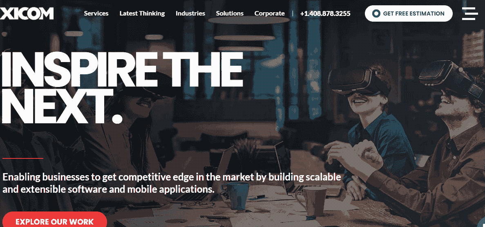

**Image resource:** [**Xicom**](https://www.xicom.biz/)

Xicom Technologies 拥有一支由 300 多名高技能开发人员组成的充满活力的团队，热衷于有效地扩展客户的业务需求。在任何项目中实施人工智能技术时，他们的开发人员都要确保一切都在正确的地方，并构建出想要的产品。

机器学习应用程序开发公司 Xicom 获得了 NASSCOM & STPI 的认证，并准备在开发客户产品时释放最新的思维。开发人员的专业知识帮助初创公司和大型企业做出关键决策，并在工作流程中带来技术进步。

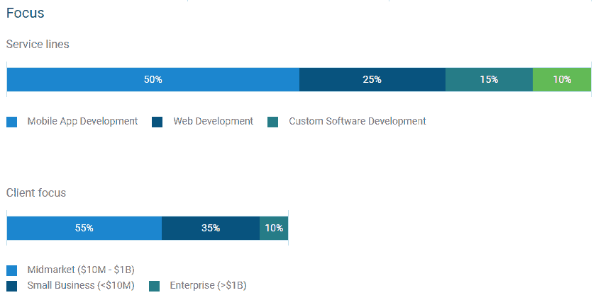

Image resource: [Clutch](https://clutch.co/profile/xicom-technologies)

**执行了 7500 多个项目|全球 1500 多个客户| 15 年以上的业务经验**

公司成立: 2002 年

**离合器额定值:** 4.7/5

**技术专长**:大数据&分析、云计算、移动 app 开发(iOS、Android)、ASP.NET 开发、区块链、人工智能

**地点:**美国、印度

**PixelCrayons:屡获殊荣的数字咨询&工程公司**

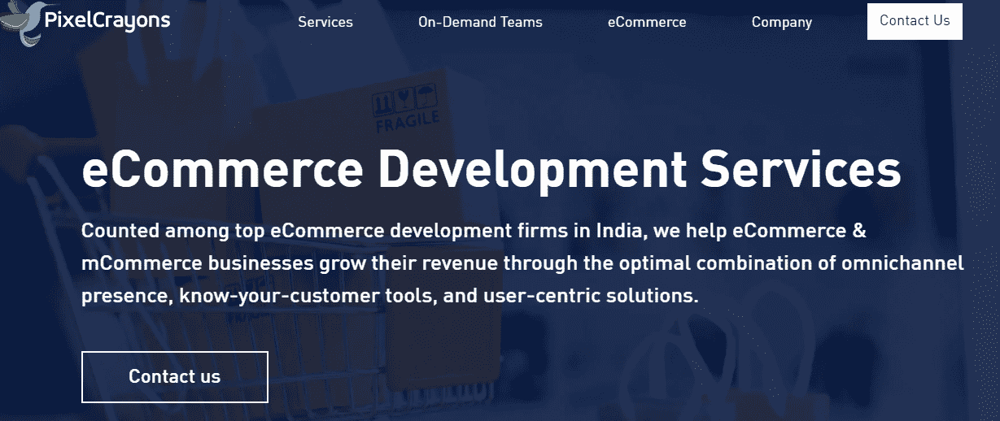

**Image Resource:** [**PixelCrayons**](https://www.pixelcrayons.com/)

PixelCrayons 是一家 web 应用程序开发公司，通过世界一流的软件和应用程序开发提供卓越的在线解决方案。他们的努力让 4800 多名客户对他们的最大奉献感到满意，并准备通过解决每一个问题来扩大他们的成功图表。

从运输到医疗保健，从零售到广告，该公司适用于每一个利基行业。应用程序开发人员和创意设计师团队确保每个交付的项目 100%成功。敲门为你的网络项目雇佣最好的 AI/ML 开发者。

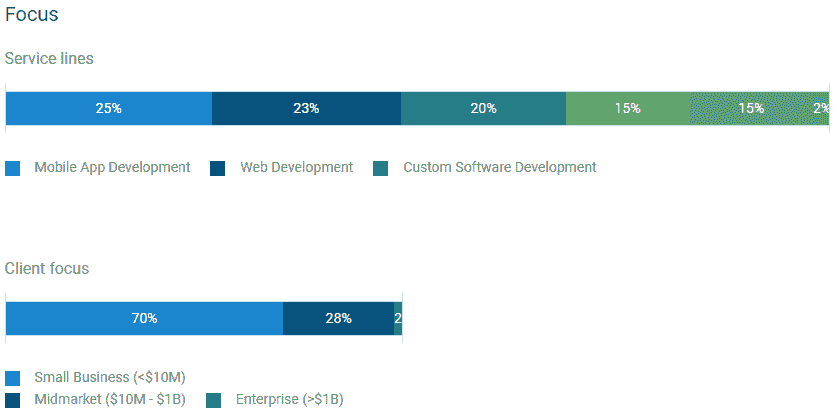

Image resource: [Clutch](https://clutch.co/profile/pixelcrayons)

**16 年以上的专业经验|完成 11500 多个项目| 38 个以上国家/地区**

**公司成立** : 2004 年

**离合器额定值:** 4.9/5

**技术专长:**人工智能、加密货币开发、定制软件开发、DevOps 解决方案、机器学习服务、区块链

**地点**:印度诺伊达

**Indium Software:同类最佳机器学习解决方案提供商**

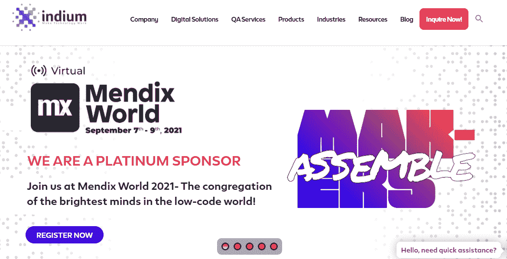

**Image Resource:** [**Indium**](https://www.indiumsoftware.com/)

Indium Software 允许您利用其开发人员的技术专长来查看商业模式的未知领域。他们广泛的机器学习服务和人工智能解决方案有助于公司拓宽其数字领域，并实现强大的用户参与。

web 应用程序开发公司 Indium Software 揭示了工具和技术功能，包括文本分析、情感分析、信息提取、数据分析等。该公司的销售和营销团队为企业的成功提供了宝贵的见解。

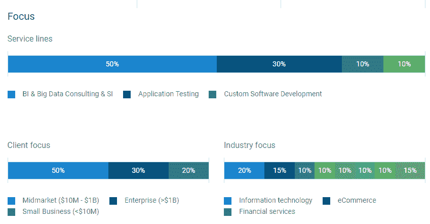

Image resource: [Clutch](https://clutch.co/profile/indium-software)

**1400 多名员工| 20 多年的从业经验| 350 多名客户**

公司成立: 1999 年

**离合器额定值:** 4.7/5

**技术专长:**大数据服务、数据工程、应用开发、云服务、DevOps 服务、物联网分析等。

**地点:**美国、印度、英国、新加坡、马来西亚

**网络大师:准备好与改变世界的人一起改变数字生态系统**

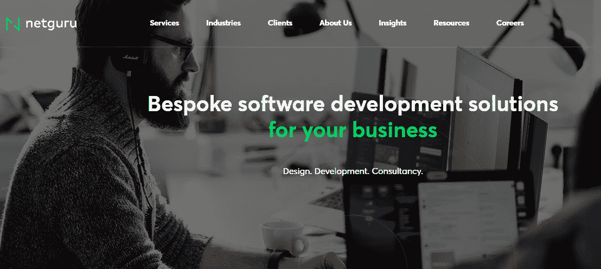

Image Resource: [Netguru](https://www.netguru.com/services?utm_source=clutch&utm_medium=referral)

Netguru 是一家领先的软件开发公司，专注于软件和产品的设计和开发。他们的定制解决方案通过添加尖端技术，如人工智能、机器学习等，帮助您在业务流程中取得成功。

除了完美的解决方案，该公司还提供软件开发和产品开发的 IT 咨询服务。它得到了德勤、福布斯和金融时报的认可。Netguru 还被认证为 2021 年的最佳工作场所。

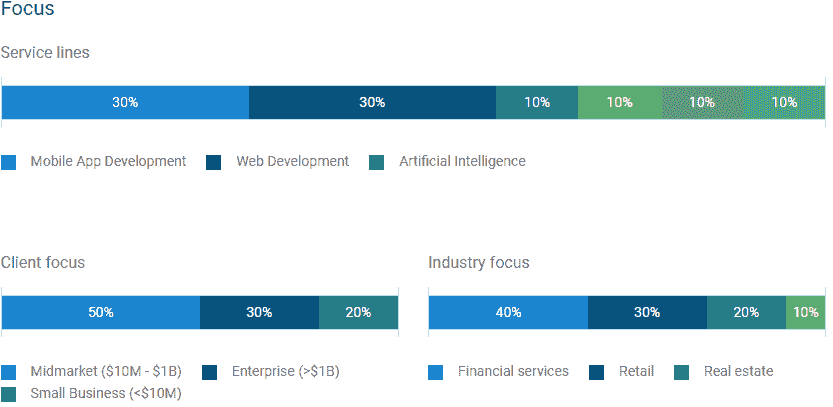

**Image resource:** [**Clutch**](https://clutch.co/profile/netguru)

**700 多名船上员工| 13 年以上的从业经验|完成 700 多个项目**

公司成立日期: 2008 年

**离合器额定值** : 4.8

**技术专长**:移动开发、机器学习、网页开发、产品设计

**地点**:波兰

**MobiDev:利用专家技能拓展技术进步**

**Image resource:** [**MobiDev**](https://mobidev.biz/?utm_source=clutch.co&utm_medium=referral)

MobiDev 是顶尖的软件解决方案提供商，遵循完整的开发周期来满足客户的所有需求。他们为 20 多个国家提供定制软件开发服务，并积极提供帮助和支持。

凭借 11 年以上的经验和开发的 350 多种产品，该公司随时准备在每个指定的项目中提供出色的表现。在高技能 IT 专家 MobiDev 的专门协助下，加速您的人工智能开发过程。

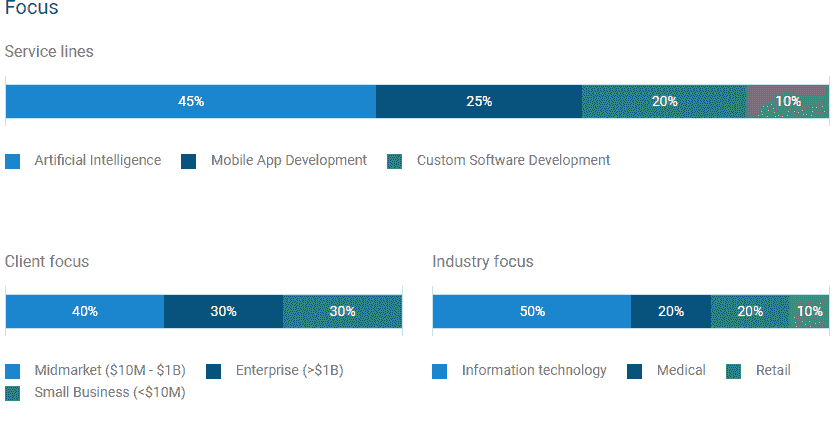

Image resource: [Clutch](https://clutch.co/profile/mobidev)

**300 多名熟练工程师| 10 多年的从业经验|**

**公司成立** : 2009 年

**离合器等级** : 5.0/5

**技术专长**:机器学习&深度学习、预测分析、计算机视觉、自然语言处理、移动开发

**地点**:乌克兰、美国、英国

**Prolitus:领先的机器学习应用开发公司**

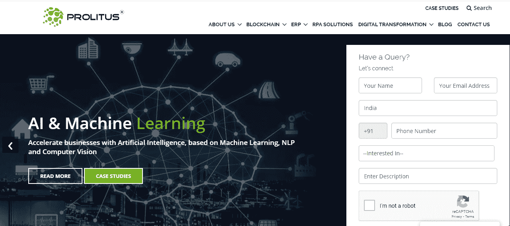

**Image resource:** [**Prolitus**](https://www.prolitus.com/)

在进入数字领域后，Prolitus Technologies 成功地为大型和小型企业提供了令人满意的可扩展解决方案。开发团队在 R&D 进行了大量投资，以保持在竞争中的领先地位，并利用这个信息时代的优势。

通过利用最好的机器学习工具，该公司提供面向行业的人工智能解决方案，并将创新想法转化为现实生活中的体验。他们的技术专家尽一切努力在每个项目交付中提供 100%的满意度。

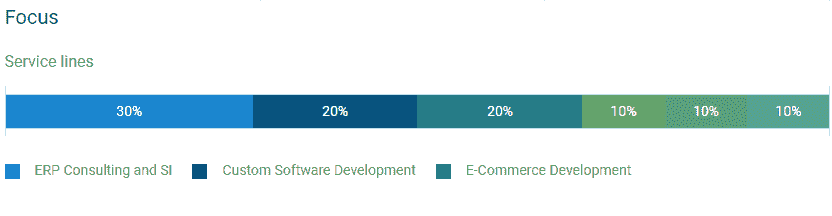

Image Resource: [Clutch](https://clutch.co/profile/prolitus-technologies)

**ISO 9001&ISO/IEC 27001:2013 认证| 200 多名软件工程师**

**公司成立** : 2005 年

**离合器等级** : 4.8/5

**技术专长:**用户界面开发、人工智能解决方案、区块链开发、云解决方案、Web 和移动应用开发

**地点**:印度，美国

**Endive Software:顶级人工智能解决方案提供商**

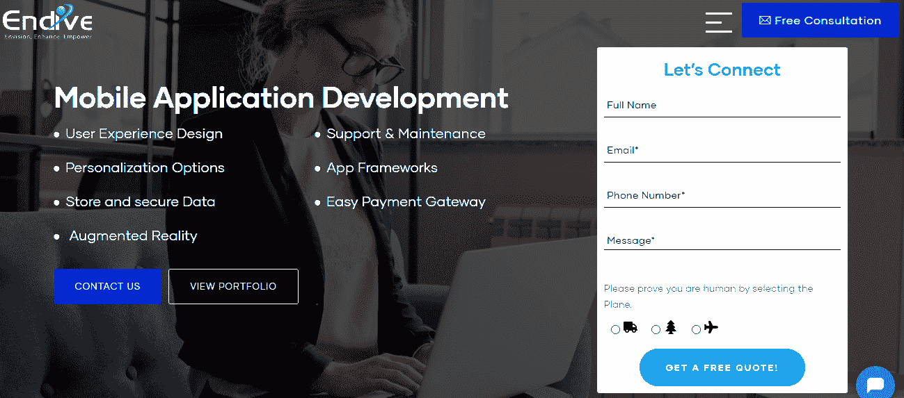

**Image Resource:** [**Endive Software**](https://www.endivesoftware.com/mobile-application-development-services/)

凭借对开发工具和技术的深入了解，Endive Software 是顶级定制软件开发服务之一。该公司热衷于提供 web 解决方案和云开发服务，以拥抱最新技术的成功。

该公司的目标是所有主要平台，iOS、Android 和 Windows，以提供开创性的移动应用解决方案。他们由经验丰富的移动应用程序开发人员和程序员组成的内部团队对构建面向未来的应用程序和扩大行业特定的数字环境感到兴奋。

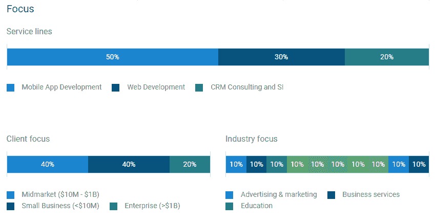

Image Resource: [Clutch](https://clutch.co/profile/endive-software)

公司成立日期: 2008 年

**离合器额定值:** 4.7/5

**技术专长:** Web 开发、定制软件开发、Android 游戏开发、人工智能、Salesforce 集成

**地点:**美国、印度

**iTechArt 集团:分享人工智能需求的最佳选择**

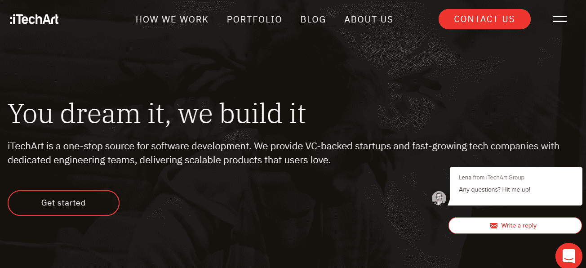

**Image Resource:** [**iTechArt Group**](https://www.itechart.com/?utm_source=clutch&utm_medium=referral)

以精通业务的工程团队为后盾，iTechArt Group 提供基于敏捷和最新技术的高级业务解决方案。在 iTechArt 开发人员的帮助下，公司可以将特性和功能添加到应用程序开发中，以专注于本机、混合或跨平台。

该公司的成功取决于其一流开发人员的技术水平和应用开发知识。该公司还因提供最佳服务而被列入美国 5000 家发展最快的公司。

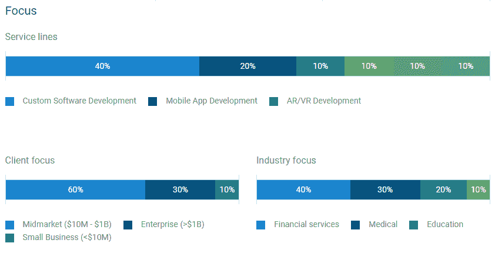

Image Resource: [Clutch](https://clutch.co/profile/itechart-group)

**250 多个客户| 2700 多名经验丰富的工程师| 5.6%的流失率**

公司成立时间 : 2002 年

**离合器额定值:** 4.9/5

**技术专长**:定制软件开发、人工智能应用、云计算、移动&网络应用开发

**地点:**美国、英国

**Neoteric:一家更高效地处理数据的公司**

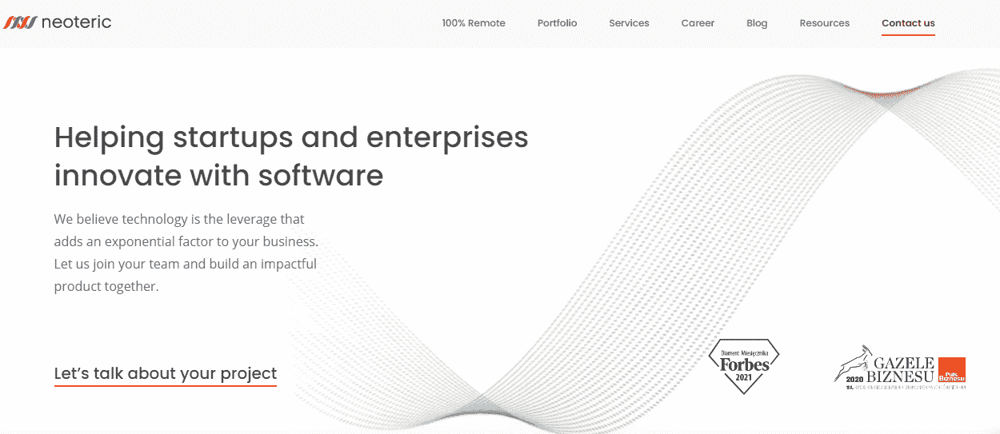

**Image Resource:** [**Neoteric**](https://neoteric.eu/?utm_source=clutch.co&utm_medium=referral&utm_campaign=profile)

Neoteric 是提供优秀解决方案来组织机器学习和预测模型的顶级公司之一。借助机器学习应用程序开发公司 Neoteric 的大量专家和应用程序开发人员，为您的想象力增添翅膀。

该公司的愿景是在自然语言处理能力的聊天机器人的帮助下，更有效地处理客户查询。雇用人工智能工程师，将他们的定制数据策略应用到业务管理中。

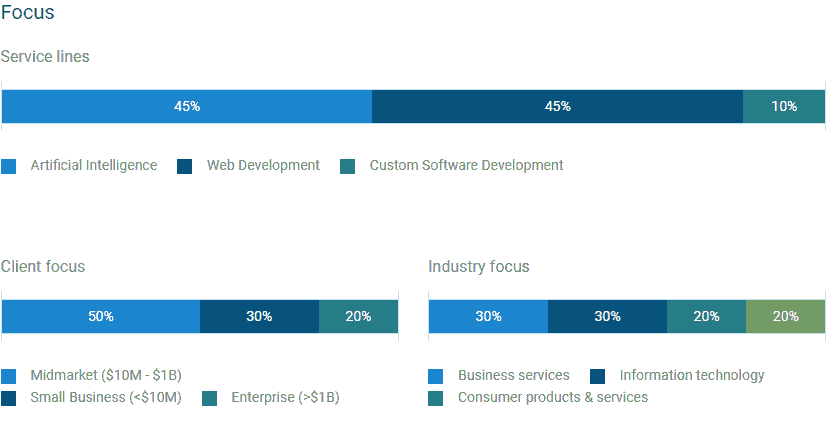

Image Resource: [Clutch](https://clutch.co/profile/neoteric)

**公司成立** : 2005 年

**离合器等级** : 4.9/5

**技术专长:** SaaS 开发、人工智能、Web App 开发、机器人流程自动化、产品设计、

**地点:**波兰

**unisoft:美国顶级人工智能公司**

**Image resource:** [**Unicsoft**](https://unicsoft.com/)

凭借 12 年的国际市场经验，Unicsoft 帮助 70 多家公司实现了他们的目标并满足了他们的 IT 需求。会见他们的技术团队，将先进技术集成到您的业务流程中。

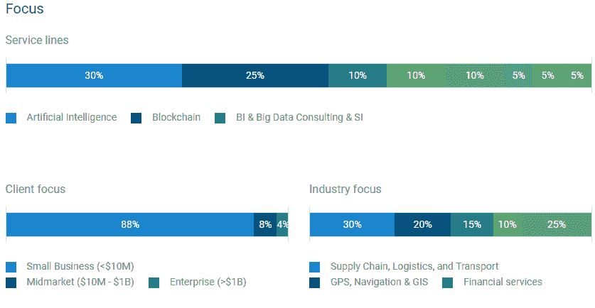

Image Resource: [Clutch](https://clutch.co/profile/unicsoft)

**100 多名软件工程师| 12 年以上的从业经验| 75%的客户保持率**

公司成立日期:2005 年

**离合器额定值:** 4.9/5

**技术专长:**区块链、云咨询、移动开发、自然语言处理、数据分析、数据科学、机器学习

**地点:**美国、新加坡

# 对比:2021 年要考虑的 12 大 AI/ML 开发公司

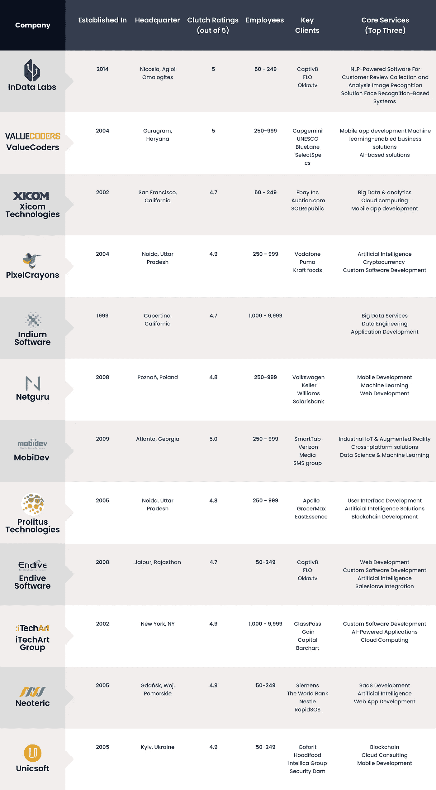

**最后的想法**

浏览前 12 家 AI/ML 应用开发公司的完整列表，为你即将到来的项目雇佣[最好的 AI/ML 开发人员](https://www.valuecoders.com/ai-ml-development-services-company?utm_source=Ang_N12&utm_medium=medium&utm_id=geekculture)。在接触任何 web 应用程序开发公司之前，请确保了解您的业务需求并相应地塑造它们。

现在，我相信你会为你的机器学习项目做出明智的决定，并精确地升级你的成功图表。