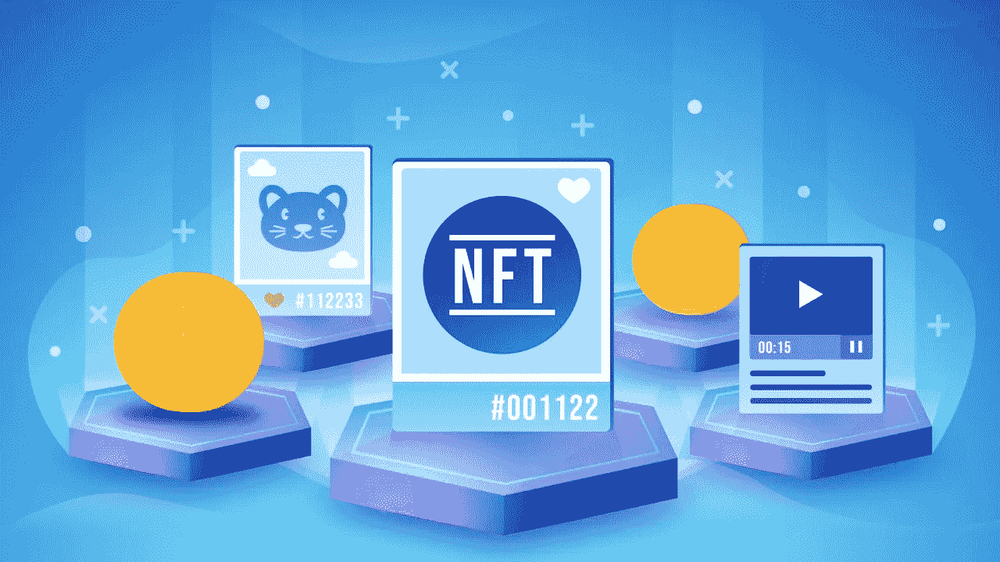

# NFT 市场给企业带来的十大好处

> 原文：<https://medium.com/geekculture/top-10-benefits-of-nft-marketplaces-for-enterprise-baaaa95f1781?source=collection_archive---------20----------------------->

Fig: Top 10 Benefits Of NFT Marketplaces For Enterprise

NFT 的市场让在区块链工作的创意人员更容易在网上销售和购买 NFT。在我写这篇博客的时候，有相当多的可靠的 NFT 市场在运作，但是他们做得非常出色。

来自世界各地的人们现在可以通过无缝地购买和销售他们的非功能性交易市场，轻松地从这些 NFT 市场中受益。

在本文中，我们将讨论这些 NFT 市场如何通过使用基于区块链的 trail 来帮助新来者购买、销售、交易和认证购买。

# 轻松卖掉你的 NFT

NFT 市场的第一个也是最明显的好处是，它允许用户轻松地向公众出售他们的 NFT。人们可以在一个真实的媒介上出售他们的 NFT，而不是直接卖给卖家。NFT 市场可能会对挂牌出售 NFT 收取一些费用，但这是一个安全可靠的媒介。过去有很多骗局，人们卖了他们的 NFT 却得不到报酬。可靠的 NFT 市场从来不会出现这种情况。

# 寻找要购买的新 NFT

与销售类似，NFT 市场是一个买家可以以适合他们的价格轻松购买他们选择的非功能性食品的地方。他们可以对自己喜欢的 NFT 出价，如果卖家喜欢这个价格，他们就可以得到 NFT。付款将自动从他们的钱包转移到卖家的钱包，他们将获得 NFT 代码+可下载的 NFT 图像。与此同时，NFT 市场将在区块链上增加一个新的区块，告知买方已经以一定的价格从卖方手中购买了 NFT。这种交易轨迹是不可改变的。

# 容易投标

NFT 市场就像密码交易所一样运作。你不是在竞拍加密货币，而是在竞拍不可替代的代币(NFT)。每个用户对 NFT 的出价都会被记录下来并显示给其他用户。竞价结束后，出价最高者获得 NFT。NFT 市场彻底改变了投标流程的工作方式，NFTs 只是这种投标流程的一个例子。在区块链工作的公司不会与房地产、金融科技和其他非科技公司合作，也不会将实物资产令牌化。许多 [**NFT 发展公司**](https://www.turnkeytown.com/nft-development-services) 可以为你的企业创建基于 NFT 的市场。

# 真实购买

过去一直存在资金去向的问题。与不同个人或组织有关的资产已被冻结，因为缺乏他们购买资产的书面记录。现在情况不再是这样了，因为 NFT 市场让所有人都能看到任何产品的真实购买。我们已经讨论了区块链以及基于块的数据是如何不可变的。任何在 NFT 市场上被记录为交易的东西都是不可改变的，并且会被永久记录。这个踪迹作为一个保证，买家从卖家那里购买了 NFT 市场上的 NFT。如果需要的话，这也可以作为法庭上的法律文件。

# 完整的基于块的踪迹

NFT 市场使用区块链像以太坊，索拉纳，多边形，甚至卡尔达诺。所有这些区块链都是分类账或现代数据库，但有一个显著的不同。这些区块链上的数据永远不会被删除。对于数据是金融自由关键的公共应用程序，如 NFT 市场，区块链的系统是书面记录的完美保证。他们确保 NFT 市场始终安全，拥有最新的数据，并且平台上从未发生盗窃事件。由于这些数据是分散的，所以即使服务器或数据中心遭到黑客攻击，数据块上的数据也不会被以任何方式更改。

# 无缝支付流程

NFT 市场有一个无缝的支付过程，买家可以在整合他们的钱包后在他们选择的 NFT 上出价。一旦达到出价水平，或者卖方同意该价格，NFT 就从卖方账户转移到买方账户。与此同时，加密货币的支付从买家的钱包转移到了卖家的钱包。整个交易过程只需要几分之一秒。

# 钱包整合

最后但同样重要的是，NFT 市场为所有用户提供钱包整合。因此，任何在市场上销售或购买 NFT 的人都必须集成他们的钱包以进行支付转移。没有钱包，买家和卖家都无法添加 NFT 或对其出价。这种基于钱包的透明支付转移将 NFT 市场排除在责任等式之外。相反，一系列的资金转移确保了买卖双方轻松透明地获得他们应得的份额。

# 底线

NFT 市场是向公众买卖非功能性食品的可靠媒介。这些 NFT 的一些好处是它们使交易安全、透明和可靠。任何有区块链钱包的人都可以很容易地把它连接到 NFT 市场，开始 NFT 交易。

## 准备好创建您的 NFT 市场了吗？雇佣顶尖的 NFT 开发者

如果你想发展你的 NFT 市场，那么你来对地方了。我们在交钥匙镇 [**NFT 市场开发平台**](https://www.turnkeytown.com/nft-marketplace-development) 允许数字开发和设计机构在我们的平台上上市。我们有最大的 NFT 发展公司名单。