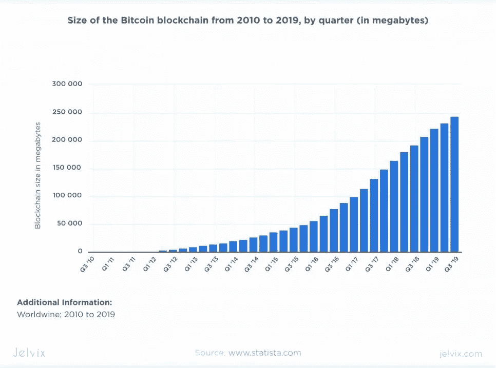
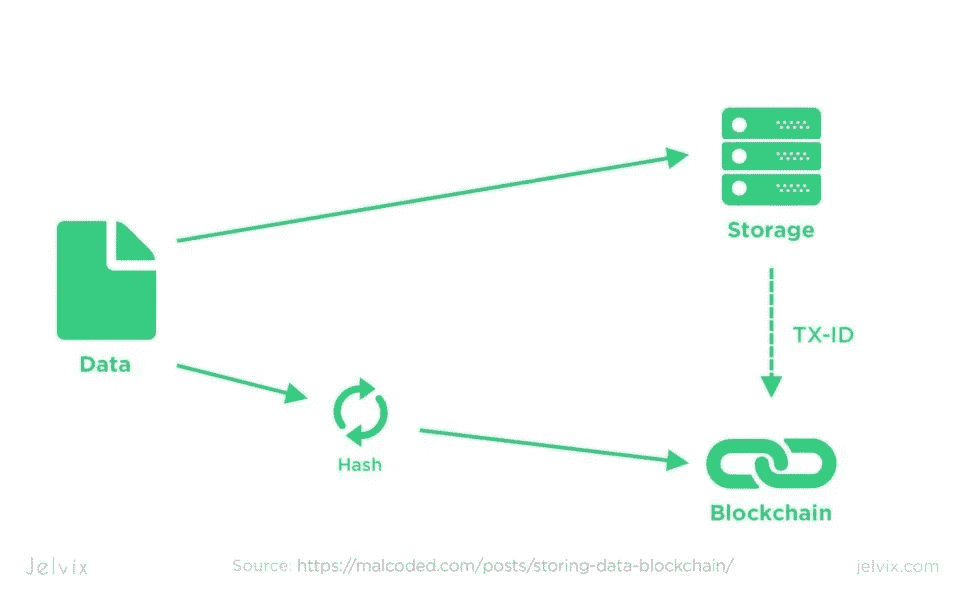
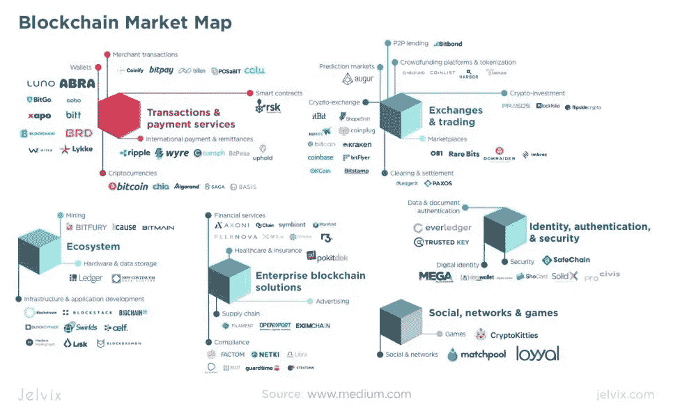
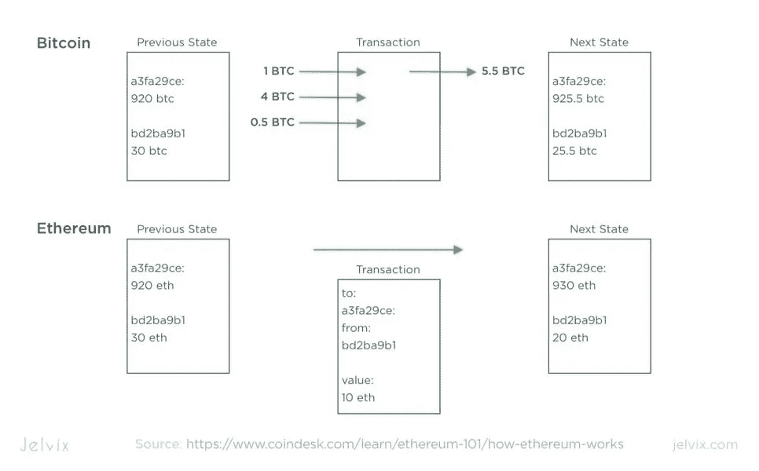
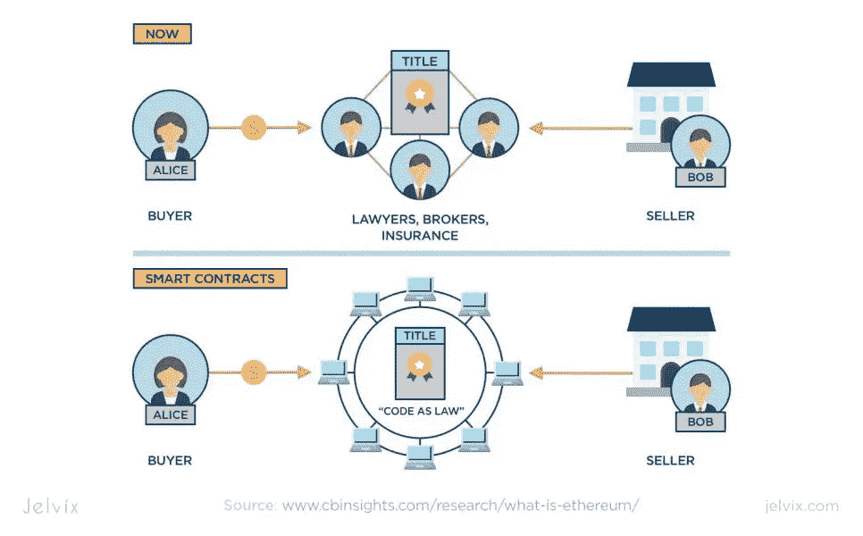
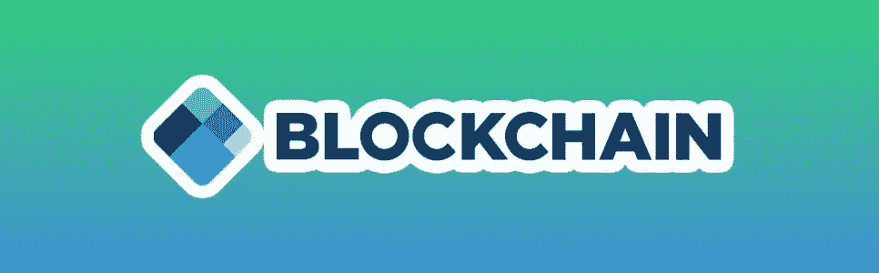
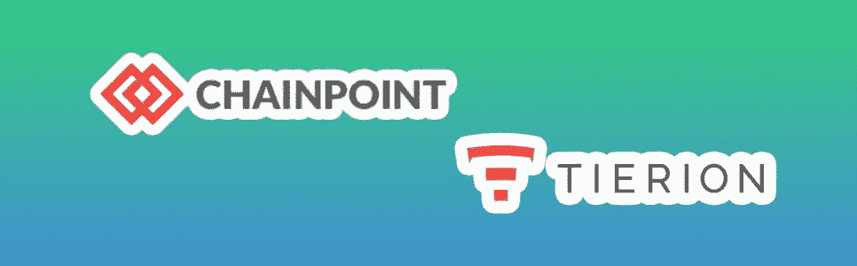
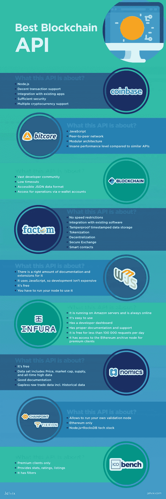

# 面向开发者的十大最佳区块链 API 提供商

> 原文：<https://medium.com/geekculture/top-10-best-blockchain-api-providers-for-developers-7e19d8602ccc?source=collection_archive---------4----------------------->

[区块链技术](https://en.wikipedia.org/wiki/Blockchain)已经遍及整个电子商务行业。如今，加密货币支付不是一个令人愉快的新奇事物，而是一个必需的功能。尽管有人对这项新技术持怀疑态度，但区块链的生态系统正在成长。每个月都会出现新的激动人心的技术和应用领域。于是老式的[区块链实现的](https://jelvix.com/blog/blockchain-transforms-industries)越来越受欢迎。看看快速增长的比特币区块链规模:

# 什么是区块链数据？

区块链经常被用作[加密货币](https://en.wikipedia.org/wiki/Cryptocurrency)的绰号。虽然像[比特币](https://bitcoin.org/en/)这样的加密货币是基于区块链技术，但它们不是一回事。区块链可以被概念化为一个账本，就像游戏玩家保留的一张卡片。然而，与简单的记账方法不同的是，信息在所有用户之间传播并被加密。没有一个单一的总账管理人使它既独立于任何中央机构。

哈希加密还提供了大量的隐私，使黑客难以置信的困难。黑客的阻力来自于这样一个事实，为了成功地做到这一点，你将需要大量的原始硬件处理能力。以至于用它来促进加密货币交易会更有利可图。

因此，虽然加密货币仍然是主要推动力，但这种独特技术还有许多其他应用。可以想象，对于分散和安全的在线分类帐，还有许多其他的应用程序。它们促进了在线合同、物流网络或银行业务。区块链也非常适合一些与治理相关的用途。投票或医疗记录——任何敏感信息都可以使用区块链[来解释。](https://jelvix.com/blog/blockchain-cybersecurity-predictions)

# 什么是区块链生态系统？

通常，当使用术语区块链生态系统时，它代表:

*   加密货币本身；
*   钱包和支付服务等交易服务商；
*   采矿和数据存储等基础设施提供商；
*   众筹、交易所、交易和投资市场；
*   安全识别和认证；
*   针对电子政务、合同签订、物流等的其他区块链解决方案。；
*   区块链软件开发者。

区块链社会整体上高度鼓励这些行业的竞争。为了在区块链周围建立一个强大的分散经济，许多竞争性的服务是必要的。如果你仍然想知道你的项目是否需要某种形式的区块链实现，我们有一整篇文章专门讨论这个话题。

支持加密货币的软件开发是一件大事。幸运的是，区块链[API](https://en.wikipedia.org/wiki/Application_programming_interface)可以消除创建整个加密货币系统的必要性。这种方法节省了你大量的时间。怎么挑最好的？要考虑哪些方面？让我们找到最适合您需求的 API 提供商。

# API 是用来做什么的？

应用程序编程接口或 API 是不同用户应用程序之间的接口。例如，一个让你在线买票、订酒店、叫出租车或查询汇率的应用程序可能使用特定的 API。API 将请求传递给保存所需数据的服务器，并将结果返回到您的手机。

如今，API 被广泛用于软件开发，尤其是移动和网络应用。

# 区块链 API 到底是什么？

它是一个直接或通过其他服务与区块链节点或客户端网络通信的接口。一个很好的区块链 API 例子是比特币交易所和从中收集数据的用户应用程序之间的接口。

# 加密货币中的 API 是什么？

API 用于许多与加密货币相关的领域。有用于交易、市场交易、账户管理、分析和安全的 API。自从一个受欢迎的密码交易所[币安](https://www.binance.com/en)被黑客攻击并造成灾难性后果后，最后一个变得尤为重要。在一次交易中，大约有 4200 万美元被盗。

币安和其他密码公司立即采取措施保护他们的客户。然而，这一事件表明，在这个时代，安全是多么重要。说到 API，安全性是最重要的。因此，尽可能将公开可用的流行 API 留给知名开发人员使用。

# 为什么 API 很重要？

API 技术对于加密货币至关重要。它的价值很大一部分来自于将它作为一种私人的、安全的在线交易方式的能力。因此，反过来，它主要取决于 API 提供的隐私和安全性。另一个因素是易用性。没有人会在日常操作中使用耗时费力的交易完成过程的交易方法。

另一个重要领域是加密交易。这是因为比特币和其他硬币被视为股票市场证券或一种商品。所以要想在交易中获得丰厚的利润，你需要最大量的信息。大多数加密交换都有自己的 API。

也有数据聚合器从这些交换中收集信息，并通过他们自己的 API 传递给用户。此外，还有众筹和投资平台，也为他们的客户提供 API。

# 搜索最佳区块链 API 时需要注意什么

[区块链社区](https://jelvix.com/blog/how-to-hire-blockchain-developers)和[区块链开发者](https://jelvix.com/blog/how-to-find-blockchain-developers)的各种像样的 API 都在迅速增加。您的偏好可能会有所不同，这取决于技术、项目规模和预算。让我们来解决你首先应该考虑的三个关键点。

## API 技术概述

每个开发人员都比其他人更喜欢特定的库、架构模式、编程语言。有一个大型的区块链社区生产大量的开源软件。他们普遍认为我们这个时代最好的安全性来自开源代码，因为它可以被每个人完善和测试。

## 您应该将基于区块链的项目纳入您的系统

大多数在线商店接受比特币作为唯一可用的加密货币支付方式。几乎所有受尊敬的 API 都旨在只支持比特币交易。然而，他们中很少有人支持替代硬币。无论您计划使用[以太坊](https://ethereum.org/)、 [Ripple](https://www.ripple.com/) 还是任何其他加密货币，请检查您选择的 API 是否具有该功能。

## 以太币是什么？

以太坊最近越来越臭名昭著。还有，有一个很好的理由。它不仅可以为加密交易构建解决方案，还可以促进交易达成和许多智能合同。这是同类产品中的第一款，也是迄今为止最大的一款。智能合约不仅促进交易。他们允许在区块链上构建名为 [Dapps](https://en.wikipedia.org/wiki/Decentralized_application) (或分散式应用)的应用程序。智能合同[其他区块链实施](https://jelvix.com/blog/top-blockchain-trends-2019)。

智能合同和 Dapps 是必不可少的，因为它们允许操作整个物流网络。区块链技术使物流更加自动化、安全、可靠和稳健。如果你想了解物流领域的[区块链技术](https://jelvix.com/blog/blockchain-for-supply-chain-management)，请查看更多信息。

你经常会听到媒体将以太坊描述为未来的全球超级计算机。然而，除了名字相似之外，它几乎没有任何优点。目前，通过以太坊网络处理大量数据效率非常低，因为它既慢又贵。尽管将来可能会有所改变。目前，以太坊还有许多其他令人兴奋的应用领域。

## 表演

不同的应用需要不同的性能水平。一些区块链 API 每秒处理几个事务。而另一些能够在相同的时间内创建数百个记录。一般来说，区块链技术比非区块链技术速度更慢，效率更低。然而，一如既往，这是一个权衡。作为回报，您将获得无与伦比的安全性和健壮性。

# 2021 年十大区块链 API 供应商

我们通过选择最高效、最值得信赖、最安全和最具可扩展性的产品来创建此列表。他们来了，五大 API 巨头。

## 1.NOWNodes

[NOWNodes](https://nownodes.io/) 通过[全节点](https://nownodes.io/nodes)和区块链探索者提供对最受欢迎的区块链的快速便捷的访问。这是一个区块链即服务解决方案，通过 API 提供高质量的连接。超过 40 台区块链可用于连接可靠且经济高效的基础设施。

NOWNodes 的功能:

*   您的所有完整节点和浏览器都在一个地方，无需与多个服务合作；
*   快速访问:1GB/秒的可靠连接；
*   保证服务质量。

这些节点处于全天候监视之下，并由 NOWNodes 专家持续监控。

## 2.比特币基地

API 是一种灵活而安全的工具。它支持比特币、比特币现金、莱特币和以太坊。比特币基地提供卓越的钱包服务，每笔交易都有通知。API 技术基于 [Node.js](https://nodejs.org/en/) 。

由于加密货币能够与现有应用程序集成，比特币基地很受欢迎。有了它，你可以在一个旧的应用程序中拥有加密功能，而不是丢弃它并开始一个新的。

比特币基地工具是免费使用的，每小时有 10，000 个请求的限制。还有一个高级选项 CoinbasePro，它具有更高级的 API。它有许多令人兴奋的功能，包括程序化交易。

总而言之，这个 API 是关于:

*   Node.js
*   体面的交易支持；
*   与现有应用程序集成；
*   足够的安全性；
*   多种加密货币支持。

## 3.比特核心

[Bitcore](https://bitcore.io/) 是比特币网络的原生接口。流行的比特币支付处理器 [Bitpay](https://bitpay.com/) 开发了它。它是免费的，开源的，用 JavaScript 编码。这是几乎所有比特币相关应用程序的必备工具集。它包括一个节点，钱包，比特币链浏览器，和许多有用的库。由于它的模块化架构，很容易扩展它的附加服务。这是企业应用程序的一个优势。

此外，Bitcore 是一个完整的节点，因此其 API 上的应用程序运行在 P2P 网络上。这意味着令人难以置信的性能(每秒超过 500 个事务)。Bitcore productivity 使其成为扩展项目的最佳区块链 API 之一。它卓越性能的潜力使它在某种程度上是面向未来的。它消除了人们对在不远的将来需要进行重大重建的担忧。

综上所述，Bitcore API 是关于:

*   JavaScript
*   对等网络；
*   模块化架构；
*   与类似的 API 相比，这是一个疯狂的性能水平。

# 4.区块链

[区块链](https://www.blockchain.com/) API 是实现加密货币支付功能的完美解决方案。区块链 API 技术拥有超过 25，000 名开发人员，被认为是最古老和最受欢迎的技术。区块链有用于钱包、支付处理、区块链探索和简单文本查询的 API。他们还提供 WebSockets，市场数据 API。

区块链 API 以 [JSON 格式](https://www.json.org/)存储区块和交易的数据。它的超时时间很短，并且只使用钱包操作。这避免了对额外加密货币存储的需求。

总的来说，这个区块链 API 很有竞争力，因为:

*   庞大的开发者社区；
*   低超时；
*   可访问的 JSON 数据格式；
*   通过电子钱包账户进行操作。

## 5.事实

Factom 是一家提供名为 Harmony Connect 的真正创新解决方案的公司。它在其区块链上提供数据存储服务。当您需要长时间记录防篡改数据时，这很有帮助。他们的 API 与现有软件有很好的集成。Factom 区块链也可以运行智能合约。他们的区块链的另一个很好的特点是记号化。您可以创建代表现实世界资产的代币，并通过网络进行交易。Factom 似乎是一个在不久的将来会非常受欢迎的解决方案。

Factom API 具有:

*   没有速度限制；
*   与现有软件的集成；
*   防篡改带时间戳的数据存储；
*   标记化；
*   权力下放；
*   安全交换；
*   智能联系人。

## 6.Web3.js 以太坊 API

[Web3.js](https://web3js.readthedocs.io/en/v1.2.1/) 是以太坊网络的主要 API 然而，要使用它，您需要运行自己的以太坊客户端。你也可以使用 Infura 主机。它支持钱包，从本地 java 代码自动生成智能契约的包装器。它支持 ERC20 和 ERC721 令牌标准。

其特点是:

*   它有适量的文档和扩展；
*   它使用 JavaScript，所以开发并不昂贵；
*   它是免费的；
*   您必须运行您的节点才能使用它。

## 7.以太坊 API

然而，还有另一种方法，特别是如果您计划对一个节点使用 Infura client。你可以使用一个 [Infura 以太坊 API](https://infura.io/docs/gettingStarted/authentication) 来代替。Infura 是当今最大的区块链服务提供商之一，它为以太坊网络中的客户端基础设施提供强大的可扩展解决方案。它对分散的应用程序很有用，也有其他用途。Infura 还提供了一个后端 API，通过 HTTP 和 WebSockets 将应用程序连接到以太坊网络 IPFS 存储。

Infura 负责为大约 60%的应用程序提供以太坊访问权限，包括一个流行的 Cryptokitties。在我们的博客文章中，我们已经对[scriptocittes 应用](https://jelvix.com/blog/learn-from-cryptokitties)进行了一个简明的案例研究。

Infura 以太坊 API 的一些主要特性包括:

*   它运行在亚马逊服务器上，永远在线；
*   很好用；
*   有一个开发人员仪表板；
*   有适当的文件和支持；
*   每天少于 100，00 0 次请求是免费的；
*   它可以访问高级客户端的以太坊存档节点。

## 8.经济学 API

Nomics 是一个交易数据聚合平台，其免费 API 可满足您的所有交易需求。[经济学](https://docs.nomics.com/)的主要特点是使用原始贸易数据。这个 API 不使用交易中的蜡烛线数据，而是尝试获取原始的交易数据，然后根据需要计算蜡烛线或分笔成交点。它提供了更准确的数据，尤其是来自不太可信的加密交换的数据。

它也有助于检测某些形式的交易数据操纵，如股票填充和安定垃圾邮件。这个数据聚合器从 13 个不同的加密交易所收集订单和交易数据。它还可以访问历史数据，满足您所有的深入分析需求。

Nomics API 具有以下特性:

*   它是免费的；
*   数据集包括价格、市值、供应量和历史新高数据；
*   良好的文档；
*   无缝原始贸易数据，包括历史数据。

## 9.蒂里昂链点

Tierion 提供了一个奇怪的解决方案，叫做[链点](https://tierion.com/chainpoint/)。这个 API 允许你在链接到一个文件的区块链中创建无与伦比的时间戳。该时间戳不能被删除或篡改。出于法律原因，它可能是有用的，例如，证明一项研究的 IP 或时间戳，或者创建审计跟踪。许多应用程序都是使用这个 API 开发的。这项技术是新的。但是已经有案例成功地将区块链锚定作为法庭证据。

Tierion 具有以下特点:

*   允许您运行自己的验证节点；
*   仅限以太坊；
*   Node.js+RocksDB 技术栈。

## 10.ICObench 数据 API

区块链技术的另一个重要应用是众筹或 ICO。最重要和最基本的 ICO 平台是 ICObench。这个平台有自己的 [API](https://icobench.com/) 供高级用户使用。这个 API 允许客户直接从平台本身获取 ICO 列表、统计数据和其他一些数据。但是，它仅适用于高级客户。

数据本身可以用于通知或运行分析。如果你想了解更多关于 ICO 的信息，我们建议你阅读我们关于[主题](https://jelvix.com/blog/how-to-have-successful-ico)的文章。

ICO 工作台具有以下特点:

*   仅限高级客户；
*   提供统计数据、评级、列表；
*   有过滤器。

# 把它包起来

有时找到最合适的区块链 API 是一个真正的挑战。各种不同的产品让开发人员困惑，因为每个 API 都提供独特的特性和功能。不同的性能、安全级别和多种加密货币支持需要仔细考虑。

在本文中，我们列出了现代金融科技领域最受欢迎和尊重的区块链 API。其中一些提供出色的性能，而另一些则专注于提供卓越的安全性。最后，区块链技术的选择应该基于您的规格、需求和计划规模。

不要误解我们。我们不坚持让你从上面描述的列表中选择一个 API。这些例子展示了高质量 API 的必要标准和要求。在做决定的时候，评估你的机会，你就不会对这个负责任的选择有任何问题。

有一些未解决的问题，需要帮助，或者只是想分享你的想法？

让我们讨论一下你的项目。

*最初发表于*[T5【https://jelvix.com】](https://jelvix.com/blog/how-to-choose-the-best-blockchain-api-for-your-project)*。*